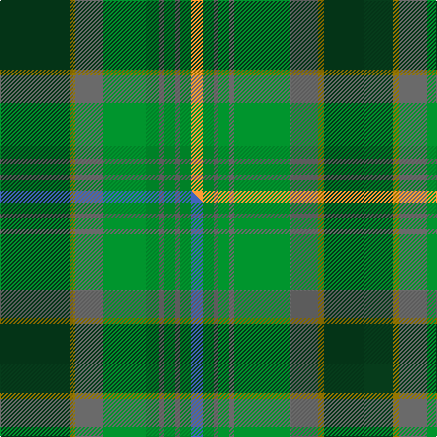

This is one **variant** — a specific cloth: this exact thread count and colourway, with its own
provenance below. It is one weaving of the [sett](/tartans/d/da/dalwhinnie-2/) (the scale-free proportion — the
same cloth at any scale or shade), whose colour order is pattern [GGBGBGBGY](/stripes/ggbgbgbgy/).

Part of the [Dalwhinnie](/tartans/d/da/dalwhinnie-2/) tartan — the named design grouping this sett with its other cloths.

Sourced from house-of-tartan.  It is a [9 stripe tartan](/stripes/stripes9/).

Original link [http://www.house-of-tartan.scotland.net/house/TartanViewjs.asp?colr=Def&tnam=1018](http://www.house-of-tartan.scotland.net/house/TartanViewjs.asp?colr=Def&tnam=1018)

## Provenance

Earliest known date: 1982 Reconstructed and woven by Don Rankin from illustration. Sample in STS collection.

Dataset <small>— provenance for this record, inherited from the source manifest</small>

<dl class="dataset-prov">
<dt>source</dt><dd><a href="/sources/house-of-tartan/">House of Tartan</a></dd>
<dt>data captured from</dt><dd><a href="https://github.com/thetartan/tartan-database/blob/master/data/house-of-tartan/data.csv">https://github.com/thetartan/tartan-database/blob/master/data/house-of-tartan/data.csv</a></dd>
<dt>data date</dt><dd>1982 <small>(this record)</small></dd>
<dt>licence</dt><dd><a href="https://creativecommons.org/licenses/by-nc-nd/4.0/">CC BY-NC-ND 4.0</a></dd>
</dl>

Capture chain <small>— the hands this data passed through, oldest first; each capture carries its own licence</small>

<ol class="capture-chain">
<li><a href="http://www.house-of-tartan.scotland.net/">House of Tartan</a> <small>the weaver/retailer's database — the site is now offline; the URL is kept as the ultimate source's identity</small></li>
<li><a href="https://github.com/thetartan/tartan-database">thetartan/tartan-database</a> <small>2016-2017</small> · <a href="https://creativecommons.org/licenses/by-nc-nd/4.0/">CC BY-NC-ND 4.0</a> <small>Levko Kravets's frozen compilation — the capture we vendored, and where its CC licence text came from</small></li>
<li>this dictionary <small>captured 2026-06-10 · commit 5bf86c7566</small> <small>each re-capture is a git commit to data/sources</small></li>
</ol>

## Thread count
DG/70 Y6 N28 G56 N5 G11 N5 G11 LO/12

One full sett is **326 threads**.

## Palette
<table><thead><tr><th>Colour</th><th>Shade</th><th>OKLCh</th></tr></thead><tbody><tr><td>DG</td><td><code style="background-color:#053819;">#053819</code> <small style="color:#888">#053819</small></td><td><small style="color:#888">oklch(30.0% 0.075 151.3)</small></td></tr><tr><td>G</td><td><code style="background-color:#008B2A;">#008B2A</code> <small style="color:#888">#008B2A</small></td><td><small style="color:#888">oklch(55.4% 0.170 145.9)</small></td></tr><tr><td>N</td><td><code style="background-color:#636363;">#636363</code> <small style="color:#888">#636363</small></td><td><small style="color:#888">oklch(50.0% 0.000 89.9)</small></td></tr><tr><td>LO</td><td><code style="background-color:#FF9C34;">#FF9C34</code> <small style="color:#888">#FF9C34</small></td><td><small style="color:#888">oklch(77.9% 0.161 61.8)</small></td></tr><tr><td>Y</td><td><code style="background-color:#8B6E00;">#8B6E00</code> <small style="color:#888">#8B6E00</small></td><td><small style="color:#888">oklch(55.1% 0.113 90.4)</small></td></tr></tbody></table>

# Sample pattern

## Compared to the master

This cloth is one sett of its design; the master sett (the exemplar the design is anchored on) is below for comparison.

Its **ΔTartan distance** from the master is **0.30** — the same measure the nearest-tartans table ranks by (0 is identical; a re-scale of the same cloth is near 0, a recolour or a different proportion further).

<figure class="master-compare" style="margin:0">

this sett
master sett ★

<figcaption style="color:#888;font-size:smaller">One weave of this sett against the <a href="/setts/dg70y6n28g56n5g11n5g11b12/">master sett ★</a>, split on the diagonal: a shared proportion runs seamlessly across it with only the shades shifting; a different proportion breaks on it.</figcaption>
</figure>

## Nearest tartan variants

The nearest existing variants by ΔTartan distance, with this cloth at the top so the swatches line up against it.

ΔTartan

Threads

Variant

Sett

—

326

<a href="/variants/s9/dg70y6n28g56n5g11n5g11lo12/">Dalwhinnie Trade Tartan</a>

<a href="/ttd/edit/#slug=dg70y6n28g56n5g11n5g11b12&amp;base=dg70y6n28g56n5g11n5g11lo12" title="compare in the TTD">0.30</a>

326

<a href="/variants/s9/dg70y6n28g56n5g11n5g11b12/">Dalwhinnie</a>

<a href="/ttd/edit/#slug=g30dp3g3dp3g3dp10dg10y20lp2dg5~x2~dg1803133-y2302138&amp;base=dg70y6n28g56n5g11n5g11lo12" title="compare in the TTD">2.23</a>

286

<a href="/variants/s10/g30dp3g3dp3g3dp10dg10y20lp2dg5~x2~dg1803133-y2302138/">Roddy's Highland Spirit (Fashion)</a>

<a href="/ttd/edit/#slug=g1dr7g7n2dr1dg15lb1~x4&amp;base=dg70y6n28g56n5g11n5g11lo12" title="compare in the TTD">2.46</a>

264

<a href="/variants/s7/g1dr7g7n2dr1dg15lb1~x4/">Ramsay (Green Fashion)</a>

<a href="/ttd/edit/#slug=n44y2dg27y2g16lb8dg16lb2dg8~x2&amp;base=dg70y6n28g56n5g11n5g11lo12" title="compare in the TTD">2.47</a>

396

<a href="/variants/s9/n44y2dg27y2g16lb8dg16lb2dg8~x2/">Crumlish (2015)</a>

<a href="/ttd/edit/#slug=dr4g46dr10db10dy33db5dy4ly3~x2&amp;base=dg70y6n28g56n5g11n5g11lo12" title="compare in the TTD">2.53</a>

446

<a href="/variants/s8/dr4g46dr10db10dy33db5dy4ly3~x2/">State Seal of Minnesota (Fashion)</a>

<a href="/ttd/edit/#slug=g12db2dr2db2dt26dg2g3dg3g24dr4~x2&amp;base=dg70y6n28g56n5g11n5g11lo12" title="compare in the TTD">2.56</a>

288

<a href="/variants/s10/g12db2dr2db2dt26dg2g3dg3g24dr4~x2/">New South Wales Waratah</a>

<a href="/ttd/edit/#slug=g20dg11n6dr2dp3n1~x2&amp;base=dg70y6n28g56n5g11n5g11lo12" title="compare in the TTD">2.66</a>

130

<a href="/variants/s6/g20dg11n6dr2dp3n1~x2/">Chiti, Cristiano (Personal)</a>

<a href="/ttd/edit/#slug=do9t3do4y3do3y4do3dy11g30ti3g4do3~x2~t2304245-ti2607245&amp;base=dg70y6n28g56n5g11n5g11lo12" title="compare in the TTD">2.77</a>

296

<a href="/variants/s12/do9t3do4y3do3y4do3dy11g30ti3g4do3~x2~t2304245-ti2607245/">Harmony 2</a>

<a href="/ttd/edit/#slug=dg2lo1dg12lb6g12dr1~x4~dg1806142-g2203152&amp;base=dg70y6n28g56n5g11n5g11lo12" title="compare in the TTD">2.80</a>

260

<a href="/variants/s6/dg2lo1dg12lb6g12dr1~x4~dg1806142-g2203152/">City of Vancouver (Commemorative)</a>

<a href="/ttd/edit/#slug=dg4t28dg11w2dg2g14y2~x2&amp;base=dg70y6n28g56n5g11n5g11lo12" title="compare in the TTD">2.94</a>

240

<a href="/variants/s7/dg4t28dg11w2dg2g14y2~x2/">Rhode Island State American District Tartan</a>

## Neighbour map

Every grey dot is one of 13656 variants placed by the first two principal components of the ΔTartan feature space (42% of its variance). Red is this tartan; blue dots are its nearest — click one to open its page. The map is a flat projection of a many-dimensional space — [how to read it](/posts/neighbourhood-maps/).

<svg viewBox="0 0 640 380" role="img" style="max-width:100%;height:auto;border:1px solid #e0e0e0;border-radius:4px;display:block" xmlns="http://www.w3.org/2000/svg"><image href="/nn/cloud.v1.png" width="640" height="380"/><a href="/variants/s9/dg70y6n28g56n5g11n5g11b12/"><circle cx="310.7" cy="213.5" r="4" fill="#3465a4"><title>Dalwhinnie</title></circle></a><a href="/variants/s10/g30dp3g3dp3g3dp10dg10y20lp2dg5~x2~dg1803133-y2302138/"><circle cx="303.4" cy="206.0" r="4" fill="#3465a4"><title>Roddy's Highland Spirit (Fashion)</title></circle></a><a href="/variants/s7/g1dr7g7n2dr1dg15lb1~x4/"><circle cx="320.9" cy="209.3" r="4" fill="#3465a4"><title>Ramsay (Green Fashion)</title></circle></a><a href="/variants/s9/n44y2dg27y2g16lb8dg16lb2dg8~x2/"><circle cx="310.0" cy="187.8" r="4" fill="#3465a4"><title>Crumlish (2015)</title></circle></a><a href="/variants/s8/dr4g46dr10db10dy33db5dy4ly3~x2/"><circle cx="276.4" cy="191.7" r="4" fill="#3465a4"><title>State Seal of Minnesota (Fashion)</title></circle></a><a href="/variants/s10/g12db2dr2db2dt26dg2g3dg3g24dr4~x2/"><circle cx="332.9" cy="191.3" r="4" fill="#3465a4"><title>New South Wales Waratah</title></circle></a><a href="/variants/s6/g20dg11n6dr2dp3n1~x2/"><circle cx="341.1" cy="214.2" r="4" fill="#3465a4"><title>Chiti, Cristiano (Personal)</title></circle></a><a href="/variants/s12/do9t3do4y3do3y4do3dy11g30ti3g4do3~x2~t2304245-ti2607245/"><circle cx="264.6" cy="180.8" r="4" fill="#3465a4"><title>Harmony 2</title></circle></a><a href="/variants/s6/dg2lo1dg12lb6g12dr1~x4~dg1806142-g2203152/"><circle cx="310.2" cy="243.9" r="4" fill="#3465a4"><title>City of Vancouver (Commemorative)</title></circle></a><a href="/variants/s7/dg4t28dg11w2dg2g14y2~x2/"><circle cx="308.1" cy="212.5" r="4" fill="#3465a4"><title>Rhode Island State American District Tartan</title></circle></a><circle cx="288.4" cy="205.0" r="5" fill="#c00000"/><text x="320" y="376" text-anchor="middle" font-size="11" fill="#999">ground</text><text x="11" y="190" text-anchor="middle" font-size="11" fill="#999" transform="rotate(-90 11 190)">complexity</text></svg>

ID: /variants/s9/dg70y6n28g56n5g11n5g11lo12/
