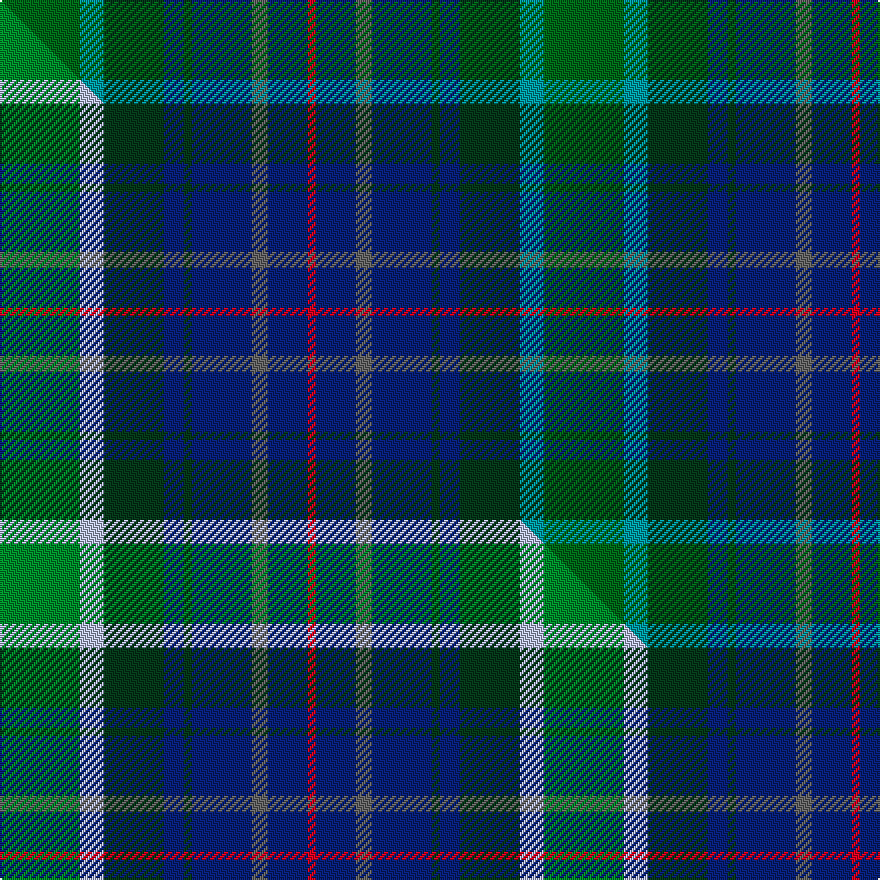

This is one **variant** — a specific cloth: this exact thread count and colourway, with its own
provenance below. It is one weaving of the [sett](/tartans/c/co/copar-a-beannichte/) (the scale-free proportion — the
same cloth at any scale or shade), whose colour order is pattern [GGGBGBBBR](/stripes/gggbgbbbr/).

Part of the [Copar a'Beannichte](/tartans/c/co/copar-a-beannichte/) tartan — the named design grouping this sett with its other cloths.

Sourced from tartans-authority.  It is a [9 stripe tartan](/stripes/stripes9/).

Original link <code>http://www.tartansauthority.com/tartan-ferret/display/6483/</code> — retired · [Internet Archive copy](https://web.archive.org/web/*/http://www.tartansauthority.com/tartan-ferret/display/6483/*)

## Provenance

Earliest known date: 2004 The name of the tartan is constructed in Gaelic from the Dutch van Koperen and the French Benoist to mean the Blessed Copper, a tribute to Mrs Y Ch van Koperen-Benoist. The green represents oxidised copper of the Koperens and blue the Benoist family.

2 attestations — the source records this cloth was collapsed from (oldest owns this page)

<ul>
<li>2004 — Copar a'Beannichte (Personal) (tartans-authority, <a href="https://web.archive.org/web/*/http://www.tartansauthority.com/tartan-ferret/display/6483/*">record</a>)  <em>The name of the tartan is constructed in Gaelic from the Dutch van Koperen and the French Benoist to mean the Blessed Copper, a tribute to rhe designer's late father, Mr W. van Koperen. The green represents oxidised copper of the Koperens and blue the Benoist family. Can be worn by others but only with the written permission of Marc Rudolf van Koperen who now lives in Scotland. Weaving by permission only and preferably by Scottish mills only. Contact House of Tartan.</em></li>
<li>2004 — Copar a'Beannichte Family Tartan (house-of-tartan, <a href="http://www.house-of-tartan.scotland.net/house/TartanViewjs.asp?colr=Def&tnam=6483">record</a>) </li>
</ul>

Dataset <small>— provenance for this record, inherited from the source manifest</small>

<dl class="dataset-prov">
<dt>source</dt><dd><a href="/sources/tartans-authority/">Scottish Tartans Authority</a></dd>
<dt>data captured from</dt><dd><a href="https://github.com/thetartan/tartan-database/blob/master/data/tartans-authority/data.csv">https://github.com/thetartan/tartan-database/blob/master/data/tartans-authority/data.csv</a></dd>
<dt>data date</dt><dd>2004 <small>(this record)</small></dd>
<dt>licence</dt><dd><a href="https://creativecommons.org/licenses/by-nc-nd/4.0/">CC BY-NC-ND 4.0</a></dd>
</dl>

Capture chain <small>— the hands this data passed through, oldest first; each capture carries its own licence</small>

<ol class="capture-chain">
<li><a href="https://www.tartansauthority.com/">Scottish Tartans Authority</a> <small>the heritage body’s archive — its tartan-ferret record browser is retired; dead record links are shown unlinked, with an Internet Archive copy (ITI numbers are not SRT references)</small></li>
<li><a href="https://github.com/thetartan/tartan-database">thetartan/tartan-database</a> <small>2016-2017</small> · <a href="https://creativecommons.org/licenses/by-nc-nd/4.0/">CC BY-NC-ND 4.0</a> <small>Levko Kravets's frozen compilation — the capture we vendored, and where its CC licence text came from</small></li>
<li>this dictionary <small>captured 2026-06-10 · commit 5bf86c7566</small> <small>each re-capture is a git commit to data/sources</small></li>
</ol>

## Register references

External register numbers recorded for this tartan.

- Scottish Tartans Authority (ITI): 6483

## Thread count
DGi/40 G12 DG30 DB10 DG4 DB30 N8 DB20 R/4

One full sett is **272 threads**.

## Palette
<table><thead><tr><th>Colour</th><th>Shade</th><th>OKLCh</th></tr></thead><tbody><tr><td>G</td><td><code style="background-color:#0098A0;">#0098A0</code> <small style="color:#888">#0098A0</small></td><td><small style="color:#888">oklch(61.8% 0.105 201.4)</small></td></tr><tr><td>DB</td><td><code style="background-color:#082077;">#082077</code> <small style="color:#888">#082077</small></td><td><small style="color:#888">oklch(30.0% 0.149 265.1)</small></td></tr><tr><td>DG</td><td><code style="background-color:#053819;">#053819</code> <small style="color:#888">#053819</small></td><td><small style="color:#888">oklch(30.0% 0.075 151.3)</small></td></tr><tr><td>DG</td><td><code style="background-color:#006818;">#006818</code> <small style="color:#888">#006818</small></td><td><small style="color:#888">oklch(45.0% 0.142 145.0)</small></td></tr><tr><td>N</td><td><code style="background-color:#636363;">#636363</code> <small style="color:#888">#636363</small></td><td><small style="color:#888">oklch(50.0% 0.000 89.9)</small></td></tr><tr><td>R</td><td><code style="background-color:#D60020;">#D60020</code> <small style="color:#888">#D60020</small></td><td><small style="color:#888">oklch(55.2% 0.224 25.5)</small></td></tr></tbody></table>

# Sample pattern

## Compared to the master

This cloth is one sett of its design; the master sett (the exemplar the design is anchored on) is below for comparison.

Its **ΔTartan distance** from the master is **0.09** — the same measure the nearest-tartans table ranks by (0 is identical; a re-scale of the same cloth is near 0, a recolour or a different proportion further).

<figure class="master-compare" style="margin:0">

this sett
master sett ★

<figcaption style="color:#888;font-size:smaller">One weave of this sett against the <a href="/setts/g20lb6dg15db5dg2db15n4db10r2/">master sett ★</a>, split on the diagonal: a shared proportion runs seamlessly across it with only the shades shifting; a different proportion breaks on it.</figcaption>
</figure>

## Nearest tartan variants

The nearest existing variants by ΔTartan distance, with this cloth at the top so the swatches line up against it.

ΔTartan

Threads

Variant

Sett

—

272

<a href="/variants/s9/dgi20g6dg15db5dg2db15n4db10r2~x2~dgi1806142-g2504202/">Copar a'Beannichte (Personal)</a>

<a href="/ttd/edit/#slug=g20lb6dg15db5dg2db15n4db10r2~x2&amp;base=dgi20g6dg15db5dg2db15n4db10r2~x2~dgi1806142-g2504202" title="compare in the TTD">0.09</a>

272

<a href="/variants/s9/g20lb6dg15db5dg2db15n4db10r2~x2/">Copar a'Beannichte (Personal)</a>

<a href="/ttd/edit/#slug=dg15g3dr2g3dg8b12db20r2db4~x2~b2105244-db1004274&amp;base=dgi20g6dg15db5dg2db15n4db10r2~x2~dgi1806142-g2504202" title="compare in the TTD">1.50</a>

238

<a href="/variants/s9/dg15g3dr2g3dg8t12db20r2db4~x2~t2105244-db1004274/">Westbrook (2013)</a>

<a href="/ttd/edit/#slug=dg3y2dr10dg10db20dg12r3db10w2~x2&amp;base=dgi20g6dg15db5dg2db15n4db10r2~x2~dgi1806142-g2504202" title="compare in the TTD">2.64</a>

278

<a href="/variants/s9/dg3y2dr10dg10db20dg12r3db10w2~x2/">Patel (2013)</a>

<a href="/ttd/edit/#slug=dg20dr2g3db12k20dr2dt3db4dt3~x2&amp;base=dgi20g6dg15db5dg2db15n4db10r2~x2~dgi1806142-g2504202" title="compare in the TTD">2.65</a>

230

<a href="/variants/s9/dg20dr2g3db12k20dr2dt3db4dt3~x2/">Ithilien Heather (Personal)</a>

<a href="/ttd/edit/#slug=dg12dgi6r1dg6dgi4dp8dy2w2~x4~dg1403171-dgi1805151&amp;base=dgi20g6dg15db5dg2db15n4db10r2~x2~dgi1806142-g2504202" title="compare in the TTD">2.71</a>

272

<a href="/variants/s8/dg12dgi6r1dg6dgi4dp8dy2w2~x4~dg1403171-dgi1805151/">Connelly Tartan</a>

<a href="/ttd/edit/#slug=db17w2db2r2db2do12dg16y3~x4&amp;base=dgi20g6dg15db5dg2db15n4db10r2~x2~dgi1806142-g2504202" title="compare in the TTD">2.84</a>

368

<a href="/variants/s8/db17w2db2r2db2do12dg16y3~x4/">Blairmore House</a>

<a href="/ttd/edit/#slug=db30r6dy16dp8g10dp14g24y4dy10dp3dy28&amp;base=dgi20g6dg15db5dg2db15n4db10r2~x2~dgi1806142-g2504202" title="compare in the TTD">2.92</a>

248

<a href="/variants/s11/db30r6dy16dp8g10dp14g24y4dy10dp3dy28/">Greyfriars</a>

<a href="/ttd/edit/#slug=o8dti8o4dti28dt12n6dt12dr4n8dr4n29lb6~o2500000-dti1102249-dt0900000-n1900000&amp;base=dgi20g6dg15db5dg2db15n4db10r2~x2~dgi1806142-g2504202" title="compare in the TTD">3.23</a>

244

<a href="/variants/s12/o8dti8o4dti28dt12n6dt12dr4n8dr4n29lb6~o2500000-dti1102249-dt0900000-n1900000/">Kinloch Anderson Granite (Corporate)</a>

<a href="/ttd/edit/#slug=r3dg20y2dg20n20b20r3~x2&amp;base=dgi20g6dg15db5dg2db15n4db10r2~x2~dgi1806142-g2504202" title="compare in the TTD">3.26</a>

340

<a href="/variants/s7/r3dg20y2dg20n20b20r3~x2/">Brodie, Silver</a>

<a href="/ttd/edit/#slug=dg10m2dg2o4dg16dp16o2b18y2b8o3~x2&amp;base=dgi20g6dg15db5dg2db15n4db10r2~x2~dgi1806142-g2504202" title="compare in the TTD">3.37</a>

306

<a href="/variants/s11/dg10m2dg2o4dg16dp16o2b18y2b8o3~x2/">Commonwealth Games 1998</a>

## Neighbour map

Every grey dot is one of 13657 variants placed by the first two principal components of the ΔTartan feature space (42% of its variance). Red is this tartan; blue dots are its nearest — click one to open its page. The map is a flat projection of a many-dimensional space — [how to read it](/posts/neighbourhood-maps/).

<svg viewBox="0 0 640 380" role="img" style="max-width:100%;height:auto;border:1px solid #e0e0e0;border-radius:4px;display:block" xmlns="http://www.w3.org/2000/svg"><image href="/nn/cloud.v1.png" width="640" height="380"/><a href="/variants/s9/g20lb6dg15db5dg2db15n4db10r2~x2/"><circle cx="161.7" cy="198.0" r="4" fill="#3465a4"><title>Copar a'Beannichte (Personal)</title></circle></a><a href="/variants/s9/dg15g3dr2g3dg8t12db20r2db4~x2~t2105244-db1004274/"><circle cx="224.0" cy="208.1" r="4" fill="#3465a4"><title>Westbrook (2013)</title></circle></a><a href="/variants/s9/dg3y2dr10dg10db20dg12r3db10w2~x2/"><circle cx="229.6" cy="203.5" r="4" fill="#3465a4"><title>Patel (2013)</title></circle></a><a href="/variants/s9/dg20dr2g3db12k20dr2dt3db4dt3~x2/"><circle cx="154.6" cy="173.9" r="4" fill="#3465a4"><title>Ithilien Heather (Personal)</title></circle></a><a href="/variants/s8/dg12dgi6r1dg6dgi4dp8dy2w2~x4~dg1403171-dgi1805151/"><circle cx="240.3" cy="211.5" r="4" fill="#3465a4"><title>Connelly Tartan</title></circle></a><a href="/variants/s8/db17w2db2r2db2do12dg16y3~x4/"><circle cx="214.5" cy="200.2" r="4" fill="#3465a4"><title>Blairmore House</title></circle></a><a href="/variants/s11/db30r6dy16dp8g10dp14g24y4dy10dp3dy28/"><circle cx="172.1" cy="202.0" r="4" fill="#3465a4"><title>Greyfriars</title></circle></a><a href="/variants/s12/o8dti8o4dti28dt12n6dt12dr4n8dr4n29lb6~o2500000-dti1102249-dt0900000-n1900000/"><circle cx="188.3" cy="208.6" r="4" fill="#3465a4"><title>Kinloch Anderson Granite (Corporate)</title></circle></a><a href="/variants/s7/r3dg20y2dg20n20b20r3~x2/"><circle cx="267.7" cy="231.5" r="4" fill="#3465a4"><title>Brodie, Silver</title></circle></a><a href="/variants/s11/dg10m2dg2o4dg16dp16o2b18y2b8o3~x2/"><circle cx="179.3" cy="187.5" r="4" fill="#3465a4"><title>Commonwealth Games 1998</title></circle></a><circle cx="211.6" cy="215.1" r="5" fill="#c00000"/><text x="320" y="376" text-anchor="middle" font-size="11" fill="#999">ground</text><text x="11" y="190" text-anchor="middle" font-size="11" fill="#999" transform="rotate(-90 11 190)">complexity</text></svg>

ID: /variants/s9/dgi20g6dg15db5dg2db15n4db10r2~x2~dgi1806142-g2504202/
