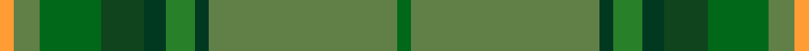

This is one **variant** — a specific cloth: this exact thread count and colourway, with its own
provenance below. It is one weaving of the [sett](/setts/dgii4y52dg4g8dg6dgi12dgii17y7lo4/) (the scale-free proportion — the
same cloth at any scale or shade), whose colour order is pattern [GGGGGGGGY](/stripes/ggggggggy/).

Sourced from tartans-authority.  It is a [9 stripe tartan](/stripes/stripes9/).

Original link [https://www.tartanregister.gov.uk/tartanDetails.aspx?ref=10073](https://www.tartanregister.gov.uk/tartanDetails.aspx?ref=10073)

Dataset <small>— provenance for this record, inherited from the source manifest</small>

<dl class="dataset-prov">
<dt>source</dt><dd><a href="/sources/tartans-authority/">Scottish Tartans Authority</a></dd>
<dt>data captured from</dt><dd><a href="https://github.com/thetartan/tartan-database/blob/master/data/tartans-authority/data.csv">https://github.com/thetartan/tartan-database/blob/master/data/tartans-authority/data.csv</a></dd>
<dt>data date</dt><dd>4th Sept. 2009 <small>(this record)</small></dd>
<dt>licence</dt><dd><a href="https://creativecommons.org/licenses/by-nc-nd/4.0/">CC BY-NC-ND 4.0</a></dd>
</dl>

Capture chain <small>— the hands this data passed through, oldest first; each capture carries its own licence</small>

<ol class="capture-chain">
<li><a href="https://www.tartansauthority.com/">Scottish Tartans Authority</a> <small>the heritage body's archive — its tartan-ferret record browser is retired (links repaired to the SRT, above)</small></li>
<li><a href="https://github.com/thetartan/tartan-database">thetartan/tartan-database</a> <small>2016-2017</small> · <a href="https://creativecommons.org/licenses/by-nc-nd/4.0/">CC BY-NC-ND 4.0</a> <small>Levko Kravets's frozen compilation — the capture we vendored, and where its CC licence text came from</small></li>
<li>this dictionary <small>captured 2026-06-10 · commit 5bf86c7566</small> <small>each re-capture is a git commit to data/sources</small></li>
</ol>

## Register references

External register numbers recorded for this tartan.

- Scottish Register of Tartans: [10073](https://www.tartanregister.gov.uk/tartanDetails?ref=10073)
- Scottish Tartans Authority (ITI): 10073

## Thread count
LO/4 Y7 DGii17 DGi12 DG6 G8 DG4 Y52 DGii/4

One full sett is **220 threads**.

## Palette
<table><thead><tr><th>Colour</th><th>Shade</th><th>OKLCh</th></tr></thead><tbody><tr><td>DG</td><td><code style="background-color:#10441C;">#10441C</code> <small style="color:#888">#10441C</small></td><td><small style="color:#888">oklch(34.2% 0.086 147.6)</small></td></tr><tr><td>DG</td><td><code style="background-color:#003820;">#003820</code> <small style="color:#888">#003820</small></td><td><small style="color:#888">oklch(30.0% 0.070 158.3)</small></td></tr><tr><td>DG</td><td><code style="background-color:#006818;">#006818</code> <small style="color:#888">#006818</small></td><td><small style="color:#888">oklch(45.0% 0.142 145.0)</small></td></tr><tr><td>G</td><td><code style="background-color:#288028;">#288028</code> <small style="color:#888">#288028</small></td><td><small style="color:#888">oklch(52.9% 0.149 143.1)</small></td></tr><tr><td>Y</td><td><code style="background-color:#608048;">#608048</code> <small style="color:#888">#608048</small></td><td><small style="color:#888">oklch(56.1% 0.089 132.9)</small></td></tr><tr><td>LO</td><td><code style="background-color:#FF9C34;">#FF9C34</code> <small style="color:#888">#FF9C34</small></td><td><small style="color:#888">oklch(77.9% 0.161 61.8)</small></td></tr></tbody></table>

# Sample pattern

## Nearest tartan variants

The nearest existing variants by ΔTartan distance, with this cloth at the top so the swatches line up against it.

ΔTartan

Threads

Variant

Sett

—

220

<a href="/variants/s9/dgii4y52dg4g8dg6dgi12dgii17y7lo4~dgii1806142-y2204130-g2106142-dgi1403152/">McAlbourne (Corporate)</a>

<a href="/ttd/edit/#slug=dgi4dgii52dt4g8dt6dg12dgi17dgii7lo4~dgi1604144-dgii1702166-g2304158&amp;base=dgii4y52dg4g8dg6dgi12dgii17y7lo4~dgii1806142-y2204130-g2106142-dgi1403152" title="compare in the TTD">3.24</a>

220

<a href="/variants/s9/dgi4dgii52dt4g8dt6dg12dgi17dgii7lo4~dgi1604144-dgii1702166-g2304158/">The McAlbourne</a>

<a href="/ttd/edit/#slug=dg3dy2gi12g12w1dg1y3~x2~dg1806142-gi2408144-g1903114&amp;base=dgii4y52dg4g8dg6dgi12dgii17y7lo4~dgii1806142-y2204130-g2106142-dgi1403152" title="compare in the TTD">4.00</a>

124

<a href="/variants/s7/dg3dy2gi12g12w1dg1y3~x2~dg1806142-gi2408144-g1903114/">Braemar House Corporate Tartan</a>

## Neighbour map

Every grey dot is one of 13621 variants placed by the first two principal components of the ΔTartan feature space (42% of its variance). Red is this tartan; blue dots are its nearest — click one to open its page.

<svg viewBox="0 0 640 380" role="img" style="max-width:100%;height:auto;border:1px solid #e0e0e0;border-radius:4px;display:block" xmlns="http://www.w3.org/2000/svg"><image href="/nn/cloud.v1.png" width="640" height="380"/><a href="/variants/s9/dgi4dgii52dt4g8dt6dg12dgi17dgii7lo4~dgi1604144-dgii1702166-g2304158/"><circle cx="465.8" cy="232.2" r="4" fill="#3465a4"><title>The McAlbourne</title></circle></a><a href="/variants/s7/dg3dy2gi12g12w1dg1y3~x2~dg1806142-gi2408144-g1903114/"><circle cx="310.9" cy="236.2" r="4" fill="#3465a4"><title>Braemar House Corporate Tartan</title></circle></a><circle cx="416.0" cy="215.0" r="5" fill="#c00000"/><text x="320" y="376" text-anchor="middle" font-size="11" fill="#999">ground</text><text x="11" y="190" text-anchor="middle" font-size="11" fill="#999" transform="rotate(-90 11 190)">complexity</text></svg>

ID: /variants/s9/dgii4y52dg4g8dg6dgi12dgii17y7lo4~dgii1806142-y2204130-g2106142-dgi1403152/
