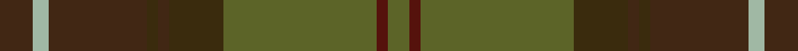

This page is one **sett** — a single exact thread-count. It belongs to the [tartan](/setts/do6lg3do18dy2do2dy10g28dr2g4/)
(the same proportion at any scale), whose colour order is pattern [BYBGBGGBG](/stripes/bybgbggbg/).

Sourced from register-of-tartans.  It is a [9 stripe tartan](/stripes/stripes9/).

Original link https://www.tartanregister.gov.uk/tartanDetails.aspx?ref=3712

2 attestations — the source records this cloth was collapsed from (oldest owns this page)

<ul>
<li>01/07/2007 — Scottish Crofting Foundation (register-of-tartans, <a href="https://www.tartanregister.gov.uk/tartanDetails.aspx?ref=3712">record</a>)  <em>"Established and run by crofters themselves, the SCF actively engages with agencies and government officials at local, national and international levels to influence policy on rural, agricultural, social, environmental and other issues."</em></li>
<li>July 2007 — Scottish Crofting Foundation (Corp) (tartans-authority, <a href="http://www.tartansauthority.com/tartan-ferret/display/7239/">record</a>)  <em>"Established and run by crofters themselves, the SCF actively engages with agencies and government officials at local, national and international levels to influence policy on rural, agricultural, social, environmental and other issues."</em></li>
</ul>

## Register references

External register numbers recorded for this tartan.

- Scottish Register of Tartans: [3712](https://www.tartanregister.gov.uk/tartanDetails.aspx?ref=3712)
- Scottish Tartans Authority (ITI): 7239

## Thread count
DO/12 LG6 DO36 DY4 DO4 DY20 G56 DR4 G/8

One full sett is **280 threads**.

## Palette
<table><thead><tr><th>Colour</th><th>Shade</th><th>OKLCh</th></tr></thead><tbody><tr><td>DO</td><td><code style="background-color:#412714;">#412714</code> <small style="color:#888">#412714</small></td><td><small style="color:#888">oklch(30.1% 0.050 55.7)</small></td></tr><tr><td>DR</td><td><code style="background-color:#55120C;">#55120C</code> <small style="color:#888">#55120C</small></td><td><small style="color:#888">oklch(30.0% 0.099 29.3)</small></td></tr><tr><td>G</td><td><code style="background-color:#5C6428;">#5C6428</code> <small style="color:#888">#5C6428</small></td><td><small style="color:#888">oklch(48.3% 0.084 116.0)</small></td></tr><tr><td>LG</td><td><code style="background-color:#A0B8A4;">#A0B8A4</code> <small style="color:#888">#A0B8A4</small></td><td><small style="color:#888">oklch(75.9% 0.039 150.1)</small></td></tr><tr><td>R</td><td><code style="background-color:#D60020;">#D60020</code> <small style="color:#888">#D60020</small></td><td><small style="color:#888">oklch(55.2% 0.224 25.5)</small></td></tr><tr><td>DY</td><td><code style="background-color:#3A2B0D;">#3A2B0D</code> <small style="color:#888">#3A2B0D</small></td><td><small style="color:#888">oklch(30.0% 0.049 82.0)</small></td></tr></tbody></table>

# Sample pattern

## Nearest tartan variants

The nearest existing variants by ΔTartan distance, with this cloth at the top so the swatches line up against it.

ΔTartan

Threads

Variant

Sett

—

280

<a href="/variants/s9/do6lg3do18dy2do2dy10g28dr2g4~x2~lg3002138-g1903114/">Scottish Crofting Foundation</a>

<a href="/ttd/edit/#slug=dy31do3dy3do3dy3do22g26dr4~x2&amp;base=do6lg3do18dy2do2dy10g28dr2g4~x2~lg3002138-g1903114" title="compare in the TTD">2.72</a>

310

<a href="/variants/s8/dy31do3dy3do3dy3do22g26dr4~x2/">Devarr (Fashion)</a>

## Neighbour map

Every grey dot is one of 13620 variants placed by the first two principal components of the ΔTartan feature space (42% of its variance). Red is this tartan; blue dots are its nearest — click one to open its page.

<svg viewBox="0 0 640 380" role="img" style="max-width:100%;height:auto;border:1px solid #e0e0e0;border-radius:4px;display:block" xmlns="http://www.w3.org/2000/svg"><image href="/nn/cloud.v1.png" width="640" height="380"/><a href="/variants/s8/dy31do3dy3do3dy3do22g26dr4~x2/"><circle cx="364.2" cy="255.1" r="4" fill="#3465a4"><title>Devarr (Fashion)</title></circle></a><circle cx="396.4" cy="224.8" r="5" fill="#c00000"/><text x="320" y="376" text-anchor="middle" font-size="11" fill="#999">ground</text><text x="11" y="190" text-anchor="middle" font-size="11" fill="#999" transform="rotate(-90 11 190)">complexity</text></svg>

ID: /variants/s9/do6lg3do18dy2do2dy10g28dr2g4~x2~lg3002138-g1903114/
