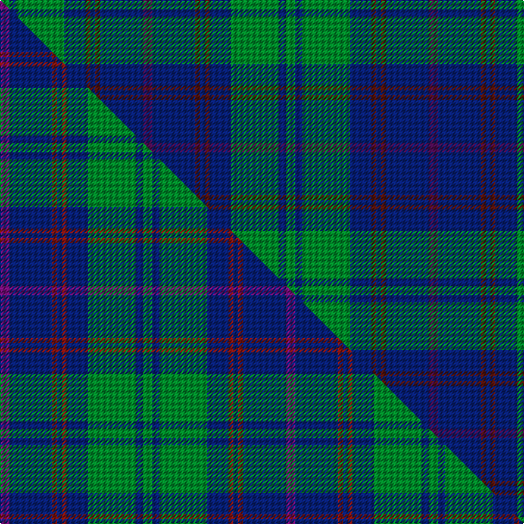

This is one **variant** — a specific cloth: this exact thread count and colourway, with its own
provenance below. It is one weaving of the [sett](/tartans/s/st/st-andrews-new-golf-club/) (the scale-free proportion — the
same cloth at any scale or shade), whose colour order is pattern [BBBBBBGBG](/stripes/bbbbbbgbg/).

Part of the [St. Andrews New Golf Club](/tartans/s/st/st-andrews-new-golf-club/) tartan — the named design grouping this sett with its other cloths.

Sourced from tartans-authority.  It is a [9 stripe tartan](/stripes/stripes9/).

Original link <code>http://www.tartansauthority.com/tartan-ferret/display/2497/</code> — retired · [Internet Archive copy](https://web.archive.org/web/*/http://www.tartansauthority.com/tartan-ferret/display/2497/*)

Dataset <small>— provenance for this record, inherited from the source manifest</small>

<dl class="dataset-prov">
<dt>source</dt><dd><a href="/sources/tartans-authority/">Scottish Tartans Authority</a></dd>
<dt>data captured from</dt><dd><a href="https://github.com/thetartan/tartan-database/blob/master/data/tartans-authority/data.csv">https://github.com/thetartan/tartan-database/blob/master/data/tartans-authority/data.csv</a></dd>
<dt>data date</dt><dd>1998 <small>(this record)</small></dd>
<dt>licence</dt><dd><a href="https://creativecommons.org/licenses/by-nc-nd/4.0/">CC BY-NC-ND 4.0</a></dd>
</dl>

Capture chain <small>— the hands this data passed through, oldest first; each capture carries its own licence</small>

<ol class="capture-chain">
<li><a href="https://www.tartansauthority.com/">Scottish Tartans Authority</a> <small>the heritage body’s archive — its tartan-ferret record browser is retired; dead record links are shown unlinked, with an Internet Archive copy (ITI numbers are not SRT references)</small></li>
<li><a href="https://github.com/thetartan/tartan-database">thetartan/tartan-database</a> <small>2016-2017</small> · <a href="https://creativecommons.org/licenses/by-nc-nd/4.0/">CC BY-NC-ND 4.0</a> <small>Levko Kravets's frozen compilation — the capture we vendored, and where its CC licence text came from</small></li>
<li>this dictionary <small>captured 2026-06-10 · commit 5bf86c7566</small> <small>each re-capture is a git commit to data/sources</small></li>
</ol>

## Register references

External register numbers recorded for this tartan.

- Scottish Tartans Authority (ITI): 2497

## Thread count
G/8 DB6 G40 DB18 DR4 DB4 DR4 DB36 DP/8

One full sett is **240 threads**.

## Palette
<table><thead><tr><th>Colour</th><th>Shade</th><th>OKLCh</th></tr></thead><tbody><tr><td>DB</td><td><code style="background-color:#082077;">#082077</code> <small style="color:#888">#082077</small></td><td><small style="color:#888">oklch(30.0% 0.149 265.1)</small></td></tr><tr><td>DR</td><td><code style="background-color:#55120C;">#55120C</code> <small style="color:#888">#55120C</small></td><td><small style="color:#888">oklch(30.0% 0.099 29.3)</small></td></tr><tr><td>G</td><td><code style="background-color:#008B2A;">#008B2A</code> <small style="color:#888">#008B2A</small></td><td><small style="color:#888">oklch(55.4% 0.170 145.9)</small></td></tr><tr><td>DP</td><td><code style="background-color:#4B0B4F;">#4B0B4F</code> <small style="color:#888">#4B0B4F</small></td><td><small style="color:#888">oklch(30.1% 0.125 325.4)</small></td></tr></tbody></table>

# Sample pattern

## Compared to the master

This cloth is one sett of its design; the master sett (the exemplar the design is anchored on) is below for comparison.

Its **ΔTartan distance** from the master is **0.03** — the same measure the nearest-tartans table ranks by (0 is identical; a re-scale of the same cloth is near 0, a recolour or a different proportion further).

<figure class="master-compare" style="margin:0">

this sett
master sett ★

<figcaption style="color:#888;font-size:smaller">One weave of this sett against the <a href="/setts/dp4db18r2db2r2db9g20db3g4/">master sett ★</a>, split on the diagonal: a shared proportion runs seamlessly across it with only the shades shifting; a different proportion breaks on it.</figcaption>
</figure>

## Nearest tartan variants

The nearest existing variants by ΔTartan distance, with this cloth at the top so the swatches line up against it.

ΔTartan

Threads

Variant

Sett

—

240

<a href="/variants/s9/dp4db18dr2db2dr2db9g20db3g4~x2/">St. Andrews New Golf Club (Corp)</a>

<a href="/ttd/edit/#slug=dp4db18r2db2r2db9g20db3g4~x2~dp1607327-r1606028&amp;base=dp4db18dr2db2dr2db9g20db3g4~x2" title="compare in the TTD">0.03</a>

240

<a href="/variants/s9/dp4db18r2db2r2db9g20db3g4~x2~dp1607327-r1606028/">St. Andrews New Golf Club</a>

<a href="/ttd/edit/#slug=dt3db4dt24db6r3db4g3db8w3~x2&amp;base=dp4db18dr2db2dr2db9g20db3g4~x2" title="compare in the TTD">1.29</a>

220

<a href="/variants/s9/dt3db4dt24db6r3db4g3db8w3~x2/">Scozia (Fashion)</a>

<a href="/ttd/edit/#slug=ly3dg17t3dg3t3do5t18dr2t8dr2~x2&amp;base=dp4db18dr2db2dr2db9g20db3g4~x2" title="compare in the TTD">1.57</a>

246

<a href="/variants/s10/ly3dg17t3dg3t3do5t18dr2t8dr2~x2/">Donegal, County</a>

<a href="/ttd/edit/#slug=y3g17db3g3db3do5db18r2db8r2~x2&amp;base=dp4db18dr2db2dr2db9g20db3g4~x2" title="compare in the TTD">1.57</a>

246

<a href="/variants/s10/y3g17db3g3db3do5db18r2db8r2~x2/">Donegal</a>

<a href="/ttd/edit/#slug=db32do3db3do3db3do10g24dr3~x2&amp;base=dp4db18dr2db2dr2db9g20db3g4~x2" title="compare in the TTD">1.89</a>

254

<a href="/variants/s8/db32do3db3do3db3do10g24dr3~x2/">Gammell Family Tartan</a>

<a href="/ttd/edit/#slug=db10dr3db3dr6db26g12dr6g2dr3g6lo2~x2&amp;base=dp4db18dr2db2dr2db9g20db3g4~x2" title="compare in the TTD">1.90</a>

292

<a href="/variants/s11/db10dr3db3dr6db26g12dr6g2dr3g6lo2~x2/">Law of Atholl (Personal)</a>

<a href="/ttd/edit/#slug=do2db4g12db3do6lb2db24do2db2g2~x2&amp;base=dp4db18dr2db2dr2db9g20db3g4~x2" title="compare in the TTD">1.94</a>

228

<a href="/variants/s10/do2db4g12db3do6lb2db24do2db2g2~x2/">Wicklow</a>

<a href="/ttd/edit/#slug=db6lb3db3lb15dg7db7dg5db17dg46dgi4~dgi1605139&amp;base=dp4db18dr2db2dr2db9g20db3g4~x2" title="compare in the TTD">1.99</a>

216

<a href="/variants/s10/db6lb3db3lb15dg7db7dg5db17dg46dgi4~dgi1605139/">Jones (Welsh Name)</a>

<a href="/ttd/edit/#slug=dr17db2dr2db13dr2db2g17db2~x2&amp;base=dp4db18dr2db2dr2db9g20db3g4~x2" title="compare in the TTD">2.05</a>

190

<a href="/variants/s8/dr17db2dr2db13dr2db2g17db2~x2/">Remony (Red)</a>

<a href="/ttd/edit/#slug=g47dr3g6db35lo3~x2&amp;base=dp4db18dr2db2dr2db9g20db3g4~x2" title="compare in the TTD">2.14</a>

276

<a href="/variants/s5/g47dr3g6db35lo3~x2/">Gracie</a>

## Neighbour map

Every grey dot is one of 13657 variants placed by the first two principal components of the ΔTartan feature space (42% of its variance). Red is this tartan; blue dots are its nearest — click one to open its page. The map is a flat projection of a many-dimensional space — [how to read it](/posts/neighbourhood-maps/).

<svg viewBox="0 0 640 380" role="img" style="max-width:100%;height:auto;border:1px solid #e0e0e0;border-radius:4px;display:block" xmlns="http://www.w3.org/2000/svg"><image href="/nn/cloud.v1.png" width="640" height="380"/><a href="/variants/s9/dp4db18r2db2r2db9g20db3g4~x2~dp1607327-r1606028/"><circle cx="296.6" cy="200.5" r="4" fill="#3465a4"><title>St. Andrews New Golf Club</title></circle></a><a href="/variants/s9/dt3db4dt24db6r3db4g3db8w3~x2/"><circle cx="270.4" cy="196.3" r="4" fill="#3465a4"><title>Scozia (Fashion)</title></circle></a><a href="/variants/s10/ly3dg17t3dg3t3do5t18dr2t8dr2~x2/"><circle cx="302.6" cy="213.9" r="4" fill="#3465a4"><title>Donegal, County</title></circle></a><a href="/variants/s10/y3g17db3g3db3do5db18r2db8r2~x2/"><circle cx="255.7" cy="187.1" r="4" fill="#3465a4"><title>Donegal</title></circle></a><a href="/variants/s8/db32do3db3do3db3do10g24dr3~x2/"><circle cx="323.0" cy="215.5" r="4" fill="#3465a4"><title>Gammell Family Tartan</title></circle></a><a href="/variants/s11/db10dr3db3dr6db26g12dr6g2dr3g6lo2~x2/"><circle cx="311.0" cy="197.0" r="4" fill="#3465a4"><title>Law of Atholl (Personal)</title></circle></a><a href="/variants/s10/do2db4g12db3do6lb2db24do2db2g2~x2/"><circle cx="360.0" cy="191.4" r="4" fill="#3465a4"><title>Wicklow</title></circle></a><a href="/variants/s10/db6lb3db3lb15dg7db7dg5db17dg46dgi4~dgi1605139/"><circle cx="328.2" cy="180.7" r="4" fill="#3465a4"><title>Jones (Welsh Name)</title></circle></a><a href="/variants/s8/dr17db2dr2db13dr2db2g17db2~x2/"><circle cx="286.5" cy="243.2" r="4" fill="#3465a4"><title>Remony (Red)</title></circle></a><a href="/variants/s5/g47dr3g6db35lo3~x2/"><circle cx="346.7" cy="197.6" r="4" fill="#3465a4"><title>Gracie</title></circle></a><circle cx="321.7" cy="216.6" r="5" fill="#c00000"/><text x="320" y="376" text-anchor="middle" font-size="11" fill="#999">ground</text><text x="11" y="190" text-anchor="middle" font-size="11" fill="#999" transform="rotate(-90 11 190)">complexity</text></svg>

ID: /variants/s9/dp4db18dr2db2dr2db9g20db3g4~x2/
