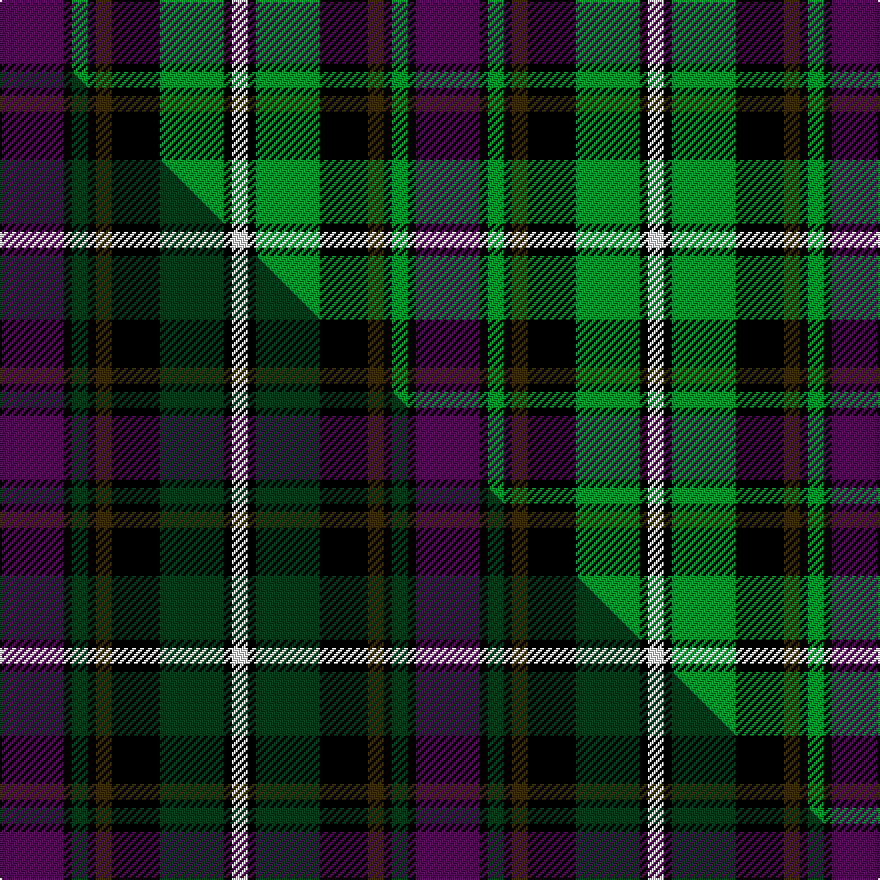

This is one **variant** — a specific cloth: this exact thread count and colourway, with its own
provenance below. It is one weaving of the [sett](/tartans/c/co/coffield-limesand/) (the scale-free proportion — the
same cloth at any scale or shade), whose colour order is pattern [BKGKGKGKW](/stripes/bkgkgkgkw/).

Part of the [Coffield-Limesand](/tartans/c/co/coffield-limesand/) tartan — the named design grouping this sett with its other cloths.

Sourced from tartans-authority.  It is a [9 stripe tartan](/stripes/stripes9/).

Original link <code>http://www.tartansauthority.com/tartan-ferret/display/10596/</code> — retired · [Internet Archive copy](https://web.archive.org/web/*/http://www.tartansauthority.com/tartan-ferret/display/10596/*)

Dataset <small>— provenance for this record, inherited from the source manifest</small>

<dl class="dataset-prov">
<dt>source</dt><dd><a href="/sources/tartans-authority/">Scottish Tartans Authority</a></dd>
<dt>data captured from</dt><dd><a href="https://github.com/thetartan/tartan-database/blob/master/data/tartans-authority/data.csv">https://github.com/thetartan/tartan-database/blob/master/data/tartans-authority/data.csv</a></dd>
<dt>data date</dt><dd>06/04/2012 <small>(this record)</small></dd>
<dt>licence</dt><dd><a href="https://creativecommons.org/licenses/by-nc-nd/4.0/">CC BY-NC-ND 4.0</a></dd>
</dl>

Capture chain <small>— the hands this data passed through, oldest first; each capture carries its own licence</small>

<ol class="capture-chain">
<li><a href="https://www.tartansauthority.com/">Scottish Tartans Authority</a> <small>the heritage body’s archive — its tartan-ferret record browser is retired; dead record links are shown unlinked, with an Internet Archive copy (ITI numbers are not SRT references)</small></li>
<li><a href="https://github.com/thetartan/tartan-database">thetartan/tartan-database</a> <small>2016-2017</small> · <a href="https://creativecommons.org/licenses/by-nc-nd/4.0/">CC BY-NC-ND 4.0</a> <small>Levko Kravets's frozen compilation — the capture we vendored, and where its CC licence text came from</small></li>
<li>this dictionary <small>captured 2026-06-10 · commit 5bf86c7566</small> <small>each re-capture is a git commit to data/sources</small></li>
</ol>

## Register references

External register numbers recorded for this tartan.

- Scottish Register of Tartans: [10596](https://www.tartanregister.gov.uk/tartanDetails?ref=10596)
- Scottish Tartans Authority (ITI): 10596

## Thread count
DP/32 K4 G8 K4 DY8 K24 G32 K4 W/8

One full sett is **208 threads**.

## Palette
<table><thead><tr><th>Colour</th><th>Shade</th><th>OKLCh</th></tr></thead><tbody><tr><td>G</td><td><code style="background-color:#008B2A;">#008B2A</code> <small style="color:#888">#008B2A</small></td><td><small style="color:#888">oklch(55.4% 0.170 145.9)</small></td></tr><tr><td>K</td><td><code style="background-color:#000000;">#000000</code> <small style="color:#888">#000000</small></td><td><small style="color:#888">oklch(0.0% 0.000 0.0)</small></td></tr><tr><td>W</td><td><code style="background-color:#F7F7F7;">#F7F7F7</code> <small style="color:#888">#F7F7F7</small></td><td><small style="color:#888">oklch(97.6% 0.000 89.9)</small></td></tr><tr><td>DP</td><td><code style="background-color:#4B0B4F;">#4B0B4F</code> <small style="color:#888">#4B0B4F</small></td><td><small style="color:#888">oklch(30.1% 0.125 325.4)</small></td></tr><tr><td>DY</td><td><code style="background-color:#3A2B0D;">#3A2B0D</code> <small style="color:#888">#3A2B0D</small></td><td><small style="color:#888">oklch(30.0% 0.049 82.0)</small></td></tr></tbody></table>

# Sample pattern

## Compared to the master

This cloth is one sett of its design; the master sett (the exemplar the design is anchored on) is below for comparison.

Its **ΔTartan distance** from the master is **0.15** — the same measure the nearest-tartans table ranks by (0 is identical; a re-scale of the same cloth is near 0, a recolour or a different proportion further).

<figure class="master-compare" style="margin:0">

this sett
master sett ★

<figcaption style="color:#888;font-size:smaller">One weave of this sett against the <a href="/setts/dp8k1dg2k1dy2k6dg8k1w2/">master sett ★</a>, split on the diagonal: a shared proportion runs seamlessly across it with only the shades shifting; a different proportion breaks on it.</figcaption>
</figure>

## Nearest tartan variants

The nearest existing variants by ΔTartan distance, with this cloth at the top so the swatches line up against it.

ΔTartan

Threads

Variant

Sett

—

208

<a href="/variants/s9/dp8k1g2k1dy2k6g8k1w2~x4/">Coffield-Limesand (Personal)</a>

<a href="/ttd/edit/#slug=r3g18r4db3r4k13r3db18g2y3~x2&amp;base=dp8k1g2k1dy2k6g8k1w2~x4" title="compare in the TTD">1.52</a>

272

<a href="/variants/s10/r3g18r4db3r4k13r3db18g2y3~x2/">Stirling &amp; Bannockburn (District)</a>

<a href="/ttd/edit/#slug=r5db3r3db29k29g29w4r4~x2&amp;base=dp8k1g2k1dy2k6g8k1w2~x4" title="compare in the TTD">1.55</a>

406

<a href="/variants/s8/r5db3r3db29k29g29w4r4~x2/">Borrodale</a>

<a href="/ttd/edit/#slug=db12r4db18r2k19g18r4g3y2g8~x2&amp;base=dp8k1g2k1dy2k6g8k1w2~x4" title="compare in the TTD">1.58</a>

320

<a href="/variants/s10/db12r4db18r2k19g18r4g3y2g8~x2/">Biskup (Personal)</a>

<a href="/ttd/edit/#slug=dp6k3dp21k23w3g24r3~x2&amp;base=dp8k1g2k1dy2k6g8k1w2~x4" title="compare in the TTD">1.63</a>

314

<a href="/variants/s7/dp6k3dp21k23w3g24r3~x2/">Colquhoun #3</a>

<a href="/ttd/edit/#slug=lb2k1lb1db2k8r2g8db2lb1k1lb2~x2&amp;base=dp8k1g2k1dy2k6g8k1w2~x4" title="compare in the TTD">1.63</a>

112

<a href="/variants/s11/lb2k1lb1db2k8r2g8db2lb1k1lb2~x2/">Unidentified No 22</a>

<a href="/ttd/edit/#slug=r2k1db8k8g8k1y2~x2&amp;base=dp8k1g2k1dy2k6g8k1w2~x4" title="compare in the TTD">1.67</a>

112

<a href="/variants/s7/r2k1db8k8g8k1y2~x2/">Campbell of Cawdor Clan Tartan</a>

<a href="/ttd/edit/#slug=k4t21dy10y4k20r6t3~x2&amp;base=dp8k1g2k1dy2k6g8k1w2~x4" title="compare in the TTD">1.71</a>

258

<a href="/variants/s7/k4t21dy10y4k20r6t3~x2/">Swankie (Personal)</a>

<a href="/ttd/edit/#slug=r2k1db8k8g8k1w2&amp;base=dp8k1g2k1dy2k6g8k1w2~x4" title="compare in the TTD">1.73</a>

56

<a href="/variants/s7/r2k1db8k8g8k1w2/">Campbell Cawdor</a>

<a href="/ttd/edit/#slug=r2k1db8k8g8k1lb2~x2&amp;base=dp8k1g2k1dy2k6g8k1w2~x4" title="compare in the TTD">1.76</a>

112

<a href="/variants/s7/r2k1db8k8g8k1lb2~x2/">Argyll District Tartan</a>

<a href="/ttd/edit/#slug=r2k1db8k8g8k1lb2~x4&amp;base=dp8k1g2k1dy2k6g8k1w2~x4" title="compare in the TTD">1.76</a>

224

<a href="/variants/s7/r2k1db8k8g8k1lb2~x4/">Campbell of Cawdor</a>

## Neighbour map

Every grey dot is one of 13662 variants placed by the first two principal components of the ΔTartan feature space (42% of its variance). Red is this tartan; blue dots are its nearest — click one to open its page. The map is a flat projection of a many-dimensional space — [how to read it](/posts/neighbourhood-maps/).

<svg viewBox="0 0 640 380" role="img" style="max-width:100%;height:auto;border:1px solid #e0e0e0;border-radius:4px;display:block" xmlns="http://www.w3.org/2000/svg"><image href="/nn/cloud.v1.png" width="640" height="380"/><a href="/variants/s10/r3g18r4db3r4k13r3db18g2y3~x2/"><circle cx="92.0" cy="162.5" r="4" fill="#3465a4"><title>Stirling &amp; Bannockburn (District)</title></circle></a><a href="/variants/s8/r5db3r3db29k29g29w4r4~x2/"><circle cx="102.2" cy="165.4" r="4" fill="#3465a4"><title>Borrodale</title></circle></a><a href="/variants/s10/db12r4db18r2k19g18r4g3y2g8~x2/"><circle cx="105.6" cy="172.9" r="4" fill="#3465a4"><title>Biskup (Personal)</title></circle></a><a href="/variants/s7/dp6k3dp21k23w3g24r3~x2/"><circle cx="115.0" cy="186.3" r="4" fill="#3465a4"><title>Colquhoun #3</title></circle></a><a href="/variants/s11/lb2k1lb1db2k8r2g8db2lb1k1lb2~x2/"><circle cx="80.1" cy="153.4" r="4" fill="#3465a4"><title>Unidentified No 22</title></circle></a><a href="/variants/s7/r2k1db8k8g8k1y2~x2/"><circle cx="101.4" cy="190.2" r="4" fill="#3465a4"><title>Campbell of Cawdor Clan Tartan</title></circle></a><a href="/variants/s7/k4t21dy10y4k20r6t3~x2/"><circle cx="108.4" cy="194.8" r="4" fill="#3465a4"><title>Swankie (Personal)</title></circle></a><a href="/variants/s7/r2k1db8k8g8k1w2/"><circle cx="90.4" cy="187.5" r="4" fill="#3465a4"><title>Campbell Cawdor</title></circle></a><a href="/variants/s7/r2k1db8k8g8k1lb2~x2/"><circle cx="96.1" cy="189.2" r="4" fill="#3465a4"><title>Argyll District Tartan</title></circle></a><a href="/variants/s7/r2k1db8k8g8k1lb2~x4/"><circle cx="96.1" cy="189.2" r="4" fill="#3465a4"><title>Campbell of Cawdor</title></circle></a><circle cx="92.3" cy="173.0" r="5" fill="#c00000"/><text x="320" y="376" text-anchor="middle" font-size="11" fill="#999">ground</text><text x="11" y="190" text-anchor="middle" font-size="11" fill="#999" transform="rotate(-90 11 190)">complexity</text></svg>

ID: /variants/s9/dp8k1g2k1dy2k6g8k1w2~x4/
