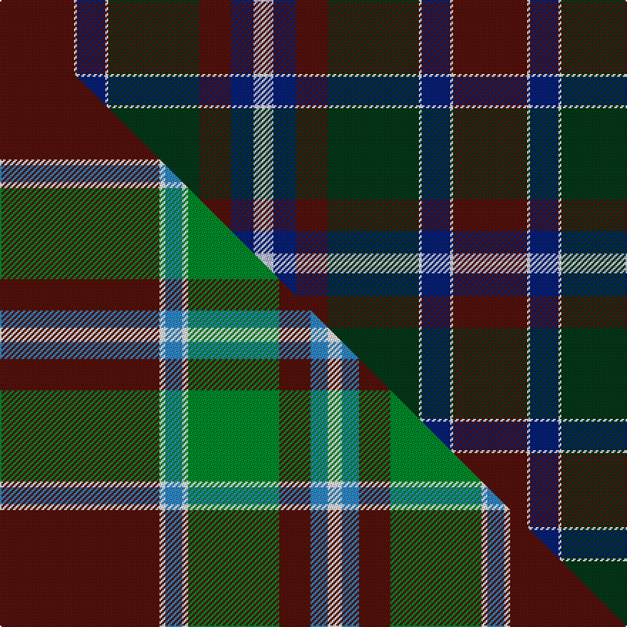

This is one **variant** — a specific cloth: this exact thread count and colourway, with its own
provenance below. It is one weaving of the [sett](/setts/dr26w1db10w1dg32dr11db8lb3w1/) (the scale-free proportion — the
same cloth at any scale or shade), whose colour order is pattern [BWBWGBBWW](/stripes/bwbwgbbww/).

Part of the [Spens/Spence](/tartans/spens-spence/) tartan — the named design grouping this sett with its other cloths.

Sourced from tartans-authority.  It is a [9 stripe tartan](/stripes/stripes9/).

Original link [https://www.tartanregister.gov.uk/tartanDetails.aspx?ref=1671](https://www.tartanregister.gov.uk/tartanDetails.aspx?ref=1671)

Dataset <small>— provenance for this record, inherited from the source manifest</small>

<dl class="dataset-prov">
<dt>source</dt><dd><a href="/sources/tartans-authority/">Scottish Tartans Authority</a></dd>
<dt>data captured from</dt><dd><a href="https://github.com/thetartan/tartan-database/blob/master/data/tartans-authority/data.csv">https://github.com/thetartan/tartan-database/blob/master/data/tartans-authority/data.csv</a></dd>
<dt>data date</dt><dd>c. 1816 <small>(this record)</small></dd>
<dt>licence</dt><dd><a href="https://creativecommons.org/licenses/by-nc-nd/4.0/">CC BY-NC-ND 4.0</a></dd>
</dl>

Capture chain <small>— the hands this data passed through, oldest first; each capture carries its own licence</small>

<ol class="capture-chain">
<li><a href="https://www.tartansauthority.com/">Scottish Tartans Authority</a> <small>the heritage body's archive — its tartan-ferret record browser is retired (links repaired to the SRT, above)</small></li>
<li><a href="https://github.com/thetartan/tartan-database">thetartan/tartan-database</a> <small>2016-2017</small> · <a href="https://creativecommons.org/licenses/by-nc-nd/4.0/">CC BY-NC-ND 4.0</a> <small>Levko Kravets's frozen compilation — the capture we vendored, and where its CC licence text came from</small></li>
<li>this dictionary <small>captured 2026-06-10 · commit 5bf86c7566</small> <small>each re-capture is a git commit to data/sources</small></li>
</ol>

## Register references

External register numbers recorded for this tartan.

- Scottish Tartans Authority (ITI): 1671

## Thread count
DR/52 W2 DB20 W2 DG64 DR22 DB16 LB6 W/2

One full sett is **318 threads**.

## Palette
<table><thead><tr><th>Colour</th><th>Shade</th><th>OKLCh</th></tr></thead><tbody><tr><td>W</td><td><code style="background-color:#F7F7F7;">#F7F7F7</code> <small style="color:#888">#F7F7F7</small></td><td><small style="color:#888">oklch(97.6% 0.000 89.9)</small></td></tr><tr><td>DB</td><td><code style="background-color:#082077;">#082077</code> <small style="color:#888">#082077</small></td><td><small style="color:#888">oklch(30.0% 0.149 265.1)</small></td></tr><tr><td>DR</td><td><code style="background-color:#55120C;">#55120C</code> <small style="color:#888">#55120C</small></td><td><small style="color:#888">oklch(30.0% 0.099 29.3)</small></td></tr><tr><td>DG</td><td><code style="background-color:#053819;">#053819</code> <small style="color:#888">#053819</small></td><td><small style="color:#888">oklch(30.0% 0.075 151.3)</small></td></tr><tr><td>LB</td><td><code style="background-color:#B5BBDE;">#B5BBDE</code> <small style="color:#888">#B5BBDE</small></td><td><small style="color:#888">oklch(79.9% 0.050 277.6)</small></td></tr></tbody></table>

# Sample pattern

## Compared to the master

This cloth is one sett of its design; the master sett (the exemplar the design is anchored on) is below for comparison.

Its **ΔTartan distance** from the master is **1.03** — the same measure the nearest-tartans table ranks by (0 is identical; a re-scale of the same cloth is near 0, a recolour or a different proportion further).

<figure class="master-compare" style="margin:0">

this sett
master sett ★

<figcaption style="color:#888;font-size:smaller">One weave of this sett against the <a href="/setts/dr56w2t6w2g32dr11t6w5/">master sett ★</a>, split on the diagonal: a shared proportion runs seamlessly across it with only the shades shifting; a different proportion breaks on it.</figcaption>
</figure>

## Nearest tartan variants

The nearest existing variants by ΔTartan distance, with this cloth at the top so the swatches line up against it.

ΔTartan

Threads

Variant

Sett

—

318

<a href="/variants/s9/dr26w1db10w1dg32dr11db8lb3w1~x2/">Spens/Spence (Clan)</a>

<a href="/ttd/edit/#slug=dg6r2db1r3db16n20w2~x2&amp;base=dr26w1db10w1dg32dr11db8lb3w1~x2" title="compare in the TTD">2.08</a>

184

<a href="/variants/s7/dg6r2db1r3db16n20w2~x2/">MacCord (Personal)</a>

<a href="/ttd/edit/#slug=dg18g2db5dr45lb3db18lb3dr8lr2~x2~dg1806142-g2408144-lb3103284-lr3200000&amp;base=dr26w1db10w1dg32dr11db8lb3w1~x2" title="compare in the TTD">2.24</a>

376

<a href="/variants/s9/dg18g2db5dr45lb3db18lb3dr8lbi2~x2~dg1806142-g2408144-lb3103284-lbi3200000/">MacNiven</a>

<a href="/ttd/edit/#slug=g9db2dp2g2dp18g2db2g1db19dr33g2~x2&amp;base=dr26w1db10w1dg32dr11db8lb3w1~x2" title="compare in the TTD">2.94</a>

346

<a href="/variants/s11/g9db2dp2g2dp18g2db2g1db19dr33g2~x2/">Pride of Scotland Autumn</a>

<a href="/ttd/edit/#slug=w1dg1dr1dg14dr1db6dr11dg1dr1lb1~x4&amp;base=dr26w1db10w1dg32dr11db8lb3w1~x2" title="compare in the TTD">3.11</a>

296

<a href="/variants/s10/w1dg1dr1dg14dr1db6dr11dg1dr1lb1~x4/">Glen Tilt #1 (District)</a>

<a href="/ttd/edit/#slug=dpi13dg16g4dp1g4dp34y1dp1~x2~dpi1607327-dp1105325&amp;base=dr26w1db10w1dg32dr11db8lb3w1~x2" title="compare in the TTD">3.15</a>

268

<a href="/variants/s8/dpi13dg16g4dp1g4dp34y1dp1~x2~dpi1607327-dp1105325/">Heather Mead (Personal)</a>

<a href="/ttd/edit/#slug=lb4db38g6dr2g6dr36lo2dr3~x2&amp;base=dr26w1db10w1dg32dr11db8lb3w1~x2" title="compare in the TTD">3.17</a>

374

<a href="/variants/s8/lb4db38g6dr2g6dr36lo2dr3~x2/">Scotland 2000 (Commemorative)</a>

<a href="/ttd/edit/#slug=dr5y2dr35g6dr2g6db38w4~x2&amp;base=dr26w1db10w1dg32dr11db8lb3w1~x2" title="compare in the TTD">3.28</a>

374

<a href="/variants/s8/dr5y2dr35g6dr2g6db38w4~x2/">Scotland 2000</a>

<a href="/ttd/edit/#slug=w4db38g6dr2g6dr36y2dr3~x2&amp;base=dr26w1db10w1dg32dr11db8lb3w1~x2" title="compare in the TTD">3.31</a>

374

<a href="/variants/s8/w4db38g6dr2g6dr36y2dr3~x2/">Scotland 2000</a>

<a href="/ttd/edit/#slug=dr1dg4g1dg3dr4db15w1~x4&amp;base=dr26w1db10w1dg32dr11db8lb3w1~x2" title="compare in the TTD">3.36</a>

224

<a href="/variants/s7/dr1dg4g1dg3dr4db15w1~x4/">Bressuire</a>

<a href="/ttd/edit/#slug=dr2dg14lb3dr13ly1dr2~x4&amp;base=dr26w1db10w1dg32dr11db8lb3w1~x2" title="compare in the TTD">3.40</a>

264

<a href="/variants/s6/dr2dg14lb3dr13ly1dr2~x4/">Swedish Para Whisky Club (Corporate</a>

## Neighbour map

Every grey dot is one of 13621 variants placed by the first two principal components of the ΔTartan feature space (42% of its variance). Red is this tartan; blue dots are its nearest — click one to open its page.

<svg viewBox="0 0 640 380" role="img" style="max-width:100%;height:auto;border:1px solid #e0e0e0;border-radius:4px;display:block" xmlns="http://www.w3.org/2000/svg"><image href="/nn/cloud.v1.png" width="640" height="380"/><a href="/variants/s7/dg6r2db1r3db16n20w2~x2/"><circle cx="263.4" cy="170.3" r="4" fill="#3465a4"><title>MacCord (Personal)</title></circle></a><a href="/variants/s9/dg18g2db5dr45lb3db18lb3dr8lbi2~x2~dg1806142-g2408144-lb3103284-lbi3200000/"><circle cx="322.4" cy="140.8" r="4" fill="#3465a4"><title>MacNiven</title></circle></a><a href="/variants/s11/g9db2dp2g2dp18g2db2g1db19dr33g2~x2/"><circle cx="328.3" cy="158.0" r="4" fill="#3465a4"><title>Pride of Scotland Autumn</title></circle></a><a href="/variants/s10/w1dg1dr1dg14dr1db6dr11dg1dr1lb1~x4/"><circle cx="331.2" cy="180.9" r="4" fill="#3465a4"><title>Glen Tilt #1 (District)</title></circle></a><a href="/variants/s8/dpi13dg16g4dp1g4dp34y1dp1~x2~dpi1607327-dp1105325/"><circle cx="383.3" cy="153.7" r="4" fill="#3465a4"><title>Heather Mead (Personal)</title></circle></a><a href="/variants/s8/lb4db38g6dr2g6dr36lo2dr3~x2/"><circle cx="310.0" cy="164.1" r="4" fill="#3465a4"><title>Scotland 2000 (Commemorative)</title></circle></a><a href="/variants/s8/dr5y2dr35g6dr2g6db38w4~x2/"><circle cx="301.9" cy="164.0" r="4" fill="#3465a4"><title>Scotland 2000</title></circle></a><a href="/variants/s8/w4db38g6dr2g6dr36y2dr3~x2/"><circle cx="301.0" cy="161.5" r="4" fill="#3465a4"><title>Scotland 2000</title></circle></a><a href="/variants/s7/dr1dg4g1dg3dr4db15w1~x4/"><circle cx="353.7" cy="190.9" r="4" fill="#3465a4"><title>Bressuire</title></circle></a><a href="/variants/s6/dr2dg14lb3dr13ly1dr2~x4/"><circle cx="364.9" cy="222.6" r="4" fill="#3465a4"><title>Swedish Para Whisky Club (Corporate</title></circle></a><circle cx="320.5" cy="161.4" r="5" fill="#c00000"/><text x="320" y="376" text-anchor="middle" font-size="11" fill="#999">ground</text><text x="11" y="190" text-anchor="middle" font-size="11" fill="#999" transform="rotate(-90 11 190)">complexity</text></svg>

ID: /variants/s9/dr26w1db10w1dg32dr11db8lb3w1~x2/
