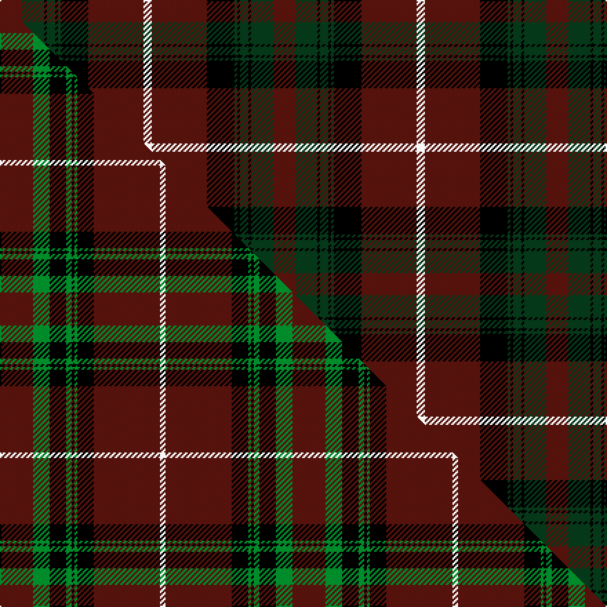

This page is one **sett** — a single exact thread-count. It belongs to the [tartan](/setts/dr8dg8k1dg3k1dg1k10dr20w3/)
(the same proportion at any scale), whose colour order is pattern [BGKGKGKBW](/stripes/bgkgkgkbw/).

Part of the [Hunter of Bute](/tartans/hunter-of-bute/) tartan — the named design grouping this sett with its other cloths.

Sourced from tartans-authority.  It is a [9 stripe tartan](/stripes/stripes9/).

Original link http://www.tartansauthority.com/tartan-ferret/display/8859/

## Register references

External register numbers recorded for this tartan.

- Scottish Tartans Authority (ITI): 8859

## Thread count
DR/16 DG16 K2 DG6 K2 DG2 K20 DR40 W/6

One full sett is **198 threads**.

## Palette
<table><thead><tr><th>Colour</th><th>Shade</th><th>OKLCh</th></tr></thead><tbody><tr><td>DR</td><td><code style="background-color:#55120C;">#55120C</code> <small style="color:#888">#55120C</small></td><td><small style="color:#888">oklch(30.0% 0.099 29.3)</small></td></tr><tr><td>DG</td><td><code style="background-color:#053819;">#053819</code> <small style="color:#888">#053819</small></td><td><small style="color:#888">oklch(30.0% 0.075 151.3)</small></td></tr><tr><td>K</td><td><code style="background-color:#000000;">#000000</code> <small style="color:#888">#000000</small></td><td><small style="color:#888">oklch(0.0% 0.000 0.0)</small></td></tr><tr><td>W</td><td><code style="background-color:#F7F7F7;">#F7F7F7</code> <small style="color:#888">#F7F7F7</small></td><td><small style="color:#888">oklch(97.6% 0.000 89.9)</small></td></tr></tbody></table>

# Sample pattern

## Compared to the master

This cloth is one sett of its design; the master sett (the exemplar the design is anchored on) is below for comparison.

Its **ΔTartan distance** from the master is **0.59** — the same measure the nearest-tartans table ranks by (0 is identical; a re-scale of the same cloth is near 0, a recolour or a different proportion further).

<figure class="master-compare" style="margin:0">

this sett
master sett ★

<figcaption style="color:#888;font-size:smaller">One weave of this sett against the <a href="/setts/dr12g6k6g2k1g1k6dr24w2/">master sett ★</a>, split on the diagonal: a shared proportion runs seamlessly across it with only the shades shifting; a different proportion breaks on it.</figcaption>
</figure>

## Nearest tartan variants

The nearest existing variants by ΔTartan distance, with this cloth at the top so the swatches line up against it.

ΔTartan

Threads

Variant

Sett

—

198

<a href="/variants/s9/dr8dg8k1dg3k1dg1k10dr20w3~x2/">Hunter of Bute (Clan ?)</a>

<a href="/ttd/edit/#slug=dr12g6k6g2k1g1k6dr24w2~x2&amp;base=dr8dg8k1dg3k1dg1k10dr20w3~x2" title="compare in the TTD">0.59</a>

212

<a href="/variants/s9/dr12g6k6g2k1g1k6dr24w2~x2/">Hunter of Bute (Personal)</a>

<a href="/ttd/edit/#slug=dr22g11k2g4k2g6k16dr42lb6~x2&amp;base=dr8dg8k1dg3k1dg1k10dr20w3~x2" title="compare in the TTD">0.73</a>

388

<a href="/variants/s9/dr22g11k2g4k2g6k16dr42lb6~x2/">Stewart of Bute Hunting</a>

<a href="/ttd/edit/#slug=dg36k2dg2k2dg3k12lb10r20~x2&amp;base=dr8dg8k1dg3k1dg1k10dr20w3~x2" title="compare in the TTD">2.16</a>

236

<a href="/variants/s8/dg36k2dg2k2dg3k12lb10r20~x2/">Georgia, State of (District)</a>

<a href="/ttd/edit/#slug=dr12g6k4g2k4g1k12dr24r4g3w3k10~x2&amp;base=dr8dg8k1dg3k1dg1k10dr20w3~x2" title="compare in the TTD">2.18</a>

296

<a href="/variants/s12/dr12g6k4g2k4g1k12dr24r4g3w3k10~x2/">Fullerton, Terence (Personal)</a>

<a href="/ttd/edit/#slug=r2k1r12k2r3k26dy14ri2~x4~r1807016-ri2610034&amp;base=dr8dg8k1dg3k1dg1k10dr20w3~x2" title="compare in the TTD">2.21</a>

480

<a href="/variants/s8/r2k1r12k2r3k26dy14ri2~x4~r1807016-ri2610034/">Booth (Fashion)</a>

<a href="/ttd/edit/#slug=k1db1dg16r16k12db8dg16db1k1~x2&amp;base=dr8dg8k1dg3k1dg1k10dr20w3~x2" title="compare in the TTD">2.29</a>

284

<a href="/variants/s9/k1db1dg16r16k12db8dg16db1k1~x2/">MacNett</a>

<a href="/ttd/edit/#slug=ly4k2dr7k15dr3k3dr3k7dr28g7dr6g2~x2&amp;base=dr8dg8k1dg3k1dg1k10dr20w3~x2" title="compare in the TTD">2.33</a>

336

<a href="/variants/s12/ly4k2dr7k15dr3k3dr3k7dr28g7dr6g2~x2/">Walker, Evening (Name)</a>

<a href="/ttd/edit/#slug=db1k1dr12g12k6db5dr12k1db1~x4&amp;base=dr8dg8k1dg3k1dg1k10dr20w3~x2" title="compare in the TTD">2.47</a>

400

<a href="/variants/s9/db1k1dr12g12k6db5dr12k1db1~x4/">Montrose (Macnaughton variation)</a>

<a href="/ttd/edit/#slug=k20r1dg3k8dg2k2dg20w2~x2&amp;base=dr8dg8k1dg3k1dg1k10dr20w3~x2" title="compare in the TTD">2.58</a>

188

<a href="/variants/s8/k20r1dg3k8dg2k2dg20w2~x2/">Scottish Chieftain (Universal)</a>

<a href="/ttd/edit/#slug=w2k35db30k3dr30k2dr4k2dr30k3w2&amp;base=dr8dg8k1dg3k1dg1k10dr20w3~x2" title="compare in the TTD">2.59</a>

282

<a href="/variants/s11/w2k35db30k3dr30k2dr4k2dr30k3w2/">Gwyn (Welsh Name)</a>

## Neighbour map

Every grey dot is one of 13620 variants placed by the first two principal components of the ΔTartan feature space (42% of its variance). Red is this tartan; blue dots are its nearest — click one to open its page.

<svg viewBox="0 0 640 380" role="img" style="max-width:100%;height:auto;border:1px solid #e0e0e0;border-radius:4px;display:block" xmlns="http://www.w3.org/2000/svg"><image href="/nn/cloud.v1.png" width="640" height="380"/><a href="/variants/s9/dr12g6k6g2k1g1k6dr24w2~x2/"><circle cx="300.6" cy="103.0" r="4" fill="#3465a4"><title>Hunter of Bute (Personal)</title></circle></a><a href="/variants/s9/dr22g11k2g4k2g6k16dr42lb6~x2/"><circle cx="304.2" cy="136.1" r="4" fill="#3465a4"><title>Stewart of Bute Hunting</title></circle></a><a href="/variants/s8/dg36k2dg2k2dg3k12lb10r20~x2/"><circle cx="226.9" cy="141.3" r="4" fill="#3465a4"><title>Georgia, State of (District)</title></circle></a><a href="/variants/s12/dr12g6k4g2k4g1k12dr24r4g3w3k10~x2/"><circle cx="192.0" cy="113.6" r="4" fill="#3465a4"><title>Fullerton, Terence (Personal)</title></circle></a><a href="/variants/s8/r2k1r12k2r3k26dy14ri2~x4~r1807016-ri2610034/"><circle cx="268.3" cy="124.6" r="4" fill="#3465a4"><title>Booth (Fashion)</title></circle></a><a href="/variants/s9/k1db1dg16r16k12db8dg16db1k1~x2/"><circle cx="213.5" cy="161.7" r="4" fill="#3465a4"><title>MacNett</title></circle></a><a href="/variants/s12/ly4k2dr7k15dr3k3dr3k7dr28g7dr6g2~x2/"><circle cx="277.3" cy="142.4" r="4" fill="#3465a4"><title>Walker, Evening (Name)</title></circle></a><a href="/variants/s9/db1k1dr12g12k6db5dr12k1db1~x4/"><circle cx="231.9" cy="178.2" r="4" fill="#3465a4"><title>Montrose (Macnaughton variation)</title></circle></a><a href="/variants/s8/k20r1dg3k8dg2k2dg20w2~x2/"><circle cx="305.1" cy="142.5" r="4" fill="#3465a4"><title>Scottish Chieftain (Universal)</title></circle></a><a href="/variants/s11/w2k35db30k3dr30k2dr4k2dr30k3w2/"><circle cx="260.7" cy="139.7" r="4" fill="#3465a4"><title>Gwyn (Welsh Name)</title></circle></a><circle cx="276.9" cy="145.4" r="5" fill="#c00000"/><text x="320" y="376" text-anchor="middle" font-size="11" fill="#999">ground</text><text x="11" y="190" text-anchor="middle" font-size="11" fill="#999" transform="rotate(-90 11 190)">complexity</text></svg>

ID: /variants/s9/dr8dg8k1dg3k1dg1k10dr20w3~x2/
