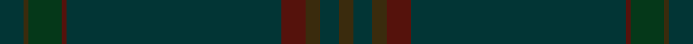
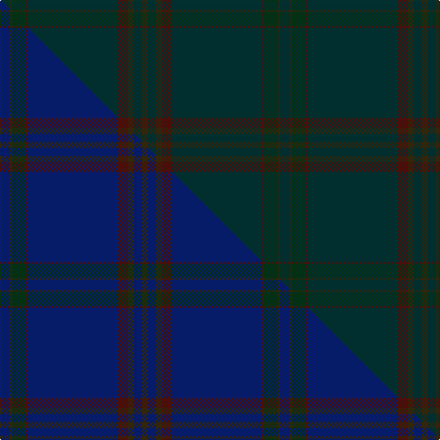

This is one **variant** — a specific cloth: this exact thread count and colourway, with its own
provenance below. It is one weaving of the [sett](/tartans/b/br/brooks-brothers-signature/) (the scale-free proportion — the
same cloth at any scale or shade), whose colour order is pattern [BGGBBBGBG](/stripes/bggbbbgbg/).

Part of the [Brooks Brothers Signature](/tartans/b/br/brooks-brothers-signature/) tartan — the named design grouping this sett with its other cloths.

Sourced from house-of-tartan.  It is a [9 stripe tartan](/stripes/stripes9/).

Original link [http://www.house-of-tartan.scotland.net/house/TartanViewjs.asp?colr=Def&tnam=10652](http://www.house-of-tartan.scotland.net/house/TartanViewjs.asp?colr=Def&tnam=10652)

## Provenance

Earliest known date: 01/05/2012 Brooks Brothers' Scottish roots originate in Perthshire's Glen Lyon. Thomas Lyon emigrated from Glen Lyon to the USA in the 1600s. It was his granddaughter, Lavinia, who married Henry Sands Brooks, founder of the Brooks empire. Brooks opened his first store in Cherry Street, New York in 1818. This simple and elegant tartan contains elements of the traditional 1819 Campbell tartan (the major clan in Glen Lyon) and incorporates the gold from the Brooks Brothers famous Golden Fleece logo and their equally famous necktie design, No. 1 stripe.

Dataset <small>— provenance for this record, inherited from the source manifest</small>

<dl class="dataset-prov">
<dt>source</dt><dd><a href="/sources/house-of-tartan/">House of Tartan</a></dd>
<dt>data captured from</dt><dd><a href="https://github.com/thetartan/tartan-database/blob/master/data/house-of-tartan/data.csv">https://github.com/thetartan/tartan-database/blob/master/data/house-of-tartan/data.csv</a></dd>
<dt>data date</dt><dd>01/05/2012 <small>(this record)</small></dd>
<dt>licence</dt><dd><a href="https://creativecommons.org/licenses/by-nc-nd/4.0/">CC BY-NC-ND 4.0</a></dd>
</dl>

Capture chain <small>— the hands this data passed through, oldest first; each capture carries its own licence</small>

<ol class="capture-chain">
<li><a href="http://www.house-of-tartan.scotland.net/">House of Tartan</a> <small>the weaver/retailer's database — the site is now offline; the URL is kept as the ultimate source's identity</small></li>
<li><a href="https://github.com/thetartan/tartan-database">thetartan/tartan-database</a> <small>2016-2017</small> · <a href="https://creativecommons.org/licenses/by-nc-nd/4.0/">CC BY-NC-ND 4.0</a> <small>Levko Kravets's frozen compilation — the capture we vendored, and where its CC licence text came from</small></li>
<li>this dictionary <small>captured 2026-06-10 · commit 5bf86c7566</small> <small>each re-capture is a git commit to data/sources</small></li>
</ol>

## Thread count
DT/10 DY2 DG14 DR2 DT90 DR10 DY6 DT8 DY/6

One full sett is **280 threads**.

## Palette
<table><thead><tr><th>Colour</th><th>Shade</th><th>OKLCh</th></tr></thead><tbody><tr><td>DT</td><td><code style="background-color:#023535;">#023535</code> <small style="color:#888">#023535</small></td><td><small style="color:#888">oklch(29.8% 0.050 194.8)</small></td></tr><tr><td>DR</td><td><code style="background-color:#55120C;">#55120C</code> <small style="color:#888">#55120C</small></td><td><small style="color:#888">oklch(30.0% 0.099 29.3)</small></td></tr><tr><td>DG</td><td><code style="background-color:#053819;">#053819</code> <small style="color:#888">#053819</small></td><td><small style="color:#888">oklch(30.0% 0.075 151.3)</small></td></tr><tr><td>DY</td><td><code style="background-color:#3A2B0D;">#3A2B0D</code> <small style="color:#888">#3A2B0D</small></td><td><small style="color:#888">oklch(30.0% 0.049 82.0)</small></td></tr></tbody></table>

# Sample pattern

## Compared to the master

This cloth is one sett of its design; the master sett (the exemplar the design is anchored on) is below for comparison.

Its **ΔTartan distance** from the master is **13.03** — the same measure the nearest-tartans table ranks by (0 is identical; a re-scale of the same cloth is near 0, a recolour or a different proportion further).

<figure class="master-compare" style="margin:0">

this sett
master sett ★

<figcaption style="color:#888;font-size:smaller">One weave of this sett against the <a href="/setts/db5dy1dg7dr1db45dr5dy3db4dy3/">master sett ★</a>, split on the diagonal: a shared proportion runs seamlessly across it with only the shades shifting; a different proportion breaks on it.</figcaption>
</figure>

## Nearest tartan variants

The nearest existing variants by ΔTartan distance, with this cloth at the top so the swatches line up against it.

ΔTartan

Threads

Variant

Sett

—

280

<a href="/variants/s9/dt5dy1dg7dr1dt45dr5dy3dt4dy3~x2/">Brooks Brothers Signature Corporate Tartan</a>

<a href="/ttd/edit/#slug=y9g9lo1g9y9g1~x4&amp;base=dt5dy1dg7dr1dt45dr5dy3dt4dy3~x2" title="compare in the TTD">1.98</a>

264

<a href="/variants/s6/y9g9lo1g9y9g1~x4/">Spring Morning</a>

<a href="/ttd/edit/#slug=dt4dr1dt4dr1dg14n1dg1~x4&amp;base=dt5dy1dg7dr1dt45dr5dy3dt4dy3~x2" title="compare in the TTD">3.56</a>

188

<a href="/variants/s7/dt4dr1dt4dr1dg14n1dg1~x4/">Pinehurst Resort</a>

<a href="/ttd/edit/#slug=g8y1g8y12r1y1~x4&amp;base=dt5dy1dg7dr1dt45dr5dy3dt4dy3~x2" title="compare in the TTD">3.59</a>

212

<a href="/variants/s6/g8y1g8y12r1y1~x4/">Forget Family (Yonne)</a>

## Neighbour map

Every grey dot is one of 13662 variants placed by the first two principal components of the ΔTartan feature space (42% of its variance). Red is this tartan; blue dots are its nearest — click one to open its page. The map is a flat projection of a many-dimensional space — [how to read it](/posts/neighbourhood-maps/).

<svg viewBox="0 0 640 380" role="img" style="max-width:100%;height:auto;border:1px solid #e0e0e0;border-radius:4px;display:block" xmlns="http://www.w3.org/2000/svg"><image href="/nn/cloud.v1.png" width="640" height="380"/><a href="/variants/s6/y9g9lo1g9y9g1~x4/"><circle cx="545.5" cy="356.8" r="4" fill="#3465a4"><title>Spring Morning</title></circle></a><a href="/variants/s7/dt4dr1dt4dr1dg14n1dg1~x4/"><circle cx="626.0" cy="320.2" r="4" fill="#3465a4"><title>Pinehurst Resort</title></circle></a><a href="/variants/s6/g8y1g8y12r1y1~x4/"><circle cx="549.8" cy="304.8" r="4" fill="#3465a4"><title>Forget Family (Yonne)</title></circle></a><circle cx="626.0" cy="253.8" r="5" fill="#c00000"/><text x="320" y="376" text-anchor="middle" font-size="11" fill="#999">ground</text><text x="11" y="190" text-anchor="middle" font-size="11" fill="#999" transform="rotate(-90 11 190)">complexity</text></svg>

ID: /variants/s9/dt5dy1dg7dr1dt45dr5dy3dt4dy3~x2/
