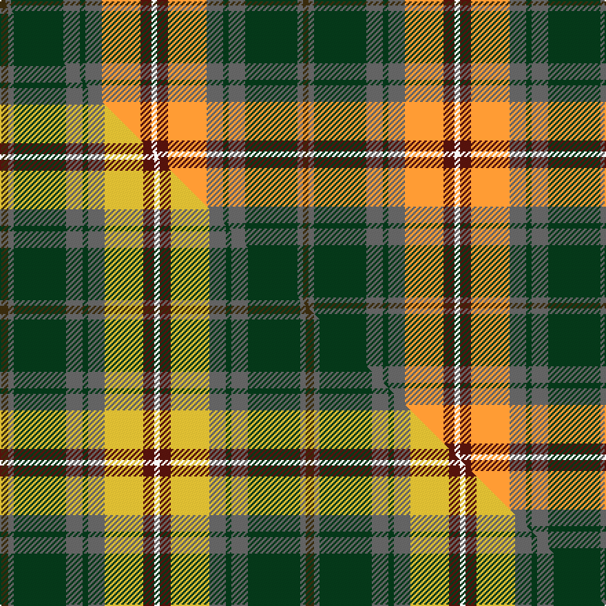

This is one **variant** — a specific cloth: this exact thread count and colourway, with its own
provenance below. It is one weaving of the [sett](/tartans/r/ro/royal-pharmaceutical-society/) (the scale-free proportion — the
same cloth at any scale or shade), whose colour order is pattern [GBGBGBYBW](/stripes/gbgbgbybw/).

Part of the [Royal Pharmaceutical Society](/tartans/r/ro/royal-pharmaceutical-society/) tartan — the named design grouping this sett with its other cloths.

Sourced from tartans-authority.  It is a [9 stripe tartan](/stripes/stripes9/).

Original link <code>http://www.tartansauthority.com/tartan-ferret/display/2091/</code> — retired · [Internet Archive copy](https://web.archive.org/web/*/http://www.tartansauthority.com/tartan-ferret/display/2091/*)

Dataset <small>— provenance for this record, inherited from the source manifest</small>

<dl class="dataset-prov">
<dt>source</dt><dd><a href="/sources/tartans-authority/">Scottish Tartans Authority</a></dd>
<dt>data captured from</dt><dd><a href="https://github.com/thetartan/tartan-database/blob/master/data/tartans-authority/data.csv">https://github.com/thetartan/tartan-database/blob/master/data/tartans-authority/data.csv</a></dd>
<dt>data date</dt><dd>1991 <small>(this record)</small></dd>
<dt>licence</dt><dd><a href="https://creativecommons.org/licenses/by-nc-nd/4.0/">CC BY-NC-ND 4.0</a></dd>
</dl>

Capture chain <small>— the hands this data passed through, oldest first; each capture carries its own licence</small>

<ol class="capture-chain">
<li><a href="https://www.tartansauthority.com/">Scottish Tartans Authority</a> <small>the heritage body’s archive — its tartan-ferret record browser is retired; dead record links are shown unlinked, with an Internet Archive copy (ITI numbers are not SRT references)</small></li>
<li><a href="https://github.com/thetartan/tartan-database">thetartan/tartan-database</a> <small>2016-2017</small> · <a href="https://creativecommons.org/licenses/by-nc-nd/4.0/">CC BY-NC-ND 4.0</a> <small>Levko Kravets's frozen compilation — the capture we vendored, and where its CC licence text came from</small></li>
<li>this dictionary <small>captured 2026-06-10 · commit 5bf86c7566</small> <small>each re-capture is a git commit to data/sources</small></li>
</ol>

## Register references

External register numbers recorded for this tartan.

- Scottish Tartans Authority (ITI): 2091

## Thread count
DY/4 N4 DG38 N12 DG4 N12 LO28 DR8 W/4

One full sett is **220 threads**.

## Palette
<table><thead><tr><th>Colour</th><th>Shade</th><th>OKLCh</th></tr></thead><tbody><tr><td>DG</td><td><code style="background-color:#053819;">#053819</code> <small style="color:#888">#053819</small></td><td><small style="color:#888">oklch(30.0% 0.075 151.3)</small></td></tr><tr><td>DR</td><td><code style="background-color:#55120C;">#55120C</code> <small style="color:#888">#55120C</small></td><td><small style="color:#888">oklch(30.0% 0.099 29.3)</small></td></tr><tr><td>W</td><td><code style="background-color:#F7F7F7;">#F7F7F7</code> <small style="color:#888">#F7F7F7</small></td><td><small style="color:#888">oklch(97.6% 0.000 89.9)</small></td></tr><tr><td>LO</td><td><code style="background-color:#FF9C34;">#FF9C34</code> <small style="color:#888">#FF9C34</small></td><td><small style="color:#888">oklch(77.9% 0.161 61.8)</small></td></tr><tr><td>N</td><td><code style="background-color:#636363;">#636363</code> <small style="color:#888">#636363</small></td><td><small style="color:#888">oklch(50.0% 0.000 89.9)</small></td></tr><tr><td>DY</td><td><code style="background-color:#3A2B0D;">#3A2B0D</code> <small style="color:#888">#3A2B0D</small></td><td><small style="color:#888">oklch(30.0% 0.049 82.0)</small></td></tr></tbody></table>

# Sample pattern

## Compared to the master

This cloth is one sett of its design; the master sett (the exemplar the design is anchored on) is below for comparison.

Its **ΔTartan distance** from the master is **1.03** — the same measure the nearest-tartans table ranks by (0 is identical; a re-scale of the same cloth is near 0, a recolour or a different proportion further).

<figure class="master-compare" style="margin:0">

this sett
master sett ★

<figcaption style="color:#888;font-size:smaller">One weave of this sett against the <a href="/setts/dy3n2dg19n6dg2n6ly14dr4w2/">master sett ★</a>, split on the diagonal: a shared proportion runs seamlessly across it with only the shades shifting; a different proportion breaks on it.</figcaption>
</figure>

## Nearest tartan variants

The nearest existing variants by ΔTartan distance, with this cloth at the top so the swatches line up against it.

ΔTartan

Threads

Variant

Sett

—

220

<a href="/variants/s9/dy2n2dg19n6dg2n6lo14dr4w2~x2/">Royal Pharmaceutical Society (Corp)</a>

<a href="/ttd/edit/#slug=dy3n2dg19n6dg2n6ly14dr4w2~x2&amp;base=dy2n2dg19n6dg2n6lo14dr4w2~x2" title="compare in the TTD">1.03</a>

222

<a href="/variants/s9/dy3n2dg19n6dg2n6ly14dr4w2~x2/">Royal Pharmaceutical Society</a>

<a href="/ttd/edit/#slug=dr3ly21dr14w3db11g36do3db3do4ly3~x2&amp;base=dy2n2dg19n6dg2n6lo14dr4w2~x2" title="compare in the TTD">2.33</a>

392

<a href="/variants/s10/dr3ly21dr14w3db11g36do3db3do4ly3~x2/">State Seal of Florida (Fashion)</a>

<a href="/ttd/edit/#slug=r4ly3dt24dy26g3ly21dp2ly4~x2&amp;base=dy2n2dg19n6dg2n6lo14dr4w2~x2" title="compare in the TTD">2.62</a>

332

<a href="/variants/s8/r4ly3dt24dy26g3ly21dp2ly4~x2/">Goddin mab Gododdin (Personal)</a>

<a href="/ttd/edit/#slug=w5n49w3dg24dr5ly4dy30w4~x2&amp;base=dy2n2dg19n6dg2n6lo14dr4w2~x2" title="compare in the TTD">2.79</a>

478

<a href="/variants/s8/w5n49w3dg24dr5ly4dy30w4~x2/">State Seal of New Mexico (Fashion)</a>

<a href="/ttd/edit/#slug=do3db2g19db6g2db6ly14w2dp4w2~x2&amp;base=dy2n2dg19n6dg2n6lo14dr4w2~x2" title="compare in the TTD">2.81</a>

230

<a href="/variants/s10/do3db2g19db6g2db6ly14w2dp4w2~x2/">Royal Pharmaceutical Society Commemorative Tartan</a>

<a href="/ttd/edit/#slug=dy17n5db2w12db2y4g7~x2&amp;base=dy2n2dg19n6dg2n6lo14dr4w2~x2" title="compare in the TTD">2.94</a>

148

<a href="/variants/s7/dy17n5db2w12db2y4g7~x2/">Ontario Northern Canadian District Tartan</a>

<a href="/ttd/edit/#slug=dpi4dp4dpi2dp14dg6g3dg6dgi2g4dgi2g15n3~x2~dpi1607327-dp1105325-g2408144-dgi1806142&amp;base=dy2n2dg19n6dg2n6lo14dr4w2~x2" title="compare in the TTD">2.95</a>

246

<a href="/variants/s12/dpi4dp4dpi2dp14dg6g3dg6dgi2g4dgi2g15n3~x2~dpi1607327-dp1105325-g2408144-dgi1806142/">Kinloch Anderson Heather (Corporate)</a>

<a href="/ttd/edit/#slug=lo40y10w6dy10do6dy4do6dy4do60n34db11&amp;base=dy2n2dg19n6dg2n6lo14dr4w2~x2" title="compare in the TTD">2.97</a>

331

<a href="/variants/s11/lo40y10w6dy10do6dy4do6dy4do60n34db11/">Angels' Share, The</a>

<a href="/ttd/edit/#slug=lr4dg13g6dr16lb2dr2g2~x2~lr3200000-lb3103284&amp;base=dy2n2dg19n6dg2n6lo14dr4w2~x2" title="compare in the TTD">2.99</a>

168

<a href="/variants/s7/lbi4dg13g6dr16lb2dr2g2~x2~lbi3200000-lb3103284/">Caledonian Brewery (Corporate)</a>

<a href="/ttd/edit/#slug=dy3o1lb1dy1o1dy3lb3ly6dr1~x6~o2503076-ly3104101&amp;base=dy2n2dg19n6dg2n6lo14dr4w2~x2" title="compare in the TTD">3.07</a>

216

<a href="/variants/s9/dy3ly1lb1dy1ly1dy3lb3lyi6dr1~x6~ly2503076-lyi3104101/">Toorak Chapler (Fashion)</a>

## Neighbour map

Every grey dot is one of 13656 variants placed by the first two principal components of the ΔTartan feature space (42% of its variance). Red is this tartan; blue dots are its nearest — click one to open its page. The map is a flat projection of a many-dimensional space — [how to read it](/posts/neighbourhood-maps/).

<svg viewBox="0 0 640 380" role="img" style="max-width:100%;height:auto;border:1px solid #e0e0e0;border-radius:4px;display:block" xmlns="http://www.w3.org/2000/svg"><image href="/nn/cloud.v1.png" width="640" height="380"/><a href="/variants/s9/dy3n2dg19n6dg2n6ly14dr4w2~x2/"><circle cx="169.2" cy="189.0" r="4" fill="#3465a4"><title>Royal Pharmaceutical Society</title></circle></a><a href="/variants/s10/dr3ly21dr14w3db11g36do3db3do4ly3~x2/"><circle cx="165.1" cy="164.4" r="4" fill="#3465a4"><title>State Seal of Florida (Fashion)</title></circle></a><a href="/variants/s8/r4ly3dt24dy26g3ly21dp2ly4~x2/"><circle cx="153.4" cy="164.9" r="4" fill="#3465a4"><title>Goddin mab Gododdin (Personal)</title></circle></a><a href="/variants/s8/w5n49w3dg24dr5ly4dy30w4~x2/"><circle cx="232.7" cy="169.0" r="4" fill="#3465a4"><title>State Seal of New Mexico (Fashion)</title></circle></a><a href="/variants/s10/do3db2g19db6g2db6ly14w2dp4w2~x2/"><circle cx="142.3" cy="179.1" r="4" fill="#3465a4"><title>Royal Pharmaceutical Society Commemorative Tartan</title></circle></a><a href="/variants/s7/dy17n5db2w12db2y4g7~x2/"><circle cx="119.7" cy="206.1" r="4" fill="#3465a4"><title>Ontario Northern Canadian District Tartan</title></circle></a><a href="/variants/s12/dpi4dp4dpi2dp14dg6g3dg6dgi2g4dgi2g15n3~x2~dpi1607327-dp1105325-g2408144-dgi1806142/"><circle cx="151.1" cy="199.6" r="4" fill="#3465a4"><title>Kinloch Anderson Heather (Corporate)</title></circle></a><a href="/variants/s11/lo40y10w6dy10do6dy4do6dy4do60n34db11/"><circle cx="180.6" cy="138.9" r="4" fill="#3465a4"><title>Angels' Share, The</title></circle></a><a href="/variants/s7/lbi4dg13g6dr16lb2dr2g2~x2~lbi3200000-lb3103284/"><circle cx="223.5" cy="225.5" r="4" fill="#3465a4"><title>Caledonian Brewery (Corporate)</title></circle></a><a href="/variants/s9/dy3ly1lb1dy1ly1dy3lb3lyi6dr1~x6~ly2503076-lyi3104101/"><circle cx="157.5" cy="231.1" r="4" fill="#3465a4"><title>Toorak Chapler (Fashion)</title></circle></a><circle cx="178.7" cy="185.1" r="5" fill="#c00000"/><text x="320" y="376" text-anchor="middle" font-size="11" fill="#999">ground</text><text x="11" y="190" text-anchor="middle" font-size="11" fill="#999" transform="rotate(-90 11 190)">complexity</text></svg>

ID: /variants/s9/dy2n2dg19n6dg2n6lo14dr4w2~x2/
