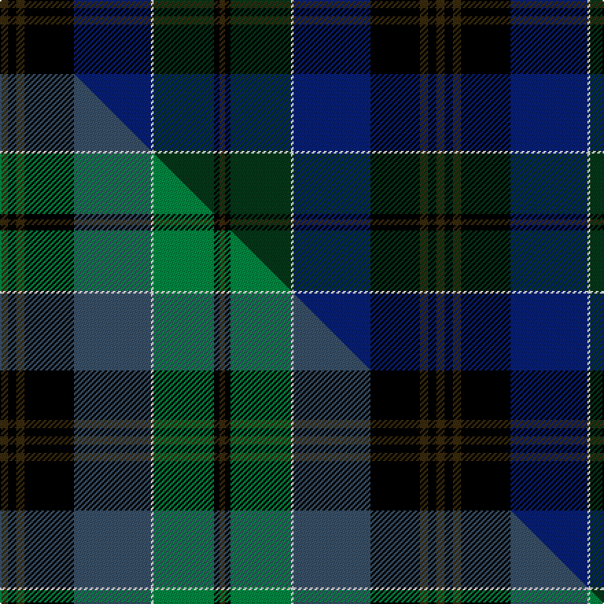

This page is one **sett** — a single exact thread-count. It belongs to the [tartan](/setts/dy3k3dy3k18db28w1dg22k2dy2/)
(the same proportion at any scale), whose colour order is pattern [GKGKBWGKG](/stripes/gkgkbwgkg/).

Part of the [Black Gold](/tartans/black-gold/) tartan — the named design grouping this sett with its other cloths.

Sourced from tartans-authority.  It is a [9 stripe tartan](/stripes/stripes9/).

Original link http://www.tartansauthority.com/tartan-ferret/display/4253/

## Register references

External register numbers recorded for this tartan.

- Scottish Tartans Authority (ITI): 4253

## Thread count
DY/6 K6 DY6 K36 DB56 W2 DG44 K4 DY/4

One full sett is **318 threads**.

## Palette
<table><thead><tr><th>Colour</th><th>Shade</th><th>OKLCh</th></tr></thead><tbody><tr><td>DB</td><td><code style="background-color:#082077;">#082077</code> <small style="color:#888">#082077</small></td><td><small style="color:#888">oklch(30.0% 0.149 265.1)</small></td></tr><tr><td>DG</td><td><code style="background-color:#053819;">#053819</code> <small style="color:#888">#053819</small></td><td><small style="color:#888">oklch(30.0% 0.075 151.3)</small></td></tr><tr><td>K</td><td><code style="background-color:#000000;">#000000</code> <small style="color:#888">#000000</small></td><td><small style="color:#888">oklch(0.0% 0.000 0.0)</small></td></tr><tr><td>W</td><td><code style="background-color:#F7F7F7;">#F7F7F7</code> <small style="color:#888">#F7F7F7</small></td><td><small style="color:#888">oklch(97.6% 0.000 89.9)</small></td></tr><tr><td>DY</td><td><code style="background-color:#3A2B0D;">#3A2B0D</code> <small style="color:#888">#3A2B0D</small></td><td><small style="color:#888">oklch(30.0% 0.049 82.0)</small></td></tr></tbody></table>

# Sample pattern

## Compared to the master

This cloth is one sett of its design; the master sett (the exemplar the design is anchored on) is below for comparison.

Its **ΔTartan distance** from the master is **1.94** — the same measure the nearest-tartans table ranks by (0 is identical; a re-scale of the same cloth is near 0, a recolour or a different proportion further).

<figure class="master-compare" style="margin:0">

this sett
master sett ★

<figcaption style="color:#888;font-size:smaller">One weave of this sett against the <a href="/setts/dy3k3dy3k18n28w1g22k2dy2/">master sett ★</a>, split on the diagonal: a shared proportion runs seamlessly across it with only the shades shifting; a different proportion breaks on it.</figcaption>
</figure>

## Nearest variants

The nearest existing variants by ΔTartan distance, with this cloth at the top so the swatches line up against it.

ΔTartan

Threads

Variant

Sett

—

318

<a href="/variants/s9/dy3k3dy3k18db28w1dg22k2dy2~x2/">Black Gold (Corporate)</a>

<a href="/ttd/edit/#slug=k10lo4dg34db34k1y3~x2&amp;base=dy3k3dy3k18db28w1dg22k2dy2~x2" title="compare in the TTD">2.84</a>

318

<a href="/variants/s6/k10lo4dg34db34k1y3~x2/">Singh, Gopal (Personal)</a>

<a href="/ttd/edit/#slug=dg40k8r4k4r8k4r4k8db40y3~x2&amp;base=dy3k3dy3k18db28w1dg22k2dy2~x2" title="compare in the TTD">2.90</a>

406

<a href="/variants/s10/dg40k8r4k4r8k4r4k8db40y3~x2/">Griffiths of Llangynin (Personal)</a>

<a href="/ttd/edit/#slug=y2k4y1dg16k14db23k4r1~x2&amp;base=dy3k3dy3k18db28w1dg22k2dy2~x2" title="compare in the TTD">2.99</a>

254

<a href="/variants/s8/y2k4y1dg16k14db23k4r1~x2/">Thomas of Craigie (Personal)</a>

## Neighbour map

Every grey dot is one of 13620 variants placed by the first two principal components of the ΔTartan feature space (42% of its variance). Red is this tartan; blue dots are its nearest — click one to open its page.

<svg viewBox="0 0 640 380" role="img" style="max-width:100%;height:auto;border:1px solid #e0e0e0;border-radius:4px;display:block" xmlns="http://www.w3.org/2000/svg"><image href="/nn/cloud.v1.png" width="640" height="380"/><a href="/variants/s6/k10lo4dg34db34k1y3~x2/"><circle cx="265.2" cy="143.4" r="4" fill="#3465a4"><title>Singh, Gopal (Personal)</title></circle></a><a href="/variants/s10/dg40k8r4k4r8k4r4k8db40y3~x2/"><circle cx="170.9" cy="138.4" r="4" fill="#3465a4"><title>Griffiths of Llangynin (Personal)</title></circle></a><a href="/variants/s8/y2k4y1dg16k14db23k4r1~x2/"><circle cx="216.6" cy="144.3" r="4" fill="#3465a4"><title>Thomas of Craigie (Personal)</title></circle></a><circle cx="230.9" cy="132.0" r="5" fill="#c00000"/><text x="320" y="376" text-anchor="middle" font-size="11" fill="#999">ground</text><text x="11" y="190" text-anchor="middle" font-size="11" fill="#999" transform="rotate(-90 11 190)">complexity</text></svg>

ID: /variants/s9/dy3k3dy3k18db28w1dg22k2dy2~x2/
