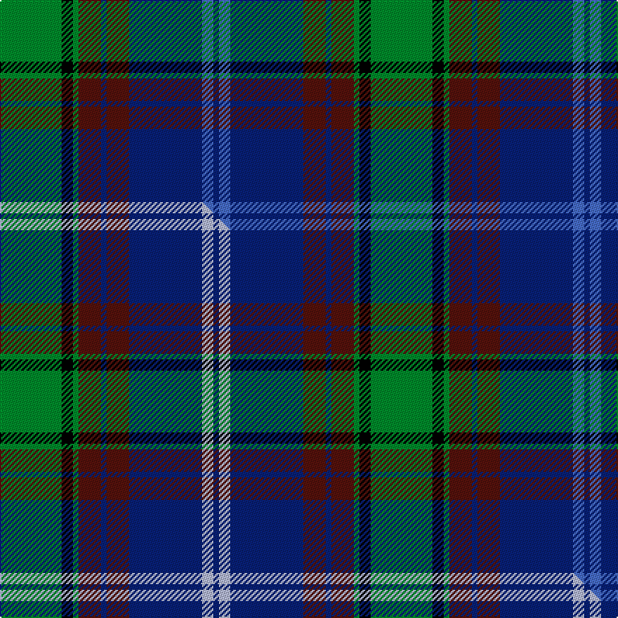

This page is one **sett** — a single exact thread-count. It belongs to the [tartan](/setts/g11k2g1dr4db1dr4db13b2db1/)
(the same proportion at any scale), whose colour order is pattern [BBBBBBGKG](/stripes/bbbbbbgkg/).

Part of the [Dunbartonshire](/tartans/dunbartonshire/) tartan — the named design grouping this sett with its other cloths.

Sourced from weddslist.  It is a [9 stripe tartan](/stripes/stripes9/).

Original link http://www.weddslist.com/cgi-bin/tartans/pg.pl?source=sts

## Thread count
G/44 K8 G4 DR16 DB4 DR16 DB52 B8 DB/4

One full sett is **264 threads**.

## Palette
<table><thead><tr><th>Colour</th><th>Shade</th><th>OKLCh</th></tr></thead><tbody><tr><td>DB</td><td><code style="background-color:#082077;">#082077</code> <small style="color:#888">#082077</small></td><td><small style="color:#888">oklch(30.0% 0.149 265.1)</small></td></tr><tr><td>DR</td><td><code style="background-color:#55120C;">#55120C</code> <small style="color:#888">#55120C</small></td><td><small style="color:#888">oklch(30.0% 0.099 29.3)</small></td></tr><tr><td>G</td><td><code style="background-color:#008B2A;">#008B2A</code> <small style="color:#888">#008B2A</small></td><td><small style="color:#888">oklch(55.4% 0.170 145.9)</small></td></tr><tr><td>K</td><td><code style="background-color:#000000;">#000000</code> <small style="color:#888">#000000</small></td><td><small style="color:#888">oklch(0.0% 0.000 0.0)</small></td></tr><tr><td>B</td><td><code style="background-color:#466CC8;">#466CC8</code> <small style="color:#888">#466CC8</small></td><td><small style="color:#888">oklch(55.1% 0.149 265.0)</small></td></tr></tbody></table>

# Sample pattern

## Compared to the master

This cloth is one sett of its design; the master sett (the exemplar the design is anchored on) is below for comparison.

Its **ΔTartan distance** from the master is **0.37** — the same measure the nearest-tartans table ranks by (0 is identical; a re-scale of the same cloth is near 0, a recolour or a different proportion further).

<figure class="master-compare" style="margin:0">

this sett
master sett ★

<figcaption style="color:#888;font-size:smaller">One weave of this sett against the <a href="/setts/g11k2g1dr4db1dr4db13lb2db1/">master sett ★</a>, split on the diagonal: a shared proportion runs seamlessly across it with only the shades shifting; a different proportion breaks on it.</figcaption>
</figure>

## Nearest variants

The nearest existing variants by ΔTartan distance, with this cloth at the top so the swatches line up against it.

ΔTartan

Threads

Variant

Sett

—

264

<a href="/variants/s9/g11k2g1dr4db1dr4db13b2db1~x4/">Dunbartonshire</a>

<a href="/ttd/edit/#slug=g11k2g1dr4db1dr4db13lb2db1~x4&amp;base=g11k2g1dr4db1dr4db13b2db1~x4" title="compare in the TTD">0.00</a>

264

<a href="/variants/s9/g11k2g1dr4db1dr4db13lb2db1~x4/">Dunbartonshire</a>

<a href="/ttd/edit/#slug=g40k8g4k8g4dr14db64lb9db3&amp;base=g11k2g1dr4db1dr4db13b2db1~x4" title="compare in the TTD">2.38</a>

265

<a href="/variants/s9/g40k8g4k8g4dr14db64lb9db3/">West Lothian</a>

<a href="/ttd/edit/#slug=t5dr3t30k6w4k6dg24dr4dg6dr3&amp;base=g11k2g1dr4db1dr4db13b2db1~x4" title="compare in the TTD">2.39</a>

174

<a href="/variants/s10/t5dr3t30k6w4k6dg24dr4dg6dr3/">Law Society of Scotland</a>

<a href="/ttd/edit/#slug=g26db3dr3db20dr3db3dr30lb3k2~x2&amp;base=g11k2g1dr4db1dr4db13b2db1~x4" title="compare in the TTD">2.52</a>

316

<a href="/variants/s9/g26db3dr3db20dr3db3dr30lb3k2~x2/">Ormiston (Personal)</a>

2.81

—

<a href="/variants/s10/k3db20dbi8db4g20k2g2r2g3ly3~x2~db1204274-dbi1406275/">Schmidt (2014)</a>

2.81

—

<a href="/variants/s10/k3db20dbi8db4g20k2g2r2g3y3~x2~db0705267-dbi1204274/">Schmidt (2014)</a>

<a href="/ttd/edit/#slug=db10y3db30y5k8g16r4g16r2~x2&amp;base=g11k2g1dr4db1dr4db13b2db1~x4" title="compare in the TTD">2.86</a>

352

<a href="/variants/s9/db10y3db30y5k8g16r4g16r2~x2/">MacMillan Hunting</a>

<a href="/ttd/edit/#slug=db22r3db2r3db2k17dg18o4~x2&amp;base=g11k2g1dr4db1dr4db13b2db1~x4" title="compare in the TTD">2.97</a>

232

<a href="/variants/s8/db22r3db2r3db2k17dg18o4~x2/">Scotch House 2000, original</a>

## Neighbour map

Every grey dot is one of 13620 variants placed by the first two principal components of the ΔTartan feature space (42% of its variance). Red is this tartan; blue dots are its nearest — click one to open its page.

<svg viewBox="0 0 640 380" role="img" style="max-width:100%;height:auto;border:1px solid #e0e0e0;border-radius:4px;display:block" xmlns="http://www.w3.org/2000/svg"><image href="/nn/cloud.v1.png" width="640" height="380"/><a href="/variants/s9/g11k2g1dr4db1dr4db13lb2db1~x4/"><circle cx="180.7" cy="155.5" r="4" fill="#3465a4"><title>Dunbartonshire</title></circle></a><a href="/variants/s9/g40k8g4k8g4dr14db64lb9db3/"><circle cx="213.0" cy="120.8" r="4" fill="#3465a4"><title>West Lothian</title></circle></a><a href="/variants/s10/t5dr3t30k6w4k6dg24dr4dg6dr3/"><circle cx="158.8" cy="157.7" r="4" fill="#3465a4"><title>Law Society of Scotland</title></circle></a><a href="/variants/s9/g26db3dr3db20dr3db3dr30lb3k2~x2/"><circle cx="212.0" cy="148.1" r="4" fill="#3465a4"><title>Ormiston (Personal)</title></circle></a><a href="/variants/s10/k3db20dbi8db4g20k2g2r2g3ly3~x2~db1204274-dbi1406275/"><circle cx="146.3" cy="144.1" r="4" fill="#3465a4"><title>Schmidt (2014)</title></circle></a><a href="/variants/s10/k3db20dbi8db4g20k2g2r2g3y3~x2~db0705267-dbi1204274/"><circle cx="140.0" cy="142.5" r="4" fill="#3465a4"><title>Schmidt (2014)</title></circle></a><a href="/variants/s9/db10y3db30y5k8g16r4g16r2~x2/"><circle cx="186.8" cy="161.2" r="4" fill="#3465a4"><title>MacMillan Hunting</title></circle></a><a href="/variants/s8/db22r3db2r3db2k17dg18o4~x2/"><circle cx="171.7" cy="172.3" r="4" fill="#3465a4"><title>Scotch House 2000, original</title></circle></a><circle cx="192.6" cy="159.5" r="5" fill="#c00000"/><text x="320" y="376" text-anchor="middle" font-size="11" fill="#999">ground</text><text x="11" y="190" text-anchor="middle" font-size="11" fill="#999" transform="rotate(-90 11 190)">complexity</text></svg>

ID: /variants/s9/g11k2g1dr4db1dr4db13b2db1~x4/
