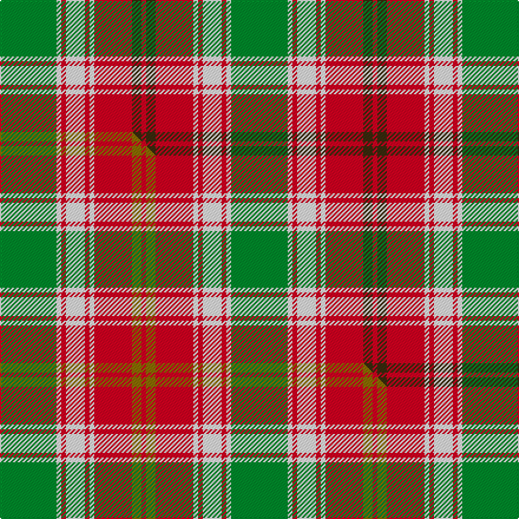

This is one **variant** — a specific cloth: this exact thread count and colourway, with its own
provenance below. It is one weaving of the [sett](/tartans/k/ka/karibu/) (the scale-free proportion — the
same cloth at any scale or shade), whose colour order is pattern [GWRWRWRGR](/stripes/gwrwrwrgr/).

Part of the [Karibu](/tartans/k/ka/karibu/) tartan — the named design grouping this sett with its other cloths.

Sourced from tartans-authority.  It is a [9 stripe tartan](/stripes/stripes9/).

Original link <code>http://www.tartansauthority.com/tartan-ferret/display/10674/</code> — retired · [Internet Archive copy](https://web.archive.org/web/*/http://www.tartansauthority.com/tartan-ferret/display/10674/*)

Dataset <small>— provenance for this record, inherited from the source manifest</small>

<dl class="dataset-prov">
<dt>source</dt><dd><a href="/sources/tartans-authority/">Scottish Tartans Authority</a></dd>
<dt>data captured from</dt><dd><a href="https://github.com/thetartan/tartan-database/blob/master/data/tartans-authority/data.csv">https://github.com/thetartan/tartan-database/blob/master/data/tartans-authority/data.csv</a></dd>
<dt>data date</dt><dd>26/03/2012 <small>(this record)</small></dd>
<dt>licence</dt><dd><a href="https://creativecommons.org/licenses/by-nc-nd/4.0/">CC BY-NC-ND 4.0</a></dd>
</dl>

Capture chain <small>— the hands this data passed through, oldest first; each capture carries its own licence</small>

<ol class="capture-chain">
<li><a href="https://www.tartansauthority.com/">Scottish Tartans Authority</a> <small>the heritage body’s archive — its tartan-ferret record browser is retired; dead record links are shown unlinked, with an Internet Archive copy (ITI numbers are not SRT references)</small></li>
<li><a href="https://github.com/thetartan/tartan-database">thetartan/tartan-database</a> <small>2016-2017</small> · <a href="https://creativecommons.org/licenses/by-nc-nd/4.0/">CC BY-NC-ND 4.0</a> <small>Levko Kravets's frozen compilation — the capture we vendored, and where its CC licence text came from</small></li>
<li>this dictionary <small>captured 2026-06-10 · commit 5bf86c7566</small> <small>each re-capture is a git commit to data/sources</small></li>
</ol>

## Register references

External register numbers recorded for this tartan.

- Scottish Register of Tartans: [10674](https://www.tartanregister.gov.uk/tartanDetails?ref=10674)
- Scottish Tartans Authority (ITI): 10674

## Thread count
G/48 W4 R4 W16 R4 W4 R32 DY8 R/4

One full sett is **196 threads**.

## Palette
<table><thead><tr><th>Colour</th><th>Shade</th><th>OKLCh</th></tr></thead><tbody><tr><td>G</td><td><code style="background-color:#008B2A;">#008B2A</code> <small style="color:#888">#008B2A</small></td><td><small style="color:#888">oklch(55.4% 0.170 145.9)</small></td></tr><tr><td>R</td><td><code style="background-color:#D60020;">#D60020</code> <small style="color:#888">#D60020</small></td><td><small style="color:#888">oklch(55.2% 0.224 25.5)</small></td></tr><tr><td>W</td><td><code style="background-color:#F7F7F7;">#F7F7F7</code> <small style="color:#888">#F7F7F7</small></td><td><small style="color:#888">oklch(97.6% 0.000 89.9)</small></td></tr><tr><td>DY</td><td><code style="background-color:#3A2B0D;">#3A2B0D</code> <small style="color:#888">#3A2B0D</small></td><td><small style="color:#888">oklch(30.0% 0.049 82.0)</small></td></tr></tbody></table>

# Sample pattern

## Compared to the master

This cloth is one sett of its design; the master sett (the exemplar the design is anchored on) is below for comparison.

Its **ΔTartan distance** from the master is **0.04** — the same measure the nearest-tartans table ranks by (0 is identical; a re-scale of the same cloth is near 0, a recolour or a different proportion further).

<figure class="master-compare" style="margin:0">

this sett
master sett ★

<figcaption style="color:#888;font-size:smaller">One weave of this sett against the <a href="/setts/g12w1r1w4r1w1r8y2r1/">master sett ★</a>, split on the diagonal: a shared proportion runs seamlessly across it with only the shades shifting; a different proportion breaks on it.</figcaption>
</figure>

## Nearest tartan variants

The nearest existing variants by ΔTartan distance, with this cloth at the top so the swatches line up against it.

ΔTartan

Threads

Variant

Sett

—

196

<a href="/variants/s9/g12w1r1w4r1w1r8dy2r1~x4/">Karibu (Corporate)</a>

<a href="/ttd/edit/#slug=g12w1r1w4r1w1r8y2r1~x4&amp;base=g12w1r1w4r1w1r8dy2r1~x4" title="compare in the TTD">0.04</a>

196

<a href="/variants/s9/g12w1r1w4r1w1r8y2r1~x4/">Karibu</a>

<a href="/ttd/edit/#slug=do2w20r2w2do3w3y3r8y26w2~x2&amp;base=g12w1r1w4r1w1r8dy2r1~x4" title="compare in the TTD">1.66</a>

276

<a href="/variants/s10/do2w20r2w2do3w3y3r8y26w2~x2/">Liama, The</a>

<a href="/ttd/edit/#slug=do4r3do21r2w14ly22r3ly4~x2&amp;base=g12w1r1w4r1w1r8dy2r1~x4" title="compare in the TTD">1.98</a>

276

<a href="/variants/s8/do4r3do21r2w14ly22r3ly4~x2/">Bannock Bane M.405</a>

<a href="/ttd/edit/#slug=w1r1g1r11db6r1g14r1g1w1~x4&amp;base=g12w1r1w4r1w1r8dy2r1~x4" title="compare in the TTD">2.10</a>

296

<a href="/variants/s10/w1r1g1r11db6r1g14r1g1w1~x4/">Glen Tilt District Tartan</a>

<a href="/ttd/edit/#slug=g14r1g14r7w1r7w1r7db5dp3w1~x4&amp;base=g12w1r1w4r1w1r8dy2r1~x4" title="compare in the TTD">2.15</a>

428

<a href="/variants/s11/g14r1g14r7w1r7w1r7db5dp3w1~x4/">Hynde Artifact Tartan</a>

<a href="/ttd/edit/#slug=o35w4o3y7o3w4o7do15n4w36n5~x2&amp;base=g12w1r1w4r1w1r8dy2r1~x4" title="compare in the TTD">2.42</a>

412

<a href="/variants/s11/o35w4o3y7o3w4o7do15n4w36n5~x2/">MacKellar, dress</a>

<a href="/ttd/edit/#slug=db3o14g2o2g2o3g6w18db3o2db2o2~x2&amp;base=g12w1r1w4r1w1r8dy2r1~x4" title="compare in the TTD">2.50</a>

226

<a href="/variants/s12/db3o14g2o2g2o3g6w18db3o2db2o2~x2/">Raibert, Check</a>

<a href="/ttd/edit/#slug=do2r2do15r1w10o15r2o2~x2&amp;base=g12w1r1w4r1w1r8dy2r1~x4" title="compare in the TTD">2.51</a>

188

<a href="/variants/s8/do2r2do15r1w10o15r2o2~x2/">Bannockbane</a>

<a href="/ttd/edit/#slug=o22do2o2do2o2do15w17do3~x2&amp;base=g12w1r1w4r1w1r8dy2r1~x4" title="compare in the TTD">2.56</a>

210

<a href="/variants/s8/o22do2o2do2o2do15w17do3~x2/">Turnberry, Manx Snaefell</a>

<a href="/ttd/edit/#slug=do2b2do15b1w10o15b2o2~x2&amp;base=g12w1r1w4r1w1r8dy2r1~x4" title="compare in the TTD">2.59</a>

188

<a href="/variants/s8/do2b2do15b1w10o15b2o2~x2/">Bannockbane</a>

## Neighbour map

Every grey dot is one of 13656 variants placed by the first two principal components of the ΔTartan feature space (42% of its variance). Red is this tartan; blue dots are its nearest — click one to open its page. The map is a flat projection of a many-dimensional space — [how to read it](/posts/neighbourhood-maps/).

<svg viewBox="0 0 640 380" role="img" style="max-width:100%;height:auto;border:1px solid #e0e0e0;border-radius:4px;display:block" xmlns="http://www.w3.org/2000/svg"><image href="/nn/cloud.v1.png" width="640" height="380"/><a href="/variants/s9/g12w1r1w4r1w1r8y2r1~x4/"><circle cx="226.5" cy="172.0" r="4" fill="#3465a4"><title>Karibu</title></circle></a><a href="/variants/s10/do2w20r2w2do3w3y3r8y26w2~x2/"><circle cx="236.4" cy="157.5" r="4" fill="#3465a4"><title>Liama, The</title></circle></a><a href="/variants/s8/do4r3do21r2w14ly22r3ly4~x2/"><circle cx="176.9" cy="189.8" r="4" fill="#3465a4"><title>Bannock Bane M.405</title></circle></a><a href="/variants/s10/w1r1g1r11db6r1g14r1g1w1~x4/"><circle cx="253.2" cy="152.4" r="4" fill="#3465a4"><title>Glen Tilt District Tartan</title></circle></a><a href="/variants/s11/g14r1g14r7w1r7w1r7db5dp3w1~x4/"><circle cx="233.2" cy="163.2" r="4" fill="#3465a4"><title>Hynde Artifact Tartan</title></circle></a><a href="/variants/s11/o35w4o3y7o3w4o7do15n4w36n5~x2/"><circle cx="191.5" cy="148.8" r="4" fill="#3465a4"><title>MacKellar, dress</title></circle></a><a href="/variants/s12/db3o14g2o2g2o3g6w18db3o2db2o2~x2/"><circle cx="183.3" cy="171.0" r="4" fill="#3465a4"><title>Raibert, Check</title></circle></a><a href="/variants/s8/do2r2do15r1w10o15r2o2~x2/"><circle cx="196.9" cy="170.1" r="4" fill="#3465a4"><title>Bannockbane</title></circle></a><a href="/variants/s8/o22do2o2do2o2do15w17do3~x2/"><circle cx="235.9" cy="195.2" r="4" fill="#3465a4"><title>Turnberry, Manx Snaefell</title></circle></a><a href="/variants/s8/do2b2do15b1w10o15b2o2~x2/"><circle cx="199.7" cy="176.1" r="4" fill="#3465a4"><title>Bannockbane</title></circle></a><circle cx="218.2" cy="168.9" r="5" fill="#c00000"/><text x="320" y="376" text-anchor="middle" font-size="11" fill="#999">ground</text><text x="11" y="190" text-anchor="middle" font-size="11" fill="#999" transform="rotate(-90 11 190)">complexity</text></svg>

ID: /variants/s9/g12w1r1w4r1w1r8dy2r1~x4/
