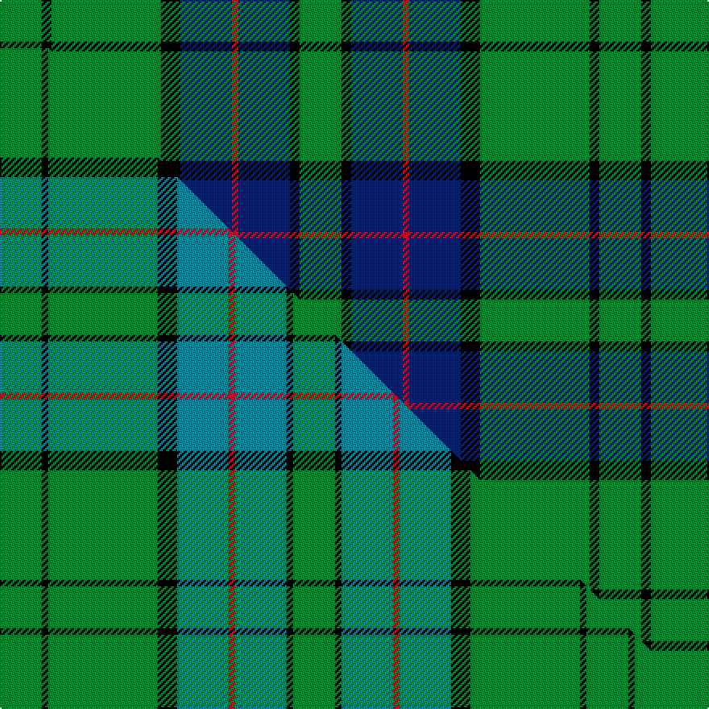

This page is one **sett** — a single exact thread-count. It belongs to the [tartan](/setts/g13k3g34k6db16r2db16k3g13/)
(the same proportion at any scale), whose colour order is pattern [GKBRBKGKG](/stripes/gkbrbkgkg/).

Part of the [Lockhart](/tartans/lockhart/) tartan — the named design grouping this sett with its other cloths.

Sourced from weddslist.  It is a [9 stripe tartan](/stripes/stripes9/).

Original link http://www.weddslist.com/cgi-bin/tartans/pg.pl?source=sts

## Provenance

Earliest known date: 1996 The clan tartan approved by the chief and the Lockhart Family Association 1996. The tartan was registered in the Lyon Court Book. LCB 100 on 11th June 1996.

2 attestations — the source records this cloth was collapsed from (oldest owns this page)

<ul>
<li>undated — Lockhart (weddslist, <a href="http://www.weddslist.com/cgi-bin/tartans/pg.pl?source=sts">record</a>) </li>
<li>undated — Lockhart Family Tartan (house-of-tartan, <a href="http://www.house-of-tartan.scotland.net/house/TartanViewjs.asp?colr=Def&tnam=2258">record</a>) </li>
</ul>

## Thread count
G/26 K6 G68 K12 DB32 R4 DB32 K6 G/26

One full sett is **372 threads**.

## Palette
<table><thead><tr><th>Colour</th><th>Shade</th><th>OKLCh</th></tr></thead><tbody><tr><td>DB</td><td><code style="background-color:#082077;">#082077</code> <small style="color:#888">#082077</small></td><td><small style="color:#888">oklch(30.0% 0.149 265.1)</small></td></tr><tr><td>G</td><td><code style="background-color:#008B2A;">#008B2A</code> <small style="color:#888">#008B2A</small></td><td><small style="color:#888">oklch(55.4% 0.170 145.9)</small></td></tr><tr><td>K</td><td><code style="background-color:#000000;">#000000</code> <small style="color:#888">#000000</small></td><td><small style="color:#888">oklch(0.0% 0.000 0.0)</small></td></tr><tr><td>R</td><td><code style="background-color:#D60020;">#D60020</code> <small style="color:#888">#D60020</small></td><td><small style="color:#888">oklch(55.2% 0.224 25.5)</small></td></tr></tbody></table>

# Sample pattern

## Compared to the master

This cloth is one sett of its design; the master sett (the exemplar the design is anchored on) is below for comparison.

Its **ΔTartan distance** from the master is **1.49** — the same measure the nearest-tartans table ranks by (0 is identical; a re-scale of the same cloth is near 0, a recolour or a different proportion further).

<figure class="master-compare" style="margin:0">

this sett
master sett ★

<figcaption style="color:#888;font-size:smaller">One weave of this sett against the <a href="/setts/g13k2g34k6t16r2t16k2g13/">master sett ★</a>, split on the diagonal: a shared proportion runs seamlessly across it with only the shades shifting; a different proportion breaks on it.</figcaption>
</figure>

## Nearest variants

The nearest existing variants by ΔTartan distance, with this cloth at the top so the swatches line up against it.

ΔTartan

Threads

Variant

Sett

—

372

<a href="/variants/s9/g13k3g34k6db16r2db16k3g13~x2/">Lockhart</a>

<a href="/ttd/edit/#slug=g13k2g34k6t16r2t16k2g13~x2&amp;base=g13k3g34k6db16r2db16k3g13~x2" title="compare in the TTD">0.03</a>

364

<a href="/variants/s9/g13k2g34k6t16r2t16k2g13~x2/">Lockhart</a>

<a href="/ttd/edit/#slug=db19g7db7lb2g20k9g6k4g10w3~x2&amp;base=g13k3g34k6db16r2db16k3g13~x2" title="compare in the TTD">2.48</a>

304

<a href="/variants/s10/db19g7db7lb2g20k9g6k4g10w3~x2/">O'Connell, William (Name)</a>

<a href="/ttd/edit/#slug=db4lb2k2db12lb4g6k6g28k2lb2g3~x2&amp;base=g13k3g34k6db16r2db16k3g13~x2" title="compare in the TTD">2.49</a>

270

<a href="/variants/s11/db4lb2k2db12lb4g6k6g28k2lb2g3~x2/">Hudson Hunting (Personal)</a>

<a href="/ttd/edit/#slug=g5k2g28k10dy26db4g4~x2&amp;base=g13k3g34k6db16r2db16k3g13~x2" title="compare in the TTD">2.50</a>

298

<a href="/variants/s7/g5k2g28k10dy26db4g4~x2/">John Telfar Dunbar Hunting</a>

<a href="/ttd/edit/#slug=b16y2b4y2b5k14g28y2g7~x2&amp;base=g13k3g34k6db16r2db16k3g13~x2" title="compare in the TTD">2.54</a>

274

<a href="/variants/s9/b16y2b4y2b5k14g28y2g7~x2/">Marie Curie Fields of Hope</a>

<a href="/ttd/edit/#slug=b26g6k8g3k8g30w3g3~x2&amp;base=g13k3g34k6db16r2db16k3g13~x2" title="compare in the TTD">2.56</a>

290

<a href="/variants/s8/b26g6k8g3k8g30w3g3~x2/">Riley (Personal)</a>

<a href="/ttd/edit/#slug=g8k2g13r4g12db22g5ly3~x2&amp;base=g13k3g34k6db16r2db16k3g13~x2" title="compare in the TTD">2.74</a>

254

<a href="/variants/s8/g8k2g13r4g12db22g5ly3~x2/">Taylor</a>

<a href="/ttd/edit/#slug=g8k2g13b4g12db22g5y3~x2&amp;base=g13k3g34k6db16r2db16k3g13~x2" title="compare in the TTD">2.74</a>

254

<a href="/variants/s8/g8k2g13b4g12db22g5y3~x2/">Taylor</a>

<a href="/ttd/edit/#slug=g2k1g12dr4g3db9lb2~x4&amp;base=g13k3g34k6db16r2db16k3g13~x2" title="compare in the TTD">2.77</a>

248

<a href="/variants/s7/g2k1g12dr4g3db9lb2~x4/">Lee (Personal)</a>

<a href="/ttd/edit/#slug=w1g16lb2g12k1g12k10dp10lb1~x2&amp;base=g13k3g34k6db16r2db16k3g13~x2" title="compare in the TTD">2.83</a>

256

<a href="/variants/s9/w1g16lb2g12k1g12k10dp10lb1~x2/">Faskin Family (Aberdeenshire)</a>

## Neighbour map

Every grey dot is one of 13620 variants placed by the first two principal components of the ΔTartan feature space (42% of its variance). Red is this tartan; blue dots are its nearest — click one to open its page.

<svg viewBox="0 0 640 380" role="img" style="max-width:100%;height:auto;border:1px solid #e0e0e0;border-radius:4px;display:block" xmlns="http://www.w3.org/2000/svg"><image href="/nn/cloud.v1.png" width="640" height="380"/><a href="/variants/s9/g13k2g34k6t16r2t16k2g13~x2/"><circle cx="319.8" cy="180.8" r="4" fill="#3465a4"><title>Lockhart</title></circle></a><a href="/variants/s10/db19g7db7lb2g20k9g6k4g10w3~x2/"><circle cx="173.7" cy="179.4" r="4" fill="#3465a4"><title>O'Connell, William (Name)</title></circle></a><a href="/variants/s11/db4lb2k2db12lb4g6k6g28k2lb2g3~x2/"><circle cx="235.7" cy="139.4" r="4" fill="#3465a4"><title>Hudson Hunting (Personal)</title></circle></a><a href="/variants/s7/g5k2g28k10dy26db4g4~x2/"><circle cx="241.5" cy="181.1" r="4" fill="#3465a4"><title>John Telfar Dunbar Hunting</title></circle></a><a href="/variants/s9/b16y2b4y2b5k14g28y2g7~x2/"><circle cx="204.9" cy="166.6" r="4" fill="#3465a4"><title>Marie Curie Fields of Hope</title></circle></a><a href="/variants/s8/b26g6k8g3k8g30w3g3~x2/"><circle cx="209.6" cy="179.4" r="4" fill="#3465a4"><title>Riley (Personal)</title></circle></a><a href="/variants/s8/g8k2g13r4g12db22g5ly3~x2/"><circle cx="244.9" cy="185.5" r="4" fill="#3465a4"><title>Taylor</title></circle></a><a href="/variants/s8/g8k2g13b4g12db22g5y3~x2/"><circle cx="260.4" cy="192.4" r="4" fill="#3465a4"><title>Taylor</title></circle></a><a href="/variants/s7/g2k1g12dr4g3db9lb2~x4/"><circle cx="232.3" cy="181.8" r="4" fill="#3465a4"><title>Lee (Personal)</title></circle></a><a href="/variants/s9/w1g16lb2g12k1g12k10dp10lb1~x2/"><circle cx="260.1" cy="153.5" r="4" fill="#3465a4"><title>Faskin Family (Aberdeenshire)</title></circle></a><circle cx="276.9" cy="168.3" r="5" fill="#c00000"/><text x="320" y="376" text-anchor="middle" font-size="11" fill="#999">ground</text><text x="11" y="190" text-anchor="middle" font-size="11" fill="#999" transform="rotate(-90 11 190)">complexity</text></svg>

ID: /variants/s9/g13k3g34k6db16r2db16k3g13~x2/
