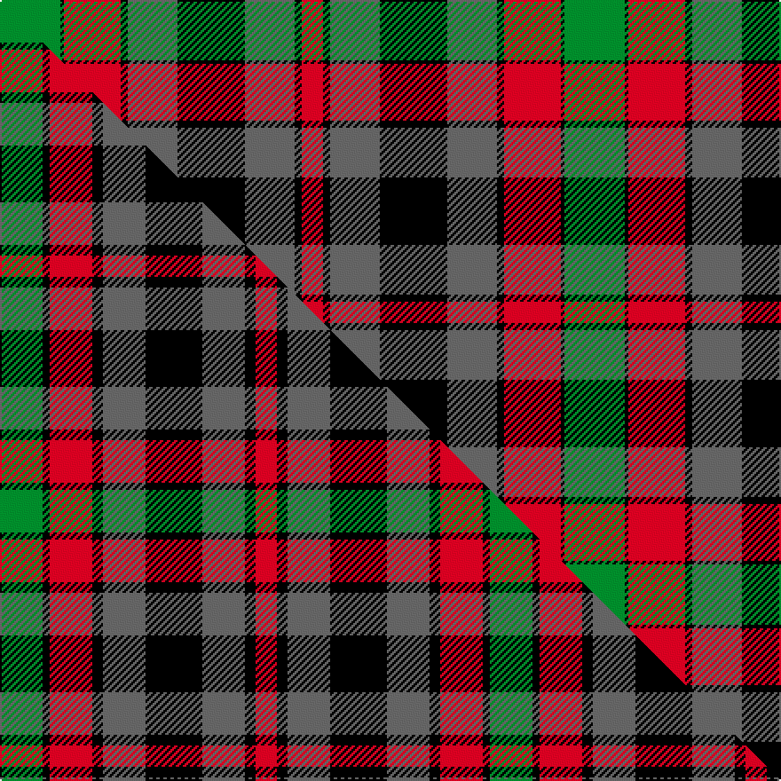

This is one **variant** — a specific cloth: this exact thread count and colourway, with its own
provenance below. It is one weaving of the [sett](/setts/g17k1r16k2n14k19n14k2r6/) (the scale-free proportion — the
same cloth at any scale or shade), whose colour order is pattern [GKRKBKBKR](/stripes/gkrkbkbkr/).

Part of the [Borthwick](/tartans/b/bo/borthwick-2/) tartan — the named design grouping this sett with its other cloths.

Sourced from weddslist.  It is a [9 stripe tartan](/stripes/stripes9/).

Original link [http://www.weddslist.com/cgi-bin/tartans/pg.pl?source=sts](http://www.weddslist.com/cgi-bin/tartans/pg.pl?source=sts)

2 attestations — the source records this cloth was collapsed from (oldest owns this page)

<ul>
<li>undated — Borthwick (weddslist, <a href="http://www.weddslist.com/cgi-bin/tartans/pg.pl?source=sts">record</a>) </li>
<li>undated — Borthwick (weddslist, <a href="http://www.weddslist.com/cgi-bin/tartans/pg.pl?source=tinsel">record</a>) </li>
</ul>

Dataset <small>— provenance for this record, inherited from the source manifest</small>

<dl class="dataset-prov">
<dt>source</dt><dd><a href="/sources/weddslist/">Weddslist</a></dd>
<dt>data captured from</dt><dd><a href="https://github.com/thetartan/tartan-database/blob/master/data/weddslist/data.csv">https://github.com/thetartan/tartan-database/blob/master/data/weddslist/data.csv</a></dd>
<dt>data date</dt><dd>2016-11-17 <small>(dataset default)</small></dd>
<dt>licence</dt><dd><a href="https://creativecommons.org/licenses/by-nc-nd/4.0/">CC BY-NC-ND 4.0</a></dd>
</dl>

Capture chain <small>— the hands this data passed through, oldest first; each capture carries its own licence</small>

<ol class="capture-chain">
<li><a href="https://www.weddslist.com/tartans/">Weddslist</a> <small>the living privately compiled reference</small></li>
<li><a href="https://github.com/thetartan/tartan-database">thetartan/tartan-database</a> <small>2016-2017</small> · <a href="https://creativecommons.org/licenses/by-nc-nd/4.0/">CC BY-NC-ND 4.0</a> <small>Levko Kravets's frozen compilation — the capture we vendored, and where its CC licence text came from</small></li>
<li>this dictionary <small>captured 2026-06-10 · commit 5bf86c7566</small> <small>each re-capture is a git commit to data/sources</small></li>
</ol>

## Thread count
G/34 K2 R32 K4 N28 K38 N28 K4 R/12

One full sett is **318 threads**.

## Palette
<table><thead><tr><th>Colour</th><th>Shade</th><th>OKLCh</th></tr></thead><tbody><tr><td>R</td><td><code style="background-color:#D60020;">#D60020</code> <small style="color:#888">#D60020</small></td><td><small style="color:#888">oklch(55.2% 0.224 25.5)</small></td></tr><tr><td>G</td><td><code style="background-color:#008B2A;">#008B2A</code> <small style="color:#888">#008B2A</small></td><td><small style="color:#888">oklch(55.4% 0.170 145.9)</small></td></tr><tr><td>K</td><td><code style="background-color:#000000;">#000000</code> <small style="color:#888">#000000</small></td><td><small style="color:#888">oklch(0.0% 0.000 0.0)</small></td></tr><tr><td>N</td><td><code style="background-color:#636363;">#636363</code> <small style="color:#888">#636363</small></td><td><small style="color:#888">oklch(50.0% 0.000 89.9)</small></td></tr></tbody></table>

# Sample pattern

## Compared to the master

This cloth is one sett of its design; the master sett (the exemplar the design is anchored on) is below for comparison.

Its **ΔTartan distance** from the master is **0.60** — the same measure the nearest-tartans table ranks by (0 is identical; a re-scale of the same cloth is near 0, a recolour or a different proportion further).

<figure class="master-compare" style="margin:0">

this sett
master sett ★

<figcaption style="color:#888;font-size:smaller">One weave of this sett against the <a href="/setts/g12k2r12k3n12k16n12k3r6/">master sett ★</a>, split on the diagonal: a shared proportion runs seamlessly across it with only the shades shifting; a different proportion breaks on it.</figcaption>
</figure>

## Nearest tartan variants

The nearest existing variants by ΔTartan distance, with this cloth at the top so the swatches line up against it.

ΔTartan

Threads

Variant

Sett

—

318

<a href="/variants/s9/g17k1r16k2n14k19n14k2r6~x2/">Borthwick</a>

<a href="/ttd/edit/#slug=g17k1r16k2n14k19n14k2r6&amp;base=g17k1r16k2n14k19n14k2r6~x2" title="compare in the TTD">0.00</a>

159

<a href="/variants/s9/g17k1r16k2n14k19n14k2r6/">Borthwick</a>

<a href="/ttd/edit/#slug=g17k1dr16k2n14k19n14k2dr6~x2&amp;base=g17k1r16k2n14k19n14k2r6~x2" title="compare in the TTD">0.12</a>

318

<a href="/variants/s9/g17k1dr16k2n14k19n14k2dr6~x2/">Borthwick (Clan)</a>

<a href="/ttd/edit/#slug=g12k1r10k2n10k14n10k2r4~x2&amp;base=g17k1r16k2n14k19n14k2r6~x2" title="compare in the TTD">0.39</a>

228

<a href="/variants/s9/g12k1r10k2n10k14n10k2r4~x2/">Borthwick D</a>

<a href="/ttd/edit/#slug=g12k2r12k3n12k16n12k3r6~x2&amp;base=g17k1r16k2n14k19n14k2r6~x2" title="compare in the TTD">0.60</a>

276

<a href="/variants/s9/g12k2r12k3n12k16n12k3r6~x2/">Borthwick Hunting</a>

<a href="/ttd/edit/#slug=g17k1r16k2y14k19y14k2r6&amp;base=g17k1r16k2n14k19n14k2r6~x2" title="compare in the TTD">2.31</a>

159

<a href="/variants/s9/g17k1r16k2y14k19y14k2r6/">Borthwick</a>

<a href="/ttd/edit/#slug=db6k3r14k3g14k3db6y1~x4~db1406275&amp;base=g17k1r16k2n14k19n14k2r6~x2" title="compare in the TTD">2.41</a>

372

<a href="/variants/s8/db6k3r14k3g14k3db6y1~x4~db1406275/">Kilgour (Asymmetrical)</a>

<a href="/ttd/edit/#slug=g12k1r10k2y10k14y10k2r4~x2&amp;base=g17k1r16k2n14k19n14k2r6~x2" title="compare in the TTD">2.43</a>

228

<a href="/variants/s9/g12k1r10k2y10k14y10k2r4~x2/">Borthwick D</a>

<a href="/ttd/edit/#slug=db6y1db6k3r14k3g14k3~x4&amp;base=g17k1r16k2n14k19n14k2r6~x2" title="compare in the TTD">2.47</a>

364

<a href="/variants/s8/db6y1db6k3r14k3g14k3~x4/">Kilgour (Cant)</a>

<a href="/ttd/edit/#slug=db6k3r14k3g14k3db6y1~x4&amp;base=g17k1r16k2n14k19n14k2r6~x2" title="compare in the TTD">2.47</a>

372

<a href="/variants/s8/db6k3r14k3g14k3db6y1~x4/">Kilgour (Clan)</a>

<a href="/ttd/edit/#slug=db6k3g14k3r14k3db6y1~x4&amp;base=g17k1r16k2n14k19n14k2r6~x2" title="compare in the TTD">2.47</a>

372

<a href="/variants/s8/db6k3g14k3r14k3db6y1~x4/">Kilgour (Symmetrical)</a>

## Neighbour map

Every grey dot is one of 13621 variants placed by the first two principal components of the ΔTartan feature space (42% of its variance). Red is this tartan; blue dots are its nearest — click one to open its page.

<svg viewBox="0 0 640 380" role="img" style="max-width:100%;height:auto;border:1px solid #e0e0e0;border-radius:4px;display:block" xmlns="http://www.w3.org/2000/svg"><image href="/nn/cloud.v1.png" width="640" height="380"/><a href="/variants/s9/g17k1r16k2n14k19n14k2r6/"><circle cx="129.5" cy="167.6" r="4" fill="#3465a4"><title>Borthwick</title></circle></a><a href="/variants/s9/g17k1dr16k2n14k19n14k2dr6~x2/"><circle cx="149.0" cy="178.6" r="4" fill="#3465a4"><title>Borthwick (Clan)</title></circle></a><a href="/variants/s9/g12k1r10k2n10k14n10k2r4~x2/"><circle cx="116.0" cy="181.9" r="4" fill="#3465a4"><title>Borthwick D</title></circle></a><a href="/variants/s9/g12k2r12k3n12k16n12k3r6~x2/"><circle cx="93.1" cy="210.7" r="4" fill="#3465a4"><title>Borthwick Hunting</title></circle></a><a href="/variants/s9/g17k1r16k2y14k19y14k2r6/"><circle cx="126.9" cy="166.9" r="4" fill="#3465a4"><title>Borthwick</title></circle></a><a href="/variants/s8/db6k3r14k3g14k3db6y1~x4~db1406275/"><circle cx="101.0" cy="163.0" r="4" fill="#3465a4"><title>Kilgour (Asymmetrical)</title></circle></a><a href="/variants/s9/g12k1r10k2y10k14y10k2r4~x2/"><circle cx="113.2" cy="181.0" r="4" fill="#3465a4"><title>Borthwick D</title></circle></a><a href="/variants/s8/db6y1db6k3r14k3g14k3~x4/"><circle cx="98.0" cy="162.7" r="4" fill="#3465a4"><title>Kilgour (Cant)</title></circle></a><a href="/variants/s8/db6k3r14k3g14k3db6y1~x4/"><circle cx="98.0" cy="162.7" r="4" fill="#3465a4"><title>Kilgour (Clan)</title></circle></a><a href="/variants/s8/db6k3g14k3r14k3db6y1~x4/"><circle cx="98.0" cy="162.7" r="4" fill="#3465a4"><title>Kilgour (Symmetrical)</title></circle></a><circle cx="129.5" cy="167.6" r="5" fill="#c00000"/><text x="320" y="376" text-anchor="middle" font-size="11" fill="#999">ground</text><text x="11" y="190" text-anchor="middle" font-size="11" fill="#999" transform="rotate(-90 11 190)">complexity</text></svg>

ID: /variants/s9/g17k1r16k2n14k19n14k2r6~x2/
