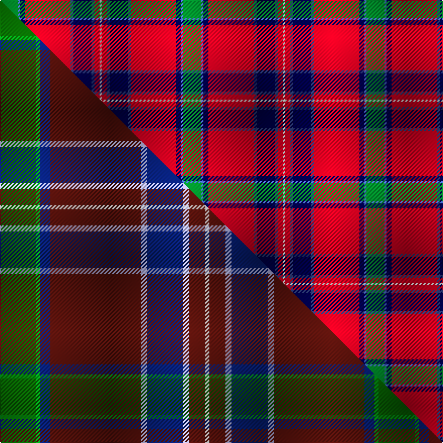

This is one **variant** — a specific cloth: this exact thread count and colourway, with its own
provenance below. It is one weaving of the [sett](/setts/g18b2db5r45dbi3db18dbi3r5w2/) (the scale-free proportion — the
same cloth at any scale or shade), whose colour order is pattern [GBBRBBBRW](/stripes/gbbrbbbrw/).

Part of the [MacNiven](/tartans/m/ma/macniven/) tartan — the named design grouping this sett with its other cloths.

Sourced from weddslist.  It is a [9 stripe tartan](/stripes/stripes9/).

Original link [http://www.weddslist.com/cgi-bin/tartans/pg.pl?source=sts](http://www.weddslist.com/cgi-bin/tartans/pg.pl?source=sts)

Dataset <small>— provenance for this record, inherited from the source manifest</small>

<dl class="dataset-prov">
<dt>source</dt><dd><a href="/sources/weddslist/">Weddslist</a></dd>
<dt>data captured from</dt><dd><a href="https://github.com/thetartan/tartan-database/blob/master/data/weddslist/data.csv">https://github.com/thetartan/tartan-database/blob/master/data/weddslist/data.csv</a></dd>
<dt>data date</dt><dd>2016-11-17 <small>(dataset default)</small></dd>
<dt>licence</dt><dd><a href="https://creativecommons.org/licenses/by-nc-nd/4.0/">CC BY-NC-ND 4.0</a></dd>
</dl>

Capture chain <small>— the hands this data passed through, oldest first; each capture carries its own licence</small>

<ol class="capture-chain">
<li><a href="https://www.weddslist.com/tartans/">Weddslist</a> <small>the living privately compiled reference</small></li>
<li><a href="https://github.com/thetartan/tartan-database">thetartan/tartan-database</a> <small>2016-2017</small> · <a href="https://creativecommons.org/licenses/by-nc-nd/4.0/">CC BY-NC-ND 4.0</a> <small>Levko Kravets's frozen compilation — the capture we vendored, and where its CC licence text came from</small></li>
<li>this dictionary <small>captured 2026-06-10 · commit 5bf86c7566</small> <small>each re-capture is a git commit to data/sources</small></li>
</ol>

## Thread count
G/18 B2 DB5 R45 DBi3 DB18 DBi3 R5 W/2

One full sett is **182 threads**.

## Palette
<table><thead><tr><th>Colour</th><th>Shade</th><th>OKLCh</th></tr></thead><tbody><tr><td>DB</td><td><code style="background-color:#304080;">#304080</code> <small style="color:#888">#304080</small></td><td><small style="color:#888">oklch(39.4% 0.109 270.2)</small></td></tr><tr><td>DB</td><td><code style="background-color:#000050;">#000050</code> <small style="color:#888">#000050</small></td><td><small style="color:#888">oklch(19.5% 0.135 264.1)</small></td></tr><tr><td>B</td><td><code style="background-color:#466CC8;">#466CC8</code> <small style="color:#888">#466CC8</small></td><td><small style="color:#888">oklch(55.1% 0.149 265.0)</small></td></tr><tr><td>G</td><td><code style="background-color:#008B2A;">#008B2A</code> <small style="color:#888">#008B2A</small></td><td><small style="color:#888">oklch(55.4% 0.170 145.9)</small></td></tr><tr><td>W</td><td><code style="background-color:#F7F7F7;">#F7F7F7</code> <small style="color:#888">#F7F7F7</small></td><td><small style="color:#888">oklch(97.6% 0.000 89.9)</small></td></tr><tr><td>R</td><td><code style="background-color:#D60020;">#D60020</code> <small style="color:#888">#D60020</small></td><td><small style="color:#888">oklch(55.2% 0.224 25.5)</small></td></tr></tbody></table>

# Sample pattern

## Compared to the master

This cloth is one sett of its design; the master sett (the exemplar the design is anchored on) is below for comparison.

Its **ΔTartan distance** from the master is **0.51** — the same measure the nearest-tartans table ranks by (0 is identical; a re-scale of the same cloth is near 0, a recolour or a different proportion further).

<figure class="master-compare" style="margin:0">

this sett
master sett ★

<figcaption style="color:#888;font-size:smaller">One weave of this sett against the <a href="/setts/dg18g2db5dr45lb3db18lb3dr8lbi2/">master sett ★</a>, split on the diagonal: a shared proportion runs seamlessly across it with only the shades shifting; a different proportion breaks on it.</figcaption>
</figure>

## Nearest tartan variants

The nearest existing variants by ΔTartan distance, with this cloth at the top so the swatches line up against it.

ΔTartan

Threads

Variant

Sett

—

182

<a href="/variants/s9/g18b2db5r45dbi3db18dbi3r5w2~db0805267-dbi1604274/">MacNiven</a>

<a href="/ttd/edit/#slug=dg18g2dt5r45db3dt18db3r5w2~dg1806142-g2408144-dt1204274-db1406275&amp;base=g18b2db5r45dbi3db18dbi3r5w2~db0805267-dbi1604274" title="compare in the TTD">0.36</a>

182

<a href="/variants/s9/dg18g2db5r45dbi3db18dbi3r5w2~dg1806142-g2408144-db1204274-dbi1406275/">MacNiven Family Tartan</a>

<a href="/ttd/edit/#slug=r22db3y1g12r6db3lb3w1~x2&amp;base=g18b2db5r45dbi3db18dbi3r5w2~db0805267-dbi1604274" title="compare in the TTD">1.77</a>

158

<a href="/variants/s8/r22db3y1g12r6db3lb3w1~x2/">Drummond, (Fingask)</a>

<a href="/ttd/edit/#slug=lb4g3lb9db14ly8db2r35ri2r3~x2~r2109032-ri2806019&amp;base=g18b2db5r45dbi3db18dbi3r5w2~db0805267-dbi1604274" title="compare in the TTD">2.13</a>

306

<a href="/variants/s9/lb4g3lb9db14ly8db2r35ri2r3~x2~r2109032-ri2806019/">Hogeboom (Personal)</a>

<a href="/ttd/edit/#slug=r4y2r34db10g4db4lb4db23w3~x2&amp;base=g18b2db5r45dbi3db18dbi3r5w2~db0805267-dbi1604274" title="compare in the TTD">2.51</a>

338

<a href="/variants/s9/r4y2r34db10g4db4lb4db23w3~x2/">Heirloom Red Alba (Fashion)</a>

<a href="/ttd/edit/#slug=r64lb16dp18y4dp4w4dp18g32r14lb4r14w3~x2&amp;base=g18b2db5r45dbi3db18dbi3r5w2~db0805267-dbi1604274" title="compare in the TTD">2.60</a>

646

<a href="/variants/s12/r64lb16dp18y4dp4w4dp18g32r14lb4r14w3~x2/">Wilson's No 4</a>

<a href="/ttd/edit/#slug=db3lb1r30db32r3w1r3g23r31db3w1&amp;base=g18b2db5r45dbi3db18dbi3r5w2~db0805267-dbi1604274" title="compare in the TTD">2.65</a>

258

<a href="/variants/s11/db3lb1r30db32r3w1r3g23r31db3w1/">MacDonald of Glenaladale Artifact Tartan</a>

<a href="/ttd/edit/#slug=r6t22r6g20y2r45t2w5~x2&amp;base=g18b2db5r45dbi3db18dbi3r5w2~db0805267-dbi1604274" title="compare in the TTD">2.77</a>

410

<a href="/variants/s8/r6t22r6g20y2r45t2w5~x2/">Elbrick Dress (Personal)</a>

<a href="/ttd/edit/#slug=dr62ly7g7r3w3db13w3r5~x2&amp;base=g18b2db5r45dbi3db18dbi3r5w2~db0805267-dbi1604274" title="compare in the TTD">2.88</a>

278

<a href="/variants/s8/dr62ly7g7r3w3db13w3r5~x2/">Legion of Frontiersmen</a>

<a href="/ttd/edit/#slug=r41w2dp5dy2g21r9dp5db3w2~x2&amp;base=g18b2db5r45dbi3db18dbi3r5w2~db0805267-dbi1604274" title="compare in the TTD">2.94</a>

274

<a href="/variants/s9/r41w2dp5dy2g21r9dp5db3w2~x2/">Perthshire or Drummond District Tartan</a>

<a href="/ttd/edit/#slug=gi4g3gi9b14y8b2r35lp2r3~x2~gi2203208-b1813263-r2208029-lp3004317&amp;base=g18b2db5r45dbi3db18dbi3r5w2~db0805267-dbi1604274" title="compare in the TTD">2.95</a>

306

<a href="/variants/s9/gi4g3gi9b14y8b2r35lp2r3~x2~gi2203208-b1813263-r2208029-lp3004317/">Hogeboom (Toronto) (Personal)</a>

## Neighbour map

Every grey dot is one of 13621 variants placed by the first two principal components of the ΔTartan feature space (42% of its variance). Red is this tartan; blue dots are its nearest — click one to open its page.

<svg viewBox="0 0 640 380" role="img" style="max-width:100%;height:auto;border:1px solid #e0e0e0;border-radius:4px;display:block" xmlns="http://www.w3.org/2000/svg"><image href="/nn/cloud.v1.png" width="640" height="380"/><a href="/variants/s9/dg18g2db5r45dbi3db18dbi3r5w2~dg1806142-g2408144-db1204274-dbi1406275/"><circle cx="278.8" cy="113.0" r="4" fill="#3465a4"><title>MacNiven Family Tartan</title></circle></a><a href="/variants/s8/r22db3y1g12r6db3lb3w1~x2/"><circle cx="298.5" cy="123.2" r="4" fill="#3465a4"><title>Drummond, (Fingask)</title></circle></a><a href="/variants/s9/lb4g3lb9db14ly8db2r35ri2r3~x2~r2109032-ri2806019/"><circle cx="230.1" cy="118.1" r="4" fill="#3465a4"><title>Hogeboom (Personal)</title></circle></a><a href="/variants/s9/r4y2r34db10g4db4lb4db23w3~x2/"><circle cx="234.1" cy="123.7" r="4" fill="#3465a4"><title>Heirloom Red Alba (Fashion)</title></circle></a><a href="/variants/s12/r64lb16dp18y4dp4w4dp18g32r14lb4r14w3~x2/"><circle cx="236.3" cy="111.0" r="4" fill="#3465a4"><title>Wilson's No 4</title></circle></a><a href="/variants/s11/db3lb1r30db32r3w1r3g23r31db3w1/"><circle cx="300.6" cy="105.3" r="4" fill="#3465a4"><title>MacDonald of Glenaladale Artifact Tartan</title></circle></a><a href="/variants/s8/r6t22r6g20y2r45t2w5~x2/"><circle cx="320.7" cy="146.3" r="4" fill="#3465a4"><title>Elbrick Dress (Personal)</title></circle></a><a href="/variants/s8/dr62ly7g7r3w3db13w3r5~x2/"><circle cx="324.5" cy="98.7" r="4" fill="#3465a4"><title>Legion of Frontiersmen</title></circle></a><a href="/variants/s9/r41w2dp5dy2g21r9dp5db3w2~x2/"><circle cx="306.7" cy="108.8" r="4" fill="#3465a4"><title>Perthshire or Drummond District Tartan</title></circle></a><a href="/variants/s9/gi4g3gi9b14y8b2r35lp2r3~x2~gi2203208-b1813263-r2208029-lp3004317/"><circle cx="255.9" cy="130.8" r="4" fill="#3465a4"><title>Hogeboom (Toronto) (Personal)</title></circle></a><circle cx="257.8" cy="107.2" r="5" fill="#c00000"/><text x="320" y="376" text-anchor="middle" font-size="11" fill="#999">ground</text><text x="11" y="190" text-anchor="middle" font-size="11" fill="#999" transform="rotate(-90 11 190)">complexity</text></svg>

ID: /variants/s9/g18b2db5r45dbi3db18dbi3r5w2~db0805267-dbi1604274/
