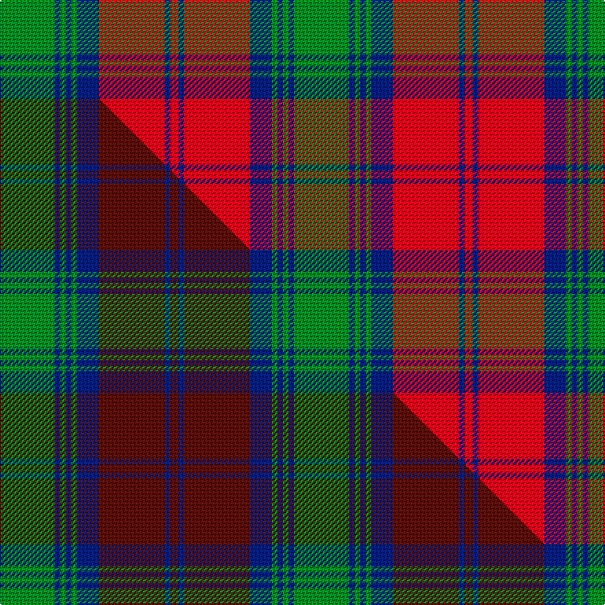

This page is one **sett** — a single exact thread-count. It belongs to the [tartan](/setts/g20db2g2db2g2db8r24db2r3/)
(the same proportion at any scale), whose colour order is pattern [GBGBGBRBR](/stripes/gbgbgbrbr/).

Part of the [Lindsay](/tartans/lindsay/) tartan — the named design grouping this sett with its other cloths.

Sourced from weddslist.  It is a [9 stripe tartan](/stripes/stripes9/).

Original link [http://www.weddslist.com/cgi-bin/tartans/pg.pl?source=tinsel](http://www.weddslist.com/cgi-bin/tartans/pg.pl?source=tinsel)

Dataset <small>— provenance for this record, inherited from the source manifest</small>

<dl class="dataset-prov">
<dt>source</dt><dd><a href="/sources/weddslist/">Weddslist</a></dd>
<dt>data captured from</dt><dd><a href="https://github.com/thetartan/tartan-database/blob/master/data/weddslist/data.csv">https://github.com/thetartan/tartan-database/blob/master/data/weddslist/data.csv</a></dd>
<dt>data date</dt><dd>2016-11-17 <small>(dataset default)</small></dd>
<dt>licence</dt><dd><a href="https://creativecommons.org/licenses/by-nc-nd/4.0/">CC BY-NC-ND 4.0</a></dd>
</dl>

Capture chain <small>— the hands this data passed through, oldest first; each capture carries its own licence</small>

<ol class="capture-chain">
<li><a href="https://www.weddslist.com/tartans/">Weddslist</a> <small>the living privately compiled reference</small></li>
<li><a href="https://github.com/thetartan/tartan-database">thetartan/tartan-database</a> <small>2016-2017</small> · <a href="https://creativecommons.org/licenses/by-nc-nd/4.0/">CC BY-NC-ND 4.0</a> <small>Levko Kravets's frozen compilation — the capture we vendored, and where its CC licence text came from</small></li>
<li>this dictionary <small>captured 2026-06-10 · commit 5bf86c7566</small> <small>each re-capture is a git commit to data/sources</small></li>
</ol>

## Thread count
G/40 DB4 G4 DB4 G4 DB16 R48 DB4 R/6

One full sett is **214 threads**.

## Palette
<table><thead><tr><th>Colour</th><th>Shade</th><th>OKLCh</th></tr></thead><tbody><tr><td>DB</td><td><code style="background-color:#082077;">#082077</code> <small style="color:#888">#082077</small></td><td><small style="color:#888">oklch(30.0% 0.149 265.1)</small></td></tr><tr><td>G</td><td><code style="background-color:#008B2A;">#008B2A</code> <small style="color:#888">#008B2A</small></td><td><small style="color:#888">oklch(55.4% 0.170 145.9)</small></td></tr><tr><td>R</td><td><code style="background-color:#D60020;">#D60020</code> <small style="color:#888">#D60020</small></td><td><small style="color:#888">oklch(55.2% 0.224 25.5)</small></td></tr></tbody></table>

# Sample pattern

## Compared to the master

This cloth is one sett of its design; the master sett (the exemplar the design is anchored on) is below for comparison.

Its **ΔTartan distance** from the master is **0.17** — the same measure the nearest-tartans table ranks by (0 is identical; a re-scale of the same cloth is near 0, a recolour or a different proportion further).

<figure class="master-compare" style="margin:0">

this sett
master sett ★

<figcaption style="color:#888;font-size:smaller">One weave of this sett against the <a href="/setts/g20db2g2db2g2db8dr24db2dr3/">master sett ★</a>, split on the diagonal: a shared proportion runs seamlessly across it with only the shades shifting; a different proportion breaks on it.</figcaption>
</figure>

## Nearest tartan variants

The nearest existing variants by ΔTartan distance, with this cloth at the top so the swatches line up against it.

ΔTartan

Threads

Variant

Sett

—

214

<a href="/variants/s9/g20db2g2db2g2db8r24db2r3~x2/">Lindsay</a>

<a href="/ttd/edit/#slug=g20db2g2db2g2db8r24db2r3&amp;base=g20db2g2db2g2db8r24db2r3~x2" title="compare in the TTD">0.00</a>

107

<a href="/variants/s9/g20db2g2db2g2db8r24db2r3/">Lindsay</a>

<a href="/ttd/edit/#slug=dg20db2dg2db2dg2db8r24db2r3~x2&amp;base=g20db2g2db2g2db8r24db2r3~x2" title="compare in the TTD">0.16</a>

214

<a href="/variants/s9/dg20db2dg2db2dg2db8r24db2r3~x2/">Lindsay</a>

<a href="/ttd/edit/#slug=dg20db2dg2db2dg2db8r24db2r3&amp;base=g20db2g2db2g2db8r24db2r3~x2" title="compare in the TTD">0.16</a>

107

<a href="/variants/s9/dg20db2dg2db2dg2db8r24db2r3/">Lindsay MINI Design Tartan</a>

<a href="/ttd/edit/#slug=g18db3g3db3g2db8r23db2r4g2~x2&amp;base=g20db2g2db2g2db8r24db2r3~x2" title="compare in the TTD">1.16</a>

232

<a href="/variants/s10/g18db3g3db3g2db8r23db2r4g2~x2/">McGlynn</a>

<a href="/ttd/edit/#slug=dg24db3dg3db3dg3db9r24dg3r4~x2&amp;base=g20db2g2db2g2db8r24db2r3~x2" title="compare in the TTD">1.43</a>

248

<a href="/variants/s9/dg24db3dg3db3dg3db9r24dg3r4~x2/">Lindsay (Chisholm Red)</a>

<a href="/ttd/edit/#slug=r12y4r38g25db8g10db8g8db25r3&amp;base=g20db2g2db2g2db8r24db2r3~x2" title="compare in the TTD">1.92</a>

267

<a href="/variants/s10/r12y4r38g25db8g10db8g8db25r3/">MacEdward</a>

<a href="/ttd/edit/#slug=db4r17db4g4db2g4db4g27db4ly4~x2&amp;base=g20db2g2db2g2db8r24db2r3~x2" title="compare in the TTD">1.92</a>

280

<a href="/variants/s10/db4r17db4g4db2g4db4g27db4ly4~x2/">Cape Breton University</a>

<a href="/ttd/edit/#slug=db4r17db4g4db2g4db4g27db4y4~x2&amp;base=g20db2g2db2g2db8r24db2r3~x2" title="compare in the TTD">1.92</a>

280

<a href="/variants/s10/db4r17db4g4db2g4db4g27db4y4~x2/">Cape Breton University Chemistry Society</a>

<a href="/ttd/edit/#slug=db3g26db3r3db20r3db3r26g5w3~x2&amp;base=g20db2g2db2g2db8r24db2r3~x2" title="compare in the TTD">1.93</a>

368

<a href="/variants/s10/db3g26db3r3db20r3db3r26g5w3~x2/">Roxburgh Red</a>

<a href="/ttd/edit/#slug=g6r2g2r18db9r3g3r3db9r3g24r2g2r4~x2&amp;base=g20db2g2db2g2db8r24db2r3~x2" title="compare in the TTD">2.11</a>

340

<a href="/variants/s14/g6r2g2r18db9r3g3r3db9r3g24r2g2r4~x2/">Stuart/Stewart of Urrard</a>

## Neighbour map

Every grey dot is one of 13621 variants placed by the first two principal components of the ΔTartan feature space (42% of its variance). Red is this tartan; blue dots are its nearest — click one to open its page.

<svg viewBox="0 0 640 380" role="img" style="max-width:100%;height:auto;border:1px solid #e0e0e0;border-radius:4px;display:block" xmlns="http://www.w3.org/2000/svg"><image href="/nn/cloud.v1.png" width="640" height="380"/><a href="/variants/s9/g20db2g2db2g2db8r24db2r3/"><circle cx="277.4" cy="183.8" r="4" fill="#3465a4"><title>Lindsay</title></circle></a><a href="/variants/s9/dg20db2dg2db2dg2db8r24db2r3~x2/"><circle cx="291.2" cy="184.3" r="4" fill="#3465a4"><title>Lindsay</title></circle></a><a href="/variants/s9/dg20db2dg2db2dg2db8r24db2r3/"><circle cx="291.2" cy="184.3" r="4" fill="#3465a4"><title>Lindsay MINI Design Tartan</title></circle></a><a href="/variants/s10/g18db3g3db3g2db8r23db2r4g2~x2/"><circle cx="259.7" cy="186.8" r="4" fill="#3465a4"><title>McGlynn</title></circle></a><a href="/variants/s9/dg24db3dg3db3dg3db9r24dg3r4~x2/"><circle cx="281.8" cy="208.6" r="4" fill="#3465a4"><title>Lindsay (Chisholm Red)</title></circle></a><a href="/variants/s10/r12y4r38g25db8g10db8g8db25r3/"><circle cx="208.6" cy="190.3" r="4" fill="#3465a4"><title>MacEdward</title></circle></a><a href="/variants/s10/db4r17db4g4db2g4db4g27db4ly4~x2/"><circle cx="263.8" cy="172.9" r="4" fill="#3465a4"><title>Cape Breton University</title></circle></a><a href="/variants/s10/db4r17db4g4db2g4db4g27db4y4~x2/"><circle cx="273.6" cy="176.1" r="4" fill="#3465a4"><title>Cape Breton University Chemistry Society</title></circle></a><a href="/variants/s10/db3g26db3r3db20r3db3r26g5w3~x2/"><circle cx="193.5" cy="186.1" r="4" fill="#3465a4"><title>Roxburgh Red</title></circle></a><a href="/variants/s14/g6r2g2r18db9r3g3r3db9r3g24r2g2r4~x2/"><circle cx="260.0" cy="175.8" r="4" fill="#3465a4"><title>Stuart/Stewart of Urrard</title></circle></a><circle cx="277.4" cy="183.8" r="5" fill="#c00000"/><text x="320" y="376" text-anchor="middle" font-size="11" fill="#999">ground</text><text x="11" y="190" text-anchor="middle" font-size="11" fill="#999" transform="rotate(-90 11 190)">complexity</text></svg>

ID: /variants/s9/g20db2g2db2g2db8r24db2r3~x2/
