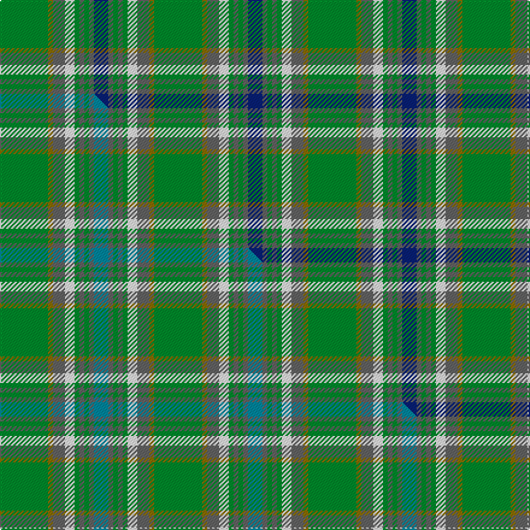

This page is one **sett** — a single exact thread-count. It belongs to the [tartan](/setts/g20y2n5w4g2n2g2n2db6/)
(the same proportion at any scale), whose colour order is pattern [BBGBGWBGG](/stripes/bbgbgwbgg/).

Part of the [Boucherville](/tartans/boucherville/) tartan — the named design grouping this sett with its other cloths.

Sourced from house-of-tartan.  It is a [9 stripe tartan](/stripes/stripes9/).

Original link http://www.house-of-tartan.scotland.net/house/TartanViewjs.asp?colr=Def&tnam=2119

## Provenance

Earliest known date: 1990 From the notes accompanying the petition for accreditation. "Les symboles ont cette remarquable propriete de reunir en une expression imagee des notions diverses. Ils refletent l'histoire, les croyances, les idealogies et les aspirations de groupes humains habitant un territoire precis. Les tisserands, c'est nous tous....!"

Dataset <small>— provenance for this record, inherited from the source manifest</small>

<dl class="dataset-prov">
<dt>source</dt><dd><a href="/sources/house-of-tartan/">House of Tartan</a></dd>
<dt>data captured from</dt><dd><a href="https://github.com/thetartan/tartan-database/blob/master/data/house-of-tartan/data.csv">https://github.com/thetartan/tartan-database/blob/master/data/house-of-tartan/data.csv</a></dd>
<dt>data date</dt><dd>2017-01-10 <small>(dataset default)</small></dd>
<dt>licence</dt><dd><a href="https://creativecommons.org/licenses/by-nc-nd/4.0/">CC BY-NC-ND 4.0</a></dd>
</dl>

Capture chain <small>— the hands this data passed through, oldest first; each capture carries its own licence</small>

<ol class="capture-chain">
<li><a href="http://www.house-of-tartan.scotland.net/">House of Tartan</a> <small>the weaver/retailer's database — the site is now offline; the URL is kept as the ultimate source's identity</small></li>
<li><a href="https://github.com/thetartan/tartan-database">thetartan/tartan-database</a> <small>2016-2017</small> · <a href="https://creativecommons.org/licenses/by-nc-nd/4.0/">CC BY-NC-ND 4.0</a> <small>Levko Kravets's frozen compilation — the capture we vendored, and where its CC licence text came from</small></li>
<li>this dictionary <small>captured 2026-06-10 · commit 5bf86c7566</small> <small>each re-capture is a git commit to data/sources</small></li>
</ol>

## Thread count
G/40 Y4 N10 W8 G4 N4 G4 N4 DB/12

One full sett is **128 threads**.

## Palette
<table><thead><tr><th>Colour</th><th>Shade</th><th>OKLCh</th></tr></thead><tbody><tr><td>DB</td><td><code style="background-color:#082077;">#082077</code> <small style="color:#888">#082077</small></td><td><small style="color:#888">oklch(30.0% 0.149 265.1)</small></td></tr><tr><td>G</td><td><code style="background-color:#008B2A;">#008B2A</code> <small style="color:#888">#008B2A</small></td><td><small style="color:#888">oklch(55.4% 0.170 145.9)</small></td></tr><tr><td>W</td><td><code style="background-color:#F7F7F7;">#F7F7F7</code> <small style="color:#888">#F7F7F7</small></td><td><small style="color:#888">oklch(97.6% 0.000 89.9)</small></td></tr><tr><td>N</td><td><code style="background-color:#636363;">#636363</code> <small style="color:#888">#636363</small></td><td><small style="color:#888">oklch(50.0% 0.000 89.9)</small></td></tr><tr><td>Y</td><td><code style="background-color:#8B6E00;">#8B6E00</code> <small style="color:#888">#8B6E00</small></td><td><small style="color:#888">oklch(55.1% 0.113 90.4)</small></td></tr></tbody></table>

# Sample pattern

## Compared to the master

This cloth is one sett of its design; the master sett (the exemplar the design is anchored on) is below for comparison.

Its **ΔTartan distance** from the master is **0.09** — the same measure the nearest-tartans table ranks by (0 is identical; a re-scale of the same cloth is near 0, a recolour or a different proportion further).

<figure class="master-compare" style="margin:0">

this sett
master sett ★

<figcaption style="color:#888;font-size:smaller">One weave of this sett against the <a href="/setts/g20y2n5w4g2n2g2n2t6/">master sett ★</a>, split on the diagonal: a shared proportion runs seamlessly across it with only the shades shifting; a different proportion breaks on it.</figcaption>
</figure>

## Nearest tartan variants

The nearest existing variants by ΔTartan distance, with this cloth at the top so the swatches line up against it.

ΔTartan

Threads

Variant

Sett

—

128

<a href="/variants/s9/g20y2n5w4g2n2g2n2db6~x2/">Boucherville (Tartan de..) District Tartan</a>

<a href="/ttd/edit/#slug=g20y2n5w4g2n2g2n2t6~x2&amp;base=g20y2n5w4g2n2g2n2db6~x2" title="compare in the TTD">0.08</a>

128

<a href="/variants/s9/g20y2n5w4g2n2g2n2t6~x2/">Boucherville (District)</a>

<a href="/ttd/edit/#slug=g20y2n5w4g2n2g2n2t6~x2~w4000000&amp;base=g20y2n5w4g2n2g2n2db6~x2" title="compare in the TTD">0.08</a>

128

<a href="/variants/s9/g20y2n5w4g2n2g2n2t6~x2~w4000000/">Boucherville</a>

<a href="/ttd/edit/#slug=dg20y2n5w4dg2n2dg2n2b6~x2&amp;base=g20y2n5w4g2n2g2n2db6~x2" title="compare in the TTD">0.21</a>

128

<a href="/variants/s9/dg20y2n5w4dg2n2dg2n2b6~x2/">Boucherville (Tartan de..)</a>

<a href="/ttd/edit/#slug=y2dr6g1dg2g12lb1g1lb2~x4&amp;base=g20y2n5w4g2n2g2n2db6~x2" title="compare in the TTD">1.89</a>

200

<a href="/variants/s8/y2dr6g1dg2g12lb1g1lb2~x4/">Manitoba</a>

<a href="/ttd/edit/#slug=dr4db15w2n15g30dr2g4~x2&amp;base=g20y2n5w4g2n2g2n2db6~x2" title="compare in the TTD">2.78</a>

272

<a href="/variants/s7/dr4db15w2n15g30dr2g4~x2/">Sinclair Green (Personal)</a>

<a href="/ttd/edit/#slug=g2dg7db3w2g14b2~x4&amp;base=g20y2n5w4g2n2g2n2db6~x2" title="compare in the TTD">2.84</a>

224

<a href="/variants/s6/g2dg7db3w2g14b2~x4/">Manx, Ellan Vannin</a>

<a href="/ttd/edit/#slug=ly3dg17t3dg3t3do5t18dr2t8dr2~x2&amp;base=g20y2n5w4g2n2g2n2db6~x2" title="compare in the TTD">3.04</a>

246

<a href="/variants/s10/ly3dg17t3dg3t3do5t18dr2t8dr2~x2/">Donegal, County</a>

<a href="/ttd/edit/#slug=db3dy7g2y2g14dy2g2db3~x2&amp;base=g20y2n5w4g2n2g2n2db6~x2" title="compare in the TTD">3.20</a>

128

<a href="/variants/s8/db3dy7g2y2g14dy2g2db3~x2/">Daks (Loden)</a>

<a href="/ttd/edit/#slug=g12db2dr2db2dt26dg2g3dg3g24dr4~x2&amp;base=g20y2n5w4g2n2g2n2db6~x2" title="compare in the TTD">3.20</a>

288

<a href="/variants/s10/g12db2dr2db2dt26dg2g3dg3g24dr4~x2/">New South Wales Waratah</a>

<a href="/ttd/edit/#slug=y14db5g25db5w2g11db7w5g6y5~x2&amp;base=g20y2n5w4g2n2g2n2db6~x2" title="compare in the TTD">3.21</a>

302

<a href="/variants/s10/y14db5g25db5w2g11db7w5g6y5~x2/">Kerry County Crest (Fashion)</a>

## Neighbour map

Every grey dot is one of 13620 variants placed by the first two principal components of the ΔTartan feature space (42% of its variance). Red is this tartan; blue dots are its nearest — click one to open its page.

<svg viewBox="0 0 640 380" role="img" style="max-width:100%;height:auto;border:1px solid #e0e0e0;border-radius:4px;display:block" xmlns="http://www.w3.org/2000/svg"><image href="/nn/cloud.v1.png" width="640" height="380"/><a href="/variants/s9/g20y2n5w4g2n2g2n2t6~x2/"><circle cx="354.7" cy="214.0" r="4" fill="#3465a4"><title>Boucherville (District)</title></circle></a><a href="/variants/s9/g20y2n5w4g2n2g2n2t6~x2~w4000000/"><circle cx="350.1" cy="212.4" r="4" fill="#3465a4"><title>Boucherville</title></circle></a><a href="/variants/s9/dg20y2n5w4dg2n2dg2n2b6~x2/"><circle cx="292.4" cy="184.4" r="4" fill="#3465a4"><title>Boucherville (Tartan de..)</title></circle></a><a href="/variants/s8/y2dr6g1dg2g12lb1g1lb2~x4/"><circle cx="305.4" cy="192.0" r="4" fill="#3465a4"><title>Manitoba</title></circle></a><a href="/variants/s7/dr4db15w2n15g30dr2g4~x2/"><circle cx="293.9" cy="204.2" r="4" fill="#3465a4"><title>Sinclair Green (Personal)</title></circle></a><a href="/variants/s6/g2dg7db3w2g14b2~x4/"><circle cx="277.4" cy="235.1" r="4" fill="#3465a4"><title>Manx, Ellan Vannin</title></circle></a><a href="/variants/s10/ly3dg17t3dg3t3do5t18dr2t8dr2~x2/"><circle cx="302.7" cy="213.8" r="4" fill="#3465a4"><title>Donegal, County</title></circle></a><a href="/variants/s8/db3dy7g2y2g14dy2g2db3~x2/"><circle cx="317.3" cy="243.4" r="4" fill="#3465a4"><title>Daks (Loden)</title></circle></a><a href="/variants/s10/g12db2dr2db2dt26dg2g3dg3g24dr4~x2/"><circle cx="333.0" cy="191.1" r="4" fill="#3465a4"><title>New South Wales Waratah</title></circle></a><a href="/variants/s10/y14db5g25db5w2g11db7w5g6y5~x2/"><circle cx="275.3" cy="218.6" r="4" fill="#3465a4"><title>Kerry County Crest (Fashion)</title></circle></a><circle cx="303.2" cy="193.9" r="5" fill="#c00000"/><text x="320" y="376" text-anchor="middle" font-size="11" fill="#999">ground</text><text x="11" y="190" text-anchor="middle" font-size="11" fill="#999" transform="rotate(-90 11 190)">complexity</text></svg>

ID: /variants/s9/g20y2n5w4g2n2g2n2db6~x2/
