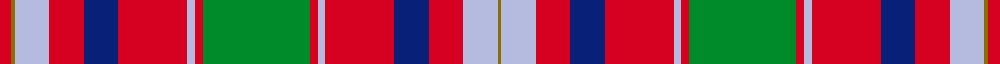

This is one **variant** — a specific cloth: this exact thread count and colourway, with its own
provenance below. It is one weaving of the [sett](/setts/g28r2lb2r18db9r9lb9y1r3/) (the scale-free proportion — the
same cloth at any scale or shade), whose colour order is pattern [GWRBRWRGRWRBRWGR](/stripes/gwrbrwrgrwrbrwgr/).

Sourced from register-of-tartans.  It is a [16 stripe tartan](/stripes/stripes16/).

Original link [https://www.tartanregister.gov.uk/tartanDetails.aspx?ref=4366](https://www.tartanregister.gov.uk/tartanDetails.aspx?ref=4366)

Dataset <small>— provenance for this record, inherited from the source manifest</small>

<dl class="dataset-prov">
<dt>source</dt><dd><a href="/sources/register-of-tartans/">Scottish Register of Tartans</a></dd>
<dt>data captured from</dt><dd><a href="https://github.com/thetartan/tartan-database/blob/master/data/register-of-tartans/data.csv">https://github.com/thetartan/tartan-database/blob/master/data/register-of-tartans/data.csv</a></dd>
<dt>data date</dt><dd>2004 <small>(this record)</small></dd>
<dt>licence</dt><dd><a href="https://www.tartanregister.gov.uk/copyright">Crown copyright</a></dd>
</dl>

Capture chain <small>— the hands this data passed through, oldest first; each capture carries its own licence</small>

<ol class="capture-chain">
<li><a href="https://www.tartanregister.gov.uk/">Scottish Register of Tartans</a> · <a href="https://www.tartanregister.gov.uk/copyright">Crown copyright</a> <small>the living register — still published by National Records of Scotland</small></li>
<li><a href="https://github.com/thetartan/tartan-database">thetartan/tartan-database</a> <small>2016-2017</small> · <a href="https://creativecommons.org/licenses/by-nc-nd/4.0/">CC BY-NC-ND 4.0</a> <small>Levko Kravets's frozen compilation — the capture we vendored, and where its CC licence text came from</small></li>
<li>this dictionary <small>captured 2026-06-10 · commit 5bf86c7566</small> <small>each re-capture is a git commit to data/sources</small></li>
</ol>

## Register references

External register numbers recorded for this tartan.

- Scottish Register of Tartans: [4366](https://www.tartanregister.gov.uk/tartanDetails.aspx?ref=4366)
- Scottish Tartans Authority (ITI): 6335

## Thread count
R/6 Y2 LB18 R18 DB18 R36 LB4 R4 G56 R4 LB4 R36 DB18 R18 LB18 Y/2

One full sett is **516 threads**.

## Palette
<table><thead><tr><th>Colour</th><th>Shade</th><th>OKLCh</th></tr></thead><tbody><tr><td>DB</td><td><code style="background-color:#082077;">#082077</code> <small style="color:#888">#082077</small></td><td><small style="color:#888">oklch(30.0% 0.149 265.1)</small></td></tr><tr><td>G</td><td><code style="background-color:#008B2A;">#008B2A</code> <small style="color:#888">#008B2A</small></td><td><small style="color:#888">oklch(55.4% 0.170 145.9)</small></td></tr><tr><td>LB</td><td><code style="background-color:#B5BBDE;">#B5BBDE</code> <small style="color:#888">#B5BBDE</small></td><td><small style="color:#888">oklch(79.9% 0.050 277.6)</small></td></tr><tr><td>R</td><td><code style="background-color:#D60020;">#D60020</code> <small style="color:#888">#D60020</small></td><td><small style="color:#888">oklch(55.2% 0.224 25.5)</small></td></tr><tr><td>Y</td><td><code style="background-color:#8B6E00;">#8B6E00</code> <small style="color:#888">#8B6E00</small></td><td><small style="color:#888">oklch(55.1% 0.113 90.4)</small></td></tr></tbody></table>

# Sample pattern

## Nearest tartan variants

The nearest existing variants by ΔTartan distance, with this cloth at the top so the swatches line up against it.

ΔTartan

Threads

Variant

Sett

—

516

<a href="/variants/s9/g28r2lb2r18db9r9lb9y1r3~x2/">Unidentified Scarlett #10</a>

<a href="/ttd/edit/#slug=r4lb2r50db26r10g44b4r10b4g44r51db2r4lb2~x2&amp;base=g28r2lb2r18db9r9lb9y1r3~x2" title="compare in the TTD">2.34</a>

1016

<a href="/variants/s14/r4lb2r50db26r10g44b4r10b4g44r51db2r4lb2~x2/">MacQuarrie 1</a>

<a href="/ttd/edit/#slug=lb3ly8r2ly8db11r2ly4ri4r27db1r2db2r2db13r2~x2~r1706009-ri2109032&amp;base=g28r2lb2r18db9r9lb9y1r3~x2" title="compare in the TTD">2.47</a>

354

<a href="/variants/s15/lb3ly8r2ly8db11r2ly4ri4r27db1r2db2r2db13r2~x2~r1706009-ri2109032/">Strathdon (District?)</a>

<a href="/ttd/edit/#slug=r12dp2r4dp4r39lb2r4dp11r6g4r6g45r4dp4db10&amp;base=g28r2lb2r18db9r9lb9y1r3~x2" title="compare in the TTD">2.49</a>

292

<a href="/variants/s15/r12dp2r4dp4r39lb2r4dp11r6g4r6g45r4dp4db10/">Grant or New Bruce Clan Tartan</a>

<a href="/ttd/edit/#slug=w2r2lp2r22db2r2g8r8g8lp2r2lp2db9r3g1r3g22r2lp2w2~x2&amp;base=g28r2lb2r18db9r9lb9y1r3~x2" title="compare in the TTD">2.53</a>

416

<a href="/variants/s20/w2r2lp2r22db2r2g8r8g8lp2r2lp2db9r3g1r3g22r2lp2w2~x2/">MacDougall Clan Tartan</a>

<a href="/ttd/edit/#slug=db30r14db2r14g20w1g2w1g20r44db4r10lb1r4~x2&amp;base=g28r2lb2r18db9r9lb9y1r3~x2" title="compare in the TTD">2.54</a>

600

<a href="/variants/s14/db30r14db2r14g20w1g2w1g20r44db4r10lb1r4~x2/">Perth (Duke of.. ) Portrait Tartan</a>

<a href="/ttd/edit/#slug=ri6r3ri6db22ri7r2w1ri2db2ri2w1r2ri7g22ri7g2ri2r2~x2~ri2109032-r1807008&amp;base=g28r2lb2r18db9r9lb9y1r3~x2" title="compare in the TTD">2.56</a>

376

<a href="/variants/s18/ri6r3ri6db22ri7r2w1ri2db2ri2w1r2ri7g22ri7g2ri2r2~x2~ri2109032-r1807008/">MacColl Hunting</a>

<a href="/ttd/edit/#slug=ri4lb2ri50db26ri10g44r4ri10r4g44ri51db2ri4lb2~x2~ri2209032-r2208029&amp;base=g28r2lb2r18db9r9lb9y1r3~x2" title="compare in the TTD">2.69</a>

1016

<a href="/variants/s14/ri4lb2ri50db26ri10g44r4ri10r4g44ri51db2ri4lb2~x2~ri2209032-r2208029/">MacQuarrie #2</a>

<a href="/ttd/edit/#slug=t5r30g26r5w1r5t32r30lb1t3lb1t31r5w1r5g26r32t5w1~x2&amp;base=g28r2lb2r18db9r9lb9y1r3~x2" title="compare in the TTD">2.72</a>

968

<a href="/variants/s19/t5r30g26r5w1r5t32r30lb1t3lb1t31r5w1r5g26r32t5w1~x2/">Unidentified Scarlett #11</a>

<a href="/ttd/edit/#slug=r64lb16dp18y4dp4w4dp18g32r14lb4r14w3~x2&amp;base=g28r2lb2r18db9r9lb9y1r3~x2" title="compare in the TTD">2.84</a>

646

<a href="/variants/s12/r64lb16dp18y4dp4w4dp18g32r14lb4r14w3~x2/">Wilson's No 4</a>

<a href="/ttd/edit/#slug=r16w1db6w1r6w1db32w1r24g1dg16g1r4g1dg6g1r4w1db6w1r16~x2~g2408144-dg1806142&amp;base=g28r2lb2r18db9r9lb9y1r3~x2" title="compare in the TTD">2.92</a>

520

<a href="/variants/s21/r16w1db6w1r6w1db32w1r24g1dg16g1r4g1dg6g1r4w1db6w1r16~x2~g2408144-dg1806142/">MacDonald of Boisdale Clan Tartan</a>

## Neighbour map

Every grey dot is one of 13621 variants placed by the first two principal components of the ΔTartan feature space (42% of its variance). Red is this tartan; blue dots are its nearest — click one to open its page.

<svg viewBox="0 0 640 380" role="img" style="max-width:100%;height:auto;border:1px solid #e0e0e0;border-radius:4px;display:block" xmlns="http://www.w3.org/2000/svg"><image href="/nn/cloud.v1.png" width="640" height="380"/><a href="/variants/s14/r4lb2r50db26r10g44b4r10b4g44r51db2r4lb2~x2/"><circle cx="298.2" cy="116.0" r="4" fill="#3465a4"><title>MacQuarrie 1</title></circle></a><a href="/variants/s15/lb3ly8r2ly8db11r2ly4ri4r27db1r2db2r2db13r2~x2~r1706009-ri2109032/"><circle cx="222.5" cy="100.8" r="4" fill="#3465a4"><title>Strathdon (District?)</title></circle></a><a href="/variants/s15/r12dp2r4dp4r39lb2r4dp11r6g4r6g45r4dp4db10/"><circle cx="282.1" cy="105.4" r="4" fill="#3465a4"><title>Grant or New Bruce Clan Tartan</title></circle></a><a href="/variants/s20/w2r2lp2r22db2r2g8r8g8lp2r2lp2db9r3g1r3g22r2lp2w2~x2/"><circle cx="229.6" cy="99.9" r="4" fill="#3465a4"><title>MacDougall Clan Tartan</title></circle></a><a href="/variants/s14/db30r14db2r14g20w1g2w1g20r44db4r10lb1r4~x2/"><circle cx="307.3" cy="91.5" r="4" fill="#3465a4"><title>Perth (Duke of.. ) Portrait Tartan</title></circle></a><a href="/variants/s18/ri6r3ri6db22ri7r2w1ri2db2ri2w1r2ri7g22ri7g2ri2r2~x2~ri2109032-r1807008/"><circle cx="218.6" cy="102.9" r="4" fill="#3465a4"><title>MacColl Hunting</title></circle></a><a href="/variants/s14/ri4lb2ri50db26ri10g44r4ri10r4g44ri51db2ri4lb2~x2~ri2209032-r2208029/"><circle cx="296.0" cy="113.3" r="4" fill="#3465a4"><title>MacQuarrie #2</title></circle></a><a href="/variants/s19/t5r30g26r5w1r5t32r30lb1t3lb1t31r5w1r5g26r32t5w1~x2/"><circle cx="291.4" cy="109.7" r="4" fill="#3465a4"><title>Unidentified Scarlett #11</title></circle></a><a href="/variants/s12/r64lb16dp18y4dp4w4dp18g32r14lb4r14w3~x2/"><circle cx="236.3" cy="111.0" r="4" fill="#3465a4"><title>Wilson's No 4</title></circle></a><a href="/variants/s21/r16w1db6w1r6w1db32w1r24g1dg16g1r4g1dg6g1r4w1db6w1r16~x2~g2408144-dg1806142/"><circle cx="266.1" cy="71.3" r="4" fill="#3465a4"><title>MacDonald of Boisdale Clan Tartan</title></circle></a><circle cx="242.8" cy="114.7" r="5" fill="#c00000"/><text x="320" y="376" text-anchor="middle" font-size="11" fill="#999">ground</text><text x="11" y="190" text-anchor="middle" font-size="11" fill="#999" transform="rotate(-90 11 190)">complexity</text></svg>

ID: /variants/s9/g28r2lb2r18db9r9lb9y1r3~x2/
