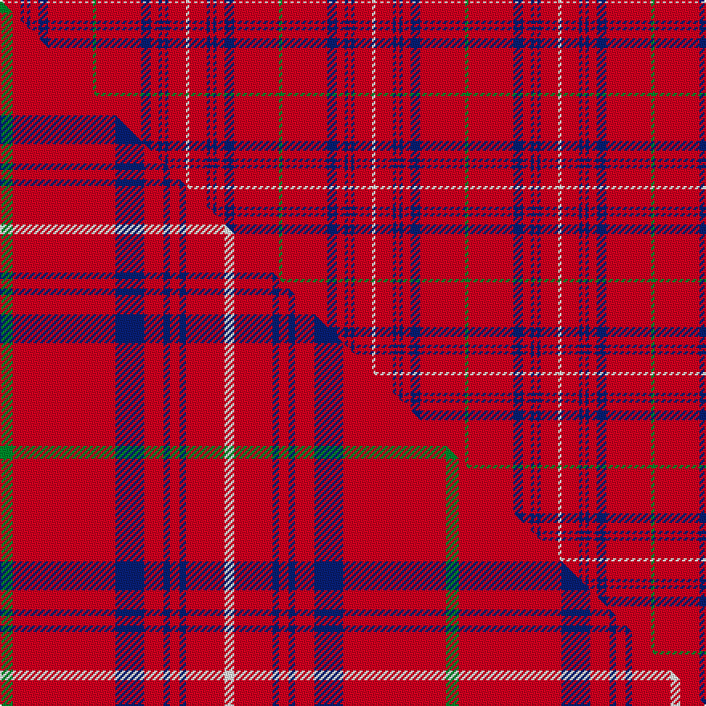

This page is one **sett** — a single exact thread-count. It belongs to the [tartan](/setts/g2r28db6r5db2r2db2r11w2/)
(the same proportion at any scale), whose colour order is pattern [GRBRBRBRW](/stripes/grbrbrbrw/).

Part of the [Rose](/tartans/rose/) tartan — the named design grouping this sett with its other cloths.

Sourced from weddslist.  It is a [9 stripe tartan](/stripes/stripes9/).

Original link http://www.weddslist.com/cgi-bin/tartans/pg.pl?source=rb

2 attestations — the source records this cloth was collapsed from (oldest owns this page)

<ul>
<li>undated — Rose (weddslist, <a href="http://www.weddslist.com/cgi-bin/tartans/pg.pl?source=rb">record</a>) </li>
<li>undated — Rose (weddslist, <a href="http://www.weddslist.com/cgi-bin/tartans/pg.pl?source=x">record</a>) </li>
</ul>

## Thread count
W/2 R11 DB2 R2 DB2 R5 DB6 R28 G/2

One full sett is **116 threads**.

## Palette
<table><thead><tr><th>Colour</th><th>Shade</th><th>OKLCh</th></tr></thead><tbody><tr><td>DB</td><td><code style="background-color:#082077;">#082077</code> <small style="color:#888">#082077</small></td><td><small style="color:#888">oklch(30.0% 0.149 265.1)</small></td></tr><tr><td>G</td><td><code style="background-color:#008B2A;">#008B2A</code> <small style="color:#888">#008B2A</small></td><td><small style="color:#888">oklch(55.4% 0.170 145.9)</small></td></tr><tr><td>W</td><td><code style="background-color:#F7F7F7;">#F7F7F7</code> <small style="color:#888">#F7F7F7</small></td><td><small style="color:#888">oklch(97.6% 0.000 89.9)</small></td></tr><tr><td>R</td><td><code style="background-color:#D60020;">#D60020</code> <small style="color:#888">#D60020</small></td><td><small style="color:#888">oklch(55.2% 0.224 25.5)</small></td></tr></tbody></table>

# Sample pattern

## Compared to the master

This cloth is one sett of its design; the master sett (the exemplar the design is anchored on) is below for comparison.

Its **ΔTartan distance** from the master is **0.75** — the same measure the nearest-tartans table ranks by (0 is identical; a re-scale of the same cloth is near 0, a recolour or a different proportion further).

<figure class="master-compare" style="margin:0">

this sett
master sett ★

<figcaption style="color:#888;font-size:smaller">One weave of this sett against the <a href="/setts/g4r32db9r6db2r3db2r12w3/">master sett ★</a>, split on the diagonal: a shared proportion runs seamlessly across it with only the shades shifting; a different proportion breaks on it.</figcaption>
</figure>

## Nearest variants

The nearest existing variants by ΔTartan distance, with this cloth at the top so the swatches line up against it.

ΔTartan

Threads

Variant

Sett

—

116

<a href="/variants/s9/g2r28db6r5db2r2db2r11w2/">Rose</a>

<a href="/ttd/edit/#slug=g2r28db6r5db2r2db2r11w2~x2&amp;base=g2r28db6r5db2r2db2r11w2" title="compare in the TTD">0.00</a>

232

<a href="/variants/s9/g2r28db6r5db2r2db2r11w2~x2/">Rose</a>

<a href="/ttd/edit/#slug=g4r32db9r6db2r3db2r12w3~x2&amp;base=g2r28db6r5db2r2db2r11w2" title="compare in the TTD">0.28</a>

278

<a href="/variants/s9/g4r32db9r6db2r3db2r12w3~x2/">Rose</a>

<a href="/ttd/edit/#slug=k2r35db6r5db2r2db2r14w2~x2&amp;base=g2r28db6r5db2r2db2r11w2" title="compare in the TTD">0.92</a>

272

<a href="/variants/s9/k2r35db6r5db2r2db2r14w2~x2/">Rose of Kilravock (Personal)</a>

<a href="/ttd/edit/#slug=r40w1r1db8r1w1r6w1r1db8~x2&amp;base=g2r28db6r5db2r2db2r11w2" title="compare in the TTD">2.67</a>

176

<a href="/variants/s10/r40w1r1db8r1w1r6w1r1db8~x2/">Miyuki #2</a>

<a href="/ttd/edit/#slug=db4r3db3r22dg8r2~x2&amp;base=g2r28db6r5db2r2db2r11w2" title="compare in the TTD">2.76</a>

156

<a href="/variants/s6/db4r3db3r22dg8r2~x2/">Auld Reekie</a>

## Neighbour map

Every grey dot is one of 13620 variants placed by the first two principal components of the ΔTartan feature space (42% of its variance). Red is this tartan; blue dots are its nearest — click one to open its page.

<svg viewBox="0 0 640 380" role="img" style="max-width:100%;height:auto;border:1px solid #e0e0e0;border-radius:4px;display:block" xmlns="http://www.w3.org/2000/svg"><image href="/nn/cloud.v1.png" width="640" height="380"/><a href="/variants/s9/g2r28db6r5db2r2db2r11w2~x2/"><circle cx="487.3" cy="143.8" r="4" fill="#3465a4"><title>Rose</title></circle></a><a href="/variants/s9/g4r32db9r6db2r3db2r12w3~x2/"><circle cx="447.3" cy="144.7" r="4" fill="#3465a4"><title>Rose</title></circle></a><a href="/variants/s9/k2r35db6r5db2r2db2r14w2~x2/"><circle cx="496.0" cy="109.1" r="4" fill="#3465a4"><title>Rose of Kilravock (Personal)</title></circle></a><a href="/variants/s10/r40w1r1db8r1w1r6w1r1db8~x2/"><circle cx="513.1" cy="90.6" r="4" fill="#3465a4"><title>Miyuki #2</title></circle></a><a href="/variants/s6/db4r3db3r22dg8r2~x2/"><circle cx="405.3" cy="200.5" r="4" fill="#3465a4"><title>Auld Reekie</title></circle></a><circle cx="487.3" cy="143.8" r="5" fill="#c00000"/><text x="320" y="376" text-anchor="middle" font-size="11" fill="#999">ground</text><text x="11" y="190" text-anchor="middle" font-size="11" fill="#999" transform="rotate(-90 11 190)">complexity</text></svg>

ID: /variants/s9/g2r28db6r5db2r2db2r11w2/
