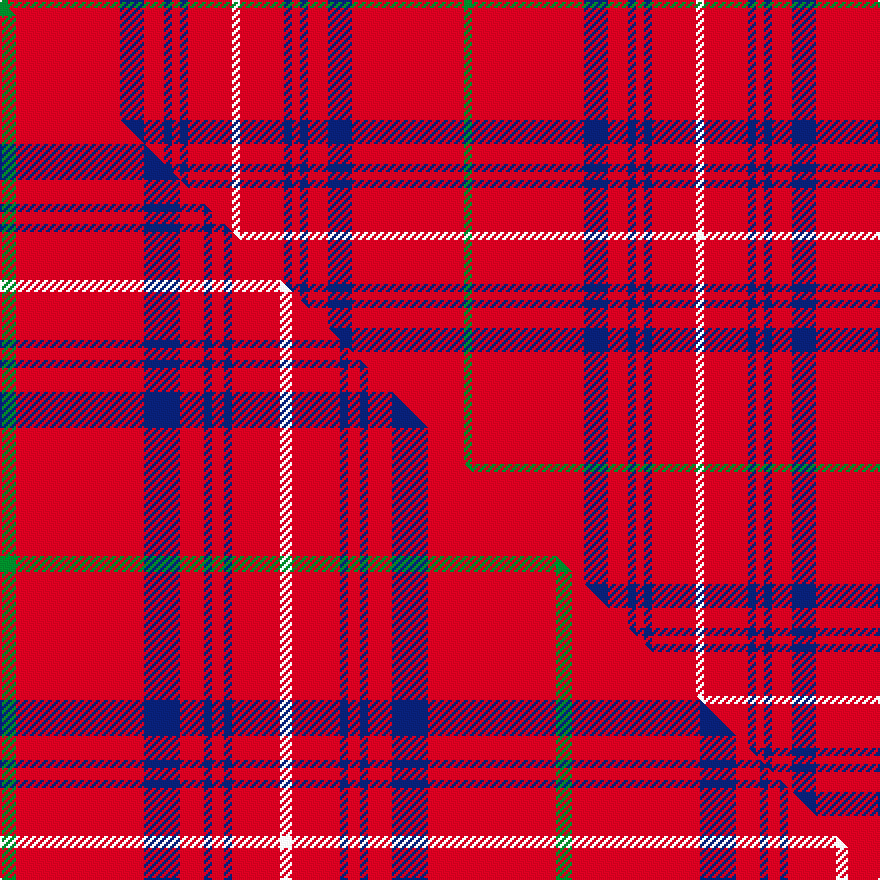

This is one **variant** — a specific cloth: this exact thread count and colourway, with its own
provenance below. It is one weaving of the [sett](/setts/g2r28db6r5db2r2db2r11w2/) (the scale-free proportion — the
same cloth at any scale or shade), whose colour order is pattern [GRBRBRBRW](/stripes/grbrbrbrw/).

Part of the [Rose](/tartans/rose/) tartan — the named design grouping this sett with its other cloths.

Sourced from weddslist.  It is a [9 stripe tartan](/stripes/stripes9/).

Original link [http://www.weddslist.com/cgi-bin/tartans/pg.pl?source=tinsel](http://www.weddslist.com/cgi-bin/tartans/pg.pl?source=tinsel)

Dataset <small>— provenance for this record, inherited from the source manifest</small>

<dl class="dataset-prov">
<dt>source</dt><dd><a href="/sources/weddslist/">Weddslist</a></dd>
<dt>data captured from</dt><dd><a href="https://github.com/thetartan/tartan-database/blob/master/data/weddslist/data.csv">https://github.com/thetartan/tartan-database/blob/master/data/weddslist/data.csv</a></dd>
<dt>data date</dt><dd>2016-11-17 <small>(dataset default)</small></dd>
<dt>licence</dt><dd><a href="https://creativecommons.org/licenses/by-nc-nd/4.0/">CC BY-NC-ND 4.0</a></dd>
</dl>

Capture chain <small>— the hands this data passed through, oldest first; each capture carries its own licence</small>

<ol class="capture-chain">
<li><a href="https://www.weddslist.com/tartans/">Weddslist</a> <small>the living privately compiled reference</small></li>
<li><a href="https://github.com/thetartan/tartan-database">thetartan/tartan-database</a> <small>2016-2017</small> · <a href="https://creativecommons.org/licenses/by-nc-nd/4.0/">CC BY-NC-ND 4.0</a> <small>Levko Kravets's frozen compilation — the capture we vendored, and where its CC licence text came from</small></li>
<li>this dictionary <small>captured 2026-06-10 · commit 5bf86c7566</small> <small>each re-capture is a git commit to data/sources</small></li>
</ol>

## Thread count
G/4 R56 DB12 R10 DB4 R4 DB4 R22 W/4

One full sett is **232 threads**.

## Palette
<table><thead><tr><th>Colour</th><th>Shade</th><th>OKLCh</th></tr></thead><tbody><tr><td>DB</td><td><code style="background-color:#082077;">#082077</code> <small style="color:#888">#082077</small></td><td><small style="color:#888">oklch(30.0% 0.149 265.1)</small></td></tr><tr><td>G</td><td><code style="background-color:#008B2A;">#008B2A</code> <small style="color:#888">#008B2A</small></td><td><small style="color:#888">oklch(55.4% 0.170 145.9)</small></td></tr><tr><td>R</td><td><code style="background-color:#D60020;">#D60020</code> <small style="color:#888">#D60020</small></td><td><small style="color:#888">oklch(55.2% 0.224 25.5)</small></td></tr><tr><td>W</td><td><code style="background-color:#F7F7F7;">#F7F7F7</code> <small style="color:#888">#F7F7F7</small></td><td><small style="color:#888">oklch(97.6% 0.000 89.9)</small></td></tr></tbody></table>

# Sample pattern

## Compared to the master

This cloth is one sett of its design; the master sett (the exemplar the design is anchored on) is below for comparison.

Its **ΔTartan distance** from the master is **0.29** — the same measure the nearest-tartans table ranks by (0 is identical; a re-scale of the same cloth is near 0, a recolour or a different proportion further).

<figure class="master-compare" style="margin:0">

this sett
master sett ★

<figcaption style="color:#888;font-size:smaller">One weave of this sett against the <a href="/setts/g4r32db9r6db2r3db2r12w3/">master sett ★</a>, split on the diagonal: a shared proportion runs seamlessly across it with only the shades shifting; a different proportion breaks on it.</figcaption>
</figure>

## Nearest tartan variants

The nearest existing variants by ΔTartan distance, with this cloth at the top so the swatches line up against it.

ΔTartan

Threads

Variant

Sett

—

232

<a href="/variants/s9/g2r28db6r5db2r2db2r11w2~x2/">Rose</a>

<a href="/ttd/edit/#slug=g2r28db6r5db2r2db2r11w2&amp;base=g2r28db6r5db2r2db2r11w2~x2" title="compare in the TTD">0.00</a>

116

<a href="/variants/s9/g2r28db6r5db2r2db2r11w2/">Rose</a>

<a href="/ttd/edit/#slug=g4r32db9r6db2r3db2r12w3~x2&amp;base=g2r28db6r5db2r2db2r11w2~x2" title="compare in the TTD">0.29</a>

278

<a href="/variants/s9/g4r32db9r6db2r3db2r12w3~x2/">Rose</a>

<a href="/ttd/edit/#slug=k2r35db6r5db2r2db2r14w2~x2&amp;base=g2r28db6r5db2r2db2r11w2~x2" title="compare in the TTD">0.89</a>

272

<a href="/variants/s9/k2r35db6r5db2r2db2r14w2~x2/">Rose of Kilravock (Personal)</a>

<a href="/ttd/edit/#slug=w10r47db2r2db2r18dt3w4~x2~db1406275-dt1204274&amp;base=g2r28db6r5db2r2db2r11w2~x2" title="compare in the TTD">2.42</a>

324

<a href="/variants/s8/w10r47dbi2r2dbi2r18db3w4~x2~dbi1406275-db1204274/">Swiss National (Fashion)</a>

<a href="/ttd/edit/#slug=w10r47b2r2b2r18db3w4~x2~b1611266-db1108266&amp;base=g2r28db6r5db2r2db2r11w2~x2" title="compare in the TTD">2.56</a>

324

<a href="/variants/s8/w10r47b2r2b2r18db3w4~x2~b1511266-db1108266/">Swiss National</a>

<a href="/ttd/edit/#slug=r65g16r4dp4r4w5~x2&amp;base=g2r28db6r5db2r2db2r11w2~x2" title="compare in the TTD">2.80</a>

252

<a href="/variants/s6/r65g16r4dp4r4w5~x2/">Howard, Vincent (Personal)</a>

<a href="/ttd/edit/#slug=r60db8w3db10y3lb4y3r19~x2&amp;base=g2r28db6r5db2r2db2r11w2~x2" title="compare in the TTD">2.87</a>

282

<a href="/variants/s8/r60db8w3db10y3lb4y3r19~x2/">Princess Elizabeth #2</a>

<a href="/ttd/edit/#slug=r68db26r5y3r5g3r13n3~x2&amp;base=g2r28db6r5db2r2db2r11w2~x2" title="compare in the TTD">2.92</a>

362

<a href="/variants/s8/r68db26r5y3r5g3r13n3~x2/">De Nardi (Personal)</a>

<a href="/ttd/edit/#slug=r68db27r5y3r5g3r13lb3~x2&amp;base=g2r28db6r5db2r2db2r11w2~x2" title="compare in the TTD">3.01</a>

366

<a href="/variants/s8/r68db27r5y3r5g3r13lb3~x2/">De Nardi #2 (Personal)</a>

<a href="/ttd/edit/#slug=r12w1r2dg1b3~x4&amp;base=g2r28db6r5db2r2db2r11w2~x2" title="compare in the TTD">3.01</a>

92

<a href="/variants/s5/r12w1r2dg1b3~x4/">Glenshee</a>

## Neighbour map

Every grey dot is one of 13621 variants placed by the first two principal components of the ΔTartan feature space (42% of its variance). Red is this tartan; blue dots are its nearest — click one to open its page.

<svg viewBox="0 0 640 380" role="img" style="max-width:100%;height:auto;border:1px solid #e0e0e0;border-radius:4px;display:block" xmlns="http://www.w3.org/2000/svg"><image href="/nn/cloud.v1.png" width="640" height="380"/><a href="/variants/s9/g2r28db6r5db2r2db2r11w2/"><circle cx="487.3" cy="144.0" r="4" fill="#3465a4"><title>Rose</title></circle></a><a href="/variants/s9/g4r32db9r6db2r3db2r12w3~x2/"><circle cx="447.4" cy="144.9" r="4" fill="#3465a4"><title>Rose</title></circle></a><a href="/variants/s9/k2r35db6r5db2r2db2r14w2~x2/"><circle cx="496.0" cy="109.2" r="4" fill="#3465a4"><title>Rose of Kilravock (Personal)</title></circle></a><a href="/variants/s8/w10r47dbi2r2dbi2r18db3w4~x2~dbi1406275-db1204274/"><circle cx="494.1" cy="119.8" r="4" fill="#3465a4"><title>Swiss National (Fashion)</title></circle></a><a href="/variants/s8/w10r47b2r2b2r18db3w4~x2~b1511266-db1108266/"><circle cx="486.9" cy="118.0" r="4" fill="#3465a4"><title>Swiss National</title></circle></a><a href="/variants/s6/r65g16r4dp4r4w5~x2/"><circle cx="499.1" cy="151.0" r="4" fill="#3465a4"><title>Howard, Vincent (Personal)</title></circle></a><a href="/variants/s8/r60db8w3db10y3lb4y3r19~x2/"><circle cx="448.6" cy="115.3" r="4" fill="#3465a4"><title>Princess Elizabeth #2</title></circle></a><a href="/variants/s8/r68db26r5y3r5g3r13n3~x2/"><circle cx="471.9" cy="114.3" r="4" fill="#3465a4"><title>De Nardi (Personal)</title></circle></a><a href="/variants/s8/r68db27r5y3r5g3r13lb3~x2/"><circle cx="460.6" cy="112.6" r="4" fill="#3465a4"><title>De Nardi #2 (Personal)</title></circle></a><a href="/variants/s5/r12w1r2dg1b3~x4/"><circle cx="476.4" cy="184.3" r="4" fill="#3465a4"><title>Glenshee</title></circle></a><circle cx="487.3" cy="144.0" r="5" fill="#c00000"/><text x="320" y="376" text-anchor="middle" font-size="11" fill="#999">ground</text><text x="11" y="190" text-anchor="middle" font-size="11" fill="#999" transform="rotate(-90 11 190)">complexity</text></svg>

ID: /variants/s9/g2r28db6r5db2r2db2r11w2~x2/
