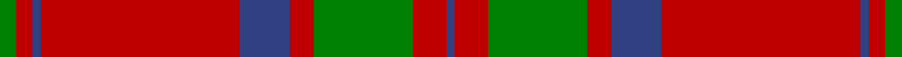

This is one **variant** — a specific cloth: this exact thread count and colourway, with its own
provenance below. It is one weaving of the [sett](/setts/g2r2db1r24db6r3g12r4db1/) (the scale-free proportion — the
same cloth at any scale or shade), whose colour order is pattern [BRGRBRBRG](/stripes/brgrbrbrg/).

Part of the [MacDonald 1](/tartans/m/ma/macdonald-1/) tartan — the named design grouping this sett with its other cloths.

Sourced from register-of-tartans.  It is a [9 stripe tartan](/stripes/stripes9/).

Original link [https://www.tartanregister.gov.uk/tartanDetails.aspx?ref=2340](https://www.tartanregister.gov.uk/tartanDetails.aspx?ref=2340)

2 attestations — the source records this cloth was collapsed from (oldest owns this page)

<ul>
<li>undated — MacDonald #7 (register-of-tartans, <a href="https://www.tartanregister.gov.uk/tartanDetails.aspx?ref=2340">record</a>)  <em>J.G.Mackay, the Romantic Story of the Highland Garb and Tartans, 1924. D.C. Stewart. The Setts of The Scottish Tartans 1950 R Bain. The Clans and Tartans of Scotland 1976.</em></li>
<li>undated — MacDonald 1 (weddslist, <a href="http://www.weddslist.com/cgi-bin/tartans/pg.pl?source=sts">record</a>) </li>
</ul>

Dataset <small>— provenance for this record, inherited from the source manifest</small>

<dl class="dataset-prov">
<dt>source</dt><dd><a href="/sources/register-of-tartans/">Scottish Register of Tartans</a></dd>
<dt>data captured from</dt><dd><a href="https://github.com/thetartan/tartan-database/blob/master/data/register-of-tartans/data.csv">https://github.com/thetartan/tartan-database/blob/master/data/register-of-tartans/data.csv</a></dd>
<dt>data date</dt><dd>2017-01-06 <small>(dataset default)</small></dd>
<dt>licence</dt><dd><a href="https://www.tartanregister.gov.uk/copyright">Crown copyright</a></dd>
</dl>

Capture chain <small>— the hands this data passed through, oldest first; each capture carries its own licence</small>

<ol class="capture-chain">
<li><a href="https://www.tartanregister.gov.uk/">Scottish Register of Tartans</a> · <a href="https://www.tartanregister.gov.uk/copyright">Crown copyright</a> <small>the living register — still published by National Records of Scotland</small></li>
<li><a href="https://github.com/thetartan/tartan-database">thetartan/tartan-database</a> <small>2016-2017</small> · <a href="https://creativecommons.org/licenses/by-nc-nd/4.0/">CC BY-NC-ND 4.0</a> <small>Levko Kravets's frozen compilation — the capture we vendored, and where its CC licence text came from</small></li>
<li>this dictionary <small>captured 2026-06-10 · commit 5bf86c7566</small> <small>each re-capture is a git commit to data/sources</small></li>
</ol>

## Register references

External register numbers recorded for this tartan.

- Scottish Register of Tartans: [2340](https://www.tartanregister.gov.uk/tartanDetails.aspx?ref=2340)
- Scottish Tartans World Register: 510

## Thread count
G/4 R4 DB2 R48 DB12 R6 G24 R8 DB/2

One full sett is **214 threads**.

## Palette
<table><thead><tr><th>Colour</th><th>Shade</th><th>OKLCh</th></tr></thead><tbody><tr><td>DB</td><td><code style="background-color:#082077;">#082077</code> <small style="color:#888">#082077</small></td><td><small style="color:#888">oklch(30.0% 0.149 265.1)</small></td></tr><tr><td>G</td><td><code style="background-color:#008B2A;">#008B2A</code> <small style="color:#888">#008B2A</small></td><td><small style="color:#888">oklch(55.4% 0.170 145.9)</small></td></tr><tr><td>R</td><td><code style="background-color:#D60020;">#D60020</code> <small style="color:#888">#D60020</small></td><td><small style="color:#888">oklch(55.2% 0.224 25.5)</small></td></tr></tbody></table>

# Sample pattern

## Nearest tartan variants

The nearest existing variants by ΔTartan distance, with this cloth at the top so the swatches line up against it.

ΔTartan

Threads

Variant

Sett

—

214

<a href="/variants/s9/g2r2db1r24db6r3g12r4db1~x2/">MacDonald #7</a>

<a href="/ttd/edit/#slug=g2r2db1r24lb1db6r3g12r4db1~x2&amp;base=g2r2db1r24db6r3g12r4db1~x2" title="compare in the TTD">0.30</a>

218

<a href="/variants/s10/g2r2db1r24lb1db6r3g12r4db1~x2/">MacDonell of Keppoch Clan Tartan</a>

<a href="/ttd/edit/#slug=g2r2db1r24lb1db6r3g12r4db1&amp;base=g2r2db1r24db6r3g12r4db1~x2" title="compare in the TTD">0.30</a>

109

<a href="/variants/s10/g2r2db1r24lb1db6r3g12r4db1/">MacDonell of Keppoch</a>

<a href="/ttd/edit/#slug=g2r2db1r24w1db6r3g12r4db1&amp;base=g2r2db1r24db6r3g12r4db1~x2" title="compare in the TTD">0.30</a>

109

<a href="/variants/s10/g2r2db1r24w1db6r3g12r4db1/">MacDonell of Keppoch</a>

<a href="/ttd/edit/#slug=dg2r2db1r24lb1db6r3dg12r4db1~x2&amp;base=g2r2db1r24db6r3g12r4db1~x2" title="compare in the TTD">0.39</a>

218

<a href="/variants/s10/dg2r2db1r24lb1db6r3dg12r4db1~x2/">MacDonell of Keppoch</a>

<a href="/ttd/edit/#slug=r6lb2r30g12r3g12r3~x2&amp;base=g2r2db1r24db6r3g12r4db1~x2" title="compare in the TTD">1.33</a>

254

<a href="/variants/s7/r6lb2r30g12r3g12r3~x2/">Crawford</a>

<a href="/ttd/edit/#slug=r6w2r30g12r3g12r3~x2&amp;base=g2r2db1r24db6r3g12r4db1~x2" title="compare in the TTD">1.63</a>

254

<a href="/variants/s7/r6w2r30g12r3g12r3~x2/">Crawford (Clan)</a>

<a href="/ttd/edit/#slug=r6w2r30g12r3g12r3&amp;base=g2r2db1r24db6r3g12r4db1~x2" title="compare in the TTD">1.63</a>

127

<a href="/variants/s7/r6w2r30g12r3g12r3/">Crawford</a>

<a href="/ttd/edit/#slug=r5g20r25db1r25db20r5db1~x4&amp;base=g2r2db1r24db6r3g12r4db1~x2" title="compare in the TTD">1.75</a>

792

<a href="/variants/s8/r5g20r25db1r25db20r5db1~x4/">Franklin Museum Unidentified 2</a>

<a href="/ttd/edit/#slug=r2db1r16db4r1g10r1~x4&amp;base=g2r2db1r24db6r3g12r4db1~x2" title="compare in the TTD">1.76</a>

268

<a href="/variants/s7/r2db1r16db4r1g10r1~x4/">Robertson - 1988 (Corporate)</a>

<a href="/ttd/edit/#slug=r12w2r37db6g3db3r4db3g21r4~x2&amp;base=g2r2db1r24db6r3g12r4db1~x2" title="compare in the TTD">1.79</a>

348

<a href="/variants/s10/r12w2r37db6g3db3r4db3g21r4~x2/">Chisholm, The</a>

## Neighbour map

Every grey dot is one of 13621 variants placed by the first two principal components of the ΔTartan feature space (42% of its variance). Red is this tartan; blue dots are its nearest — click one to open its page.

<svg viewBox="0 0 640 380" role="img" style="max-width:100%;height:auto;border:1px solid #e0e0e0;border-radius:4px;display:block" xmlns="http://www.w3.org/2000/svg"><image href="/nn/cloud.v1.png" width="640" height="380"/><a href="/variants/s10/g2r2db1r24lb1db6r3g12r4db1~x2/"><circle cx="373.2" cy="126.8" r="4" fill="#3465a4"><title>MacDonell of Keppoch Clan Tartan</title></circle></a><a href="/variants/s10/g2r2db1r24lb1db6r3g12r4db1/"><circle cx="373.2" cy="126.8" r="4" fill="#3465a4"><title>MacDonell of Keppoch</title></circle></a><a href="/variants/s10/g2r2db1r24w1db6r3g12r4db1/"><circle cx="369.1" cy="125.5" r="4" fill="#3465a4"><title>MacDonell of Keppoch</title></circle></a><a href="/variants/s10/dg2r2db1r24lb1db6r3dg12r4db1~x2/"><circle cx="375.5" cy="124.8" r="4" fill="#3465a4"><title>MacDonell of Keppoch</title></circle></a><a href="/variants/s7/r6lb2r30g12r3g12r3~x2/"><circle cx="421.6" cy="196.4" r="4" fill="#3465a4"><title>Crawford</title></circle></a><a href="/variants/s7/r6w2r30g12r3g12r3~x2/"><circle cx="412.8" cy="193.6" r="4" fill="#3465a4"><title>Crawford (Clan)</title></circle></a><a href="/variants/s7/r6w2r30g12r3g12r3/"><circle cx="412.8" cy="193.6" r="4" fill="#3465a4"><title>Crawford</title></circle></a><a href="/variants/s8/r5g20r25db1r25db20r5db1~x4/"><circle cx="367.0" cy="178.3" r="4" fill="#3465a4"><title>Franklin Museum Unidentified 2</title></circle></a><a href="/variants/s7/r2db1r16db4r1g10r1~x4/"><circle cx="368.8" cy="178.1" r="4" fill="#3465a4"><title>Robertson - 1988 (Corporate)</title></circle></a><a href="/variants/s10/r12w2r37db6g3db3r4db3g21r4~x2/"><circle cx="361.0" cy="139.6" r="4" fill="#3465a4"><title>Chisholm, The</title></circle></a><circle cx="399.0" cy="148.7" r="5" fill="#c00000"/><text x="320" y="376" text-anchor="middle" font-size="11" fill="#999">ground</text><text x="11" y="190" text-anchor="middle" font-size="11" fill="#999" transform="rotate(-90 11 190)">complexity</text></svg>

ID: /variants/s9/g2r2db1r24db6r3g12r4db1~x2/
