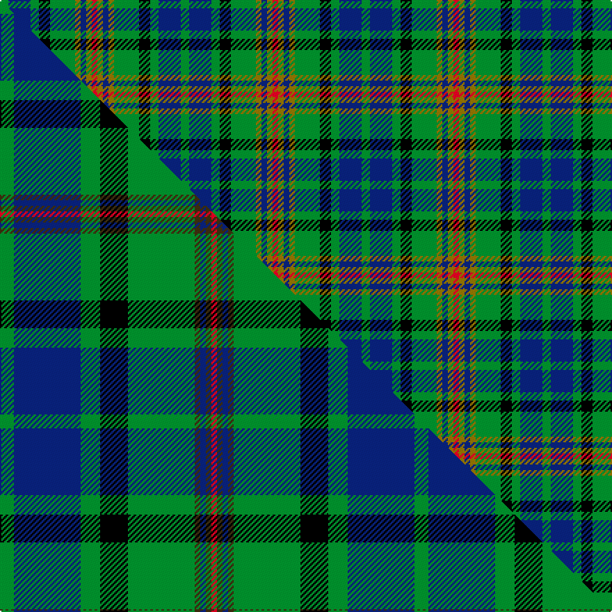

This page is one **sett** — a single exact thread-count. It belongs to the [tartan](/setts/g3db8g3k4g9y2db2y2r2/)
(the same proportion at any scale), whose colour order is pattern [GBGKGGBGR](/stripes/gbgkggbgr/).

Part of the [Maitland](/tartans/maitland/) tartan — the named design grouping this sett with its other cloths.

Sourced from weddslist.  It is a [9 stripe tartan](/stripes/stripes9/).

Original link http://www.weddslist.com/cgi-bin/tartans/pg.pl?source=tinsel

## Thread count
G/6 DB16 G6 K8 G18 Y4 DB4 Y4 R/4

One full sett is **130 threads**.

## Palette
<table><thead><tr><th>Colour</th><th>Shade</th><th>OKLCh</th></tr></thead><tbody><tr><td>DB</td><td><code style="background-color:#082077;">#082077</code> <small style="color:#888">#082077</small></td><td><small style="color:#888">oklch(30.0% 0.149 265.1)</small></td></tr><tr><td>G</td><td><code style="background-color:#008B2A;">#008B2A</code> <small style="color:#888">#008B2A</small></td><td><small style="color:#888">oklch(55.4% 0.170 145.9)</small></td></tr><tr><td>R</td><td><code style="background-color:#D60020;">#D60020</code> <small style="color:#888">#D60020</small></td><td><small style="color:#888">oklch(55.2% 0.224 25.5)</small></td></tr><tr><td>K</td><td><code style="background-color:#000000;">#000000</code> <small style="color:#888">#000000</small></td><td><small style="color:#888">oklch(0.0% 0.000 0.0)</small></td></tr><tr><td>Y</td><td><code style="background-color:#8B6E00;">#8B6E00</code> <small style="color:#888">#8B6E00</small></td><td><small style="color:#888">oklch(55.1% 0.113 90.4)</small></td></tr></tbody></table>

# Sample pattern

## Compared to the master

This cloth is one sett of its design; the master sett (the exemplar the design is anchored on) is below for comparison.

Its **ΔTartan distance** from the master is **0.58** — the same measure the nearest-tartans table ranks by (0 is identical; a re-scale of the same cloth is near 0, a recolour or a different proportion further).

<figure class="master-compare" style="margin:0">

this sett
master sett ★

<figcaption style="color:#888;font-size:smaller">One weave of this sett against the <a href="/setts/g5db24g7k10g24dy2db2dy2r2/">master sett ★</a>, split on the diagonal: a shared proportion runs seamlessly across it with only the shades shifting; a different proportion breaks on it.</figcaption>
</figure>

## Nearest tartan variants

The nearest existing variants by ΔTartan distance, with this cloth at the top so the swatches line up against it.

ΔTartan

Threads

Variant

Sett

—

130

<a href="/variants/s9/g3db8g3k4g9y2db2y2r2~x2/">Maitland</a>

<a href="/ttd/edit/#slug=g3db8g3k4g9y2db2y2r2&amp;base=g3db8g3k4g9y2db2y2r2~x2" title="compare in the TTD">0.00</a>

65

<a href="/variants/s9/g3db8g3k4g9y2db2y2r2/">Maitland</a>

<a href="/ttd/edit/#slug=g3db9g3k4g8y2db2y2r2&amp;base=g3db8g3k4g9y2db2y2r2~x2" title="compare in the TTD">0.16</a>

65

<a href="/variants/s9/g3db9g3k4g8y2db2y2r2/">Maitland</a>

<a href="/ttd/edit/#slug=g16y3db9r3db9g6db3g3k3~x4&amp;base=g3db8g3k4g9y2db2y2r2~x2" title="compare in the TTD">1.86</a>

364

<a href="/variants/s9/g16y3db9r3db9g6db3g3k3~x4/">Blarney Castle</a>

<a href="/ttd/edit/#slug=g5r4g19k10g8w4db18r4~x2&amp;base=g3db8g3k4g9y2db2y2r2~x2" title="compare in the TTD">2.20</a>

270

<a href="/variants/s8/g5r4g19k10g8w4db18r4~x2/">CSCA</a>

<a href="/ttd/edit/#slug=y1g6k5g1db5g1~x2&amp;base=g3db8g3k4g9y2db2y2r2~x2" title="compare in the TTD">2.22</a>

72

<a href="/variants/s6/y1g6k5g1db5g1~x2/">MacKay (Bonner)</a>

<a href="/ttd/edit/#slug=r4g12k12g2db12g3~x2&amp;base=g3db8g3k4g9y2db2y2r2~x2" title="compare in the TTD">2.29</a>

166

<a href="/variants/s6/r4g12k12g2db12g3~x2/">Gunn - 1810 (Clan)</a>

<a href="/ttd/edit/#slug=k8w2g11lb2k2lb2g11db6k2db6g8~x2&amp;base=g3db8g3k4g9y2db2y2r2~x2" title="compare in the TTD">2.45</a>

208

<a href="/variants/s11/k8w2g11lb2k2lb2g11db6k2db6g8~x2/">Wilson's, No 149</a>

<a href="/ttd/edit/#slug=y8g4db16g4k14y14db4t3~x2&amp;base=g3db8g3k4g9y2db2y2r2~x2" title="compare in the TTD">2.49</a>

246

<a href="/variants/s8/y8g4db16g4k14y14db4t3~x2/">Hinnigan (Personal)</a>

<a href="/ttd/edit/#slug=g24k4g6r4g6k19db22w5~x2&amp;base=g3db8g3k4g9y2db2y2r2~x2" title="compare in the TTD">2.53</a>

302

<a href="/variants/s8/g24k4g6r4g6k19db22w5~x2/">MacRae, Ancient hunting</a>

<a href="/ttd/edit/#slug=db6o2db6y3g6k1g2lb2g2k1g6~x2&amp;base=g3db8g3k4g9y2db2y2r2~x2" title="compare in the TTD">2.62</a>

124

<a href="/variants/s11/db6o2db6y3g6k1g2lb2g2k1g6~x2/">Presbyterian Synod (US) (Corporate)</a>

## Neighbour map

Every grey dot is one of 13620 variants placed by the first two principal components of the ΔTartan feature space (42% of its variance). Red is this tartan; blue dots are its nearest — click one to open its page.

<svg viewBox="0 0 640 380" role="img" style="max-width:100%;height:auto;border:1px solid #e0e0e0;border-radius:4px;display:block" xmlns="http://www.w3.org/2000/svg"><image href="/nn/cloud.v1.png" width="640" height="380"/><a href="/variants/s9/g3db8g3k4g9y2db2y2r2/"><circle cx="127.3" cy="220.4" r="4" fill="#3465a4"><title>Maitland</title></circle></a><a href="/variants/s9/g3db9g3k4g8y2db2y2r2/"><circle cx="116.8" cy="220.8" r="4" fill="#3465a4"><title>Maitland</title></circle></a><a href="/variants/s9/g16y3db9r3db9g6db3g3k3~x4/"><circle cx="174.6" cy="213.1" r="4" fill="#3465a4"><title>Blarney Castle</title></circle></a><a href="/variants/s8/g5r4g19k10g8w4db18r4~x2/"><circle cx="97.0" cy="197.4" r="4" fill="#3465a4"><title>CSCA</title></circle></a><a href="/variants/s6/y1g6k5g1db5g1~x2/"><circle cx="157.0" cy="231.3" r="4" fill="#3465a4"><title>MacKay (Bonner)</title></circle></a><a href="/variants/s6/r4g12k12g2db12g3~x2/"><circle cx="125.7" cy="237.8" r="4" fill="#3465a4"><title>Gunn - 1810 (Clan)</title></circle></a><a href="/variants/s11/k8w2g11lb2k2lb2g11db6k2db6g8~x2/"><circle cx="138.4" cy="199.8" r="4" fill="#3465a4"><title>Wilson's, No 149</title></circle></a><a href="/variants/s8/y8g4db16g4k14y14db4t3~x2/"><circle cx="86.2" cy="222.2" r="4" fill="#3465a4"><title>Hinnigan (Personal)</title></circle></a><a href="/variants/s8/g24k4g6r4g6k19db22w5~x2/"><circle cx="108.3" cy="198.4" r="4" fill="#3465a4"><title>MacRae, Ancient hunting</title></circle></a><a href="/variants/s11/db6o2db6y3g6k1g2lb2g2k1g6~x2/"><circle cx="123.9" cy="197.7" r="4" fill="#3465a4"><title>Presbyterian Synod (US) (Corporate)</title></circle></a><circle cx="127.3" cy="220.4" r="5" fill="#c00000"/><text x="320" y="376" text-anchor="middle" font-size="11" fill="#999">ground</text><text x="11" y="190" text-anchor="middle" font-size="11" fill="#999" transform="rotate(-90 11 190)">complexity</text></svg>

ID: /variants/s9/g3db8g3k4g9y2db2y2r2~x2/
