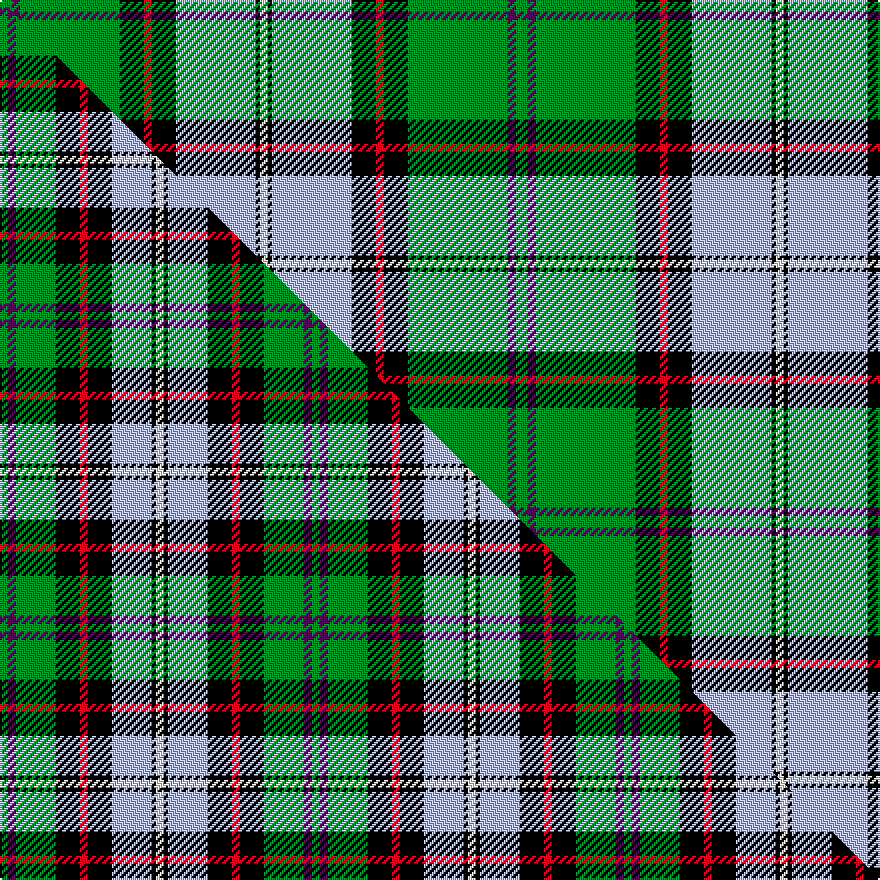

This is one **variant** — a specific cloth: this exact thread count and colourway, with its own
provenance below. It is one weaving of the [sett](/setts/g3dp2g25k6r2k6lb20k1w2/) (the scale-free proportion — the
same cloth at any scale or shade), whose colour order is pattern [GBGKRKWKW](/stripes/gbgkrkwkw/).

Part of the [Birch](/tartans/b/bi/birch/) tartan — the named design grouping this sett with its other cloths.

Sourced from tartans-authority.  It is a [9 stripe tartan](/stripes/stripes9/).

Original link [https://www.tartanregister.gov.uk/tartanDetails.aspx?ref=2157](https://www.tartanregister.gov.uk/tartanDetails.aspx?ref=2157)

Dataset <small>— provenance for this record, inherited from the source manifest</small>

<dl class="dataset-prov">
<dt>source</dt><dd><a href="/sources/tartans-authority/">Scottish Tartans Authority</a></dd>
<dt>data captured from</dt><dd><a href="https://github.com/thetartan/tartan-database/blob/master/data/tartans-authority/data.csv">https://github.com/thetartan/tartan-database/blob/master/data/tartans-authority/data.csv</a></dd>
<dt>data date</dt><dd>1993 <small>(this record)</small></dd>
<dt>licence</dt><dd><a href="https://creativecommons.org/licenses/by-nc-nd/4.0/">CC BY-NC-ND 4.0</a></dd>
</dl>

Capture chain <small>— the hands this data passed through, oldest first; each capture carries its own licence</small>

<ol class="capture-chain">
<li><a href="https://www.tartansauthority.com/">Scottish Tartans Authority</a> <small>the heritage body's archive — its tartan-ferret record browser is retired (links repaired to the SRT, above)</small></li>
<li><a href="https://github.com/thetartan/tartan-database">thetartan/tartan-database</a> <small>2016-2017</small> · <a href="https://creativecommons.org/licenses/by-nc-nd/4.0/">CC BY-NC-ND 4.0</a> <small>Levko Kravets's frozen compilation — the capture we vendored, and where its CC licence text came from</small></li>
<li>this dictionary <small>captured 2026-06-10 · commit 5bf86c7566</small> <small>each re-capture is a git commit to data/sources</small></li>
</ol>

## Register references

External register numbers recorded for this tartan.

- Scottish Tartans Authority (ITI): 2157

## Thread count
G/6 DP4 G50 K12 R4 K12 LB40 K2 W/4

One full sett is **258 threads**.

## Palette
<table><thead><tr><th>Colour</th><th>Shade</th><th>OKLCh</th></tr></thead><tbody><tr><td>LB</td><td><code style="background-color:#B5BBDE;">#B5BBDE</code> <small style="color:#888">#B5BBDE</small></td><td><small style="color:#888">oklch(79.9% 0.050 277.6)</small></td></tr><tr><td>R</td><td><code style="background-color:#D60020;">#D60020</code> <small style="color:#888">#D60020</small></td><td><small style="color:#888">oklch(55.2% 0.224 25.5)</small></td></tr><tr><td>G</td><td><code style="background-color:#008B2A;">#008B2A</code> <small style="color:#888">#008B2A</small></td><td><small style="color:#888">oklch(55.4% 0.170 145.9)</small></td></tr><tr><td>K</td><td><code style="background-color:#000000;">#000000</code> <small style="color:#888">#000000</small></td><td><small style="color:#888">oklch(0.0% 0.000 0.0)</small></td></tr><tr><td>W</td><td><code style="background-color:#F7F7F7;">#F7F7F7</code> <small style="color:#888">#F7F7F7</small></td><td><small style="color:#888">oklch(97.6% 0.000 89.9)</small></td></tr><tr><td>DP</td><td><code style="background-color:#4B0B4F;">#4B0B4F</code> <small style="color:#888">#4B0B4F</small></td><td><small style="color:#888">oklch(30.1% 0.125 325.4)</small></td></tr></tbody></table>

# Sample pattern

## Compared to the master

This cloth is one sett of its design; the master sett (the exemplar the design is anchored on) is below for comparison.

Its **ΔTartan distance** from the master is **0.66** — the same measure the nearest-tartans table ranks by (0 is identical; a re-scale of the same cloth is near 0, a recolour or a different proportion further).

<figure class="master-compare" style="margin:0">

this sett
master sett ★

<figcaption style="color:#888;font-size:smaller">One weave of this sett against the <a href="/setts/g2dp2g10k6r2k6lb10k1w2/">master sett ★</a>, split on the diagonal: a shared proportion runs seamlessly across it with only the shades shifting; a different proportion breaks on it.</figcaption>
</figure>

## Nearest tartan variants

The nearest existing variants by ΔTartan distance, with this cloth at the top so the swatches line up against it.

ΔTartan

Threads

Variant

Sett

—

258

<a href="/variants/s9/g3dp2g25k6r2k6lb20k1w2~x2/">Birch (Name)</a>

<a href="/ttd/edit/#slug=g3dp4g23k10r2k10lb18k1w3~x2&amp;base=g3dp2g25k6r2k6lb20k1w2~x2" title="compare in the TTD">0.39</a>

284

<a href="/variants/s9/g3dp4g23k10r2k10lb18k1w3~x2/">Birch Family Tartan</a>

<a href="/ttd/edit/#slug=g30dp4r6w6db6dp3k14w14db50g50w2&amp;base=g3dp2g25k6r2k6lb20k1w2~x2" title="compare in the TTD">2.16</a>

338

<a href="/variants/s11/g30dp4r6w6db6dp3k14w14db50g50w2/">Brehat (Personal)</a>

<a href="/ttd/edit/#slug=lb34r3lb8db4lb8k24g34k2w6&amp;base=g3dp2g25k6r2k6lb20k1w2~x2" title="compare in the TTD">2.22</a>

206

<a href="/variants/s9/lb34r3lb8db4lb8k24g34k2w6/">Hogg Dress</a>

<a href="/ttd/edit/#slug=g22r3k1g2r3lb16k3y2~x4&amp;base=g3dp2g25k6r2k6lb20k1w2~x2" title="compare in the TTD">2.29</a>

320

<a href="/variants/s8/g22r3k1g2r3lb16k3y2~x4/">Stirling, University of Corporate Univ Tartan</a>

<a href="/ttd/edit/#slug=w2db4r16k12g36dy1db6k2w2~x2&amp;base=g3dp2g25k6r2k6lb20k1w2~x2" title="compare in the TTD">2.30</a>

316

<a href="/variants/s9/w2db4r16k12g36dy1db6k2w2~x2/">National Millennium</a>

<a href="/ttd/edit/#slug=k2g30k3dbi4k2db18lb1k3r2~x2~dbi1406275-db1004274&amp;base=g3dp2g25k6r2k6lb20k1w2~x2" title="compare in the TTD">2.32</a>

252

<a href="/variants/s9/k2g30k3dbi4k2db18lb1k3r2~x2~dbi1406275-db1004274/">Lusk (Personal)</a>

<a href="/ttd/edit/#slug=w4k1db16k1g32dr6k6lo6g4lo2g1~x2&amp;base=g3dp2g25k6r2k6lb20k1w2~x2" title="compare in the TTD">2.33</a>

306

<a href="/variants/s11/w4k1db16k1g32dr6k6lo6g4lo2g1~x2/">Zambia</a>

<a href="/ttd/edit/#slug=r7g20ly2g4k5db4k2db20k3w1~x2&amp;base=g3dp2g25k6r2k6lb20k1w2~x2" title="compare in the TTD">2.37</a>

256

<a href="/variants/s10/r7g20ly2g4k5db4k2db20k3w1~x2/">McMeeken (Name)</a>

<a href="/ttd/edit/#slug=dr4w6k10db5k3y16k3g33k1w4~x2&amp;base=g3dp2g25k6r2k6lb20k1w2~x2" title="compare in the TTD">2.37</a>

324

<a href="/variants/s10/dr4w6k10db5k3y16k3g33k1w4~x2/">Fermanagh County, Crest Range</a>

<a href="/ttd/edit/#slug=r7g20y2g4k5db4k2db20k3w1~x2&amp;base=g3dp2g25k6r2k6lb20k1w2~x2" title="compare in the TTD">2.38</a>

256

<a href="/variants/s10/r7g20y2g4k5db4k2db20k3w1~x2/">McMeeken</a>

## Neighbour map

Every grey dot is one of 13621 variants placed by the first two principal components of the ΔTartan feature space (42% of its variance). Red is this tartan; blue dots are its nearest — click one to open its page. The map is a flat projection of a many-dimensional space — [how to read it](/posts/neighbourhood-maps/).

<svg viewBox="0 0 640 380" role="img" style="max-width:100%;height:auto;border:1px solid #e0e0e0;border-radius:4px;display:block" xmlns="http://www.w3.org/2000/svg"><image href="/nn/cloud.v1.png" width="640" height="380"/><a href="/variants/s9/g3dp4g23k10r2k10lb18k1w3~x2/"><circle cx="108.0" cy="112.3" r="4" fill="#3465a4"><title>Birch Family Tartan</title></circle></a><a href="/variants/s11/g30dp4r6w6db6dp3k14w14db50g50w2/"><circle cx="170.5" cy="100.9" r="4" fill="#3465a4"><title>Brehat (Personal)</title></circle></a><a href="/variants/s9/lb34r3lb8db4lb8k24g34k2w6/"><circle cx="129.3" cy="123.8" r="4" fill="#3465a4"><title>Hogg Dress</title></circle></a><a href="/variants/s8/g22r3k1g2r3lb16k3y2~x4/"><circle cx="207.7" cy="110.4" r="4" fill="#3465a4"><title>Stirling, University of Corporate Univ Tartan</title></circle></a><a href="/variants/s9/w2db4r16k12g36dy1db6k2w2~x2/"><circle cx="186.3" cy="76.1" r="4" fill="#3465a4"><title>National Millennium</title></circle></a><a href="/variants/s9/k2g30k3dbi4k2db18lb1k3r2~x2~dbi1406275-db1004274/"><circle cx="215.6" cy="82.3" r="4" fill="#3465a4"><title>Lusk (Personal)</title></circle></a><a href="/variants/s11/w4k1db16k1g32dr6k6lo6g4lo2g1~x2/"><circle cx="193.8" cy="76.3" r="4" fill="#3465a4"><title>Zambia</title></circle></a><a href="/variants/s10/r7g20ly2g4k5db4k2db20k3w1~x2/"><circle cx="139.0" cy="114.3" r="4" fill="#3465a4"><title>McMeeken (Name)</title></circle></a><a href="/variants/s10/dr4w6k10db5k3y16k3g33k1w4~x2/"><circle cx="141.0" cy="86.7" r="4" fill="#3465a4"><title>Fermanagh County, Crest Range</title></circle></a><a href="/variants/s10/r7g20y2g4k5db4k2db20k3w1~x2/"><circle cx="141.6" cy="114.7" r="4" fill="#3465a4"><title>McMeeken</title></circle></a><circle cx="160.2" cy="94.9" r="5" fill="#c00000"/><text x="320" y="376" text-anchor="middle" font-size="11" fill="#999">ground</text><text x="11" y="190" text-anchor="middle" font-size="11" fill="#999" transform="rotate(-90 11 190)">complexity</text></svg>

ID: /variants/s9/g3dp2g25k6r2k6lb20k1w2~x2/
