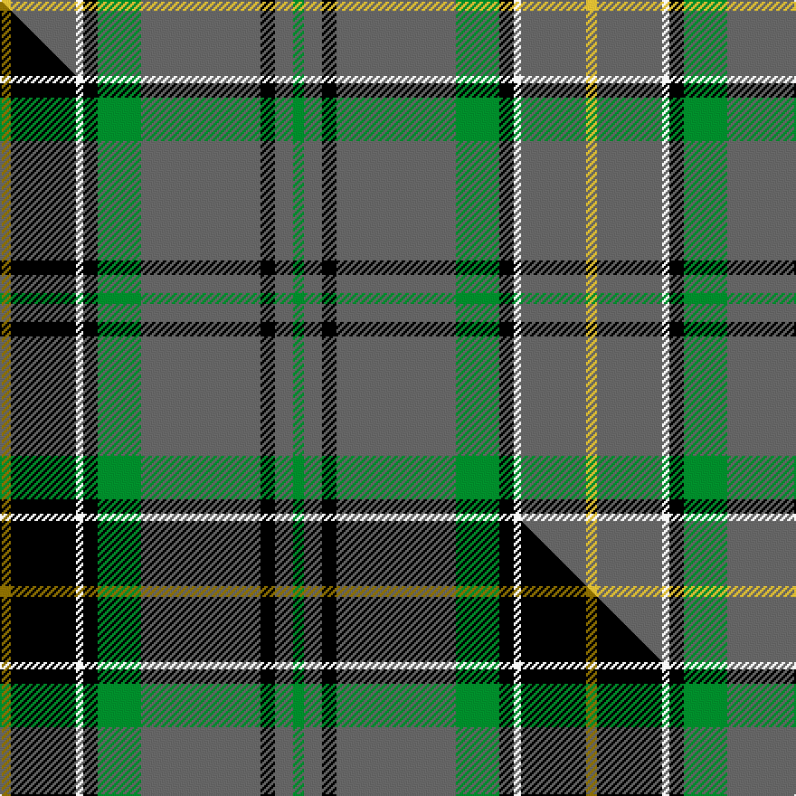

This page is one **sett** — a single exact thread-count. It belongs to the [tartan](/setts/g3n5k4n33g12k4w2n18ly3/)
(the same proportion at any scale), whose colour order is pattern [GBKBGKWBY](/stripes/gbkbgkwby/).

Part of the [Smoke Showing](/tartans/smoke-showing/) tartan — the named design grouping this sett with its other cloths.

Sourced from tartans-authority.  It is a [9 stripe tartan](/stripes/stripes9/).

Original link http://www.tartansauthority.com/tartan-ferret/display/11227/

## Register references

External register numbers recorded for this tartan.

- Scottish Register of Tartans: [11227](https://www.tartanregister.gov.uk/tartanDetails?ref=11227)
- Scottish Tartans Authority (ITI): 11227

## Thread count
LY/6 N36 W4 K8 G24 N66 K8 N10 G/6

One full sett is **324 threads**.

## Palette
<table><thead><tr><th>Colour</th><th>Shade</th><th>OKLCh</th></tr></thead><tbody><tr><td>G</td><td><code style="background-color:#008B2A;">#008B2A</code> <small style="color:#888">#008B2A</small></td><td><small style="color:#888">oklch(55.4% 0.170 145.9)</small></td></tr><tr><td>K</td><td><code style="background-color:#000000;">#000000</code> <small style="color:#888">#000000</small></td><td><small style="color:#888">oklch(0.0% 0.000 0.0)</small></td></tr><tr><td>N</td><td><code style="background-color:#636363;">#636363</code> <small style="color:#888">#636363</small></td><td><small style="color:#888">oklch(50.0% 0.000 89.9)</small></td></tr><tr><td>W</td><td><code style="background-color:#F7F7F7;">#F7F7F7</code> <small style="color:#888">#F7F7F7</small></td><td><small style="color:#888">oklch(97.6% 0.000 89.9)</small></td></tr><tr><td>LY</td><td><code style="background-color:#DCBC32;">#DCBC32</code> <small style="color:#888">#DCBC32</small></td><td><small style="color:#888">oklch(80.0% 0.150 95.2)</small></td></tr></tbody></table>

# Sample pattern

## Compared to the master

This cloth is one sett of its design; the master sett (the exemplar the design is anchored on) is below for comparison.

Its **ΔTartan distance** from the master is **1.30** — the same measure the nearest-tartans table ranks by (0 is identical; a re-scale of the same cloth is near 0, a recolour or a different proportion further).

<figure class="master-compare" style="margin:0">

this sett
master sett ★

<figcaption style="color:#888;font-size:smaller">One weave of this sett against the <a href="/setts/y3k18w2k4g12n33k4n5g3/">master sett ★</a>, split on the diagonal: a shared proportion runs seamlessly across it with only the shades shifting; a different proportion breaks on it.</figcaption>
</figure>

## Nearest tartan variants

The nearest existing variants by ΔTartan distance, with this cloth at the top so the swatches line up against it.

ΔTartan

Threads

Variant

Sett

—

324

<a href="/variants/s9/g3n5k4n33g12k4w2n18ly3~x2/">Smoke Showing (UFES)</a>

<a href="/ttd/edit/#slug=t130k9t21ly8t21w8t35r70&amp;base=g3n5k4n33g12k4w2n18ly3~x2" title="compare in the TTD">2.49</a>

404

<a href="/variants/s8/t130k9t21ly8t21w8t35r70/">Maud, Mary</a>

<a href="/ttd/edit/#slug=n16w1n1k1n8ly4r2w2r2~x4&amp;base=g3n5k4n33g12k4w2n18ly3~x2" title="compare in the TTD">2.63</a>

224

<a href="/variants/s9/n16w1n1k1n8ly4r2w2r2~x4/">Middleton, City of</a>

<a href="/ttd/edit/#slug=n19do2k3o1k1w1k1do6n3k1n6~x4&amp;base=g3n5k4n33g12k4w2n18ly3~x2" title="compare in the TTD">2.65</a>

252

<a href="/variants/s11/n19do2k3o1k1w1k1do6n3k1n6~x4/">Glen Clova #1</a>

<a href="/ttd/edit/#slug=dt14db3dt2lbi8dt5lbi2k2dt25lb2~x2~dt1700000-lbi3300000&amp;base=g3n5k4n33g12k4w2n18ly3~x2" title="compare in the TTD">2.85</a>

220

<a href="/variants/s9/n14db3n2lbi8n5lbi2k2n25lb2~x2~n1700000-lbi3300000/">Turnberry Scotland</a>

<a href="/ttd/edit/#slug=g32w1k3w1gi14g7k3dp3w1~x2~g1903114-gi2408144&amp;base=g3n5k4n33g12k4w2n18ly3~x2" title="compare in the TTD">2.87</a>

194

<a href="/variants/s9/g32w1k3w1gi14g7k3dp3w1~x2~g1903114-gi2408144/">Leach Htg #2 (Name)</a>

<a href="/ttd/edit/#slug=k3y3lo2y30k2y3m12y6mi6k3y3~x2~y2103114-lo2706066-m1907352-mi2506332&amp;base=g3n5k4n33g12k4w2n18ly3~x2" title="compare in the TTD">3.03</a>

280

<a href="/variants/s11/k3y3lo2y30k2y3m12y6mi6k3y3~x2~y2103114-lo2706066-m1907352-mi2506332/">McAlifyfe (Personal)</a>

<a href="/ttd/edit/#slug=db5ly1n19k6n4k4n12w1n12k2db2~x2&amp;base=g3n5k4n33g12k4w2n18ly3~x2" title="compare in the TTD">3.05</a>

258

<a href="/variants/s11/db5ly1n19k6n4k4n12w1n12k2db2~x2/">Apollo 12 (Commemorative)</a>

<a href="/ttd/edit/#slug=k2w2db8k4dg33r2dg16w2~x2&amp;base=g3n5k4n33g12k4w2n18ly3~x2" title="compare in the TTD">3.19</a>

268

<a href="/variants/s8/k2w2db8k4dg33r2dg16w2~x2/">Sarros, Terrence (USA) (Personal)</a>

<a href="/ttd/edit/#slug=g28dr2g28dr7lb2dr7lb2dr7k5dp4lb2~x2&amp;base=g3n5k4n33g12k4w2n18ly3~x2" title="compare in the TTD">3.21</a>

316

<a href="/variants/s11/g28dr2g28dr7lb2dr7lb2dr7k5dp4lb2~x2/">Hynde (Sir John)</a>

<a href="/ttd/edit/#slug=lb5k1g30dp15r8g30r8dp2&amp;base=g3n5k4n33g12k4w2n18ly3~x2" title="compare in the TTD">3.25</a>

191

<a href="/variants/s8/lb5k1g30dp15r8g30r8dp2/">Shaw of Tordarroch Hunting Clan Tartan</a>

## Neighbour map

Every grey dot is one of 13620 variants placed by the first two principal components of the ΔTartan feature space (42% of its variance). Red is this tartan; blue dots are its nearest — click one to open its page.

<svg viewBox="0 0 640 380" role="img" style="max-width:100%;height:auto;border:1px solid #e0e0e0;border-radius:4px;display:block" xmlns="http://www.w3.org/2000/svg"><image href="/nn/cloud.v1.png" width="640" height="380"/><a href="/variants/s8/t130k9t21ly8t21w8t35r70/"><circle cx="385.1" cy="145.7" r="4" fill="#3465a4"><title>Maud, Mary</title></circle></a><a href="/variants/s9/n16w1n1k1n8ly4r2w2r2~x4/"><circle cx="369.3" cy="132.7" r="4" fill="#3465a4"><title>Middleton, City of</title></circle></a><a href="/variants/s11/n19do2k3o1k1w1k1do6n3k1n6~x4/"><circle cx="346.7" cy="107.3" r="4" fill="#3465a4"><title>Glen Clova #1</title></circle></a><a href="/variants/s9/n14db3n2lbi8n5lbi2k2n25lb2~x2~n1700000-lbi3300000/"><circle cx="402.8" cy="148.9" r="4" fill="#3465a4"><title>Turnberry Scotland</title></circle></a><a href="/variants/s9/g32w1k3w1gi14g7k3dp3w1~x2~g1903114-gi2408144/"><circle cx="338.2" cy="100.0" r="4" fill="#3465a4"><title>Leach Htg #2 (Name)</title></circle></a><a href="/variants/s11/k3y3lo2y30k2y3m12y6mi6k3y3~x2~y2103114-lo2706066-m1907352-mi2506332/"><circle cx="326.0" cy="122.1" r="4" fill="#3465a4"><title>McAlifyfe (Personal)</title></circle></a><a href="/variants/s11/db5ly1n19k6n4k4n12w1n12k2db2~x2/"><circle cx="352.6" cy="130.8" r="4" fill="#3465a4"><title>Apollo 12 (Commemorative)</title></circle></a><a href="/variants/s8/k2w2db8k4dg33r2dg16w2~x2/"><circle cx="384.2" cy="130.7" r="4" fill="#3465a4"><title>Sarros, Terrence (USA) (Personal)</title></circle></a><a href="/variants/s11/g28dr2g28dr7lb2dr7lb2dr7k5dp4lb2~x2/"><circle cx="295.3" cy="137.5" r="4" fill="#3465a4"><title>Hynde (Sir John)</title></circle></a><a href="/variants/s8/lb5k1g30dp15r8g30r8dp2/"><circle cx="322.4" cy="135.1" r="4" fill="#3465a4"><title>Shaw of Tordarroch Hunting Clan Tartan</title></circle></a><circle cx="358.4" cy="141.1" r="5" fill="#c00000"/><text x="320" y="376" text-anchor="middle" font-size="11" fill="#999">ground</text><text x="11" y="190" text-anchor="middle" font-size="11" fill="#999" transform="rotate(-90 11 190)">complexity</text></svg>

ID: /variants/s9/g3n5k4n33g12k4w2n18ly3~x2/
