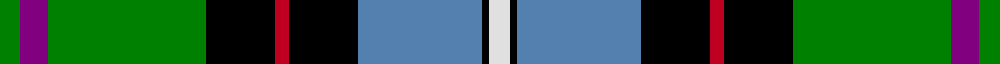

This page is one **sett** — a single exact thread-count. It belongs to the [tartan](/setts/g3p4g23k10r2k10t18k1w3/)
(the same proportion at any scale), whose colour order is pattern [GBGKRKBKW](/stripes/gbgkrkbkw/).

Part of the [Birch](/tartans/birch/) tartan — the named design grouping this sett with its other cloths.

Sourced from weddslist.  It is a [9 stripe tartan](/stripes/stripes9/).

Original link http://www.weddslist.com/cgi-bin/tartans/pg.pl?source=sts

## Thread count
G/6 P8 G46 K20 R4 K20 B36 K2 LN/6

One full sett is **284 threads**.

## Palette

Palette: <strong>Tartan Register</strong> <small style="color:#888">(2 of 6 colours)</small>
<table><thead><tr><th>Colour</th><th>Threads</th><th>Shade</th><th>Base</th><th>OKLCh</th></tr></thead><tbody><tr><td>G/</td><td style="text-align:right;font-variant-numeric:tabular-nums">6</td><td><code style="background-color:#008000;">#008000</code> <small style="color:#888">#008000</small></td><td>G <code style="background-color:#006100;">#006100</code></td><td><small style="color:#888">oklch(52.0% 0.177 142.5)</small></td></tr><tr><td>P</td><td style="text-align:right;font-variant-numeric:tabular-nums">8</td><td><code style="background-color:#800080;">#800080</code> <small style="color:#888">#800080</small></td><td>B <code style="background-color:#2A418A;">#2A418A</code></td><td><small style="color:#888">oklch(42.1% 0.193 328.4)</small></td></tr><tr><td>G</td><td style="text-align:right;font-variant-numeric:tabular-nums">46</td><td><code style="background-color:#008000;">#008000</code> <small style="color:#888">#008000</small></td><td>G <code style="background-color:#006100;">#006100</code></td><td><small style="color:#888">oklch(52.0% 0.177 142.5)</small></td></tr><tr><td>K</td><td style="text-align:right;font-variant-numeric:tabular-nums">20</td><td><code style="background-color:#000000;">#000000</code> <small style="color:#888">#000000</small></td><td>K <code style="background-color:#000000;">#000000</code></td><td><small style="color:#888">oklch(0.0% 0.000 0.0)</small></td></tr><tr><td>R</td><td style="text-align:right;font-variant-numeric:tabular-nums">4</td><td><code style="background-color:#C00020;">#C00020</code> <small style="color:#888">#C00020</small></td><td>R <code style="background-color:#CC0000;">#CC0000</code></td><td><small style="color:#888">oklch(50.9% 0.206 24.5)</small></td></tr><tr><td>K</td><td style="text-align:right;font-variant-numeric:tabular-nums">20</td><td><code style="background-color:#000000;">#000000</code> <small style="color:#888">#000000</small></td><td>K <code style="background-color:#000000;">#000000</code></td><td><small style="color:#888">oklch(0.0% 0.000 0.0)</small></td></tr><tr><td>B</td><td style="text-align:right;font-variant-numeric:tabular-nums">36</td><td><code style="background-color:#5480B0;">#5480B0</code> <small style="color:#888">#5480B0</small></td><td>B <code style="background-color:#2A418A;">#2A418A</code></td><td><small style="color:#888">oklch(58.8% 0.089 251.5)</small></td></tr><tr><td>K</td><td style="text-align:right;font-variant-numeric:tabular-nums">2</td><td><code style="background-color:#000000;">#000000</code> <small style="color:#888">#000000</small></td><td>K <code style="background-color:#000000;">#000000</code></td><td><small style="color:#888">oklch(0.0% 0.000 0.0)</small></td></tr><tr><td>LN/</td><td style="text-align:right;font-variant-numeric:tabular-nums">6</td><td><code style="background-color:#E0E0E0;">#E0E0E0</code> <small style="color:#888">#E0E0E0</small></td><td>W <code style="background-color:#F7F7F7;">#F7F7F7</code></td><td><small style="color:#888">oklch(90.7% 0.000 89.9)</small></td></tr></tbody></table>

## Compared to the master

This cloth is one sett of its design; the master sett (the exemplar the design is anchored on) is below for comparison.

<figure style="margin:0"><figcaption style="color:#888;font-size:smaller">this sett</figcaption></figure>
<figure style="margin:0"><figcaption style="color:#888;font-size:smaller"><a href="/setts/g2dp2g10k6r2k6t10k1lb2/">master sett →</a></figcaption></figure>

## Nearest tartans

The nearest existing variants by ΔTartan distance, with this tartan at the top so the swatches line up against it.

ΔTartan

Tartan

Sett

—

<a href="/ttd/edit/#slug=g3p4g23k10r2k10t18k1w3~x2">Birch</a> <a class="nn-out" href="/variants/s9/g3p4g23k10r2k10t18k1w3~x2/" title="open its dictionary page">↗</a>

0.72

<a href="/ttd/edit/#slug=w4k1g19ly1k19db13r2db4r2~x2&amp;base=g3p4g23k10r2k10t18k1w3~x2">Whitson</a> <a class="nn-out" href="/variants/s9/w4k1g19ly1k19db13r2db4r2~x2/" title="open its dictionary page">↗</a>

0.83

<a href="/ttd/edit/#slug=k2w2k8ly8db24g13k3r1~x2&amp;base=g3p4g23k10r2k10t18k1w3~x2">Froben, Christian (Personal)</a> <a class="nn-out" href="/variants/s8/k2w2k8ly8db24g13k3r1~x2/" title="open its dictionary page">↗</a>

0.94

<a href="/ttd/edit/#slug=g3dp4g23k10r2k10t18k1w3~x2&amp;base=g3p4g23k10r2k10t18k1w3~x2">Birch Family Tartan</a> <a class="nn-out" href="/variants/s9/g3dp4g23k10r2k10t18k1w3~x2/" title="open its dictionary page">↗</a>

0.97

<a href="/ttd/edit/#slug=b4k1db28k16g10r2g10r4g10r2g10k1ly4~x2&amp;base=g3p4g23k10r2k10t18k1w3~x2">California</a> <a class="nn-out" href="/variants/s13/b4k1db28k16g10r2g10r4g10r2g10k1ly4~x2/" title="open its dictionary page">↗</a>

0.99

<a href="/ttd/edit/#slug=g5ly1r2g25k14db19w4g2~x2&amp;base=g3p4g23k10r2k10t18k1w3~x2">Tooth</a> <a class="nn-out" href="/variants/s8/g5ly1r2g25k14db19w4g2~x2/" title="open its dictionary page">↗</a>

1.04

<a href="/ttd/edit/#slug=g3dp2g25k6r2k6t20k1lb2~x2&amp;base=g3p4g23k10r2k10t18k1w3~x2">Birch (Name)</a> <a class="nn-out" href="/variants/s9/g3dp2g25k6r2k6t20k1lb2~x2/" title="open its dictionary page">↗</a>

1.06

<a href="/ttd/edit/#slug=w1r2db16k14g15k3ly1~x2&amp;base=g3p4g23k10r2k10t18k1w3~x2">MacNeil 7</a> <a class="nn-out" href="/variants/s7/w1r2db16k14g15k3ly1~x2/" title="open its dictionary page">↗</a>

1.12

<a href="/ttd/edit/#slug=dg19k20m1db8b8dg8db3m1lb12k8m1lb1~x2&amp;base=g3p4g23k10r2k10t18k1w3~x2">Vine (2015)</a> <a class="nn-out" href="/variants/s12/dg19k20m1db8b8dg8db3m1lb12k8m1lb1~x2/" title="open its dictionary page">↗</a>

1.12

<a href="/ttd/edit/#slug=w4k1g18k17db13r1db3r1~x2&amp;base=g3p4g23k10r2k10t18k1w3~x2">Whitson</a> <a class="nn-out" href="/variants/s8/w4k1g18k17db13r1db3r1~x2/" title="open its dictionary page">↗</a>

1.13

<a href="/ttd/edit/#slug=ly3db29k15r4g25r8k4r3w2~x2&amp;base=g3p4g23k10r2k10t18k1w3~x2">George Brown</a> <a class="nn-out" href="/variants/s9/ly3db29k15r4g25r8k4r3w2~x2/" title="open its dictionary page">↗</a>

## Neighbour map

Every grey dot is one of 14360 variants placed by the first two principal components of the ΔTartan feature space (44% of its variance). Red is this tartan; blue dots are its nearest — click one to open its page.

<svg viewBox="0 0 640 380" role="img" style="max-width:100%;height:auto;border:1px solid #e0e0e0;border-radius:4px;display:block" xmlns="http://www.w3.org/2000/svg"><image href="/nn/cloud.v1.png" width="640" height="380"/><a href="/variants/s9/w4k1g19ly1k19db13r2db4r2~x2/"><circle cx="120.4" cy="118.5" r="4" fill="#3465a4"><title>Whitson</title></circle></a><a href="/variants/s8/k2w2k8ly8db24g13k3r1~x2/"><circle cx="167.1" cy="119.1" r="4" fill="#3465a4"><title>Froben, Christian (Personal)</title></circle></a><a href="/variants/s9/g3dp4g23k10r2k10t18k1w3~x2/"><circle cx="160.6" cy="129.1" r="4" fill="#3465a4"><title>Birch Family Tartan</title></circle></a><a href="/variants/s13/b4k1db28k16g10r2g10r4g10r2g10k1ly4~x2/"><circle cx="162.6" cy="97.3" r="4" fill="#3465a4"><title>California</title></circle></a><a href="/variants/s8/g5ly1r2g25k14db19w4g2~x2/"><circle cx="193.9" cy="121.3" r="4" fill="#3465a4"><title>Tooth</title></circle></a><a href="/variants/s9/g3dp2g25k6r2k6t20k1lb2~x2/"><circle cx="193.0" cy="102.5" r="4" fill="#3465a4"><title>Birch (Name)</title></circle></a><a href="/variants/s7/w1r2db16k14g15k3ly1~x2/"><circle cx="134.8" cy="149.0" r="4" fill="#3465a4"><title>MacNeil 7</title></circle></a><a href="/variants/s12/dg19k20m1db8b8dg8db3m1lb12k8m1lb1~x2/"><circle cx="102.5" cy="117.9" r="4" fill="#3465a4"><title>Vine (2015)</title></circle></a><a href="/variants/s8/w4k1g18k17db13r1db3r1~x2/"><circle cx="143.1" cy="145.2" r="4" fill="#3465a4"><title>Whitson</title></circle></a><a href="/variants/s9/ly3db29k15r4g25r8k4r3w2~x2/"><circle cx="110.0" cy="129.9" r="4" fill="#3465a4"><title>George Brown</title></circle></a><circle cx="135.2" cy="118.6" r="5" fill="#c00000"/></svg>

ID: /variants/s9/g3p4g23k10r2k10t18k1w3~x2/
