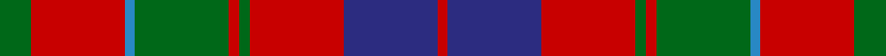

This page is one **sett** — a single exact thread-count. It belongs to the [tartan](/setts/g3r9t1g9r1g1r9db9r1/)
(the same proportion at any scale), whose colour order is pattern [GRBGRGRBR](/stripes/grbgrgrbr/).

Sourced from tartans-authority.  It is a [9 stripe tartan](/stripes/stripes9/).

Original link http://www.tartansauthority.com/tartan-ferret/display/2348/

## Register references

External register numbers recorded for this tartan.

- Scottish Tartans Authority (ITI): 2348

## Thread count
G/12 R36 B4 G36 R4 G4 R36 DB36 R/4

One full sett is **328 threads**.

## Palette

Palette: <strong>Tartan Register</strong>
<table><thead><tr><th>Colour</th><th>Threads</th><th>Shade</th><th>Base</th><th>OKLCh</th></tr></thead><tbody><tr><td>G/</td><td style="text-align:right;font-variant-numeric:tabular-nums">12</td><td><code style="background-color:#006818;">#006818</code> <small style="color:#888">#006818</small></td><td>G <code style="background-color:#006100;">#006100</code></td><td><small style="color:#888">oklch(45.0% 0.142 145.0)</small></td></tr><tr><td>R</td><td style="text-align:right;font-variant-numeric:tabular-nums">36</td><td><code style="background-color:#C80000;">#C80000</code> <small style="color:#888">#C80000</small></td><td>R <code style="background-color:#CC0000;">#CC0000</code></td><td><small style="color:#888">oklch(52.3% 0.215 29.2)</small></td></tr><tr><td>B</td><td style="text-align:right;font-variant-numeric:tabular-nums">4</td><td><code style="background-color:#2888C4;">#2888C4</code> <small style="color:#888">#2888C4</small></td><td>B <code style="background-color:#2A418A;">#2A418A</code></td><td><small style="color:#888">oklch(60.1% 0.125 241.5)</small></td></tr><tr><td>G</td><td style="text-align:right;font-variant-numeric:tabular-nums">36</td><td><code style="background-color:#006818;">#006818</code> <small style="color:#888">#006818</small></td><td>G <code style="background-color:#006100;">#006100</code></td><td><small style="color:#888">oklch(45.0% 0.142 145.0)</small></td></tr><tr><td>R</td><td style="text-align:right;font-variant-numeric:tabular-nums">4</td><td><code style="background-color:#C80000;">#C80000</code> <small style="color:#888">#C80000</small></td><td>R <code style="background-color:#CC0000;">#CC0000</code></td><td><small style="color:#888">oklch(52.3% 0.215 29.2)</small></td></tr><tr><td>G</td><td style="text-align:right;font-variant-numeric:tabular-nums">4</td><td><code style="background-color:#006818;">#006818</code> <small style="color:#888">#006818</small></td><td>G <code style="background-color:#006100;">#006100</code></td><td><small style="color:#888">oklch(45.0% 0.142 145.0)</small></td></tr><tr><td>R</td><td style="text-align:right;font-variant-numeric:tabular-nums">36</td><td><code style="background-color:#C80000;">#C80000</code> <small style="color:#888">#C80000</small></td><td>R <code style="background-color:#CC0000;">#CC0000</code></td><td><small style="color:#888">oklch(52.3% 0.215 29.2)</small></td></tr><tr><td>DB</td><td style="text-align:right;font-variant-numeric:tabular-nums">36</td><td><code style="background-color:#2C2C80;">#2C2C80</code> <small style="color:#888">#2C2C80</small></td><td>B <code style="background-color:#2A418A;">#2A418A</code></td><td><small style="color:#888">oklch(35.0% 0.138 276.6)</small></td></tr><tr><td>R/</td><td style="text-align:right;font-variant-numeric:tabular-nums">4</td><td><code style="background-color:#C80000;">#C80000</code> <small style="color:#888">#C80000</small></td><td>R <code style="background-color:#CC0000;">#CC0000</code></td><td><small style="color:#888">oklch(52.3% 0.215 29.2)</small></td></tr></tbody></table>

## Nearest tartans

The nearest existing variants by ΔTartan distance, with this tartan at the top so the swatches line up against it.

ΔTartan

Tartan

Sett

—

<a href="/ttd/edit/#slug=g3r9t1g9r1g1r9db9r1~x4">Convention of the Baronage (Corp)</a> <a class="nn-out" href="/variants/s9/g3r9t1g9r1g1r9db9r1~x4/" title="open its dictionary page">↗</a>

0.38

<a href="/ttd/edit/#slug=y3dr18y4dr3y4r13y3y18dr2lo3~x2&amp;base=g3r9t1g9r1g1r9db9r1~x4">Leitrim</a> <a class="nn-out" href="/variants/s10/y3dr18y4dr3y4r13y3y18dr2lo3~x2/" title="open its dictionary page">↗</a>

0.43

<a href="/ttd/edit/#slug=dg3r9t1dg9r1dg1r8db9r1~x4&amp;base=g3r9t1g9r1g1r9db9r1~x4">Baronage</a> <a class="nn-out" href="/variants/s9/dg3r9t1dg9r1dg1r8db9r1~x4/" title="open its dictionary page">↗</a>

0.70

<a href="/ttd/edit/#slug=y28k3r22k8w3k8r22k3y28k3~x2&amp;base=g3r9t1g9r1g1r9db9r1~x4">Henkel</a> <a class="nn-out" href="/variants/s10/y28k3r22k8w3k8r22k3y28k3~x2/" title="open its dictionary page">↗</a>

0.82

<a href="/ttd/edit/#slug=k2r12db6r3dg12r4db1~x2&amp;base=g3r9t1g9r1g1r9db9r1~x4">MacBean/MacElvain</a> <a class="nn-out" href="/variants/s7/k2r12db6r3dg12r4db1~x2/" title="open its dictionary page">↗</a>

0.83

<a href="/ttd/edit/#slug=db24r3db4r6g8r3g8r30k3~x2&amp;base=g3r9t1g9r1g1r9db9r1~x4">Gates</a> <a class="nn-out" href="/variants/s9/db24r3db4r6g8r3g8r30k3~x2/" title="open its dictionary page">↗</a>

0.84

<a href="/ttd/edit/#slug=g3r2db2r13t1db4r2g7r2db2~x2&amp;base=g3r9t1g9r1g1r9db9r1~x4">MacKillop</a> <a class="nn-out" href="/variants/s10/g3r2db2r13t1db4r2g7r2db2~x2/" title="open its dictionary page">↗</a>

0.88

<a href="/ttd/edit/#slug=n28r26w2n5w2r26lg28r5w2r5~x2&amp;base=g3r9t1g9r1g1r9db9r1~x4">Glenfinnan (Clan?)</a> <a class="nn-out" href="/variants/s10/n28r26w2n5w2r26lg28r5w2r5~x2/" title="open its dictionary page">↗</a>

0.89

<a href="/ttd/edit/#slug=o16oi2o11oi6k4w2k4oi16~x2&amp;base=g3r9t1g9r1g1r9db9r1~x4">Sydney (Nova Scotia) (District)</a> <a class="nn-out" href="/variants/s8/o16oi2o11oi6k4w2k4oi16~x2/" title="open its dictionary page">↗</a>

0.90

<a href="/ttd/edit/#slug=r1t1r6db3r1dg6r1dg6r6db1r1t1~x2&amp;base=g3r9t1g9r1g1r9db9r1~x4">MacQuarrie</a> <a class="nn-out" href="/variants/s12/r1t1r6db3r1dg6r1dg6r6db1r1t1~x2/" title="open its dictionary page">↗</a>

0.92

<a href="/ttd/edit/#slug=db8r8dg17w3r35db10dg15w3~x2&amp;base=g3r9t1g9r1g1r9db9r1~x4">James of Glencarr (Personal)</a> <a class="nn-out" href="/variants/s8/db8r8dg17w3r35db10dg15w3~x2/" title="open its dictionary page">↗</a>

## Neighbour map

Every grey dot is one of 14360 variants placed by the first two principal components of the ΔTartan feature space (44% of its variance). Red is this tartan; blue dots are its nearest — click one to open its page.

<svg viewBox="0 0 640 380" role="img" style="max-width:100%;height:auto;border:1px solid #e0e0e0;border-radius:4px;display:block" xmlns="http://www.w3.org/2000/svg"><image href="/nn/cloud.v1.png" width="640" height="380"/><a href="/variants/s10/y3dr18y4dr3y4r13y3y18dr2lo3~x2/"><circle cx="247.1" cy="186.3" r="4" fill="#3465a4"><title>Leitrim</title></circle></a><a href="/variants/s9/dg3r9t1dg9r1dg1r8db9r1~x4/"><circle cx="246.4" cy="200.5" r="4" fill="#3465a4"><title>Baronage</title></circle></a><a href="/variants/s10/y28k3r22k8w3k8r22k3y28k3~x2/"><circle cx="225.6" cy="181.5" r="4" fill="#3465a4"><title>Henkel</title></circle></a><a href="/variants/s7/k2r12db6r3dg12r4db1~x2/"><circle cx="259.2" cy="199.0" r="4" fill="#3465a4"><title>MacBean/MacElvain</title></circle></a><a href="/variants/s9/db24r3db4r6g8r3g8r30k3~x2/"><circle cx="269.6" cy="180.0" r="4" fill="#3465a4"><title>Gates</title></circle></a><a href="/variants/s10/g3r2db2r13t1db4r2g7r2db2~x2/"><circle cx="291.4" cy="172.9" r="4" fill="#3465a4"><title>MacKillop</title></circle></a><a href="/variants/s10/n28r26w2n5w2r26lg28r5w2r5~x2/"><circle cx="272.9" cy="168.3" r="4" fill="#3465a4"><title>Glenfinnan (Clan?)</title></circle></a><a href="/variants/s8/o16oi2o11oi6k4w2k4oi16~x2/"><circle cx="243.6" cy="214.0" r="4" fill="#3465a4"><title>Sydney (Nova Scotia) (District)</title></circle></a><a href="/variants/s12/r1t1r6db3r1dg6r1dg6r6db1r1t1~x2/"><circle cx="235.9" cy="196.7" r="4" fill="#3465a4"><title>MacQuarrie</title></circle></a><a href="/variants/s8/db8r8dg17w3r35db10dg15w3~x2/"><circle cx="227.4" cy="186.0" r="4" fill="#3465a4"><title>James of Glencarr (Personal)</title></circle></a><circle cx="251.2" cy="198.0" r="5" fill="#c00000"/></svg>

ID: /variants/s9/g3r9t1g9r1g1r9db9r1~x4/
