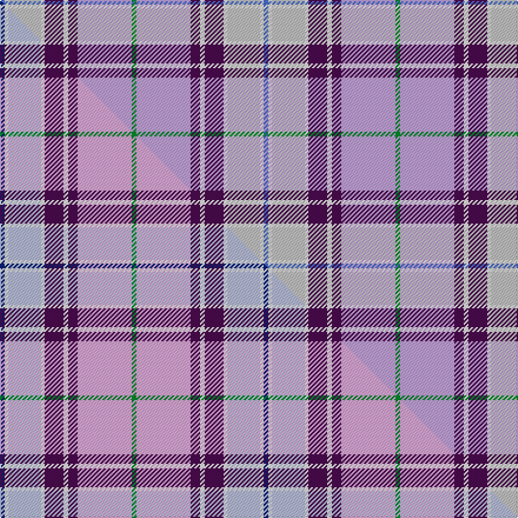

This is one **variant** — a specific cloth: this exact thread count and colourway, with its own
provenance below. It is one weaving of the [sett](/setts/g4lp46dp8w4dp16w3lb28w3b4/) (the scale-free proportion — the
same cloth at any scale or shade), whose colour order is pattern [BWWWBWBWG](/stripes/bwwwbwbwg/).

Part of the [Heather](/tartans/h/he/heather-2/) tartan — the named design grouping this sett with its other cloths.

Sourced from weddslist.  It is a [9 stripe tartan](/stripes/stripes9/).

Original link [http://www.weddslist.com/cgi-bin/tartans/pg.pl?source=sts](http://www.weddslist.com/cgi-bin/tartans/pg.pl?source=sts)

Dataset <small>— provenance for this record, inherited from the source manifest</small>

<dl class="dataset-prov">
<dt>source</dt><dd><a href="/sources/weddslist/">Weddslist</a></dd>
<dt>data captured from</dt><dd><a href="https://github.com/thetartan/tartan-database/blob/master/data/weddslist/data.csv">https://github.com/thetartan/tartan-database/blob/master/data/weddslist/data.csv</a></dd>
<dt>data date</dt><dd>2016-11-17 <small>(dataset default)</small></dd>
<dt>licence</dt><dd><a href="https://creativecommons.org/licenses/by-nc-nd/4.0/">CC BY-NC-ND 4.0</a></dd>
</dl>

Capture chain <small>— the hands this data passed through, oldest first; each capture carries its own licence</small>

<ol class="capture-chain">
<li><a href="https://www.weddslist.com/tartans/">Weddslist</a> <small>the living privately compiled reference</small></li>
<li><a href="https://github.com/thetartan/tartan-database">thetartan/tartan-database</a> <small>2016-2017</small> · <a href="https://creativecommons.org/licenses/by-nc-nd/4.0/">CC BY-NC-ND 4.0</a> <small>Levko Kravets's frozen compilation — the capture we vendored, and where its CC licence text came from</small></li>
<li>this dictionary <small>captured 2026-06-10 · commit 5bf86c7566</small> <small>each re-capture is a git commit to data/sources</small></li>
</ol>

## Thread count
B/4 W3 LB28 W3 DP16 W4 DP8 LP46 G/4

One full sett is **224 threads**.

## Palette
<table><thead><tr><th>Colour</th><th>Shade</th><th>OKLCh</th></tr></thead><tbody><tr><td>B</td><td><code style="background-color:#466CC8;">#466CC8</code> <small style="color:#888">#466CC8</small></td><td><small style="color:#888">oklch(55.1% 0.149 265.0)</small></td></tr><tr><td>G</td><td><code style="background-color:#008B2A;">#008B2A</code> <small style="color:#888">#008B2A</small></td><td><small style="color:#888">oklch(55.4% 0.170 145.9)</small></td></tr><tr><td>W</td><td><code style="background-color:#F7F7F7;">#F7F7F7</code> <small style="color:#888">#F7F7F7</small></td><td><small style="color:#888">oklch(97.6% 0.000 89.9)</small></td></tr><tr><td>LP</td><td><code style="background-color:#C0A0E0;">#C0A0E0</code> <small style="color:#888">#C0A0E0</small></td><td><small style="color:#888">oklch(75.7% 0.096 307.0)</small></td></tr><tr><td>LB</td><td><code style="background-color:#C0C0C0;">#C0C0C0</code> <small style="color:#888">#C0C0C0</small></td><td><small style="color:#888">oklch(80.8% 0.000 89.9)</small></td></tr><tr><td>DP</td><td><code style="background-color:#4B0B4F;">#4B0B4F</code> <small style="color:#888">#4B0B4F</small></td><td><small style="color:#888">oklch(30.1% 0.125 325.4)</small></td></tr></tbody></table>

# Sample pattern

## Compared to the master

This cloth is one sett of its design; the master sett (the exemplar the design is anchored on) is below for comparison.

Its **ΔTartan distance** from the master is **2.22** — the same measure the nearest-tartans table ranks by (0 is identical; a re-scale of the same cloth is near 0, a recolour or a different proportion further).

<figure class="master-compare" style="margin:0">

this sett
master sett ★

<figcaption style="color:#888;font-size:smaller">One weave of this sett against the <a href="/setts/db4w3lb28w3dp16w4dp8lp46g4/">master sett ★</a>, split on the diagonal: a shared proportion runs seamlessly across it with only the shades shifting; a different proportion breaks on it.</figcaption>
</figure>

## Nearest tartan variants

The nearest existing variants by ΔTartan distance, with this cloth at the top so the swatches line up against it.

ΔTartan

Threads

Variant

Sett

—

224

<a href="/variants/s9/g4lp46dp8w4dp16w3lb28w3b4~lp3004302-lb3200000/">Heather, (R.S.S.P.C.C.)</a>

<a href="/ttd/edit/#slug=db4w3lb28w3dp16w4dp8lp46g4&amp;base=g4lp46dp8w4dp16w3lb28w3b4~lp3004302-lb3200000" title="compare in the TTD">2.22</a>

224

<a href="/variants/s9/db4w3lb28w3dp16w4dp8lp46g4/">Heather (R.S.S.P.C.C.) Corporate Tartan</a>

<a href="/ttd/edit/#slug=lb38dp5lb6dp5lb4db20lb38y12w3n30w3n2w7&amp;base=g4lp46dp8w4dp16w3lb28w3b4~lp3004302-lb3200000" title="compare in the TTD">3.14</a>

301

<a href="/variants/s13/lb38dp5lb6dp5lb4db20lb38y12w3n30w3n2w7/">Tom Morris (Official)</a>

<a href="/ttd/edit/#slug=lb36db5g5w2r4w2dr9w22~x2&amp;base=g4lp46dp8w4dp16w3lb28w3b4~lp3004302-lb3200000" title="compare in the TTD">3.20</a>

224

<a href="/variants/s8/lb36db5g5w2r4w2dr9w22~x2/">Jubilee, South Canterbury Centre Piping &amp; Dancing Association</a>

<a href="/ttd/edit/#slug=b36db5g5w2r4w2dr9w22~x2~g2004144-r2308029&amp;base=g4lp46dp8w4dp16w3lb28w3b4~lp3004302-lb3200000" title="compare in the TTD">3.22</a>

224

<a href="/variants/s8/b36db5g5w2r4w2dr9w22~x2~g2004144-r2308029/">South Canterbury Centre P. &amp; D. Assoc., Jubilee</a>

<a href="/ttd/edit/#slug=lb38dp5lb6dp5lb4db20lb38o12w3n30w3n2w7~o2500000-n1900000&amp;base=g4lp46dp8w4dp16w3lb28w3b4~lp3004302-lb3200000" title="compare in the TTD">3.51</a>

301

<a href="/variants/s13/lb38dp5lb6dp5lb4db20lb38o12w3n30w3n2w7~o2500000-n1900000/">Morris, Tom (Corporate)</a>

<a href="/ttd/edit/#slug=lb38db18lb4ly3g10o3g4lb3o17r4~x2~ly3407090-o2503076&amp;base=g4lp46dp8w4dp16w3lb28w3b4~lp3004302-lb3200000" title="compare in the TTD">3.57</a>

332

<a href="/variants/s10/lb38db18lb4lyi3g10ly3g4lb3ly17r4~x2~lyi3407090-ly2503076/">State Seal of Delaware (Fashion)</a>

<a href="/ttd/edit/#slug=lb40db12ly2db2lb2db2g6w21r2lb2~x2&amp;base=g4lp46dp8w4dp16w3lb28w3b4~lp3004302-lb3200000" title="compare in the TTD">3.80</a>

280

<a href="/variants/s10/lb40db12ly2db2lb2db2g6w21r2lb2~x2/">Corryvrechan Dress (Corporate)</a>

<a href="/ttd/edit/#slug=dg1n8lb5n23lb5db3lb5dp3lb5dg5lb3w1~x2&amp;base=g4lp46dp8w4dp16w3lb28w3b4~lp3004302-lb3200000" title="compare in the TTD">3.81</a>

264

<a href="/variants/s12/dg1n8lb5n23lb5db3lb5dp3lb5dg5lb3w1~x2/">Hand Name Tartan</a>

## Neighbour map

Every grey dot is one of 13621 variants placed by the first two principal components of the ΔTartan feature space (42% of its variance). Red is this tartan; blue dots are its nearest — click one to open its page.

<svg viewBox="0 0 640 380" role="img" style="max-width:100%;height:auto;border:1px solid #e0e0e0;border-radius:4px;display:block" xmlns="http://www.w3.org/2000/svg"><image href="/nn/cloud.v1.png" width="640" height="380"/><a href="/variants/s9/db4w3lb28w3dp16w4dp8lp46g4/"><circle cx="217.6" cy="152.5" r="4" fill="#3465a4"><title>Heather (R.S.S.P.C.C.) Corporate Tartan</title></circle></a><a href="/variants/s13/lb38dp5lb6dp5lb4db20lb38y12w3n30w3n2w7/"><circle cx="258.8" cy="144.4" r="4" fill="#3465a4"><title>Tom Morris (Official)</title></circle></a><a href="/variants/s8/lb36db5g5w2r4w2dr9w22~x2/"><circle cx="212.4" cy="142.7" r="4" fill="#3465a4"><title>Jubilee, South Canterbury Centre Piping &amp; Dancing Association</title></circle></a><a href="/variants/s8/b36db5g5w2r4w2dr9w22~x2~g2004144-r2308029/"><circle cx="203.4" cy="139.1" r="4" fill="#3465a4"><title>South Canterbury Centre P. &amp; D. Assoc., Jubilee</title></circle></a><a href="/variants/s13/lb38dp5lb6dp5lb4db20lb38o12w3n30w3n2w7~o2500000-n1900000/"><circle cx="240.2" cy="131.6" r="4" fill="#3465a4"><title>Morris, Tom (Corporate)</title></circle></a><a href="/variants/s10/lb38db18lb4lyi3g10ly3g4lb3ly17r4~x2~lyi3407090-ly2503076/"><circle cx="206.2" cy="155.3" r="4" fill="#3465a4"><title>State Seal of Delaware (Fashion)</title></circle></a><a href="/variants/s10/lb40db12ly2db2lb2db2g6w21r2lb2~x2/"><circle cx="250.3" cy="116.1" r="4" fill="#3465a4"><title>Corryvrechan Dress (Corporate)</title></circle></a><a href="/variants/s12/dg1n8lb5n23lb5db3lb5dp3lb5dg5lb3w1~x2/"><circle cx="282.0" cy="141.9" r="4" fill="#3465a4"><title>Hand Name Tartan</title></circle></a><circle cx="225.1" cy="156.5" r="5" fill="#c00000"/><text x="320" y="376" text-anchor="middle" font-size="11" fill="#999">ground</text><text x="11" y="190" text-anchor="middle" font-size="11" fill="#999" transform="rotate(-90 11 190)">complexity</text></svg>

ID: /variants/s9/g4lp46dp8w4dp16w3lb28w3b4~lp3004302-lb3200000/
