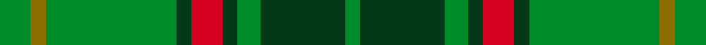

This is one **variant** — a specific cloth: this exact thread count and colourway, with its own
provenance below. It is one weaving of the [sett](/setts/g4y2g17dg2r4dg2g3dg11g2/) (the scale-free proportion — the
same cloth at any scale or shade), whose colour order is pattern [GGGGRGGGG](/stripes/ggggrgggg/).

Part of the [Armagh](/tartans/a/ar/armagh/) tartan — the named design grouping this sett with its other cloths.

Sourced from house-of-tartan.  It is a [9 stripe tartan](/stripes/stripes9/).

Original link [http://www.house-of-tartan.scotland.net/house/TartanViewjs.asp?colr=Def&tnam=2276](http://www.house-of-tartan.scotland.net/house/TartanViewjs.asp?colr=Def&tnam=2276)

## Provenance

Earliest known date: 1996 One of a series of Irish District tartans designed by Polly Wittering of the House of Edgar, with colours reminiscent of the Country with soft warm colours dominating.

2 attestations — the source records this cloth was collapsed from (oldest owns this page)

<ul>
<li>1996 — Armagh Irish County Tartan (house-of-tartan, <a href="http://www.house-of-tartan.scotland.net/house/TartanViewjs.asp?colr=Def&tnam=2276">record</a>) </li>
<li>undated — Armagh (weddslist, <a href="http://www.weddslist.com/cgi-bin/tartans/pg.pl?source=sts">record</a>) </li>
</ul>

Dataset <small>— provenance for this record, inherited from the source manifest</small>

<dl class="dataset-prov">
<dt>source</dt><dd><a href="/sources/house-of-tartan/">House of Tartan</a></dd>
<dt>data captured from</dt><dd><a href="https://github.com/thetartan/tartan-database/blob/master/data/house-of-tartan/data.csv">https://github.com/thetartan/tartan-database/blob/master/data/house-of-tartan/data.csv</a></dd>
<dt>data date</dt><dd>1996 <small>(this record)</small></dd>
<dt>licence</dt><dd><a href="https://creativecommons.org/licenses/by-nc-nd/4.0/">CC BY-NC-ND 4.0</a></dd>
</dl>

Capture chain <small>— the hands this data passed through, oldest first; each capture carries its own licence</small>

<ol class="capture-chain">
<li><a href="http://www.house-of-tartan.scotland.net/">House of Tartan</a> <small>the weaver/retailer's database — the site is now offline; the URL is kept as the ultimate source's identity</small></li>
<li><a href="https://github.com/thetartan/tartan-database">thetartan/tartan-database</a> <small>2016-2017</small> · <a href="https://creativecommons.org/licenses/by-nc-nd/4.0/">CC BY-NC-ND 4.0</a> <small>Levko Kravets's frozen compilation — the capture we vendored, and where its CC licence text came from</small></li>
<li>this dictionary <small>captured 2026-06-10 · commit 5bf86c7566</small> <small>each re-capture is a git commit to data/sources</small></li>
</ol>

## Thread count
G/8 Y4 G34 DG4 R8 DG4 G6 DG22 G/4

One full sett is **176 threads**.

## Palette
<table><thead><tr><th>Colour</th><th>Shade</th><th>OKLCh</th></tr></thead><tbody><tr><td>DG</td><td><code style="background-color:#053819;">#053819</code> <small style="color:#888">#053819</small></td><td><small style="color:#888">oklch(30.0% 0.075 151.3)</small></td></tr><tr><td>R</td><td><code style="background-color:#D60020;">#D60020</code> <small style="color:#888">#D60020</small></td><td><small style="color:#888">oklch(55.2% 0.224 25.5)</small></td></tr><tr><td>G</td><td><code style="background-color:#008B2A;">#008B2A</code> <small style="color:#888">#008B2A</small></td><td><small style="color:#888">oklch(55.4% 0.170 145.9)</small></td></tr><tr><td>Y</td><td><code style="background-color:#8B6E00;">#8B6E00</code> <small style="color:#888">#8B6E00</small></td><td><small style="color:#888">oklch(55.1% 0.113 90.4)</small></td></tr></tbody></table>

# Sample pattern

## Nearest tartan variants

The nearest existing variants by ΔTartan distance, with this cloth at the top so the swatches line up against it.

ΔTartan

Threads

Variant

Sett

—

176

<a href="/variants/s9/g4y2g17dg2r4dg2g3dg11g2~x2/">Armagh Irish County Tartan</a>

<a href="/ttd/edit/#slug=r3g8r2g18dr5g3do3g3do16g3do3g3~x2&amp;base=g4y2g17dg2r4dg2g3dg11g2~x2" title="compare in the TTD">2.26</a>

268

<a href="/variants/s12/r3g8r2g18dr5g3do3g3do16g3do3g3~x2/">Dublin</a>

<a href="/ttd/edit/#slug=r2dg19g2dg2g19dg2y2~x2&amp;base=g4y2g17dg2r4dg2g3dg11g2~x2" title="compare in the TTD">2.36</a>

184

<a href="/variants/s7/r2dg19g2dg2g19dg2y2~x2/">Hunting Kenmore</a>

<a href="/ttd/edit/#slug=db3o7g2r2g14o2g2db3~x2&amp;base=g4y2g17dg2r4dg2g3dg11g2~x2" title="compare in the TTD">2.62</a>

128

<a href="/variants/s8/db3o7g2r2g14o2g2db3~x2/">Daks, Tartan-Loden</a>

<a href="/ttd/edit/#slug=g24r9g4dg19y2dg6g7~x2&amp;base=g4y2g17dg2r4dg2g3dg11g2~x2" title="compare in the TTD">2.82</a>

222

<a href="/variants/s7/g24r9g4dg19y2dg6g7~x2/">Doyle</a>

<a href="/ttd/edit/#slug=g14y7g14dg50g64w6g7&amp;base=g4y2g17dg2r4dg2g3dg11g2~x2" title="compare in the TTD">3.15</a>

303

<a href="/variants/s7/g14y7g14dg50g64w6g7/">Freedom of Derry</a>

<a href="/ttd/edit/#slug=dt16g4dt3g3lo2g24dr2~x2&amp;base=g4y2g17dg2r4dg2g3dg11g2~x2" title="compare in the TTD">3.18</a>

180

<a href="/variants/s7/dt16g4dt3g3lo2g24dr2~x2/">St. Andrews Links (Corporate)</a>

<a href="/ttd/edit/#slug=r5dt12g3db4g20dt3g3r5~x4&amp;base=g4y2g17dg2r4dg2g3dg11g2~x2" title="compare in the TTD">3.29</a>

400

<a href="/variants/s8/r5dt12g3db4g20dt3g3r5~x4/">Daks (0600150)</a>

<a href="/ttd/edit/#slug=g1dy8g8r1g8dy8w1~x4&amp;base=g4y2g17dg2r4dg2g3dg11g2~x2" title="compare in the TTD">3.32</a>

272

<a href="/variants/s7/g1dy8g8r1g8dy8w1~x4/">MacKinnon Htg (Clan)</a>

<a href="/ttd/edit/#slug=g1dy8g8r1g8dy8w1~x2&amp;base=g4y2g17dg2r4dg2g3dg11g2~x2" title="compare in the TTD">3.32</a>

136

<a href="/variants/s7/g1dy8g8r1g8dy8w1~x2/">MacKinnon Hunting Clan Tartan</a>

<a href="/ttd/edit/#slug=g24dp3g3dp3g3dp7dg20r3~x2&amp;base=g4y2g17dg2r4dg2g3dg11g2~x2" title="compare in the TTD">3.35</a>

210

<a href="/variants/s8/g24dp3g3dp3g3dp7dg20r3~x2/">Crantock Trade Tartan</a>

## Neighbour map

Every grey dot is one of 13621 variants placed by the first two principal components of the ΔTartan feature space (42% of its variance). Red is this tartan; blue dots are its nearest — click one to open its page. The map is a flat projection of a many-dimensional space — [how to read it](/posts/neighbourhood-maps/).

<svg viewBox="0 0 640 380" role="img" style="max-width:100%;height:auto;border:1px solid #e0e0e0;border-radius:4px;display:block" xmlns="http://www.w3.org/2000/svg"><image href="/nn/cloud.v1.png" width="640" height="380"/><a href="/variants/s12/r3g8r2g18dr5g3do3g3do16g3do3g3~x2/"><circle cx="318.2" cy="202.4" r="4" fill="#3465a4"><title>Dublin</title></circle></a><a href="/variants/s7/r2dg19g2dg2g19dg2y2~x2/"><circle cx="354.2" cy="218.1" r="4" fill="#3465a4"><title>Hunting Kenmore</title></circle></a><a href="/variants/s8/db3o7g2r2g14o2g2db3~x2/"><circle cx="297.5" cy="227.8" r="4" fill="#3465a4"><title>Daks, Tartan-Loden</title></circle></a><a href="/variants/s7/g24r9g4dg19y2dg6g7~x2/"><circle cx="309.4" cy="230.2" r="4" fill="#3465a4"><title>Doyle</title></circle></a><a href="/variants/s7/g14y7g14dg50g64w6g7/"><circle cx="406.6" cy="233.5" r="4" fill="#3465a4"><title>Freedom of Derry</title></circle></a><a href="/variants/s7/dt16g4dt3g3lo2g24dr2~x2/"><circle cx="400.7" cy="222.1" r="4" fill="#3465a4"><title>St. Andrews Links (Corporate)</title></circle></a><a href="/variants/s8/r5dt12g3db4g20dt3g3r5~x4/"><circle cx="247.7" cy="228.1" r="4" fill="#3465a4"><title>Daks (0600150)</title></circle></a><a href="/variants/s7/g1dy8g8r1g8dy8w1~x4/"><circle cx="296.9" cy="244.3" r="4" fill="#3465a4"><title>MacKinnon Htg (Clan)</title></circle></a><a href="/variants/s7/g1dy8g8r1g8dy8w1~x2/"><circle cx="296.9" cy="244.3" r="4" fill="#3465a4"><title>MacKinnon Hunting Clan Tartan</title></circle></a><a href="/variants/s8/g24dp3g3dp3g3dp7dg20r3~x2/"><circle cx="274.3" cy="216.9" r="4" fill="#3465a4"><title>Crantock Trade Tartan</title></circle></a><circle cx="347.3" cy="220.1" r="5" fill="#c00000"/><text x="320" y="376" text-anchor="middle" font-size="11" fill="#999">ground</text><text x="11" y="190" text-anchor="middle" font-size="11" fill="#999" transform="rotate(-90 11 190)">complexity</text></svg>

ID: /variants/s9/g4y2g17dg2r4dg2g3dg11g2~x2/
