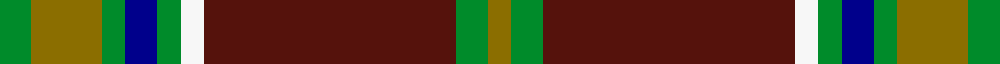

This page is one **sett** — a single exact thread-count. It belongs to the [tartan](/setts/g4y9g3db4g3w3dr32g4y3/)
(the same proportion at any scale), whose colour order is pattern [GGBWGBGGG](/stripes/ggbwgbggg/).

Sourced from register-of-tartans.  It is a [9 stripe tartan](/stripes/stripes9/).

Original link https://www.tartanregister.gov.uk/tartanDetails.aspx?ref=4919

## Register references

External register numbers recorded for this tartan.

- Scottish Register of Tartans: [4919](https://www.tartanregister.gov.uk/tartanDetails.aspx?ref=4919)
- Scottish Tartans Authority (ITI): 7448
- Scottish Tartans World Register: 3074

## Thread count
G/8 Y18 G6 DB8 G6 W6 DR64 G8 Y/6

One full sett is **246 threads**.

## Palette
<table><thead><tr><th>Colour</th><th>Shade</th><th>OKLCh</th></tr></thead><tbody><tr><td>DB</td><td><code style="background-color:#2C2C80;">#2C2C80</code> <small style="color:#888">#2C2C80</small></td><td><small style="color:#888">oklch(35.0% 0.138 276.6)</small></td></tr><tr><td>DB</td><td><code style="background-color:#00008B;">#00008B</code> <small style="color:#888">#00008B</small></td><td><small style="color:#888">oklch(28.8% 0.199 264.1)</small></td></tr><tr><td>DR</td><td><code style="background-color:#55120C;">#55120C</code> <small style="color:#888">#55120C</small></td><td><small style="color:#888">oklch(30.0% 0.099 29.3)</small></td></tr><tr><td>G</td><td><code style="background-color:#008B2A;">#008B2A</code> <small style="color:#888">#008B2A</small></td><td><small style="color:#888">oklch(55.4% 0.170 145.9)</small></td></tr><tr><td>W</td><td><code style="background-color:#F7F7F7;">#F7F7F7</code> <small style="color:#888">#F7F7F7</small></td><td><small style="color:#888">oklch(97.6% 0.000 89.9)</small></td></tr><tr><td>R</td><td><code style="background-color:#D60020;">#D60020</code> <small style="color:#888">#D60020</small></td><td><small style="color:#888">oklch(55.2% 0.224 25.5)</small></td></tr><tr><td>Y</td><td><code style="background-color:#8B6E00;">#8B6E00</code> <small style="color:#888">#8B6E00</small></td><td><small style="color:#888">oklch(55.1% 0.113 90.4)</small></td></tr></tbody></table>

# Sample pattern

ID: /variants/s9/g4y9g3db4g3w3dr32g4y3~x2~db1208266/
