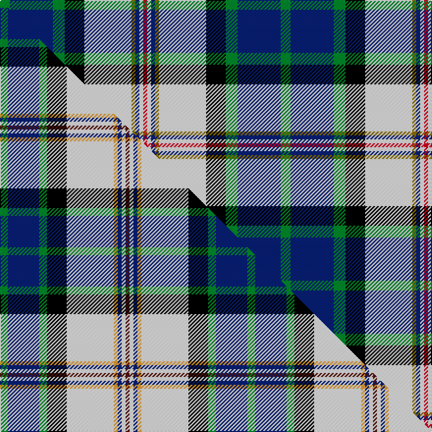

This page is one **sett** — a single exact thread-count. It belongs to the [tartan](/setts/g5db22g6k10w24y2db2w2r2/)
(the same proportion at any scale), whose colour order is pattern [GBGKWGBWR](/stripes/gbgkwgbwr/).

Part of the [Haymarket Dress](/tartans/haymarket-dress/) tartan — the named design grouping this sett with its other cloths.

Sourced from weddslist.  It is a [9 stripe tartan](/stripes/stripes9/).

Original link http://www.weddslist.com/cgi-bin/tartans/pg.pl?source=sts

## Provenance

Earliest known date: pre 1992 One of a number of dress tartans produced by Hugh Macpherson, a kiltmaker in Edinburgh, whose shop is a short walk from Haymarket railway station.

2 attestations — the source records this cloth was collapsed from (oldest owns this page)

<ul>
<li>undated — Haymarket, dress Blue (weddslist, <a href="http://www.weddslist.com/cgi-bin/tartans/pg.pl?source=sts">record</a>) </li>
<li>undated — Haymarket Dress Blue Trade Tartan (house-of-tartan, <a href="http://www.house-of-tartan.scotland.net/house/TartanViewjs.asp?colr=Def&tnam=713">record</a>) </li>
</ul>

Dataset <small>— provenance for this record, inherited from the source manifest</small>

<dl class="dataset-prov">
<dt>source</dt><dd><a href="/sources/weddslist/">Weddslist</a></dd>
<dt>data captured from</dt><dd><a href="https://github.com/thetartan/tartan-database/blob/master/data/weddslist/data.csv">https://github.com/thetartan/tartan-database/blob/master/data/weddslist/data.csv</a></dd>
<dt>data date</dt><dd>2016-11-17 <small>(dataset default)</small></dd>
<dt>licence</dt><dd><a href="https://creativecommons.org/licenses/by-nc-nd/4.0/">CC BY-NC-ND 4.0</a></dd>
</dl>

Capture chain <small>— the hands this data passed through, oldest first; each capture carries its own licence</small>

<ol class="capture-chain">
<li><a href="https://www.weddslist.com/tartans/">Weddslist</a> <small>the living privately compiled reference</small></li>
<li><a href="https://github.com/thetartan/tartan-database">thetartan/tartan-database</a> <small>2016-2017</small> · <a href="https://creativecommons.org/licenses/by-nc-nd/4.0/">CC BY-NC-ND 4.0</a> <small>Levko Kravets's frozen compilation — the capture we vendored, and where its CC licence text came from</small></li>
<li>this dictionary <small>captured 2026-06-10 · commit 5bf86c7566</small> <small>each re-capture is a git commit to data/sources</small></li>
</ol>

## Thread count
G/10 DB44 G12 K20 W48 Y4 DB4 W4 R/4

One full sett is **286 threads**.

## Palette
<table><thead><tr><th>Colour</th><th>Shade</th><th>OKLCh</th></tr></thead><tbody><tr><td>DB</td><td><code style="background-color:#082077;">#082077</code> <small style="color:#888">#082077</small></td><td><small style="color:#888">oklch(30.0% 0.149 265.1)</small></td></tr><tr><td>G</td><td><code style="background-color:#008B2A;">#008B2A</code> <small style="color:#888">#008B2A</small></td><td><small style="color:#888">oklch(55.4% 0.170 145.9)</small></td></tr><tr><td>K</td><td><code style="background-color:#000000;">#000000</code> <small style="color:#888">#000000</small></td><td><small style="color:#888">oklch(0.0% 0.000 0.0)</small></td></tr><tr><td>W</td><td><code style="background-color:#F7F7F7;">#F7F7F7</code> <small style="color:#888">#F7F7F7</small></td><td><small style="color:#888">oklch(97.6% 0.000 89.9)</small></td></tr><tr><td>R</td><td><code style="background-color:#D60020;">#D60020</code> <small style="color:#888">#D60020</small></td><td><small style="color:#888">oklch(55.2% 0.224 25.5)</small></td></tr><tr><td>Y</td><td><code style="background-color:#8B6E00;">#8B6E00</code> <small style="color:#888">#8B6E00</small></td><td><small style="color:#888">oklch(55.1% 0.113 90.4)</small></td></tr></tbody></table>

# Sample pattern

## Compared to the master

This cloth is one sett of its design; the master sett (the exemplar the design is anchored on) is below for comparison.

Its **ΔTartan distance** from the master is **0.62** — the same measure the nearest-tartans table ranks by (0 is identical; a re-scale of the same cloth is near 0, a recolour or a different proportion further).

<figure class="master-compare" style="margin:0">

this sett
master sett ★

<figcaption style="color:#888;font-size:smaller">One weave of this sett against the <a href="/setts/g2db8g2k5w12lo1db1w1dr1/">master sett ★</a>, split on the diagonal: a shared proportion runs seamlessly across it with only the shades shifting; a different proportion breaks on it.</figcaption>
</figure>

## Nearest tartan variants

The nearest existing variants by ΔTartan distance, with this cloth at the top so the swatches line up against it.

ΔTartan

Threads

Variant

Sett

—

286

<a href="/variants/s9/g5db22g6k10w24y2db2w2r2~x2/">Haymarket, dress Blue</a>

<a href="/ttd/edit/#slug=g2db8g2k5w12lo1db1w1dr1~x4&amp;base=g5db22g6k10w24y2db2w2r2~x2" title="compare in the TTD">0.62</a>

252

<a href="/variants/s9/g2db8g2k5w12lo1db1w1dr1~x4/">Haymarket Dress (Dance)</a>

<a href="/ttd/edit/#slug=w3lb26db13k13w2g8k5r3lb3~x2&amp;base=g5db22g6k10w24y2db2w2r2~x2" title="compare in the TTD">1.39</a>

292

<a href="/variants/s9/w3lb26db13k13w2g8k5r3lb3~x2/">Moran (Virgin Islands) (Personal)</a>

<a href="/ttd/edit/#slug=y4db25g3k3g3k3g13w24k2r3~x2&amp;base=g5db22g6k10w24y2db2w2r2~x2" title="compare in the TTD">1.75</a>

318

<a href="/variants/s10/y4db25g3k3g3k3g13w24k2r3~x2/">MacLeod, Californian</a>

<a href="/ttd/edit/#slug=lb26db13k13w2g8k5r3lb3~x2&amp;base=g5db22g6k10w24y2db2w2r2~x2" title="compare in the TTD">1.89</a>

234

<a href="/variants/s8/lb26db13k13w2g8k5r3lb3~x2/">Moran (Coilessan) (Personal)</a>

<a href="/ttd/edit/#slug=y4db22g3k3g3k3g12w22k2r3~x2&amp;base=g5db22g6k10w24y2db2w2r2~x2" title="compare in the TTD">1.99</a>

294

<a href="/variants/s10/y4db22g3k3g3k3g12w22k2r3~x2/">Californian MacLeod</a>

<a href="/ttd/edit/#slug=lb34r3lb8db4lb8k24g34k2w6&amp;base=g5db22g6k10w24y2db2w2r2~x2" title="compare in the TTD">2.26</a>

206

<a href="/variants/s9/lb34r3lb8db4lb8k24g34k2w6/">Hogg Dress</a>

<a href="/ttd/edit/#slug=k16w6k4b64m19k8g42y6&amp;base=g5db22g6k10w24y2db2w2r2~x2" title="compare in the TTD">2.26</a>

308

<a href="/variants/s8/k16w6k4b64m19k8g42y6/">Unidentified (Woven sample)</a>

<a href="/ttd/edit/#slug=dp4k2w3k2db30g9k4w20dy3~x2~g2408144&amp;base=g5db22g6k10w24y2db2w2r2~x2" title="compare in the TTD">2.32</a>

294

<a href="/variants/s9/dp4k2w3k2db30g9k4w20dy3~x2~g2408144/">Minnesota Dress American District Tartan</a>

<a href="/ttd/edit/#slug=ly5lb14k3ly7g3k3g7k6db24w3~x2&amp;base=g5db22g6k10w24y2db2w2r2~x2" title="compare in the TTD">2.33</a>

284

<a href="/variants/s10/ly5lb14k3ly7g3k3g7k6db24w3~x2/">Kagame (Personal)</a>

<a href="/ttd/edit/#slug=dp4k2w3k2db30g9k4w20dy3~x2&amp;base=g5db22g6k10w24y2db2w2r2~x2" title="compare in the TTD">2.33</a>

294

<a href="/variants/s9/dp4k2w3k2db30g9k4w20dy3~x2/">Minnesota Dress</a>

## Neighbour map

Every grey dot is one of 13620 variants placed by the first two principal components of the ΔTartan feature space (42% of its variance). Red is this tartan; blue dots are its nearest — click one to open its page.

<svg viewBox="0 0 640 380" role="img" style="max-width:100%;height:auto;border:1px solid #e0e0e0;border-radius:4px;display:block" xmlns="http://www.w3.org/2000/svg"><image href="/nn/cloud.v1.png" width="640" height="380"/><a href="/variants/s9/g2db8g2k5w12lo1db1w1dr1~x4/"><circle cx="104.5" cy="105.9" r="4" fill="#3465a4"><title>Haymarket Dress (Dance)</title></circle></a><a href="/variants/s9/w3lb26db13k13w2g8k5r3lb3~x2/"><circle cx="95.1" cy="132.8" r="4" fill="#3465a4"><title>Moran (Virgin Islands) (Personal)</title></circle></a><a href="/variants/s10/y4db25g3k3g3k3g13w24k2r3~x2/"><circle cx="72.8" cy="121.5" r="4" fill="#3465a4"><title>MacLeod, Californian</title></circle></a><a href="/variants/s8/lb26db13k13w2g8k5r3lb3~x2/"><circle cx="106.3" cy="141.0" r="4" fill="#3465a4"><title>Moran (Coilessan) (Personal)</title></circle></a><a href="/variants/s10/y4db22g3k3g3k3g12w22k2r3~x2/"><circle cx="59.1" cy="129.9" r="4" fill="#3465a4"><title>Californian MacLeod</title></circle></a><a href="/variants/s9/lb34r3lb8db4lb8k24g34k2w6/"><circle cx="129.4" cy="123.6" r="4" fill="#3465a4"><title>Hogg Dress</title></circle></a><a href="/variants/s8/k16w6k4b64m19k8g42y6/"><circle cx="135.1" cy="128.3" r="4" fill="#3465a4"><title>Unidentified (Woven sample)</title></circle></a><a href="/variants/s9/dp4k2w3k2db30g9k4w20dy3~x2~g2408144/"><circle cx="122.6" cy="113.9" r="4" fill="#3465a4"><title>Minnesota Dress American District Tartan</title></circle></a><a href="/variants/s10/ly5lb14k3ly7g3k3g7k6db24w3~x2/"><circle cx="47.3" cy="153.4" r="4" fill="#3465a4"><title>Kagame (Personal)</title></circle></a><a href="/variants/s9/dp4k2w3k2db30g9k4w20dy3~x2/"><circle cx="123.2" cy="113.9" r="4" fill="#3465a4"><title>Minnesota Dress</title></circle></a><circle cx="93.1" cy="130.0" r="5" fill="#c00000"/><text x="320" y="376" text-anchor="middle" font-size="11" fill="#999">ground</text><text x="11" y="190" text-anchor="middle" font-size="11" fill="#999" transform="rotate(-90 11 190)">complexity</text></svg>

ID: /variants/s9/g5db22g6k10w24y2db2w2r2~x2/
