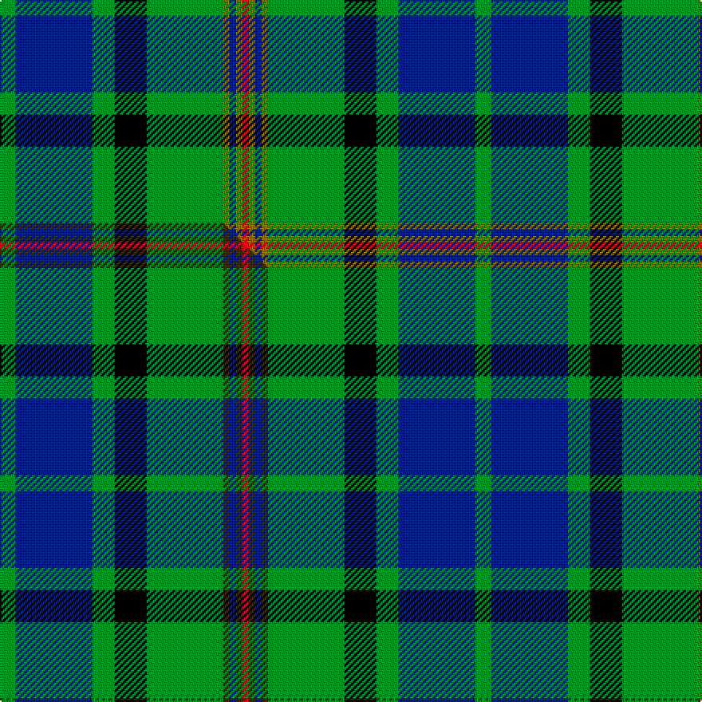

This page is one **sett** — a single exact thread-count. It belongs to the [tartan](/setts/g5db24g7k10g24y2db2y2r2/)
(the same proportion at any scale), whose colour order is pattern [GBGKGGBGR](/stripes/gbgkggbgr/).

Part of the [Maitland](/tartans/maitland/) tartan — the named design grouping this sett with its other cloths.

Sourced from weddslist.  It is a [9 stripe tartan](/stripes/stripes9/).

Original link http://www.weddslist.com/cgi-bin/tartans/pg.pl?source=sts

## Provenance

Earliest known date: 1960 This sett shows the increased proportions of green and blue of the manufactured tartan. The Lyon Court Book (entry number 10) gives the largest green 18 threads and the blue only 16. The entry was recorded on the 18th August 1960 and is restricted for the use of the chief. The Maitlands are a Lowland family, Dukes of Lauderdale and the Hereditary Saltire Banner Bearers of Scotland.

2 attestations — the source records this cloth was collapsed from (oldest owns this page)

<ul>
<li>undated — Maitland (weddslist, <a href="http://www.weddslist.com/cgi-bin/tartans/pg.pl?source=sts">record</a>) </li>
<li>undated — Maitland Chiefs own Tartan (house-of-tartan, <a href="http://www.house-of-tartan.scotland.net/house/TartanViewjs.asp?colr=Def&tnam=714">record</a>) </li>
</ul>

## Thread count
G/10 DB48 G14 K20 G48 Y4 DB4 Y4 R/4

One full sett is **298 threads**.

## Palette
<table><thead><tr><th>Colour</th><th>Shade</th><th>OKLCh</th></tr></thead><tbody><tr><td>DB</td><td><code style="background-color:#082077;">#082077</code> <small style="color:#888">#082077</small></td><td><small style="color:#888">oklch(30.0% 0.149 265.1)</small></td></tr><tr><td>G</td><td><code style="background-color:#008B2A;">#008B2A</code> <small style="color:#888">#008B2A</small></td><td><small style="color:#888">oklch(55.4% 0.170 145.9)</small></td></tr><tr><td>K</td><td><code style="background-color:#000000;">#000000</code> <small style="color:#888">#000000</small></td><td><small style="color:#888">oklch(0.0% 0.000 0.0)</small></td></tr><tr><td>R</td><td><code style="background-color:#D60020;">#D60020</code> <small style="color:#888">#D60020</small></td><td><small style="color:#888">oklch(55.2% 0.224 25.5)</small></td></tr><tr><td>Y</td><td><code style="background-color:#8B6E00;">#8B6E00</code> <small style="color:#888">#8B6E00</small></td><td><small style="color:#888">oklch(55.1% 0.113 90.4)</small></td></tr></tbody></table>

# Sample pattern

## Compared to the master

This cloth is one sett of its design; the master sett (the exemplar the design is anchored on) is below for comparison.

Its **ΔTartan distance** from the master is **0.03** — the same measure the nearest-tartans table ranks by (0 is identical; a re-scale of the same cloth is near 0, a recolour or a different proportion further).

<figure class="master-compare" style="margin:0">

this sett
master sett ★

<figcaption style="color:#888;font-size:smaller">One weave of this sett against the <a href="/setts/g5db24g7k10g24dy2db2dy2r2/">master sett ★</a>, split on the diagonal: a shared proportion runs seamlessly across it with only the shades shifting; a different proportion breaks on it.</figcaption>
</figure>

## Nearest tartan variants

The nearest existing variants by ΔTartan distance, with this cloth at the top so the swatches line up against it.

ΔTartan

Threads

Variant

Sett

—

298

<a href="/variants/s9/g5db24g7k10g24y2db2y2r2~x2/">Maitland</a>

<a href="/ttd/edit/#slug=g5db24g7k10g24dy2db2dy2r2~x2&amp;base=g5db24g7k10g24y2db2y2r2~x2" title="compare in the TTD">0.03</a>

298

<a href="/variants/s9/g5db24g7k10g24dy2db2dy2r2~x2/">Maitland Chief</a>

<a href="/ttd/edit/#slug=g6k2g24k10db2o2db2o2db10k2lb3~x2&amp;base=g5db24g7k10g24y2db2y2r2~x2" title="compare in the TTD">1.62</a>

242

<a href="/variants/s11/g6k2g24k10db2o2db2o2db10k2lb3~x2/">Scottish Rugby Union (City of Nagasaki)</a>

<a href="/ttd/edit/#slug=k3r1y1db11g13db5r1y1~x2&amp;base=g5db24g7k10g24y2db2y2r2~x2" title="compare in the TTD">1.65</a>

136

<a href="/variants/s8/k3r1y1db11g13db5r1y1~x2/">Snodgrass</a>

<a href="/ttd/edit/#slug=g16k1lb2k1g3k5db12k1y1k3~x4&amp;base=g5db24g7k10g24y2db2y2r2~x2" title="compare in the TTD">1.88</a>

284

<a href="/variants/s10/g16k1lb2k1g3k5db12k1y1k3~x4/">Hope-Vere (Lochcarron)</a>

<a href="/ttd/edit/#slug=g8w1g1dr1g4k4db8k1db1k1~x4&amp;base=g5db24g7k10g24y2db2y2r2~x2" title="compare in the TTD">1.88</a>

204

<a href="/variants/s10/g8w1g1dr1g4k4db8k1db1k1~x4/">Allen (1996)</a>

<a href="/ttd/edit/#slug=r4db11k3db3k3db4k15g36w3~x2&amp;base=g5db24g7k10g24y2db2y2r2~x2" title="compare in the TTD">1.88</a>

314

<a href="/variants/s9/r4db11k3db3k3db4k15g36w3~x2/">Semple</a>

<a href="/ttd/edit/#slug=g8w1g1r1g4k4db8k1db1k1~x2&amp;base=g5db24g7k10g24y2db2y2r2~x2" title="compare in the TTD">1.92</a>

102

<a href="/variants/s10/g8w1g1r1g4k4db8k1db1k1~x2/">Scott #2</a>

<a href="/ttd/edit/#slug=t11k4g4o1g4k1r1~x4&amp;base=g5db24g7k10g24y2db2y2r2~x2" title="compare in the TTD">1.96</a>

160

<a href="/variants/s7/t11k4g4o1g4k1r1~x4/">Ednie (Personal)</a>

<a href="/ttd/edit/#slug=g35k3dbi26k4db4w3~x2~dbi1406275-db1106275&amp;base=g5db24g7k10g24y2db2y2r2~x2" title="compare in the TTD">2.00</a>

224

<a href="/variants/s6/g35k3dbi26k4db4w3~x2~dbi1406275-db1106275/">Pride of Yorkland (Fashion)</a>

<a href="/ttd/edit/#slug=dp4lb2dp2lb8k3dp8dg3dp4dg24g2~x2~dg1806142-g2408144&amp;base=g5db24g7k10g24y2db2y2r2~x2" title="compare in the TTD">2.09</a>

228

<a href="/variants/s10/dp4lb2dp2lb8k3dp8dg3dp4dg24g2~x2~dg1806142-g2408144/">Jones Htg (Name)</a>

## Neighbour map

Every grey dot is one of 13620 variants placed by the first two principal components of the ΔTartan feature space (42% of its variance). Red is this tartan; blue dots are its nearest — click one to open its page.

<svg viewBox="0 0 640 380" role="img" style="max-width:100%;height:auto;border:1px solid #e0e0e0;border-radius:4px;display:block" xmlns="http://www.w3.org/2000/svg"><image href="/nn/cloud.v1.png" width="640" height="380"/><a href="/variants/s9/g5db24g7k10g24dy2db2dy2r2~x2/"><circle cx="205.9" cy="154.8" r="4" fill="#3465a4"><title>Maitland Chief</title></circle></a><a href="/variants/s11/g6k2g24k10db2o2db2o2db10k2lb3~x2/"><circle cx="178.9" cy="133.9" r="4" fill="#3465a4"><title>Scottish Rugby Union (City of Nagasaki)</title></circle></a><a href="/variants/s8/k3r1y1db11g13db5r1y1~x2/"><circle cx="209.4" cy="153.3" r="4" fill="#3465a4"><title>Snodgrass</title></circle></a><a href="/variants/s10/g16k1lb2k1g3k5db12k1y1k3~x4/"><circle cx="178.2" cy="126.6" r="4" fill="#3465a4"><title>Hope-Vere (Lochcarron)</title></circle></a><a href="/variants/s10/g8w1g1dr1g4k4db8k1db1k1~x4/"><circle cx="154.8" cy="166.7" r="4" fill="#3465a4"><title>Allen (1996)</title></circle></a><a href="/variants/s9/r4db11k3db3k3db4k15g36w3~x2/"><circle cx="174.7" cy="138.0" r="4" fill="#3465a4"><title>Semple</title></circle></a><a href="/variants/s10/g8w1g1r1g4k4db8k1db1k1~x2/"><circle cx="152.0" cy="165.0" r="4" fill="#3465a4"><title>Scott #2</title></circle></a><a href="/variants/s7/t11k4g4o1g4k1r1~x4/"><circle cx="173.6" cy="175.4" r="4" fill="#3465a4"><title>Ednie (Personal)</title></circle></a><a href="/variants/s6/g35k3dbi26k4db4w3~x2~dbi1406275-db1106275/"><circle cx="219.4" cy="168.0" r="4" fill="#3465a4"><title>Pride of Yorkland (Fashion)</title></circle></a><a href="/variants/s10/dp4lb2dp2lb8k3dp8dg3dp4dg24g2~x2~dg1806142-g2408144/"><circle cx="206.1" cy="146.2" r="4" fill="#3465a4"><title>Jones Htg (Name)</title></circle></a><circle cx="204.5" cy="154.5" r="5" fill="#c00000"/><text x="320" y="376" text-anchor="middle" font-size="11" fill="#999">ground</text><text x="11" y="190" text-anchor="middle" font-size="11" fill="#999" transform="rotate(-90 11 190)">complexity</text></svg>

ID: /variants/s9/g5db24g7k10g24y2db2y2r2~x2/
