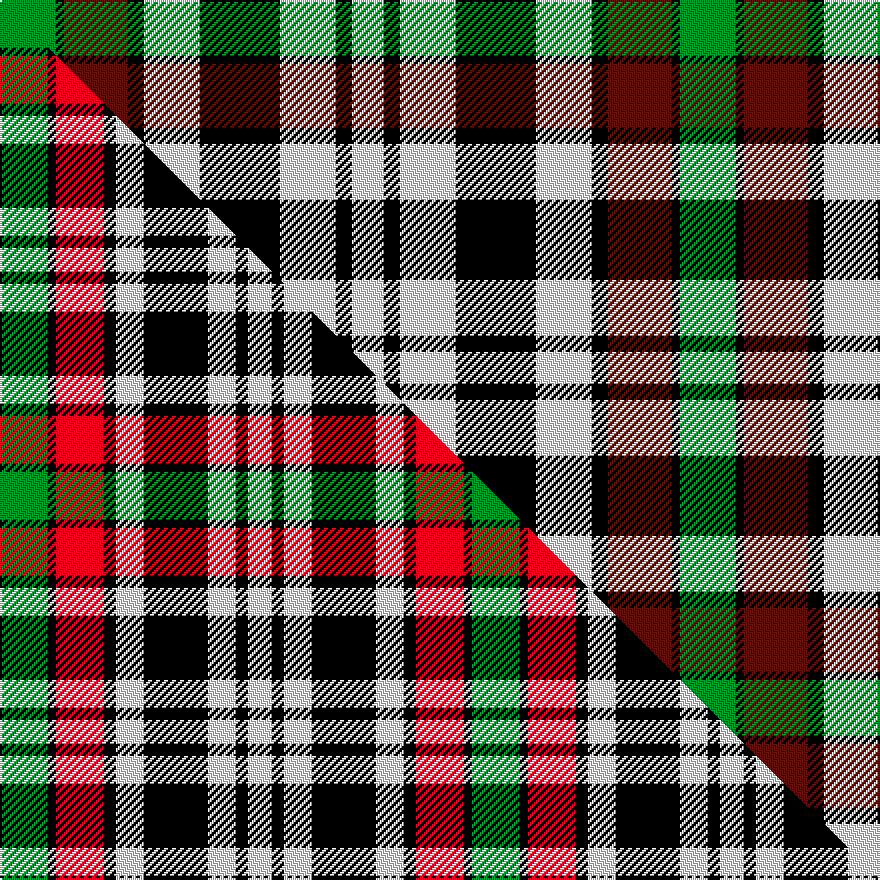

This page is one **sett** — a single exact thread-count. It belongs to the [tartan](/setts/g7k1dr8k2w7k10w7k2w4/)
(the same proportion at any scale), whose colour order is pattern [GKBKWKWKW](/stripes/gkbkwkwkw/).

Part of the [Borthwick Dress](/tartans/borthwick-dress/) tartan — the named design grouping this sett with its other cloths.

Sourced from tartans-authority.  It is a [9 stripe tartan](/stripes/stripes9/).

Original link [https://www.tartanregister.gov.uk/tartanDetails.aspx?ref=820](https://www.tartanregister.gov.uk/tartanDetails.aspx?ref=820)

Dataset <small>— provenance for this record, inherited from the source manifest</small>

<dl class="dataset-prov">
<dt>source</dt><dd><a href="/sources/tartans-authority/">Scottish Tartans Authority</a></dd>
<dt>data captured from</dt><dd><a href="https://github.com/thetartan/tartan-database/blob/master/data/tartans-authority/data.csv">https://github.com/thetartan/tartan-database/blob/master/data/tartans-authority/data.csv</a></dd>
<dt>data date</dt><dd>1975 <small>(this record)</small></dd>
<dt>licence</dt><dd><a href="https://creativecommons.org/licenses/by-nc-nd/4.0/">CC BY-NC-ND 4.0</a></dd>
</dl>

Capture chain <small>— the hands this data passed through, oldest first; each capture carries its own licence</small>

<ol class="capture-chain">
<li><a href="https://www.tartansauthority.com/">Scottish Tartans Authority</a> <small>the heritage body's archive — its tartan-ferret record browser is retired (links repaired to the SRT, above)</small></li>
<li><a href="https://github.com/thetartan/tartan-database">thetartan/tartan-database</a> <small>2016-2017</small> · <a href="https://creativecommons.org/licenses/by-nc-nd/4.0/">CC BY-NC-ND 4.0</a> <small>Levko Kravets's frozen compilation — the capture we vendored, and where its CC licence text came from</small></li>
<li>this dictionary <small>captured 2026-06-10 · commit 5bf86c7566</small> <small>each re-capture is a git commit to data/sources</small></li>
</ol>

## Register references

External register numbers recorded for this tartan.

- Scottish Tartans Authority (ITI): 820

## Thread count
G/28 K4 DR32 K8 W28 K40 W28 K8 W/16

One full sett is **340 threads**.

## Palette
<table><thead><tr><th>Colour</th><th>Shade</th><th>OKLCh</th></tr></thead><tbody><tr><td>DR</td><td><code style="background-color:#55120C;">#55120C</code> <small style="color:#888">#55120C</small></td><td><small style="color:#888">oklch(30.0% 0.099 29.3)</small></td></tr><tr><td>G</td><td><code style="background-color:#008B2A;">#008B2A</code> <small style="color:#888">#008B2A</small></td><td><small style="color:#888">oklch(55.4% 0.170 145.9)</small></td></tr><tr><td>K</td><td><code style="background-color:#000000;">#000000</code> <small style="color:#888">#000000</small></td><td><small style="color:#888">oklch(0.0% 0.000 0.0)</small></td></tr><tr><td>W</td><td><code style="background-color:#F7F7F7;">#F7F7F7</code> <small style="color:#888">#F7F7F7</small></td><td><small style="color:#888">oklch(97.6% 0.000 89.9)</small></td></tr></tbody></table>

# Sample pattern

## Compared to the master

This cloth is one sett of its design; the master sett (the exemplar the design is anchored on) is below for comparison.

Its **ΔTartan distance** from the master is **0.57** — the same measure the nearest-tartans table ranks by (0 is identical; a re-scale of the same cloth is near 0, a recolour or a different proportion further).

<figure class="master-compare" style="margin:0">

this sett
master sett ★

<figcaption style="color:#888;font-size:smaller">One weave of this sett against the <a href="/setts/g12k2r12k3w7k16w7k3w6/">master sett ★</a>, split on the diagonal: a shared proportion runs seamlessly across it with only the shades shifting; a different proportion breaks on it.</figcaption>
</figure>

## Nearest tartan variants

The nearest existing variants by ΔTartan distance, with this cloth at the top so the swatches line up against it.

ΔTartan

Threads

Variant

Sett

—

340

<a href="/variants/s9/g7k1dr8k2w7k10w7k2w4~x4/">Borthwick Dress (Clan)</a>

<a href="/ttd/edit/#slug=g7k1r7k1w7k10w7k2w4~x2&amp;base=g7k1dr8k2w7k10w7k2w4~x4" title="compare in the TTD">0.18</a>

162

<a href="/variants/s9/g7k1r7k1w7k10w7k2w4~x2/">Borthwick, dress</a>

<a href="/ttd/edit/#slug=g12k2r12k3w7k16w7k3w6~x2&amp;base=g7k1dr8k2w7k10w7k2w4~x4" title="compare in the TTD">0.57</a>

236

<a href="/variants/s9/g12k2r12k3w7k16w7k3w6~x2/">Borthwick Dress</a>

<a href="/ttd/edit/#slug=g12k2r12k3n12k16n12k3r6~x2&amp;base=g7k1dr8k2w7k10w7k2w4~x4" title="compare in the TTD">1.33</a>

276

<a href="/variants/s9/g12k2r12k3n12k16n12k3r6~x2/">Borthwick Hunting</a>

<a href="/ttd/edit/#slug=g12k1r10k2n10k14n10k2r4~x2&amp;base=g7k1dr8k2w7k10w7k2w4~x4" title="compare in the TTD">1.40</a>

228

<a href="/variants/s9/g12k1r10k2n10k14n10k2r4~x2/">Borthwick D</a>

<a href="/ttd/edit/#slug=w8k2n12k11w1dr6n4~x2&amp;base=g7k1dr8k2w7k10w7k2w4~x4" title="compare in the TTD">2.17</a>

152

<a href="/variants/s7/w8k2n12k11w1dr6n4~x2/">Unidentified</a>

<a href="/ttd/edit/#slug=g16dp4g8dp13k3w26dp10~x2&amp;base=g7k1dr8k2w7k10w7k2w4~x4" title="compare in the TTD">2.38</a>

268

<a href="/variants/s7/g16dp4g8dp13k3w26dp10~x2/">Because You Care</a>

<a href="/ttd/edit/#slug=k4y2k13y1w8lb13y2lb4~x2&amp;base=g7k1dr8k2w7k10w7k2w4~x4" title="compare in the TTD">2.55</a>

172

<a href="/variants/s8/k4y2k13y1w8lb13y2lb4~x2/">Bannockbane, Blue</a>

<a href="/ttd/edit/#slug=dg17lb3dg17k15w33db8w33k15dg17lb3dg17lb3~x2&amp;base=g7k1dr8k2w7k10w7k2w4~x4" title="compare in the TTD">2.67</a>

684

<a href="/variants/s12/dg17lb3dg17k15w33db8w33k15dg17lb3dg17lb3~x2/">MacRobart Family Tartan</a>

<a href="/ttd/edit/#slug=lyi6k6ly30k8lb18k6lyi3~x2~lyi3307090-ly2602166&amp;base=g7k1dr8k2w7k10w7k2w4~x4" title="compare in the TTD">2.68</a>

290

<a href="/variants/s7/ly6k6y30k8lb18k6ly3~x2~ly3307090-y2602166/">Cape Breton (yellow stripes)</a>

<a href="/ttd/edit/#slug=k4lo2k13lo1w8t13lo2t4~x2&amp;base=g7k1dr8k2w7k10w7k2w4~x4" title="compare in the TTD">2.71</a>

172

<a href="/variants/s8/k4lo2k13lo1w8t13lo2t4~x2/">Bannockbane Blue #1</a>

## Neighbour map

Every grey dot is one of 13621 variants placed by the first two principal components of the ΔTartan feature space (42% of its variance). Red is this tartan; blue dots are its nearest — click one to open its page.

<svg viewBox="0 0 640 380" role="img" style="max-width:100%;height:auto;border:1px solid #e0e0e0;border-radius:4px;display:block" xmlns="http://www.w3.org/2000/svg"><image href="/nn/cloud.v1.png" width="640" height="380"/><a href="/variants/s9/g7k1r7k1w7k10w7k2w4~x2/"><circle cx="107.1" cy="191.4" r="4" fill="#3465a4"><title>Borthwick, dress</title></circle></a><a href="/variants/s9/g12k2r12k3w7k16w7k3w6~x2/"><circle cx="84.0" cy="198.9" r="4" fill="#3465a4"><title>Borthwick Dress</title></circle></a><a href="/variants/s9/g12k2r12k3n12k16n12k3r6~x2/"><circle cx="93.1" cy="210.8" r="4" fill="#3465a4"><title>Borthwick Hunting</title></circle></a><a href="/variants/s9/g12k1r10k2n10k14n10k2r4~x2/"><circle cx="116.0" cy="182.0" r="4" fill="#3465a4"><title>Borthwick D</title></circle></a><a href="/variants/s7/w8k2n12k11w1dr6n4~x2/"><circle cx="125.3" cy="197.1" r="4" fill="#3465a4"><title>Unidentified</title></circle></a><a href="/variants/s7/g16dp4g8dp13k3w26dp10~x2/"><circle cx="122.2" cy="213.7" r="4" fill="#3465a4"><title>Because You Care</title></circle></a><a href="/variants/s8/k4y2k13y1w8lb13y2lb4~x2/"><circle cx="132.0" cy="171.5" r="4" fill="#3465a4"><title>Bannockbane, Blue</title></circle></a><a href="/variants/s12/dg17lb3dg17k15w33db8w33k15dg17lb3dg17lb3~x2/"><circle cx="98.3" cy="166.0" r="4" fill="#3465a4"><title>MacRobart Family Tartan</title></circle></a><a href="/variants/s7/ly6k6y30k8lb18k6ly3~x2~ly3307090-y2602166/"><circle cx="142.1" cy="187.7" r="4" fill="#3465a4"><title>Cape Breton (yellow stripes)</title></circle></a><a href="/variants/s8/k4lo2k13lo1w8t13lo2t4~x2/"><circle cx="138.1" cy="177.6" r="4" fill="#3465a4"><title>Bannockbane Blue #1</title></circle></a><circle cx="102.2" cy="200.8" r="5" fill="#c00000"/><text x="320" y="376" text-anchor="middle" font-size="11" fill="#999">ground</text><text x="11" y="190" text-anchor="middle" font-size="11" fill="#999" transform="rotate(-90 11 190)">complexity</text></svg>

ID: /variants/s9/g7k1dr8k2w7k10w7k2w4~x4/
