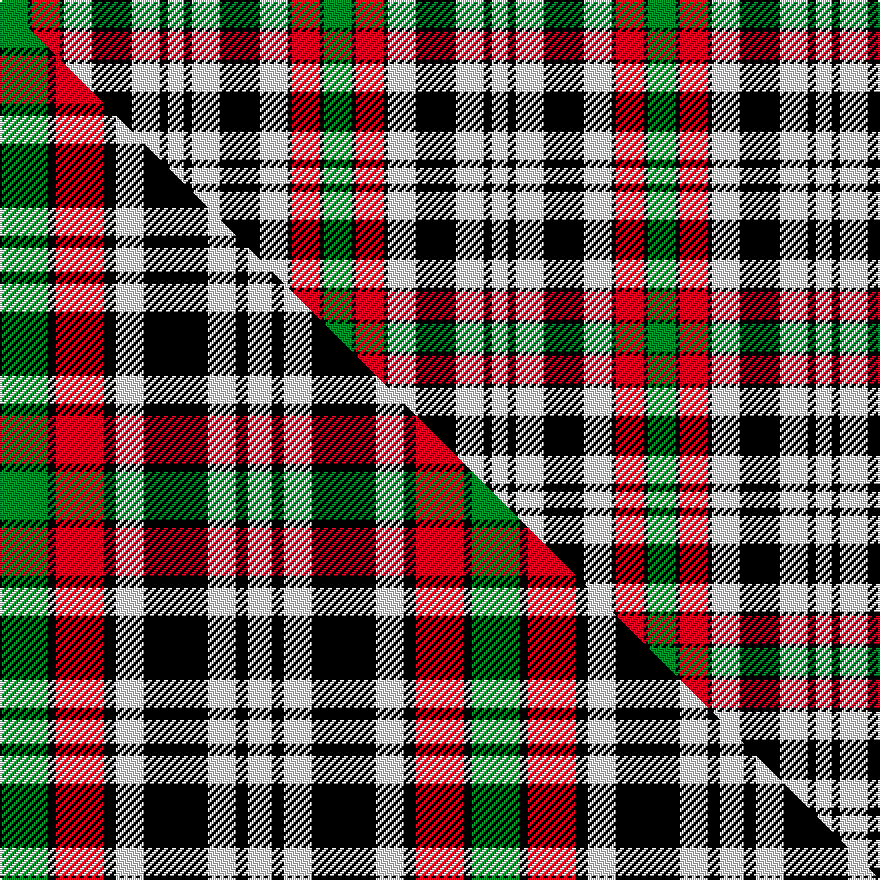

This page is one **sett** — a single exact thread-count. It belongs to the [tartan](/setts/g7k1r7k1w7k10w7k2w4/)
(the same proportion at any scale), whose colour order is pattern [GKRKWKWKW](/stripes/gkrkwkwkw/).

Part of the [Borthwick Dress](/tartans/borthwick-dress/) tartan — the named design grouping this sett with its other cloths.

Sourced from weddslist.  It is a [9 stripe tartan](/stripes/stripes9/).

Original link http://www.weddslist.com/cgi-bin/tartans/pg.pl?source=sts

## Provenance

Earliest known date: pre 2003 No details available.

2 attestations — the source records this cloth was collapsed from (oldest owns this page)

<ul>
<li>undated — Borthwick, dress (weddslist, <a href="http://www.weddslist.com/cgi-bin/tartans/pg.pl?source=sts">record</a>) </li>
<li>undated — Borthwick Dress Artifact Tartan (house-of-tartan, <a href="http://www.house-of-tartan.scotland.net/house/TartanViewjs.asp?colr=Def&tnam=820">record</a>) </li>
</ul>

## Thread count
G/14 K2 R14 K2 W14 K20 W14 K4 W/8

One full sett is **162 threads**.

## Palette
<table><thead><tr><th>Colour</th><th>Shade</th><th>OKLCh</th></tr></thead><tbody><tr><td>R</td><td><code style="background-color:#D60020;">#D60020</code> <small style="color:#888">#D60020</small></td><td><small style="color:#888">oklch(55.2% 0.224 25.5)</small></td></tr><tr><td>G</td><td><code style="background-color:#008B2A;">#008B2A</code> <small style="color:#888">#008B2A</small></td><td><small style="color:#888">oklch(55.4% 0.170 145.9)</small></td></tr><tr><td>K</td><td><code style="background-color:#000000;">#000000</code> <small style="color:#888">#000000</small></td><td><small style="color:#888">oklch(0.0% 0.000 0.0)</small></td></tr><tr><td>W</td><td><code style="background-color:#F7F7F7;">#F7F7F7</code> <small style="color:#888">#F7F7F7</small></td><td><small style="color:#888">oklch(97.6% 0.000 89.9)</small></td></tr></tbody></table>

# Sample pattern

## Compared to the master

This cloth is one sett of its design; the master sett (the exemplar the design is anchored on) is below for comparison.

Its **ΔTartan distance** from the master is **0.70** — the same measure the nearest-tartans table ranks by (0 is identical; a re-scale of the same cloth is near 0, a recolour or a different proportion further).

<figure class="master-compare" style="margin:0">

this sett
master sett ★

<figcaption style="color:#888;font-size:smaller">One weave of this sett against the <a href="/setts/g12k2r12k3w7k16w7k3w6/">master sett ★</a>, split on the diagonal: a shared proportion runs seamlessly across it with only the shades shifting; a different proportion breaks on it.</figcaption>
</figure>

## Nearest variants

The nearest existing variants by ΔTartan distance, with this cloth at the top so the swatches line up against it.

ΔTartan

Threads

Variant

Sett

—

162

<a href="/variants/s9/g7k1r7k1w7k10w7k2w4~x2/">Borthwick, dress</a>

<a href="/ttd/edit/#slug=g7k1dr8k2w7k10w7k2w4~x4&amp;base=g7k1r7k1w7k10w7k2w4~x2" title="compare in the TTD">0.09</a>

340

<a href="/variants/s9/g7k1dr8k2w7k10w7k2w4~x4/">Borthwick Dress (Clan)</a>

<a href="/ttd/edit/#slug=g12k2r12k3w7k16w7k3w6~x2&amp;base=g7k1r7k1w7k10w7k2w4~x2" title="compare in the TTD">0.57</a>

236

<a href="/variants/s9/g12k2r12k3w7k16w7k3w6~x2/">Borthwick Dress</a>

## Neighbour map

Every grey dot is one of 13620 variants placed by the first two principal components of the ΔTartan feature space (42% of its variance). Red is this tartan; blue dots are its nearest — click one to open its page.

<svg viewBox="0 0 640 380" role="img" style="max-width:100%;height:auto;border:1px solid #e0e0e0;border-radius:4px;display:block" xmlns="http://www.w3.org/2000/svg"><image href="/nn/cloud.v1.png" width="640" height="380"/><a href="/variants/s9/g7k1dr8k2w7k10w7k2w4~x4/"><circle cx="102.2" cy="200.2" r="4" fill="#3465a4"><title>Borthwick Dress (Clan)</title></circle></a><a href="/variants/s9/g12k2r12k3w7k16w7k3w6~x2/"><circle cx="84.0" cy="198.2" r="4" fill="#3465a4"><title>Borthwick Dress</title></circle></a><circle cx="107.1" cy="190.8" r="5" fill="#c00000"/><text x="320" y="376" text-anchor="middle" font-size="11" fill="#999">ground</text><text x="11" y="190" text-anchor="middle" font-size="11" fill="#999" transform="rotate(-90 11 190)">complexity</text></svg>

ID: /variants/s9/g7k1r7k1w7k10w7k2w4~x2/
