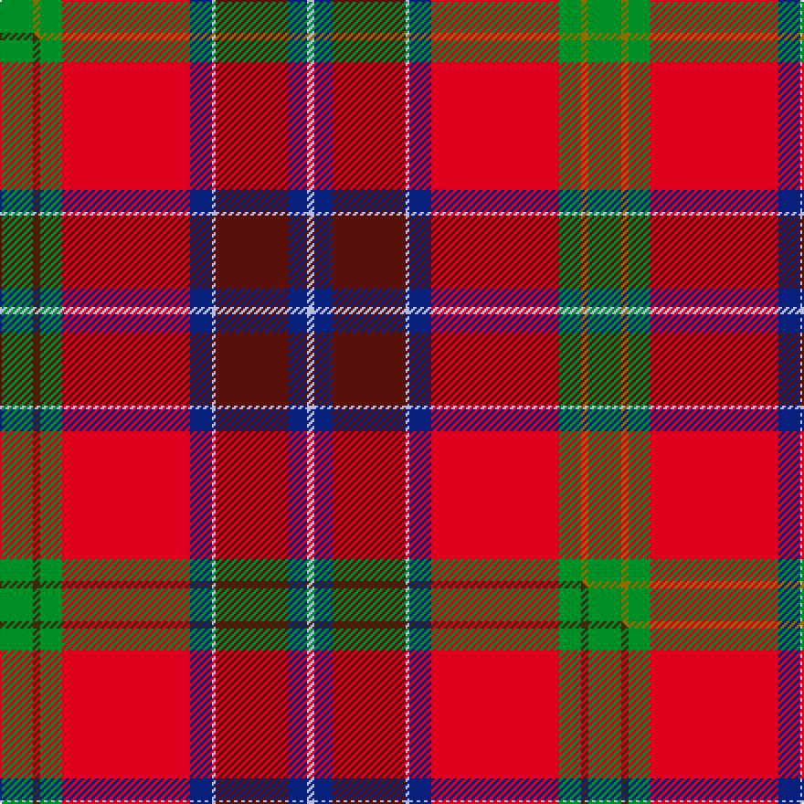

This page is one **sett** — a single exact thread-count. It belongs to the [tartan](/setts/g9y2g6r35db6lb1dr20db5lb2/)
(the same proportion at any scale), whose colour order is pattern [GGGRBWBBW](/stripes/gggrbwbbw/).

Part of the [Telfer](/tartans/telfer-2/) tartan — the named design grouping this sett with its other cloths.

Sourced from tartans-authority.  It is a [9 stripe tartan](/stripes/stripes9/).

Original link https://www.tartanregister.gov.uk/tartanDetails.aspx?ref=10083

Dataset <small>— provenance for this record, inherited from the source manifest</small>

<dl class="dataset-prov">
<dt>source</dt><dd><a href="/sources/tartans-authority/">Scottish Tartans Authority</a></dd>
<dt>data captured from</dt><dd><a href="https://github.com/thetartan/tartan-database/blob/master/data/tartans-authority/data.csv">https://github.com/thetartan/tartan-database/blob/master/data/tartans-authority/data.csv</a></dd>
<dt>data date</dt><dd>pre 2009 <small>(this record)</small></dd>
<dt>licence</dt><dd><a href="https://creativecommons.org/licenses/by-nc-nd/4.0/">CC BY-NC-ND 4.0</a></dd>
</dl>

Capture chain <small>— the hands this data passed through, oldest first; each capture carries its own licence</small>

<ol class="capture-chain">
<li><a href="https://www.tartansauthority.com/">Scottish Tartans Authority</a> <small>the heritage body's archive — its tartan-ferret record browser is retired (links repaired to the SRT, above)</small></li>
<li><a href="https://github.com/thetartan/tartan-database">thetartan/tartan-database</a> <small>2016-2017</small> · <a href="https://creativecommons.org/licenses/by-nc-nd/4.0/">CC BY-NC-ND 4.0</a> <small>Levko Kravets's frozen compilation — the capture we vendored, and where its CC licence text came from</small></li>
<li>this dictionary <small>captured 2026-06-10 · commit 5bf86c7566</small> <small>each re-capture is a git commit to data/sources</small></li>
</ol>

## Register references

External register numbers recorded for this tartan.

- Scottish Register of Tartans: [10083](https://www.tartanregister.gov.uk/tartanDetails?ref=10083)
- Scottish Tartans Authority (ITI): 10083

## Thread count
G/18 Y4 G12 R70 DB12 LB2 DR40 DB10 LB/4

One full sett is **322 threads**.

## Palette
<table><thead><tr><th>Colour</th><th>Shade</th><th>OKLCh</th></tr></thead><tbody><tr><td>DB</td><td><code style="background-color:#082077;">#082077</code> <small style="color:#888">#082077</small></td><td><small style="color:#888">oklch(30.0% 0.149 265.1)</small></td></tr><tr><td>DR</td><td><code style="background-color:#55120C;">#55120C</code> <small style="color:#888">#55120C</small></td><td><small style="color:#888">oklch(30.0% 0.099 29.3)</small></td></tr><tr><td>G</td><td><code style="background-color:#008B2A;">#008B2A</code> <small style="color:#888">#008B2A</small></td><td><small style="color:#888">oklch(55.4% 0.170 145.9)</small></td></tr><tr><td>LB</td><td><code style="background-color:#B5BBDE;">#B5BBDE</code> <small style="color:#888">#B5BBDE</small></td><td><small style="color:#888">oklch(79.9% 0.050 277.6)</small></td></tr><tr><td>R</td><td><code style="background-color:#D60020;">#D60020</code> <small style="color:#888">#D60020</small></td><td><small style="color:#888">oklch(55.2% 0.224 25.5)</small></td></tr><tr><td>Y</td><td><code style="background-color:#8B6E00;">#8B6E00</code> <small style="color:#888">#8B6E00</small></td><td><small style="color:#888">oklch(55.1% 0.113 90.4)</small></td></tr></tbody></table>

# Sample pattern

## Compared to the master

This cloth is one sett of its design; the master sett (the exemplar the design is anchored on) is below for comparison.

Its **ΔTartan distance** from the master is **0.01** — the same measure the nearest-tartans table ranks by (0 is identical; a re-scale of the same cloth is near 0, a recolour or a different proportion further).

<figure class="master-compare" style="margin:0">

this sett
master sett ★

<figcaption style="color:#888;font-size:smaller">One weave of this sett against the <a href="/setts/g9dy2g6r35db6lb1dr20db5lb2/">master sett ★</a>, split on the diagonal: a shared proportion runs seamlessly across it with only the shades shifting; a different proportion breaks on it.</figcaption>
</figure>

## Nearest tartan variants

The nearest existing variants by ΔTartan distance, with this cloth at the top so the swatches line up against it.

ΔTartan

Threads

Variant

Sett

—

322

<a href="/variants/s9/g9y2g6r35db6lb1dr20db5lb2~x2/">Telfer (Name)</a>

<a href="/ttd/edit/#slug=g9dy2g6r35db6lb1dr20db5lb2~x2&amp;base=g9y2g6r35db6lb1dr20db5lb2~x2" title="compare in the TTD">0.01</a>

322

<a href="/variants/s9/g9dy2g6r35db6lb1dr20db5lb2~x2/">Telfer</a>

<a href="/ttd/edit/#slug=g9y2g6r35db6lb1dr20db5lb2~x2~r2109032-db1004274&amp;base=g9y2g6r35db6lb1dr20db5lb2~x2" title="compare in the TTD">0.05</a>

322

<a href="/variants/s9/g9y2g6r35db6lb1dr20db5lb2~x2~r2109032-db1004274/">Telfer Name Tartan</a>

<a href="/ttd/edit/#slug=y4g18db4dr8db8r21w1~x2&amp;base=g9y2g6r35db6lb1dr20db5lb2~x2" title="compare in the TTD">2.45</a>

246

<a href="/variants/s7/y4g18db4dr8db8r21w1~x2/">G P Bathija (Shikarpur, Sindh)</a>

<a href="/ttd/edit/#slug=lr2dr1r24dr16dt20db3dt3ly2~x2&amp;base=g9y2g6r35db6lb1dr20db5lb2~x2" title="compare in the TTD">2.56</a>

276

<a href="/variants/s8/lr2dr1r24dr16dt20db3dt3ly2~x2/">Tache, Sir Etienne Paschal</a>

<a href="/ttd/edit/#slug=w3dy1r29dy16g23db3g3y2~x2&amp;base=g9y2g6r35db6lb1dr20db5lb2~x2" title="compare in the TTD">2.70</a>

310

<a href="/variants/s8/w3dy1r29dy16g23db3g3y2~x2/">Etienne Paschal Tache Sir... Canadian Tartan</a>

<a href="/ttd/edit/#slug=r35y7w1dg3w1y7dg19w2g17r12g5b5r5g2~x2&amp;base=g9y2g6r35db6lb1dr20db5lb2~x2" title="compare in the TTD">2.73</a>

410

<a href="/variants/s14/r35y7w1dg3w1y7dg19w2g17r12g5b5r5g2~x2/">Unidentified 9</a>

<a href="/ttd/edit/#slug=w3dy1r29dy16g23db3g3ly2~x2&amp;base=g9y2g6r35db6lb1dr20db5lb2~x2" title="compare in the TTD">2.79</a>

310

<a href="/variants/s8/w3dy1r29dy16g23db3g3ly2~x2/">Tache, Sir Etienne Paschal #2</a>

<a href="/ttd/edit/#slug=w3dr20g2r5n2r4n2r2n4r1n20lb3~x2&amp;base=g9y2g6r35db6lb1dr20db5lb2~x2" title="compare in the TTD">2.81</a>

260

<a href="/variants/s12/w3dr20g2r5n2r4n2r2n4r1n20lb3~x2/">Ryutokukan High School</a>

<a href="/ttd/edit/#slug=r22w1y7w1g21w1db12w1dr1w1r8~x2&amp;base=g9y2g6r35db6lb1dr20db5lb2~x2" title="compare in the TTD">2.82</a>

244

<a href="/variants/s11/r22w1y7w1g21w1db12w1dr1w1r8~x2/">Bendigo</a>

<a href="/ttd/edit/#slug=dg18g2dt5r45db3dt18db3r5w2~dg1806142-g2408144-dt1204274-db1406275&amp;base=g9y2g6r35db6lb1dr20db5lb2~x2" title="compare in the TTD">2.84</a>

182

<a href="/variants/s9/dg18g2db5r45dbi3db18dbi3r5w2~dg1806142-g2408144-db1204274-dbi1406275/">MacNiven Family Tartan</a>

## Neighbour map

Every grey dot is one of 13620 variants placed by the first two principal components of the ΔTartan feature space (42% of its variance). Red is this tartan; blue dots are its nearest — click one to open its page.

<svg viewBox="0 0 640 380" role="img" style="max-width:100%;height:auto;border:1px solid #e0e0e0;border-radius:4px;display:block" xmlns="http://www.w3.org/2000/svg"><image href="/nn/cloud.v1.png" width="640" height="380"/><a href="/variants/s9/g9dy2g6r35db6lb1dr20db5lb2~x2/"><circle cx="239.8" cy="104.6" r="4" fill="#3465a4"><title>Telfer</title></circle></a><a href="/variants/s9/g9y2g6r35db6lb1dr20db5lb2~x2~r2109032-db1004274/"><circle cx="250.5" cy="108.6" r="4" fill="#3465a4"><title>Telfer Name Tartan</title></circle></a><a href="/variants/s7/y4g18db4dr8db8r21w1~x2/"><circle cx="171.4" cy="166.0" r="4" fill="#3465a4"><title>G P Bathija (Shikarpur, Sindh)</title></circle></a><a href="/variants/s8/lr2dr1r24dr16dt20db3dt3ly2~x2/"><circle cx="225.2" cy="138.3" r="4" fill="#3465a4"><title>Tache, Sir Etienne Paschal</title></circle></a><a href="/variants/s8/w3dy1r29dy16g23db3g3y2~x2/"><circle cx="217.6" cy="124.6" r="4" fill="#3465a4"><title>Etienne Paschal Tache Sir... Canadian Tartan</title></circle></a><a href="/variants/s14/r35y7w1dg3w1y7dg19w2g17r12g5b5r5g2~x2/"><circle cx="236.8" cy="94.4" r="4" fill="#3465a4"><title>Unidentified 9</title></circle></a><a href="/variants/s8/w3dy1r29dy16g23db3g3ly2~x2/"><circle cx="213.2" cy="123.2" r="4" fill="#3465a4"><title>Tache, Sir Etienne Paschal #2</title></circle></a><a href="/variants/s12/w3dr20g2r5n2r4n2r2n4r1n20lb3~x2/"><circle cx="246.6" cy="120.5" r="4" fill="#3465a4"><title>Ryutokukan High School</title></circle></a><a href="/variants/s11/r22w1y7w1g21w1db12w1dr1w1r8~x2/"><circle cx="198.8" cy="110.3" r="4" fill="#3465a4"><title>Bendigo</title></circle></a><a href="/variants/s9/dg18g2db5r45dbi3db18dbi3r5w2~dg1806142-g2408144-db1204274-dbi1406275/"><circle cx="278.8" cy="113.0" r="4" fill="#3465a4"><title>MacNiven Family Tartan</title></circle></a><circle cx="240.5" cy="104.9" r="5" fill="#c00000"/><text x="320" y="376" text-anchor="middle" font-size="11" fill="#999">ground</text><text x="11" y="190" text-anchor="middle" font-size="11" fill="#999" transform="rotate(-90 11 190)">complexity</text></svg>

ID: /variants/s9/g9y2g6r35db6lb1dr20db5lb2~x2/
