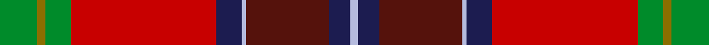

This page is one **sett** — a single exact thread-count. It belongs to the [tartan](/setts/g9y2g6r35db6lb1dr20db5lb2/)
(the same proportion at any scale), whose colour order is pattern [GGGRBWBBW](/stripes/gggrbwbbw/).

Part of the [Telfer](/tartans/telfer-2/) tartan — the named design grouping this sett with its other cloths.

Sourced from house-of-tartan.  It is a [9 stripe tartan](/stripes/stripes9/).

Original link http://www.house-of-tartan.scotland.net/house/TartanViewjs.asp?colr=Def&tnam=10083

## Provenance

Earliest known date: 2009 As a child the designer went to church in a kilt of Royal Stewart tartan, a gift from his parents. The Duncan Telfer tartan, although different in design to the Stewart tartan, echoes it in its structure. But here the predominance of red and its opposition to the green symbolises how the ancestors of the Telfers arrived in Britain on the tide of battle during the Norman invasion. This affinity is augmented by the clash of steel blue stripes. This strife is also silently witnessed by the sky (blue), trees (green) and the sun (gold). The designer would like to dedicate this tartan to the memory of his parents, James and Margaret Telfer. This tartan is for the use of all of the name of Telfer. Although there are no restrictions, anyone intending to manufacture or use this tartan is encouraged to contact the designer (or his direct descendants) and a choice of preferred charities will be offered for a suggested donation. Copyright of this design belongs to Duncan Telfer. It was developed for weaving by House of Tartan.

## Thread count
G/18 Y4 G12 R70 DB12 LB2 DR40 DB10 LB/4

One full sett is **322 threads**.

## Palette
<table><thead><tr><th>Colour</th><th>Shade</th><th>OKLCh</th></tr></thead><tbody><tr><td>DB</td><td><code style="background-color:#2C2C80;">#2C2C80</code> <small style="color:#888">#2C2C80</small></td><td><small style="color:#888">oklch(35.0% 0.138 276.6)</small></td></tr><tr><td>DBa</td><td><code style="background-color:#1C1C50;">#1C1C50</code> <small style="color:#888">#1C1C50</small></td><td><small style="color:#888">oklch(26.2% 0.093 277.9)</small></td></tr><tr><td>DR</td><td><code style="background-color:#55120C;">#55120C</code> <small style="color:#888">#55120C</small></td><td><small style="color:#888">oklch(30.0% 0.099 29.3)</small></td></tr><tr><td>DY</td><td><code style="background-color:#DCBC32;">#DCBC32</code> <small style="color:#888">#DCBC32</small></td><td><small style="color:#888">oklch(80.0% 0.150 95.2)</small></td></tr><tr><td>G</td><td><code style="background-color:#008B2A;">#008B2A</code> <small style="color:#888">#008B2A</small></td><td><small style="color:#888">oklch(55.4% 0.170 145.9)</small></td></tr><tr><td>K</td><td><code style="background-color:#000000;">#000000</code> <small style="color:#888">#000000</small></td><td><small style="color:#888">oklch(0.0% 0.000 0.0)</small></td></tr><tr><td>LP</td><td><code style="background-color:#B5BBDE;">#B5BBDE</code> <small style="color:#888">#B5BBDE</small></td><td><small style="color:#888">oklch(79.9% 0.050 277.6)</small></td></tr><tr><td>R</td><td><code style="background-color:#C80000;">#C80000</code> <small style="color:#888">#C80000</small></td><td><small style="color:#888">oklch(52.3% 0.215 29.2)</small></td></tr><tr><td>Ra</td><td><code style="background-color:#C8002C;">#C8002C</code> <small style="color:#888">#C8002C</small></td><td><small style="color:#888">oklch(52.6% 0.212 22.0)</small></td></tr><tr><td>Y</td><td><code style="background-color:#8B6E00;">#8B6E00</code> <small style="color:#888">#8B6E00</small></td><td><small style="color:#888">oklch(55.1% 0.113 90.4)</small></td></tr></tbody></table>

# Sample pattern

## Compared to the master

This cloth is one sett of its design; the master sett (the exemplar the design is anchored on) is below for comparison.

Its **ΔTartan distance** from the master is **0.42** — the same measure the nearest-tartans table ranks by (0 is identical; a re-scale of the same cloth is near 0, a recolour or a different proportion further).

<figure style="margin:0"><figcaption style="color:#888;font-size:smaller">this sett</figcaption></figure>
<figure style="margin:0"><figcaption style="color:#888;font-size:smaller"><a href="/setts/g9dy2g6r35db6lb1dr20db5lb2/">master sett →</a></figcaption></figure>

## Nearest variants

The nearest existing variants by ΔTartan distance, with this cloth at the top so the swatches line up against it.

ΔTartan

Threads

Variant

Sett

—

322

<a href="/variants/s9/g9y2g6r35db6lb1dr20db5lb2~x2~r2109032-db1004274/">Telfer Name Tartan</a>

<a href="/ttd/edit/#slug=g9y2g6r35db6lb1dr20db5lb2~x2&amp;base=g9y2g6r35db6lb1dr20db5lb2~x2~r2109032-db1004274" title="compare in the TTD">0.00</a>

322

<a href="/variants/s9/g9y2g6r35db6lb1dr20db5lb2~x2/">Telfer (Name)</a>

<a href="/ttd/edit/#slug=g9dy2g6r35db6lb1dr20db5lb2~x2&amp;base=g9y2g6r35db6lb1dr20db5lb2~x2~r2109032-db1004274" title="compare in the TTD">0.00</a>

322

<a href="/variants/s9/g9dy2g6r35db6lb1dr20db5lb2~x2/">Telfer</a>

<a href="/ttd/edit/#slug=y4g18db4dr8db8r21w1~x2&amp;base=g9y2g6r35db6lb1dr20db5lb2~x2~r2109032-db1004274" title="compare in the TTD">2.27</a>

246

<a href="/variants/s7/y4g18db4dr8db8r21w1~x2/">G P Bathija (Shikarpur, Sindh)</a>

## Neighbour map

Every grey dot is one of 13620 variants placed by the first two principal components of the ΔTartan feature space (42% of its variance). Red is this tartan; blue dots are its nearest — click one to open its page.

<svg viewBox="0 0 640 380" role="img" style="max-width:100%;height:auto;border:1px solid #e0e0e0;border-radius:4px;display:block" xmlns="http://www.w3.org/2000/svg"><image href="/nn/cloud.v1.png" width="640" height="380"/><a href="/variants/s9/g9y2g6r35db6lb1dr20db5lb2~x2/"><circle cx="240.5" cy="104.9" r="4" fill="#3465a4"><title>Telfer (Name)</title></circle></a><a href="/variants/s9/g9dy2g6r35db6lb1dr20db5lb2~x2/"><circle cx="239.8" cy="104.6" r="4" fill="#3465a4"><title>Telfer</title></circle></a><a href="/variants/s7/y4g18db4dr8db8r21w1~x2/"><circle cx="171.4" cy="166.0" r="4" fill="#3465a4"><title>G P Bathija (Shikarpur, Sindh)</title></circle></a><circle cx="250.5" cy="108.6" r="5" fill="#c00000"/><text x="320" y="376" text-anchor="middle" font-size="11" fill="#999">ground</text><text x="11" y="190" text-anchor="middle" font-size="11" fill="#999" transform="rotate(-90 11 190)">complexity</text></svg>

ID: /variants/s9/g9y2g6r35db6lb1dr20db5lb2~x2~r2109032-db1004274/
