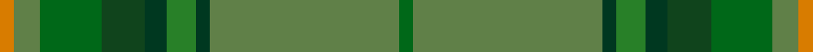

This page is one **sett** — a single exact thread-count. It belongs to the [tartan](/setts/gi4y52dg4g8dg6dgi12gi17y7lo4/)
(the same proportion at any scale), whose colour order is pattern [GGGGGGGGY](/stripes/ggggggggy/).

Sourced from tartans-authority.  It is a [9 stripe tartan](/stripes/stripes9/).

Original link http://www.tartansauthority.com/tartan-ferret/display/10073/

## Register references

External register numbers recorded for this tartan.

- Scottish Register of Tartans: [10073](https://www.tartanregister.gov.uk/tartanDetails?ref=10073)
- Scottish Tartans Authority (ITI): 10073

## Thread count
O/4 Gb7 G17 DG12 DGa6 Ga8 DGa4 Gb52 G/4

One full sett is **220 threads**.

## Palette

Palette: <strong>Tartan Register</strong> <small style="color:#888">(3 of 6 colours)</small>
<table><thead><tr><th>Colour</th><th>Threads</th><th>Shade</th><th>Base</th><th>OKLCh</th></tr></thead><tbody><tr><td>O/</td><td style="text-align:right;font-variant-numeric:tabular-nums">4</td><td><code style="background-color:#D87C00;">#D87C00</code> <small style="color:#888">#D87C00</small></td><td>Y <code style="background-color:#F2BF00;">#F2BF00</code></td><td><small style="color:#888">oklch(67.3% 0.155 61.8)</small></td></tr><tr><td>Gb</td><td style="text-align:right;font-variant-numeric:tabular-nums">7</td><td><code style="background-color:#608048;">#608048</code> <small style="color:#888">#608048</small></td><td>G <code style="background-color:#006100;">#006100</code></td><td><small style="color:#888">oklch(56.1% 0.089 132.9)</small></td></tr><tr><td>G</td><td style="text-align:right;font-variant-numeric:tabular-nums">17</td><td><code style="background-color:#006818;">#006818</code> <small style="color:#888">#006818</small></td><td>G <code style="background-color:#006100;">#006100</code></td><td><small style="color:#888">oklch(45.0% 0.142 145.0)</small></td></tr><tr><td>DG</td><td style="text-align:right;font-variant-numeric:tabular-nums">12</td><td><code style="background-color:#10441C;">#10441C</code> <small style="color:#888">#10441C</small></td><td>G <code style="background-color:#006100;">#006100</code></td><td><small style="color:#888">oklch(34.2% 0.086 147.6)</small></td></tr><tr><td>DGa</td><td style="text-align:right;font-variant-numeric:tabular-nums">6</td><td><code style="background-color:#003820;">#003820</code> <small style="color:#888">#003820</small></td><td>G <code style="background-color:#006100;">#006100</code></td><td><small style="color:#888">oklch(30.0% 0.070 158.3)</small></td></tr><tr><td>Ga</td><td style="text-align:right;font-variant-numeric:tabular-nums">8</td><td><code style="background-color:#288028;">#288028</code> <small style="color:#888">#288028</small></td><td>G <code style="background-color:#006100;">#006100</code></td><td><small style="color:#888">oklch(52.9% 0.149 143.1)</small></td></tr><tr><td>DGa</td><td style="text-align:right;font-variant-numeric:tabular-nums">4</td><td><code style="background-color:#003820;">#003820</code> <small style="color:#888">#003820</small></td><td>G <code style="background-color:#006100;">#006100</code></td><td><small style="color:#888">oklch(30.0% 0.070 158.3)</small></td></tr><tr><td>Gb</td><td style="text-align:right;font-variant-numeric:tabular-nums">52</td><td><code style="background-color:#608048;">#608048</code> <small style="color:#888">#608048</small></td><td>G <code style="background-color:#006100;">#006100</code></td><td><small style="color:#888">oklch(56.1% 0.089 132.9)</small></td></tr><tr><td>G/</td><td style="text-align:right;font-variant-numeric:tabular-nums">4</td><td><code style="background-color:#006818;">#006818</code> <small style="color:#888">#006818</small></td><td>G <code style="background-color:#006100;">#006100</code></td><td><small style="color:#888">oklch(45.0% 0.142 145.0)</small></td></tr></tbody></table>

## Nearest tartans

The nearest existing variants by ΔTartan distance, with this tartan at the top so the swatches line up against it.

ΔTartan

Tartan

Sett

—

<a href="/ttd/edit/#slug=gi4y52dg4g8dg6dgi12gi17y7lo4">McAlbourne (Corporate)</a> <a class="nn-out" href="/variants/s9/gi4y52dg4g8dg6dgi12gi17y7lo4/" title="open its dictionary page">↗</a>

1.67

<a href="/variants/s9/dgi4dgii52dt4g8dt6dg12dgi17dgii7lo4/">The McAlbourne</a>

1.85

<a href="/ttd/edit/#slug=g1r7g7n2r1dg15lb1~x4&amp;base=gi4y52dg4g8dg6dgi12gi17y7lo4">Ramsay (Green Fashion)</a> <a class="nn-out" href="/variants/s7/g1r7g7n2r1dg15lb1~x4/" title="open its dictionary page">↗</a>

1.92

<a href="/ttd/edit/#slug=lo3g30y20o6y3o3y3dt20r2~x2&amp;base=gi4y52dg4g8dg6dgi12gi17y7lo4">Glens of Corbie</a> <a class="nn-out" href="/variants/s9/lo3g30y20o6y3o3y3dt20r2~x2/" title="open its dictionary page">↗</a>

1.99

<a href="/variants/s14/dp4g4y2w3g27y30ly1r3~x2/">Hannigan of Dirleton (Personal)</a>

2.06

<a href="/ttd/edit/#slug=dg2lo6g24r2y2dg1y6dg10g2~x2&amp;base=gi4y52dg4g8dg6dgi12gi17y7lo4">Fitzgibbon (Name)</a> <a class="nn-out" href="/variants/s9/dg2lo6g24r2y2dg1y6dg10g2~x2/" title="open its dictionary page">↗</a>

2.09

<a href="/variants/s9/lb2dg2ni1dg30n10ni20dg1ni2lo1~x2/">Scottish Borderland (Fashion)</a>

2.14

<a href="/ttd/edit/#slug=n36r2n4w1y14g4ly2g18~x2&amp;base=gi4y52dg4g8dg6dgi12gi17y7lo4">Yorkland (Personal)</a> <a class="nn-out" href="/variants/s8/n36r2n4w1y14g4ly2g18~x2/" title="open its dictionary page">↗</a>

2.16

<a href="/ttd/edit/#slug=dg24g2dg4g16dg1lb2dg1g16dg3ly1dg12o2dg5~x2&amp;base=gi4y52dg4g8dg6dgi12gi17y7lo4">O'Neill (Personal)</a> <a class="nn-out" href="/variants/s13/dg24g2dg4g16dg1lb2dg1g16dg3ly1dg12o2dg5~x2/" title="open its dictionary page">↗</a>

2.17

<a href="/variants/s14/lb6dg5r5dg45k4dy24k4dg5~x2/">O'Neill Clan/Family Tartan</a>

2.18

<a href="/ttd/edit/#slug=dp4g4y2w3g27y30ly1r3~x2&amp;base=gi4y52dg4g8dg6dgi12gi17y7lo4">Hannigan of Dirleton (Personal)</a> <a class="nn-out" href="/variants/s8/dp4g4y2w3g27y30ly1r3~x2/" title="open its dictionary page">↗</a>

## Neighbour map

Every grey dot is one of 14360 variants placed by the first two principal components of the ΔTartan feature space (44% of its variance). Red is this tartan; blue dots are its nearest — click one to open its page.

<svg viewBox="0 0 640 380" role="img" style="max-width:100%;height:auto;border:1px solid #e0e0e0;border-radius:4px;display:block" xmlns="http://www.w3.org/2000/svg"><image href="/nn/cloud.v1.png" width="640" height="380"/><a href="/variants/s9/dgi4dgii52dt4g8dt6dg12dgi17dgii7lo4/"><circle cx="375.9" cy="217.6" r="4" fill="#3465a4"><title>The McAlbourne</title></circle></a><a href="/variants/s7/g1r7g7n2r1dg15lb1~x4/"><circle cx="314.2" cy="212.4" r="4" fill="#3465a4"><title>Ramsay (Green Fashion)</title></circle></a><a href="/variants/s9/lo3g30y20o6y3o3y3dt20r2~x2/"><circle cx="238.4" cy="190.2" r="4" fill="#3465a4"><title>Glens of Corbie</title></circle></a><a href="/variants/s14/dp4g4y2w3g27y30ly1r3~x2/"><circle cx="354.1" cy="137.7" r="4" fill="#3465a4"><title>Hannigan of Dirleton (Personal)</title></circle></a><a href="/variants/s9/dg2lo6g24r2y2dg1y6dg10g2~x2/"><circle cx="328.9" cy="171.5" r="4" fill="#3465a4"><title>Fitzgibbon (Name)</title></circle></a><a href="/variants/s9/lb2dg2ni1dg30n10ni20dg1ni2lo1~x2/"><circle cx="415.0" cy="184.6" r="4" fill="#3465a4"><title>Scottish Borderland (Fashion)</title></circle></a><a href="/variants/s8/n36r2n4w1y14g4ly2g18~x2/"><circle cx="364.2" cy="154.4" r="4" fill="#3465a4"><title>Yorkland (Personal)</title></circle></a><a href="/variants/s13/dg24g2dg4g16dg1lb2dg1g16dg3ly1dg12o2dg5~x2/"><circle cx="444.3" cy="197.0" r="4" fill="#3465a4"><title>O'Neill (Personal)</title></circle></a><a href="/variants/s14/lb6dg5r5dg45k4dy24k4dg5~x2/"><circle cx="370.4" cy="190.3" r="4" fill="#3465a4"><title>O'Neill Clan/Family Tartan</title></circle></a><a href="/variants/s8/dp4g4y2w3g27y30ly1r3~x2/"><circle cx="332.8" cy="146.3" r="4" fill="#3465a4"><title>Hannigan of Dirleton (Personal)</title></circle></a><circle cx="344.7" cy="197.1" r="5" fill="#c00000"/></svg>

ID: /variants/s9/gi4y52dg4g8dg6dgi12gi17y7lo4/
