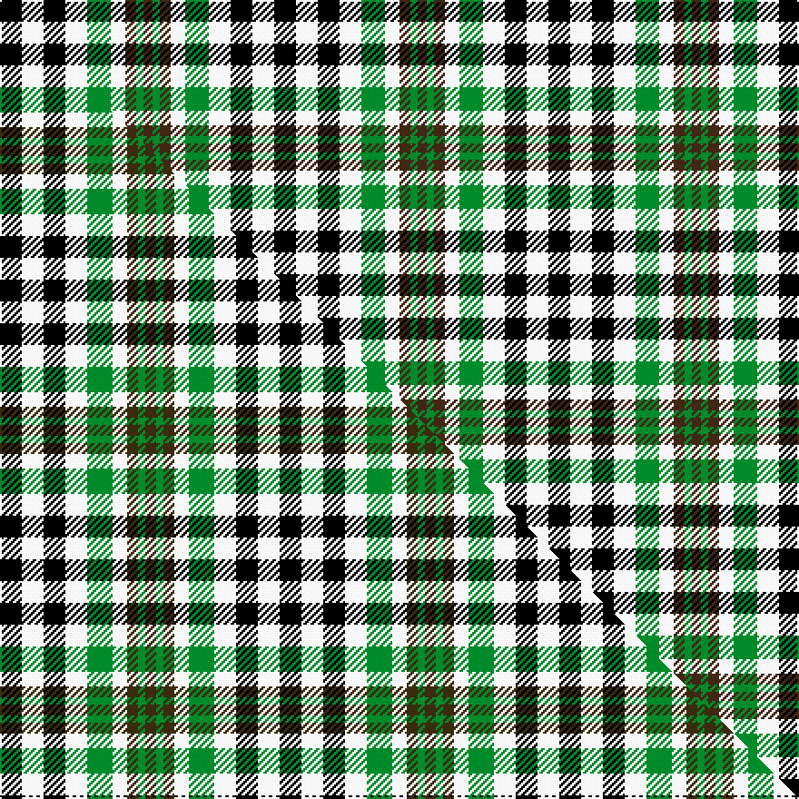

This is one **variant** — a specific cloth: this exact thread count and colourway, with its own
provenance below. It is one weaving of the [sett](/setts/k12w12k12w12g13w8do6g4do5/) (the scale-free proportion — the
same cloth at any scale or shade), whose colour order is pattern [BGBWGWKWK](/stripes/bgbwgwkwk/).

Part of the [Burns Heritage Check](/tartans/b/bu/burns-heritage-check/) tartan — the named design grouping this sett with its other cloths.

Sourced from weddslist.  It is a [9 stripe tartan](/stripes/stripes9/).

Original link [http://www.weddslist.com/cgi-bin/tartans/pg.pl?source=sts](http://www.weddslist.com/cgi-bin/tartans/pg.pl?source=sts)

Dataset <small>— provenance for this record, inherited from the source manifest</small>

<dl class="dataset-prov">
<dt>source</dt><dd><a href="/sources/weddslist/">Weddslist</a></dd>
<dt>data captured from</dt><dd><a href="https://github.com/thetartan/tartan-database/blob/master/data/weddslist/data.csv">https://github.com/thetartan/tartan-database/blob/master/data/weddslist/data.csv</a></dd>
<dt>data date</dt><dd>2016-11-17 <small>(dataset default)</small></dd>
<dt>licence</dt><dd><a href="https://creativecommons.org/licenses/by-nc-nd/4.0/">CC BY-NC-ND 4.0</a></dd>
</dl>

Capture chain <small>— the hands this data passed through, oldest first; each capture carries its own licence</small>

<ol class="capture-chain">
<li><a href="https://www.weddslist.com/tartans/">Weddslist</a> <small>the living privately compiled reference</small></li>
<li><a href="https://github.com/thetartan/tartan-database">thetartan/tartan-database</a> <small>2016-2017</small> · <a href="https://creativecommons.org/licenses/by-nc-nd/4.0/">CC BY-NC-ND 4.0</a> <small>Levko Kravets's frozen compilation — the capture we vendored, and where its CC licence text came from</small></li>
<li>this dictionary <small>captured 2026-06-10 · commit 5bf86c7566</small> <small>each re-capture is a git commit to data/sources</small></li>
</ol>

## Thread count
K/12 W12 K12 W12 G13 W8 DO6 G4 DO/5

One full sett is **151 threads**.

## Palette
<table><thead><tr><th>Colour</th><th>Shade</th><th>OKLCh</th></tr></thead><tbody><tr><td>DO</td><td><code style="background-color:#412714;">#412714</code> <small style="color:#888">#412714</small></td><td><small style="color:#888">oklch(30.1% 0.050 55.7)</small></td></tr><tr><td>G</td><td><code style="background-color:#008B2A;">#008B2A</code> <small style="color:#888">#008B2A</small></td><td><small style="color:#888">oklch(55.4% 0.170 145.9)</small></td></tr><tr><td>K</td><td><code style="background-color:#000000;">#000000</code> <small style="color:#888">#000000</small></td><td><small style="color:#888">oklch(0.0% 0.000 0.0)</small></td></tr><tr><td>W</td><td><code style="background-color:#F7F7F7;">#F7F7F7</code> <small style="color:#888">#F7F7F7</small></td><td><small style="color:#888">oklch(97.6% 0.000 89.9)</small></td></tr></tbody></table>

# Sample pattern

## Compared to the master

This cloth is one sett of its design; the master sett (the exemplar the design is anchored on) is below for comparison.

Its **ΔTartan distance** from the master is **0.64** — the same measure the nearest-tartans table ranks by (0 is identical; a re-scale of the same cloth is near 0, a recolour or a different proportion further).

<figure class="master-compare" style="margin:0">

this sett
master sett ★

<figcaption style="color:#888;font-size:smaller">One weave of this sett against the <a href="/setts/k6w6k6w6g7w4dy3g2dy3/">master sett ★</a>, split on the diagonal: a shared proportion runs seamlessly across it with only the shades shifting; a different proportion breaks on it.</figcaption>
</figure>

## Nearest tartan variants

The nearest existing variants by ΔTartan distance, with this cloth at the top so the swatches line up against it.

ΔTartan

Threads

Variant

Sett

—

151

<a href="/variants/s9/k12w12k12w12g13w8do6g4do5/">Burns Heritage Check</a>

<a href="/ttd/edit/#slug=k6w6k6w6g7w4dy3g2dy3~x2&amp;base=k12w12k12w12g13w8do6g4do5" title="compare in the TTD">0.62</a>

154

<a href="/variants/s9/k6w6k6w6g7w4dy3g2dy3~x2/">Burns Heritage Check (Corporate)</a>

<a href="/ttd/edit/#slug=k6w6k6w6g7w4dy3g2dy3~x2~g2203152&amp;base=k12w12k12w12g13w8do6g4do5" title="compare in the TTD">0.64</a>

154

<a href="/variants/s9/k6w6k6w6g7w4dy3g2dy3~x2~g2203152/">Burns Heritage Check</a>

<a href="/ttd/edit/#slug=w8k4w8k2w3k8dg8r2dg8k4~x2&amp;base=k12w12k12w12g13w8do6g4do5" title="compare in the TTD">2.33</a>

196

<a href="/variants/s10/w8k4w8k2w3k8dg8r2dg8k4~x2/">Ferguson Dress variation</a>

<a href="/ttd/edit/#slug=w2k2w2k2w2k2w1o1g1o1~x4&amp;base=k12w12k12w12g13w8do6g4do5" title="compare in the TTD">2.48</a>

116

<a href="/variants/s10/w2k2w2k2w2k2w1o1g1o1~x4/">Robert, Burns check</a>

<a href="/ttd/edit/#slug=w6k6w6k6w6k6w4dy3g2dy2~x3&amp;base=k12w12k12w12g13w8do6g4do5" title="compare in the TTD">2.67</a>

258

<a href="/variants/s10/w6k6w6k6w6k6w4dy3g2dy2~x3/">Burns Check (District)</a>

<a href="/ttd/edit/#slug=w2k2w2k2w2k2w1dy1g1dy1~x2&amp;base=k12w12k12w12g13w8do6g4do5" title="compare in the TTD">2.86</a>

58

<a href="/variants/s10/w2k2w2k2w2k2w1dy1g1dy1~x2/">Burns Check Trade Tartan</a>

<a href="/ttd/edit/#slug=g12k14lb11r3lb3r3lb11k14g12lb3~x2&amp;base=k12w12k12w12g13w8do6g4do5" title="compare in the TTD">2.90</a>

314

<a href="/variants/s10/g12k14lb11r3lb3r3lb11k14g12lb3~x2/">Wellington (Wilson) #2</a>

<a href="/ttd/edit/#slug=w2k2w2k2w2k2w1dy1g1dy1~x8~w4000000-g2203152&amp;base=k12w12k12w12g13w8do6g4do5" title="compare in the TTD">2.91</a>

232

<a href="/variants/s10/w2k2w2k2w2k2w1dy1g1dy1~x8~w4000000-g2203152/">Burns Check</a>

<a href="/ttd/edit/#slug=k4lo9k13g6lo3g9w4~x2&amp;base=k12w12k12w12g13w8do6g4do5" title="compare in the TTD">3.00</a>

176

<a href="/variants/s7/k4lo9k13g6lo3g9w4~x2/">Ramsay (Orange)</a>

<a href="/ttd/edit/#slug=g6dp3k3dp3k3dp3g6r2~x2~dp1607327-r2109032&amp;base=k12w12k12w12g13w8do6g4do5" title="compare in the TTD">3.18</a>

100

<a href="/variants/s8/g6dp3k3dp3k3dp3g6r2~x2~dp1607327-r2109032/">Wilson's No.137</a>

## Neighbour map

Every grey dot is one of 13621 variants placed by the first two principal components of the ΔTartan feature space (42% of its variance). Red is this tartan; blue dots are its nearest — click one to open its page.

<svg viewBox="0 0 640 380" role="img" style="max-width:100%;height:auto;border:1px solid #e0e0e0;border-radius:4px;display:block" xmlns="http://www.w3.org/2000/svg"><image href="/nn/cloud.v1.png" width="640" height="380"/><a href="/variants/s9/k6w6k6w6g7w4dy3g2dy3~x2/"><circle cx="41.5" cy="269.4" r="4" fill="#3465a4"><title>Burns Heritage Check (Corporate)</title></circle></a><a href="/variants/s9/k6w6k6w6g7w4dy3g2dy3~x2~g2203152/"><circle cx="43.2" cy="268.4" r="4" fill="#3465a4"><title>Burns Heritage Check</title></circle></a><a href="/variants/s10/w8k4w8k2w3k8dg8r2dg8k4~x2/"><circle cx="60.8" cy="241.4" r="4" fill="#3465a4"><title>Ferguson Dress variation</title></circle></a><a href="/variants/s10/w2k2w2k2w2k2w1o1g1o1~x4/"><circle cx="69.7" cy="295.1" r="4" fill="#3465a4"><title>Robert, Burns check</title></circle></a><a href="/variants/s10/w6k6w6k6w6k6w4dy3g2dy2~x3/"><circle cx="106.3" cy="271.5" r="4" fill="#3465a4"><title>Burns Check (District)</title></circle></a><a href="/variants/s10/w2k2w2k2w2k2w1dy1g1dy1~x2/"><circle cx="68.9" cy="295.5" r="4" fill="#3465a4"><title>Burns Check Trade Tartan</title></circle></a><a href="/variants/s10/g12k14lb11r3lb3r3lb11k14g12lb3~x2/"><circle cx="69.6" cy="231.5" r="4" fill="#3465a4"><title>Wellington (Wilson) #2</title></circle></a><a href="/variants/s10/w2k2w2k2w2k2w1dy1g1dy1~x8~w4000000-g2203152/"><circle cx="69.0" cy="295.1" r="4" fill="#3465a4"><title>Burns Check</title></circle></a><a href="/variants/s7/k4lo9k13g6lo3g9w4~x2/"><circle cx="74.1" cy="252.6" r="4" fill="#3465a4"><title>Ramsay (Orange)</title></circle></a><a href="/variants/s8/g6dp3k3dp3k3dp3g6r2~x2~dp1607327-r2109032/"><circle cx="102.1" cy="279.2" r="4" fill="#3465a4"><title>Wilson's No.137</title></circle></a><circle cx="48.1" cy="272.5" r="5" fill="#c00000"/><text x="320" y="376" text-anchor="middle" font-size="11" fill="#999">ground</text><text x="11" y="190" text-anchor="middle" font-size="11" fill="#999" transform="rotate(-90 11 190)">complexity</text></svg>

ID: /variants/s9/k12w12k12w12g13w8do6g4do5/
