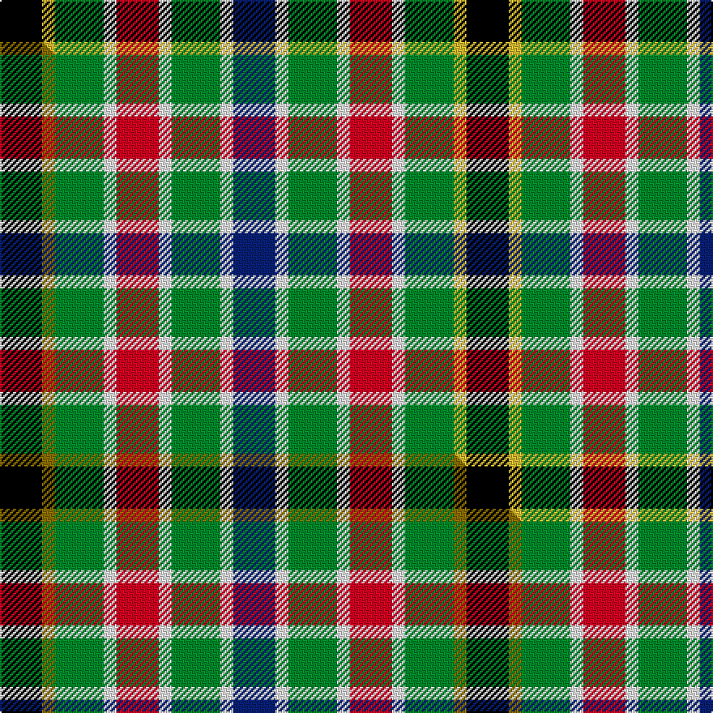

This page is one **sett** — a single exact thread-count. It belongs to the [tartan](/setts/k13ly4g15w4r13w4g15w4db13/)
(the same proportion at any scale), whose colour order is pattern [BWGWRWGYK](/stripes/bwgwrwgyk/).

Part of the [Spirit of 1994](/tartans/spirit-of-1994/) tartan — the named design grouping this sett with its other cloths.

Sourced from tartans-authority.  It is a [9 stripe tartan](/stripes/stripes9/).

Original link http://www.tartansauthority.com/tartan-ferret/display/10465/

## Register references

External register numbers recorded for this tartan.

- Scottish Register of Tartans: [10465](https://www.tartanregister.gov.uk/tartanDetails?ref=10465)
- Scottish Tartans Authority (ITI): 10465

## Thread count
K/26 LY8 G30 W8 R26 W8 G30 W8 DB/26

One full sett is **288 threads**.

## Palette
<table><thead><tr><th>Colour</th><th>Shade</th><th>OKLCh</th></tr></thead><tbody><tr><td>DB</td><td><code style="background-color:#082077;">#082077</code> <small style="color:#888">#082077</small></td><td><small style="color:#888">oklch(30.0% 0.149 265.1)</small></td></tr><tr><td>G</td><td><code style="background-color:#008B2A;">#008B2A</code> <small style="color:#888">#008B2A</small></td><td><small style="color:#888">oklch(55.4% 0.170 145.9)</small></td></tr><tr><td>K</td><td><code style="background-color:#000000;">#000000</code> <small style="color:#888">#000000</small></td><td><small style="color:#888">oklch(0.0% 0.000 0.0)</small></td></tr><tr><td>W</td><td><code style="background-color:#F7F7F7;">#F7F7F7</code> <small style="color:#888">#F7F7F7</small></td><td><small style="color:#888">oklch(97.6% 0.000 89.9)</small></td></tr><tr><td>R</td><td><code style="background-color:#D60020;">#D60020</code> <small style="color:#888">#D60020</small></td><td><small style="color:#888">oklch(55.2% 0.224 25.5)</small></td></tr><tr><td>LY</td><td><code style="background-color:#DCBC32;">#DCBC32</code> <small style="color:#888">#DCBC32</small></td><td><small style="color:#888">oklch(80.0% 0.150 95.2)</small></td></tr></tbody></table>

# Sample pattern

## Compared to the master

This cloth is one sett of its design; the master sett (the exemplar the design is anchored on) is below for comparison.

Its **ΔTartan distance** from the master is **0.30** — the same measure the nearest-tartans table ranks by (0 is identical; a re-scale of the same cloth is near 0, a recolour or a different proportion further).

<figure class="master-compare" style="margin:0">

this sett
master sett ★

<figcaption style="color:#888;font-size:smaller">One weave of this sett against the <a href="/setts/k13y4g15w4r13w4g15w4db13/">master sett ★</a>, split on the diagonal: a shared proportion runs seamlessly across it with only the shades shifting; a different proportion breaks on it.</figcaption>
</figure>

## Nearest variants

The nearest existing variants by ΔTartan distance, with this cloth at the top so the swatches line up against it.

ΔTartan

Threads

Variant

Sett

—

288

<a href="/variants/s9/k13ly4g15w4r13w4g15w4db13~x2/">Spirit of 1994 (Fashion)</a>

<a href="/ttd/edit/#slug=k13y4g15w4r13w4g15w4db13~x2&amp;base=k13ly4g15w4r13w4g15w4db13~x2" title="compare in the TTD">0.00</a>

288

<a href="/variants/s9/k13y4g15w4r13w4g15w4db13~x2/">Spirit of 1994</a>

<a href="/ttd/edit/#slug=k20y4db13w4g30w4r13~x2&amp;base=k13ly4g15w4r13w4g15w4db13~x2" title="compare in the TTD">2.40</a>

286

<a href="/variants/s7/k20y4db13w4g30w4r13~x2/">South Africa 1994 (Fashion)</a>

<a href="/ttd/edit/#slug=r3g6k2g2k1y1g2db3w1~x4&amp;base=k13ly4g15w4r13w4g15w4db13~x2" title="compare in the TTD">2.52</a>

152

<a href="/variants/s9/r3g6k2g2k1y1g2db3w1~x4/">Bisset</a>

<a href="/ttd/edit/#slug=r3lb8k9g16r12n12lo3~x2&amp;base=k13ly4g15w4r13w4g15w4db13~x2" title="compare in the TTD">2.64</a>

240

<a href="/variants/s7/r3lb8k9g16r12n12lo3~x2/">Alabama (Fashion)</a>

## Neighbour map

Every grey dot is one of 13620 variants placed by the first two principal components of the ΔTartan feature space (42% of its variance). Red is this tartan; blue dots are its nearest — click one to open its page.

<svg viewBox="0 0 640 380" role="img" style="max-width:100%;height:auto;border:1px solid #e0e0e0;border-radius:4px;display:block" xmlns="http://www.w3.org/2000/svg"><image href="/nn/cloud.v1.png" width="640" height="380"/><a href="/variants/s9/k13y4g15w4r13w4g15w4db13~x2/"><circle cx="16.8" cy="219.2" r="4" fill="#3465a4"><title>Spirit of 1994</title></circle></a><a href="/variants/s7/k20y4db13w4g30w4r13~x2/"><circle cx="57.8" cy="179.4" r="4" fill="#3465a4"><title>South Africa 1994 (Fashion)</title></circle></a><a href="/variants/s9/r3g6k2g2k1y1g2db3w1~x4/"><circle cx="113.4" cy="189.7" r="4" fill="#3465a4"><title>Bisset</title></circle></a><a href="/variants/s7/r3lb8k9g16r12n12lo3~x2/"><circle cx="14.8" cy="223.9" r="4" fill="#3465a4"><title>Alabama (Fashion)</title></circle></a><circle cx="19.8" cy="222.0" r="5" fill="#c00000"/><text x="320" y="376" text-anchor="middle" font-size="11" fill="#999">ground</text><text x="11" y="190" text-anchor="middle" font-size="11" fill="#999" transform="rotate(-90 11 190)">complexity</text></svg>

ID: /variants/s9/k13ly4g15w4r13w4g15w4db13~x2/
