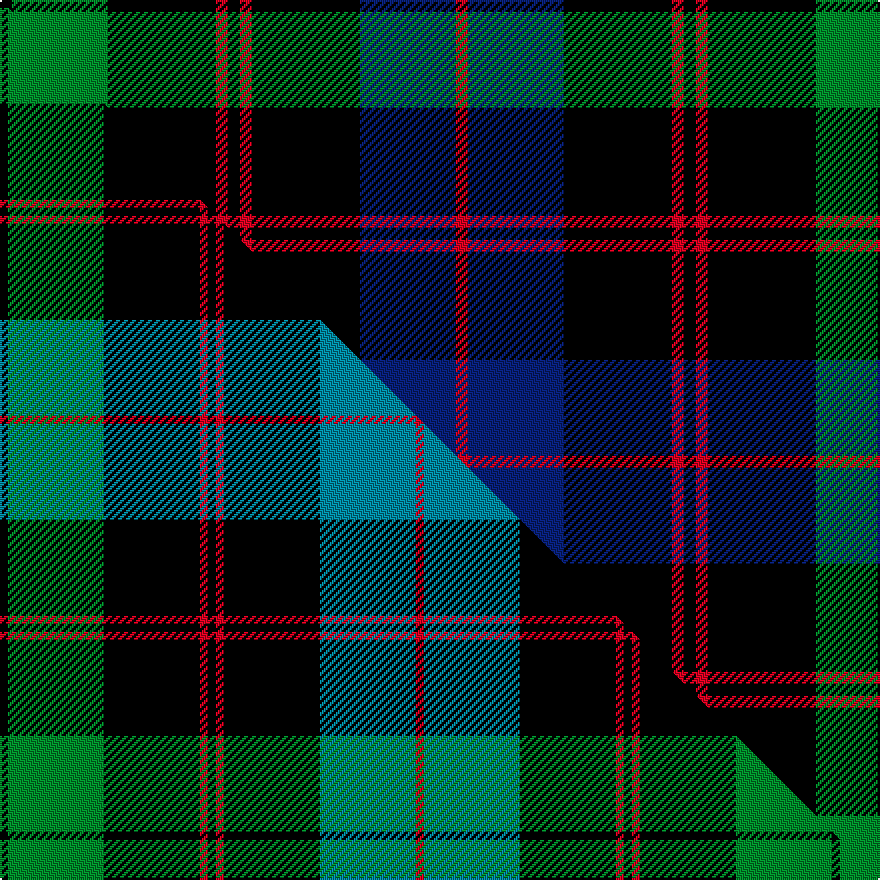

This is one **variant** — a specific cloth: this exact thread count and colourway, with its own
provenance below. It is one weaving of the [sett](/setts/k1g8k9r1k1r1k9db8r1/) (the scale-free proportion — the
same cloth at any scale or shade), whose colour order is pattern [KGKRKRKBR](/stripes/kgkrkrkbr/).

Part of the [Guthrie](/tartans/guthrie-2/) tartan — the named design grouping this sett with its other cloths.

Sourced from house-of-tartan.  It is a [9 stripe tartan](/stripes/stripes9/).

Original link [http://www.house-of-tartan.scotland.net/house/TartanViewjs.asp?colr=Def&tnam=1085](http://www.house-of-tartan.scotland.net/house/TartanViewjs.asp?colr=Def&tnam=1085)

## Provenance

Earliest known date: pre 2003 From the Barony of Guthrie in Angus, the name is also said to derive from Guthrum, a Scandinavian prince. Sir David Guthrie was King's Treasurer in the fifteenth century and built Guthrie Castle near Friockheim, Angus, in 1468.

2 attestations — the source records this cloth was collapsed from (oldest owns this page)

<ul>
<li>pre 2003 — Guthrie Family Tartan (house-of-tartan, <a href="http://www.house-of-tartan.scotland.net/house/TartanViewjs.asp?colr=Def&tnam=1085">record</a>) </li>
<li>undated — Guthrie (weddslist, <a href="http://www.weddslist.com/cgi-bin/tartans/pg.pl?source=sts">record</a>) </li>
</ul>

Dataset <small>— provenance for this record, inherited from the source manifest</small>

<dl class="dataset-prov">
<dt>source</dt><dd><a href="/sources/house-of-tartan/">House of Tartan</a></dd>
<dt>data captured from</dt><dd><a href="https://github.com/thetartan/tartan-database/blob/master/data/house-of-tartan/data.csv">https://github.com/thetartan/tartan-database/blob/master/data/house-of-tartan/data.csv</a></dd>
<dt>data date</dt><dd>pre 2003 <small>(this record)</small></dd>
<dt>licence</dt><dd><a href="https://creativecommons.org/licenses/by-nc-nd/4.0/">CC BY-NC-ND 4.0</a></dd>
</dl>

Capture chain <small>— the hands this data passed through, oldest first; each capture carries its own licence</small>

<ol class="capture-chain">
<li><a href="http://www.house-of-tartan.scotland.net/">House of Tartan</a> <small>the weaver/retailer's database — the site is now offline; the URL is kept as the ultimate source's identity</small></li>
<li><a href="https://github.com/thetartan/tartan-database">thetartan/tartan-database</a> <small>2016-2017</small> · <a href="https://creativecommons.org/licenses/by-nc-nd/4.0/">CC BY-NC-ND 4.0</a> <small>Levko Kravets's frozen compilation — the capture we vendored, and where its CC licence text came from</small></li>
<li>this dictionary <small>captured 2026-06-10 · commit 5bf86c7566</small> <small>each re-capture is a git commit to data/sources</small></li>
</ol>

## Thread count
K/6 G48 K54 R6 K6 R6 K54 DB48 R/6

One full sett is **456 threads**.

## Palette
<table><thead><tr><th>Colour</th><th>Shade</th><th>OKLCh</th></tr></thead><tbody><tr><td>DB</td><td><code style="background-color:#082077;">#082077</code> <small style="color:#888">#082077</small></td><td><small style="color:#888">oklch(30.0% 0.149 265.1)</small></td></tr><tr><td>G</td><td><code style="background-color:#008B2A;">#008B2A</code> <small style="color:#888">#008B2A</small></td><td><small style="color:#888">oklch(55.4% 0.170 145.9)</small></td></tr><tr><td>K</td><td><code style="background-color:#000000;">#000000</code> <small style="color:#888">#000000</small></td><td><small style="color:#888">oklch(0.0% 0.000 0.0)</small></td></tr><tr><td>R</td><td><code style="background-color:#D60020;">#D60020</code> <small style="color:#888">#D60020</small></td><td><small style="color:#888">oklch(55.2% 0.224 25.5)</small></td></tr></tbody></table>

# Sample pattern

## Compared to the master

This cloth is one sett of its design; the master sett (the exemplar the design is anchored on) is below for comparison.

Its **ΔTartan distance** from the master is **0.46** — the same measure the nearest-tartans table ranks by (0 is identical; a re-scale of the same cloth is near 0, a recolour or a different proportion further).

<figure class="master-compare" style="margin:0">

this sett
master sett ★

<figcaption style="color:#888;font-size:smaller">One weave of this sett against the <a href="/setts/k1g12k12r1k1r1k12t12r1/">master sett ★</a>, split on the diagonal: a shared proportion runs seamlessly across it with only the shades shifting; a different proportion breaks on it.</figcaption>
</figure>

## Nearest tartan variants

The nearest existing variants by ΔTartan distance, with this cloth at the top so the swatches line up against it.

ΔTartan

Threads

Variant

Sett

—

456

<a href="/variants/s9/k1g8k9r1k1r1k9db8r1~x6/">Guthrie Family Tartan</a>

<a href="/ttd/edit/#slug=k1g12k12r1k1r1k12t12r1~x4&amp;base=k1g8k9r1k1r1k9db8r1~x6" title="compare in the TTD">0.46</a>

416

<a href="/variants/s9/k1g12k12r1k1r1k12t12r1~x4/">Guthrie (Name)</a>

<a href="/ttd/edit/#slug=r1k7g7k7db7k7r1w1~x4&amp;base=k1g8k9r1k1r1k9db8r1~x6" title="compare in the TTD">1.74</a>

296

<a href="/variants/s8/r1k7g7k7db7k7r1w1~x4/">Tennent (Personal)</a>

<a href="/ttd/edit/#slug=dy32db10k52db10w5k24db16w10k11dy15&amp;base=k1g8k9r1k1r1k9db8r1~x6" title="compare in the TTD">1.84</a>

323

<a href="/variants/s10/dy32db10k52db10w5k24db16w10k11dy15/">Cavan County, Crest Range</a>

<a href="/ttd/edit/#slug=k5w5k5t11k3n17k30t3~x2&amp;base=k1g8k9r1k1r1k9db8r1~x6" title="compare in the TTD">2.00</a>

300

<a href="/variants/s8/k5w5k5t11k3n17k30t3~x2/">Australian Police</a>

<a href="/ttd/edit/#slug=k1w1k8dg1k1db8dg8k1db1k8w1k1~x6&amp;base=k1g8k9r1k1r1k9db8r1~x6" title="compare in the TTD">2.10</a>

468

<a href="/variants/s12/k1w1k8dg1k1db8dg8k1db1k8w1k1~x6/">Chess (Universal)</a>

<a href="/ttd/edit/#slug=dt3o3k16dt2k2dt16k3dt2lb2~x2~dt1700000-o2500000&amp;base=k1g8k9r1k1r1k9db8r1~x6" title="compare in the TTD">2.15</a>

186

<a href="/variants/s9/n3o3k16n2k2n16k3n2lb2~x2~n1700000-o2500000/">Chinzei Keiai Senior High School</a>

<a href="/ttd/edit/#slug=k61n20ly2n20k5ly4~x2&amp;base=k1g8k9r1k1r1k9db8r1~x6" title="compare in the TTD">2.17</a>

318

<a href="/variants/s6/k61n20ly2n20k5ly4~x2/">Sonsub Corporate Tartan</a>

<a href="/ttd/edit/#slug=dg4k4dg23k11r2k2r2k20w4~x2&amp;base=k1g8k9r1k1r1k9db8r1~x6" title="compare in the TTD">2.20</a>

272

<a href="/variants/s9/dg4k4dg23k11r2k2r2k20w4~x2/">New Golf Club</a>

<a href="/ttd/edit/#slug=n3o3k16n2k2n16k3n2lb2~x2~n1900000-o2500000&amp;base=k1g8k9r1k1r1k9db8r1~x6" title="compare in the TTD">2.27</a>

186

<a href="/variants/s9/n3o3k16n2k2n16k3n2lb2~x2~n1900000-o2500000/">Chinzei Keiai Senior High School</a>

<a href="/ttd/edit/#slug=k24dp5k9g3k2g3k2g14dp7k2dp10~x2&amp;base=k1g8k9r1k1r1k9db8r1~x6" title="compare in the TTD">2.40</a>

256

<a href="/variants/s11/k24dp5k9g3k2g3k2g14dp7k2dp10~x2/">Paxton (Personal)</a>

## Neighbour map

Every grey dot is one of 13621 variants placed by the first two principal components of the ΔTartan feature space (42% of its variance). Red is this tartan; blue dots are its nearest — click one to open its page.

<svg viewBox="0 0 640 380" role="img" style="max-width:100%;height:auto;border:1px solid #e0e0e0;border-radius:4px;display:block" xmlns="http://www.w3.org/2000/svg"><image href="/nn/cloud.v1.png" width="640" height="380"/><a href="/variants/s9/k1g12k12r1k1r1k12t12r1~x4/"><circle cx="199.4" cy="157.7" r="4" fill="#3465a4"><title>Guthrie (Name)</title></circle></a><a href="/variants/s8/r1k7g7k7db7k7r1w1~x4/"><circle cx="183.7" cy="197.2" r="4" fill="#3465a4"><title>Tennent (Personal)</title></circle></a><a href="/variants/s10/dy32db10k52db10w5k24db16w10k11dy15/"><circle cx="185.2" cy="179.5" r="4" fill="#3465a4"><title>Cavan County, Crest Range</title></circle></a><a href="/variants/s8/k5w5k5t11k3n17k30t3~x2/"><circle cx="226.5" cy="171.5" r="4" fill="#3465a4"><title>Australian Police</title></circle></a><a href="/variants/s12/k1w1k8dg1k1db8dg8k1db1k8w1k1~x6/"><circle cx="214.1" cy="161.2" r="4" fill="#3465a4"><title>Chess (Universal)</title></circle></a><a href="/variants/s9/n3o3k16n2k2n16k3n2lb2~x2~n1700000-o2500000/"><circle cx="231.1" cy="167.9" r="4" fill="#3465a4"><title>Chinzei Keiai Senior High School</title></circle></a><a href="/variants/s6/k61n20ly2n20k5ly4~x2/"><circle cx="201.2" cy="149.6" r="4" fill="#3465a4"><title>Sonsub Corporate Tartan</title></circle></a><a href="/variants/s9/dg4k4dg23k11r2k2r2k20w4~x2/"><circle cx="244.7" cy="157.1" r="4" fill="#3465a4"><title>New Golf Club</title></circle></a><a href="/variants/s9/n3o3k16n2k2n16k3n2lb2~x2~n1900000-o2500000/"><circle cx="225.6" cy="166.4" r="4" fill="#3465a4"><title>Chinzei Keiai Senior High School</title></circle></a><a href="/variants/s11/k24dp5k9g3k2g3k2g14dp7k2dp10~x2/"><circle cx="234.3" cy="171.2" r="4" fill="#3465a4"><title>Paxton (Personal)</title></circle></a><circle cx="207.2" cy="173.2" r="5" fill="#c00000"/><text x="320" y="376" text-anchor="middle" font-size="11" fill="#999">ground</text><text x="11" y="190" text-anchor="middle" font-size="11" fill="#999" transform="rotate(-90 11 190)">complexity</text></svg>

ID: /variants/s9/k1g8k9r1k1r1k9db8r1~x6/
