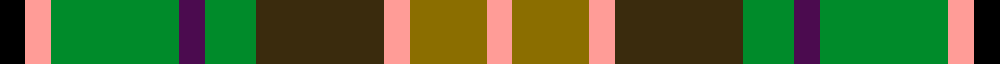

This is one **variant** — a specific cloth: this exact thread count and colourway, with its own
provenance below. It is one weaving of the [sett](/tartans/c/co/corcoran-of-sherbrooke/) (the scale-free proportion — the
same cloth at any scale or shade), whose colour order is pattern [KYGBGGYGY](/stripes/kygbggygy/).

Part of the [Corcoran of Sherbrooke](/tartans/c/co/corcoran-of-sherbrooke/) tartan — the named design grouping this sett with its other cloths.

Sourced from register-of-tartans.  It is a [9 stripe tartan](/stripes/stripes9/).

Original link [https://www.tartanregister.gov.uk/tartanDetails.aspx?ref=759](https://www.tartanregister.gov.uk/tartanDetails.aspx?ref=759)

2 attestations — the source records this cloth was collapsed from (oldest owns this page)

<ul>
<li>01/01/1994 — Corcoran of Sherbrooke (Personal) (register-of-tartans, <a href="https://www.tartanregister.gov.uk/tartanDetails.aspx?ref=759">record</a>)  <em>Designed by Annie Corcoran of Notre-Dame-de-Bois, Quebec, Canada in 1994. Swatch in Scottish Tartans Authority's Johnston Collection.</em></li>
<li>1994 — Corcoran of Sherbrooke (Name) (tartans-authority, <a href="https://web.archive.org/web/*/http://www.tartansauthority.com/tartan-ferret/display/4584/*">record</a>)  <em>Designed by Annie Corcoran,of Notre-Dame-de-Bois, Quebec, Canada in 1994. Swatch in STA's Johnston Collection</em></li>
</ul>

Dataset <small>— provenance for this record, inherited from the source manifest</small>

<dl class="dataset-prov">
<dt>source</dt><dd><a href="/sources/register-of-tartans/">Scottish Register of Tartans</a></dd>
<dt>data captured from</dt><dd><a href="https://github.com/thetartan/tartan-database/blob/master/data/register-of-tartans/data.csv">https://github.com/thetartan/tartan-database/blob/master/data/register-of-tartans/data.csv</a></dd>
<dt>data date</dt><dd>1994 <small>(this record)</small></dd>
<dt>licence</dt><dd><a href="https://www.tartanregister.gov.uk/copyright">Crown copyright</a></dd>
</dl>

Capture chain <small>— the hands this data passed through, oldest first; each capture carries its own licence</small>

<ol class="capture-chain">
<li><a href="https://www.tartanregister.gov.uk/">Scottish Register of Tartans</a> · <a href="https://www.tartanregister.gov.uk/copyright">Crown copyright</a> <small>the living register — still published by National Records of Scotland</small></li>
<li><a href="https://github.com/thetartan/tartan-database">thetartan/tartan-database</a> <small>2016-2017</small> · <a href="https://creativecommons.org/licenses/by-nc-nd/4.0/">CC BY-NC-ND 4.0</a> <small>Levko Kravets's frozen compilation — the capture we vendored, and where its CC licence text came from</small></li>
<li>this dictionary <small>captured 2026-06-10 · commit 5bf86c7566</small> <small>each re-capture is a git commit to data/sources</small></li>
</ol>

## Register references

External register numbers recorded for this tartan.

- Scottish Register of Tartans: [759](https://www.tartanregister.gov.uk/tartanDetails.aspx?ref=759)
- Scottish Tartans Authority (ITI): 4584

## Thread count
K/4 LR4 G20 DP4 G8 DY20 LR4 Y12 LR/4

One full sett is **152 threads**.

## Palette
<table><thead><tr><th>Colour</th><th>Shade</th><th>OKLCh</th></tr></thead><tbody><tr><td>G</td><td><code style="background-color:#008B2A;">#008B2A</code> <small style="color:#888">#008B2A</small></td><td><small style="color:#888">oklch(55.4% 0.170 145.9)</small></td></tr><tr><td>K</td><td><code style="background-color:#000000;">#000000</code> <small style="color:#888">#000000</small></td><td><small style="color:#888">oklch(0.0% 0.000 0.0)</small></td></tr><tr><td>Y</td><td><code style="background-color:#8B6E00;">#8B6E00</code> <small style="color:#888">#8B6E00</small></td><td><small style="color:#888">oklch(55.1% 0.113 90.4)</small></td></tr><tr><td>LR</td><td><code style="background-color:#FF9C97;">#FF9C97</code> <small style="color:#888">#FF9C97</small></td><td><small style="color:#888">oklch(79.3% 0.119 23.2)</small></td></tr><tr><td>DP</td><td><code style="background-color:#4B0B4F;">#4B0B4F</code> <small style="color:#888">#4B0B4F</small></td><td><small style="color:#888">oklch(30.1% 0.125 325.4)</small></td></tr><tr><td>DY</td><td><code style="background-color:#3A2B0D;">#3A2B0D</code> <small style="color:#888">#3A2B0D</small></td><td><small style="color:#888">oklch(30.0% 0.049 82.0)</small></td></tr></tbody></table>

# Sample pattern

## Nearest tartan variants

The nearest existing variants by ΔTartan distance, with this cloth at the top so the swatches line up against it.

ΔTartan

Threads

Variant

Sett

—

152

<a href="/variants/s9/k1lr1g5dp1g2dy5lr1y3lr1~x4/">Corcoran of Sherbrooke (Personal)</a>

<a href="/ttd/edit/#slug=g9lb2g9k2dy14ly4lb2r2~x4~dy3908078-ly8117093&amp;base=k1lr1g5dp1g2dy5lr1y3lr1~x4" title="compare in the TTD">2.37</a>

308

<a href="/variants/s8/g9lb2g9k2dy14ly4lb2r2~x4~dy3908078-ly8117093/">McShane (Personal)</a>

<a href="/ttd/edit/#slug=o21lyi4dy5lyi4o5k21dg21ly5~x2~lyi6908117-dg4514144&amp;base=k1lr1g5dp1g2dy5lr1y3lr1~x4" title="compare in the TTD">2.52</a>

292

<a href="/variants/s8/o21lyi4dy5lyi4o5k21dg21ly5~x2~lyi6908117-dg4514144/">Labrador Club of Scotland (Corporate</a>

<a href="/ttd/edit/#slug=dy5ly20r3dg13dy13db3b3~x2&amp;base=k1lr1g5dp1g2dy5lr1y3lr1~x4" title="compare in the TTD">2.64</a>

224

<a href="/variants/s7/dy5ly20r3dg13dy13db3b3~x2/">Christmas Hill Game Farm (Corporate)</a>

<a href="/ttd/edit/#slug=dg9w2dg9k2ly14lyi4w2r2~x4~ly6307084-lyi6614084&amp;base=k1lr1g5dp1g2dy5lr1y3lr1~x4" title="compare in the TTD">2.70</a>

308

<a href="/variants/s8/dg9w2dg9k2ly14lyi4w2r2~x4~ly6307084-lyi6614084/">MacShane (Clan)</a>

<a href="/ttd/edit/#slug=dy5ly20r3dg13dy13dp3b3~x2&amp;base=k1lr1g5dp1g2dy5lr1y3lr1~x4" title="compare in the TTD">2.70</a>

224

<a href="/variants/s7/dy5ly20r3dg13dy13dp3b3~x2/">Christmas Hill Game Farm</a>

<a href="/ttd/edit/#slug=y3g15r2db8lb2r8g8r2dg15r2dg2lb2~x2&amp;base=k1lr1g5dp1g2dy5lr1y3lr1~x4" title="compare in the TTD">2.77</a>

266

<a href="/variants/s12/y3g15r2db8lb2r8g8r2dg15r2dg2lb2~x2/">Gordonstoun Corporate Tartan</a>

<a href="/ttd/edit/#slug=n4k1w1k1w1k1n4db2g6r1~x6&amp;base=k1lr1g5dp1g2dy5lr1y3lr1~x4" title="compare in the TTD">2.77</a>

234

<a href="/variants/s10/n4k1w1k1w1k1n4db2g6r1~x6/">Mitsukoshi Sendai</a>

<a href="/ttd/edit/#slug=o21db4dr5db4o5k21g21ly5~x2&amp;base=k1lr1g5dp1g2dy5lr1y3lr1~x4" title="compare in the TTD">2.86</a>

292

<a href="/variants/s8/o21db4dr5db4o5k21g21ly5~x2/">Caledonian Labrador Retrievers</a>

<a href="/ttd/edit/#slug=dr9g3t19k3g19dr13k3ly3~x2&amp;base=k1lr1g5dp1g2dy5lr1y3lr1~x4" title="compare in the TTD">2.86</a>

264

<a href="/variants/s8/dr9g3t19k3g19dr13k3ly3~x2/">Orkney (District?)</a>

<a href="/ttd/edit/#slug=o3g1lb6k1g6o4k1lo1~x4&amp;base=k1lr1g5dp1g2dy5lr1y3lr1~x4" title="compare in the TTD">3.02</a>

168

<a href="/variants/s8/o3g1lb6k1g6o4k1lo1~x4/">Orkney District Tartan</a>

## Neighbour map

Every grey dot is one of 13662 variants placed by the first two principal components of the ΔTartan feature space (42% of its variance). Red is this tartan; blue dots are its nearest — click one to open its page. The map is a flat projection of a many-dimensional space — [how to read it](/posts/neighbourhood-maps/).

<svg viewBox="0 0 640 380" role="img" style="max-width:100%;height:auto;border:1px solid #e0e0e0;border-radius:4px;display:block" xmlns="http://www.w3.org/2000/svg"><image href="/nn/cloud.v1.png" width="640" height="380"/><a href="/variants/s8/g9lb2g9k2dy14ly4lb2r2~x4~dy3908078-ly8117093/"><circle cx="149.3" cy="190.5" r="4" fill="#3465a4"><title>McShane (Personal)</title></circle></a><a href="/variants/s8/o21lyi4dy5lyi4o5k21dg21ly5~x2~lyi6908117-dg4514144/"><circle cx="52.0" cy="190.8" r="4" fill="#3465a4"><title>Labrador Club of Scotland (Corporate</title></circle></a><a href="/variants/s7/dy5ly20r3dg13dy13db3b3~x2/"><circle cx="110.5" cy="204.8" r="4" fill="#3465a4"><title>Christmas Hill Game Farm (Corporate)</title></circle></a><a href="/variants/s8/dg9w2dg9k2ly14lyi4w2r2~x4~ly6307084-lyi6614084/"><circle cx="127.5" cy="179.5" r="4" fill="#3465a4"><title>MacShane (Clan)</title></circle></a><a href="/variants/s7/dy5ly20r3dg13dy13dp3b3~x2/"><circle cx="111.9" cy="204.5" r="4" fill="#3465a4"><title>Christmas Hill Game Farm</title></circle></a><a href="/variants/s12/y3g15r2db8lb2r8g8r2dg15r2dg2lb2~x2/"><circle cx="125.4" cy="180.1" r="4" fill="#3465a4"><title>Gordonstoun Corporate Tartan</title></circle></a><a href="/variants/s10/n4k1w1k1w1k1n4db2g6r1~x6/"><circle cx="82.8" cy="178.4" r="4" fill="#3465a4"><title>Mitsukoshi Sendai</title></circle></a><a href="/variants/s8/o21db4dr5db4o5k21g21ly5~x2/"><circle cx="47.6" cy="188.9" r="4" fill="#3465a4"><title>Caledonian Labrador Retrievers</title></circle></a><a href="/variants/s8/dr9g3t19k3g19dr13k3ly3~x2/"><circle cx="112.2" cy="209.4" r="4" fill="#3465a4"><title>Orkney (District?)</title></circle></a><a href="/variants/s8/o3g1lb6k1g6o4k1lo1~x4/"><circle cx="97.7" cy="207.2" r="4" fill="#3465a4"><title>Orkney District Tartan</title></circle></a><circle cx="95.8" cy="204.4" r="5" fill="#c00000"/><text x="320" y="376" text-anchor="middle" font-size="11" fill="#999">ground</text><text x="11" y="190" text-anchor="middle" font-size="11" fill="#999" transform="rotate(-90 11 190)">complexity</text></svg>

ID: /variants/s9/k1lr1g5dp1g2dy5lr1y3lr1~x4/
