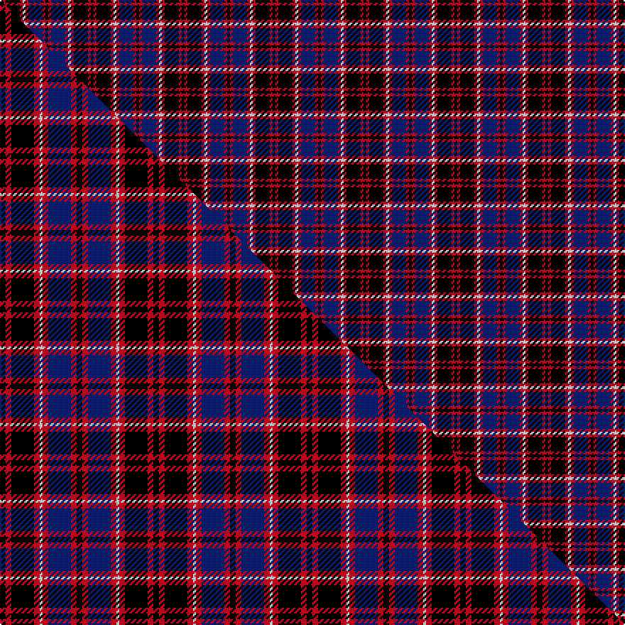

This page is one **sett** — a single exact thread-count. It belongs to the [tartan](/setts/k1r1k5r1w1r1db5r1k1/)
(the same proportion at any scale), whose colour order is pattern [KRBRWRKRK](/stripes/krbrwrkrk/).

Part of the [Gipsy](/tartans/gipsy/) tartan — the named design grouping this sett with its other cloths.

Sourced from weddslist.  It is a [9 stripe tartan](/stripes/stripes9/).

Original link http://www.weddslist.com/cgi-bin/tartans/pg.pl?source=sts

## Provenance

Earliest known date: 1847 The story goes that both name and design were inspired by the well known free-booter and composer of 'MacPhersons Rant, James MacPherson, who claimed to be the natural son of MacPherson of Invereshee by a gipsy woman.

2 attestations — the source records this cloth was collapsed from (oldest owns this page)

<ul>
<li>undated — Gipsy (weddslist, <a href="http://www.weddslist.com/cgi-bin/tartans/pg.pl?source=sts">record</a>) </li>
<li>undated — Gipsy Fancy Tartan (house-of-tartan, <a href="http://www.house-of-tartan.scotland.net/house/TartanViewjs.asp?colr=Def&tnam=1137">record</a>) </li>
</ul>

## Thread count
K/2 R2 K10 R2 W2 R2 DB10 R2 K/2

One full sett is **64 threads**.

## Palette
<table><thead><tr><th>Colour</th><th>Shade</th><th>OKLCh</th></tr></thead><tbody><tr><td>DB</td><td><code style="background-color:#082077;">#082077</code> <small style="color:#888">#082077</small></td><td><small style="color:#888">oklch(30.0% 0.149 265.1)</small></td></tr><tr><td>K</td><td><code style="background-color:#000000;">#000000</code> <small style="color:#888">#000000</small></td><td><small style="color:#888">oklch(0.0% 0.000 0.0)</small></td></tr><tr><td>W</td><td><code style="background-color:#F7F7F7;">#F7F7F7</code> <small style="color:#888">#F7F7F7</small></td><td><small style="color:#888">oklch(97.6% 0.000 89.9)</small></td></tr><tr><td>R</td><td><code style="background-color:#D60020;">#D60020</code> <small style="color:#888">#D60020</small></td><td><small style="color:#888">oklch(55.2% 0.224 25.5)</small></td></tr></tbody></table>

# Sample pattern

## Compared to the master

This cloth is one sett of its design; the master sett (the exemplar the design is anchored on) is below for comparison.

Its **ΔTartan distance** from the master is **0.80** — the same measure the nearest-tartans table ranks by (0 is identical; a re-scale of the same cloth is near 0, a recolour or a different proportion further).

<figure class="master-compare" style="margin:0">

this sett
master sett ★

<figcaption style="color:#888;font-size:smaller">One weave of this sett against the <a href="/setts/k2r2k8r2w1r2db8r2k2/">master sett ★</a>, split on the diagonal: a shared proportion runs seamlessly across it with only the shades shifting; a different proportion breaks on it.</figcaption>
</figure>

## Nearest variants

The nearest existing variants by ΔTartan distance, with this cloth at the top so the swatches line up against it.

ΔTartan

Threads

Variant

Sett

—

64

<a href="/variants/s9/k1r1k5r1w1r1db5r1k1~x2/">Gipsy</a>

<a href="/ttd/edit/#slug=k2r2k8r2w1r2db8r2k2~x2&amp;base=k1r1k5r1w1r1db5r1k1~x2" title="compare in the TTD">0.47</a>

108

<a href="/variants/s9/k2r2k8r2w1r2db8r2k2~x2/">Gipsy</a>

<a href="/ttd/edit/#slug=k2r2k8r2w1r2db8r2k2~x4&amp;base=k1r1k5r1w1r1db5r1k1~x2" title="compare in the TTD">0.47</a>

216

<a href="/variants/s9/k2r2k8r2w1r2db8r2k2~x4/">Gipsy (Fashion)</a>

<a href="/ttd/edit/#slug=k35r6db6r6k16db48r36k6r6&amp;base=k1r1k5r1w1r1db5r1k1~x2" title="compare in the TTD">2.72</a>

289

<a href="/variants/s9/k35r6db6r6k16db48r36k6r6/">Rosie O'Grady (P&amp;D) (Corporate)</a>

<a href="/ttd/edit/#slug=r2k4r2k4db1w1db4r1~x4&amp;base=k1r1k5r1w1r1db5r1k1~x2" title="compare in the TTD">2.72</a>

140

<a href="/variants/s8/r2k4r2k4db1w1db4r1~x4/">MacKean</a>

<a href="/ttd/edit/#slug=r2k4r2k4db1lb1db4r1~x4&amp;base=k1r1k5r1w1r1db5r1k1~x2" title="compare in the TTD">2.72</a>

140

<a href="/variants/s8/r2k4r2k4db1lb1db4r1~x4/">MacKean Red (Personal)</a>

## Neighbour map

Every grey dot is one of 13620 variants placed by the first two principal components of the ΔTartan feature space (42% of its variance). Red is this tartan; blue dots are its nearest — click one to open its page.

<svg viewBox="0 0 640 380" role="img" style="max-width:100%;height:auto;border:1px solid #e0e0e0;border-radius:4px;display:block" xmlns="http://www.w3.org/2000/svg"><image href="/nn/cloud.v1.png" width="640" height="380"/><a href="/variants/s9/k2r2k8r2w1r2db8r2k2~x2/"><circle cx="155.5" cy="175.3" r="4" fill="#3465a4"><title>Gipsy</title></circle></a><a href="/variants/s9/k2r2k8r2w1r2db8r2k2~x4/"><circle cx="155.5" cy="175.3" r="4" fill="#3465a4"><title>Gipsy (Fashion)</title></circle></a><a href="/variants/s9/k35r6db6r6k16db48r36k6r6/"><circle cx="171.6" cy="189.2" r="4" fill="#3465a4"><title>Rosie O'Grady (P&amp;D) (Corporate)</title></circle></a><a href="/variants/s8/r2k4r2k4db1w1db4r1~x4/"><circle cx="116.3" cy="231.5" r="4" fill="#3465a4"><title>MacKean</title></circle></a><a href="/variants/s8/r2k4r2k4db1lb1db4r1~x4/"><circle cx="121.4" cy="233.0" r="4" fill="#3465a4"><title>MacKean Red (Personal)</title></circle></a><circle cx="138.8" cy="185.4" r="5" fill="#c00000"/><text x="320" y="376" text-anchor="middle" font-size="11" fill="#999">ground</text><text x="11" y="190" text-anchor="middle" font-size="11" fill="#999" transform="rotate(-90 11 190)">complexity</text></svg>

ID: /variants/s9/k1r1k5r1w1r1db5r1k1~x2/
