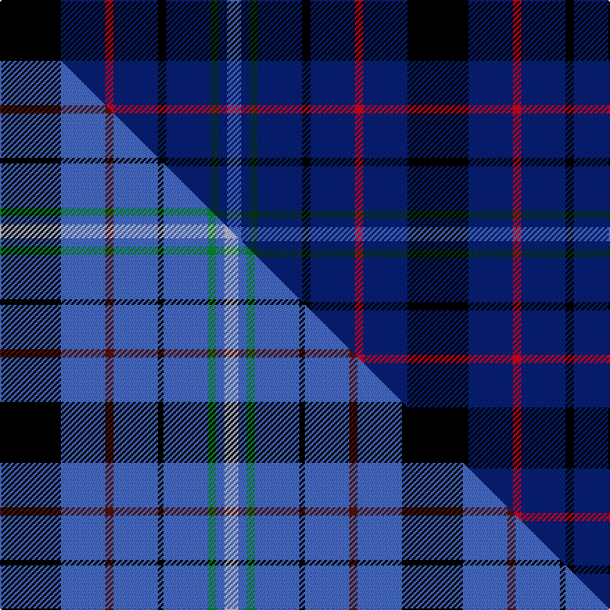

This page is one **sett** — a single exact thread-count. It belongs to the [tartan](/setts/k22db16r3db16k3db16dg3db3b5/)
(the same proportion at any scale), whose colour order is pattern [BBGBKBRBK](/stripes/bbgbkbrbk/).

Part of the [Jethart](/tartans/jethart/) tartan — the named design grouping this sett with its other cloths.

Sourced from weddslist.  It is a [9 stripe tartan](/stripes/stripes9/).

Original link http://www.weddslist.com/cgi-bin/tartans/pg.pl?source=sts

## Thread count
K/44 DB32 R6 DB32 K6 DB32 DG6 DB6 B/10

One full sett is **294 threads**.

## Palette
<table><thead><tr><th>Colour</th><th>Shade</th><th>OKLCh</th></tr></thead><tbody><tr><td>B</td><td><code style="background-color:#466CC8;">#466CC8</code> <small style="color:#888">#466CC8</small></td><td><small style="color:#888">oklch(55.1% 0.149 265.0)</small></td></tr><tr><td>DB</td><td><code style="background-color:#082077;">#082077</code> <small style="color:#888">#082077</small></td><td><small style="color:#888">oklch(30.0% 0.149 265.1)</small></td></tr><tr><td>K</td><td><code style="background-color:#000000;">#000000</code> <small style="color:#888">#000000</small></td><td><small style="color:#888">oklch(0.0% 0.000 0.0)</small></td></tr><tr><td>DG</td><td><code style="background-color:#053819;">#053819</code> <small style="color:#888">#053819</small></td><td><small style="color:#888">oklch(30.0% 0.075 151.3)</small></td></tr><tr><td>R</td><td><code style="background-color:#D60020;">#D60020</code> <small style="color:#888">#D60020</small></td><td><small style="color:#888">oklch(55.2% 0.224 25.5)</small></td></tr></tbody></table>

# Sample pattern

## Compared to the master

This cloth is one sett of its design; the master sett (the exemplar the design is anchored on) is below for comparison.

Its **ΔTartan distance** from the master is **1.98** — the same measure the nearest-tartans table ranks by (0 is identical; a re-scale of the same cloth is near 0, a recolour or a different proportion further).

<figure class="master-compare" style="margin:0">

this sett
master sett ★

<figcaption style="color:#888;font-size:smaller">One weave of this sett against the <a href="/setts/k22b16dr3b16k2b16g3b3lb5/">master sett ★</a>, split on the diagonal: a shared proportion runs seamlessly across it with only the shades shifting; a different proportion breaks on it.</figcaption>
</figure>

## Nearest tartan variants

The nearest existing variants by ΔTartan distance, with this cloth at the top so the swatches line up against it.

ΔTartan

Threads

Variant

Sett

—

294

<a href="/variants/s9/k22db16r3db16k3db16dg3db3b5~x2/">Jethart</a>

<a href="/ttd/edit/#slug=r3db21r3db3k13db13lb3db3w2~x2&amp;base=k22db16r3db16k3db16dg3db3b5~x2" title="compare in the TTD">2.31</a>

246

<a href="/variants/s9/r3db21r3db3k13db13lb3db3w2~x2/">Fitzgerald, Blue</a>

<a href="/ttd/edit/#slug=db8k3db26k11lb3db8r4db8lb3k2w3~x2&amp;base=k22db16r3db16k3db16dg3db3b5~x2" title="compare in the TTD">2.66</a>

294

<a href="/variants/s11/db8k3db26k11lb3db8r4db8lb3k2w3~x2/">Dublin Lie-ins (Corporate)</a>

<a href="/ttd/edit/#slug=db9k4lb1k4db9r1~x4~db1406275&amp;base=k22db16r3db16k3db16dg3db3b5~x2" title="compare in the TTD">2.80</a>

184

<a href="/variants/s6/db9k4lb1k4db9r1~x4~db1406275/">Scottish Nuclear</a>

## Neighbour map

Every grey dot is one of 13620 variants placed by the first two principal components of the ΔTartan feature space (42% of its variance). Red is this tartan; blue dots are its nearest — click one to open its page.

<svg viewBox="0 0 640 380" role="img" style="max-width:100%;height:auto;border:1px solid #e0e0e0;border-radius:4px;display:block" xmlns="http://www.w3.org/2000/svg"><image href="/nn/cloud.v1.png" width="640" height="380"/><a href="/variants/s9/r3db21r3db3k13db13lb3db3w2~x2/"><circle cx="280.6" cy="154.2" r="4" fill="#3465a4"><title>Fitzgerald, Blue</title></circle></a><a href="/variants/s11/db8k3db26k11lb3db8r4db8lb3k2w3~x2/"><circle cx="283.2" cy="136.9" r="4" fill="#3465a4"><title>Dublin Lie-ins (Corporate)</title></circle></a><a href="/variants/s6/db9k4lb1k4db9r1~x4~db1406275/"><circle cx="331.0" cy="211.1" r="4" fill="#3465a4"><title>Scottish Nuclear</title></circle></a><circle cx="280.0" cy="195.0" r="5" fill="#c00000"/><text x="320" y="376" text-anchor="middle" font-size="11" fill="#999">ground</text><text x="11" y="190" text-anchor="middle" font-size="11" fill="#999" transform="rotate(-90 11 190)">complexity</text></svg>

ID: /variants/s9/k22db16r3db16k3db16dg3db3b5~x2/
