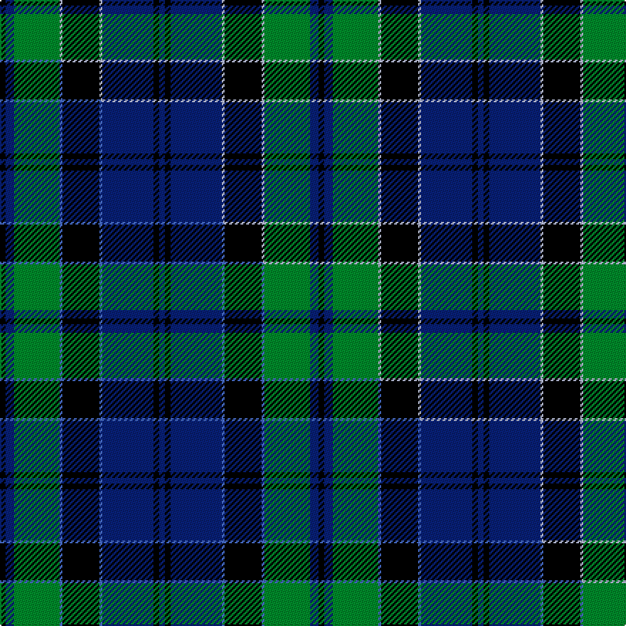

This is one **variant** — a specific cloth: this exact thread count and colourway, with its own
provenance below. It is one weaving of the [sett](/tartans/h/he/hebridean-old/) (the scale-free proportion — the
same cloth at any scale or shade), whose colour order is pattern [BKBWKWGBK](/stripes/bkbwkwgbk/).

Part of the [Hebridean Old](/tartans/h/he/hebridean-old/) tartan — the named design grouping this sett with its other cloths.

Sourced from house-of-tartan.  It is a [9 stripe tartan](/stripes/stripes9/).

Original link [http://www.house-of-tartan.scotland.net/house/TartanViewjs.asp?colr=Def&tnam=249](http://www.house-of-tartan.scotland.net/house/TartanViewjs.asp?colr=Def&tnam=249)

## Provenance

Earliest known date: pre 2003 Alternative count on 1990

Dataset <small>— provenance for this record, inherited from the source manifest</small>

<dl class="dataset-prov">
<dt>source</dt><dd><a href="/sources/house-of-tartan/">House of Tartan</a></dd>
<dt>data captured from</dt><dd><a href="https://github.com/thetartan/tartan-database/blob/master/data/house-of-tartan/data.csv">https://github.com/thetartan/tartan-database/blob/master/data/house-of-tartan/data.csv</a></dd>
<dt>data date</dt><dd>pre 2003 <small>(this record)</small></dd>
<dt>licence</dt><dd><a href="https://creativecommons.org/licenses/by-nc-nd/4.0/">CC BY-NC-ND 4.0</a></dd>
</dl>

Capture chain <small>— the hands this data passed through, oldest first; each capture carries its own licence</small>

<ol class="capture-chain">
<li><a href="http://www.house-of-tartan.scotland.net/">House of Tartan</a> <small>the weaver/retailer's database — the site is now offline; the URL is kept as the ultimate source's identity</small></li>
<li><a href="https://github.com/thetartan/tartan-database">thetartan/tartan-database</a> <small>2016-2017</small> · <a href="https://creativecommons.org/licenses/by-nc-nd/4.0/">CC BY-NC-ND 4.0</a> <small>Levko Kravets's frozen compilation — the capture we vendored, and where its CC licence text came from</small></li>
<li>this dictionary <small>captured 2026-06-10 · commit 5bf86c7566</small> <small>each re-capture is a git commit to data/sources</small></li>
</ol>

## Thread count
K/4 DB6 G32 LB2 K26 LB2 DB36 K4 DB/4

One full sett is **224 threads**.

## Palette
<table><thead><tr><th>Colour</th><th>Shade</th><th>OKLCh</th></tr></thead><tbody><tr><td>LB</td><td><code style="background-color:#B5BBDE;">#B5BBDE</code> <small style="color:#888">#B5BBDE</small></td><td><small style="color:#888">oklch(79.9% 0.050 277.6)</small></td></tr><tr><td>DB</td><td><code style="background-color:#082077;">#082077</code> <small style="color:#888">#082077</small></td><td><small style="color:#888">oklch(30.0% 0.149 265.1)</small></td></tr><tr><td>G</td><td><code style="background-color:#008B2A;">#008B2A</code> <small style="color:#888">#008B2A</small></td><td><small style="color:#888">oklch(55.4% 0.170 145.9)</small></td></tr><tr><td>K</td><td><code style="background-color:#000000;">#000000</code> <small style="color:#888">#000000</small></td><td><small style="color:#888">oklch(0.0% 0.000 0.0)</small></td></tr></tbody></table>

# Sample pattern

## Compared to the master

This cloth is one sett of its design; the master sett (the exemplar the design is anchored on) is below for comparison.

Its **ΔTartan distance** from the master is **0.02** — the same measure the nearest-tartans table ranks by (0 is identical; a re-scale of the same cloth is near 0, a recolour or a different proportion further).

<figure class="master-compare" style="margin:0">

this sett
master sett ★

<figcaption style="color:#888;font-size:smaller">One weave of this sett against the <a href="/setts/k2db3g16b1k13b1db18k2db2/">master sett ★</a>, split on the diagonal: a shared proportion runs seamlessly across it with only the shades shifting; a different proportion breaks on it.</figcaption>
</figure>

## Nearest tartan variants

The nearest existing variants by ΔTartan distance, with this cloth at the top so the swatches line up against it.

ΔTartan

Threads

Variant

Sett

—

224

<a href="/variants/s9/k2db3g16lb1k13lb1db18k2db2~x2/">Hebridean Old.. District Tartan</a>

<a href="/ttd/edit/#slug=k2db3g16b1k13b1db18k2db2~x2&amp;base=k2db3g16lb1k13lb1db18k2db2~x2" title="compare in the TTD">0.02</a>

224

<a href="/variants/s9/k2db3g16b1k13b1db18k2db2~x2/">Hebridean Old</a>

<a href="/ttd/edit/#slug=g28r2k15db2k2db2k2db18~x2&amp;base=k2db3g16lb1k13lb1db18k2db2~x2" title="compare in the TTD">1.31</a>

192

<a href="/variants/s8/g28r2k15db2k2db2k2db18~x2/">Riddoch Personal Tartan</a>

<a href="/ttd/edit/#slug=db32g2db2g14k2g14k2g2k15r2~x2&amp;base=k2db3g16lb1k13lb1db18k2db2~x2" title="compare in the TTD">1.35</a>

280

<a href="/variants/s10/db32g2db2g14k2g14k2g2k15r2~x2/">Dunedin Chapter</a>

<a href="/ttd/edit/#slug=db10k1db1k1db2k8g10w1~x4&amp;base=k2db3g16lb1k13lb1db18k2db2~x2" title="compare in the TTD">1.46</a>

228

<a href="/variants/s8/db10k1db1k1db2k8g10w1~x4/">Lamont</a>

<a href="/ttd/edit/#slug=db10k1db1k1db2k8g10w1~x2&amp;base=k2db3g16lb1k13lb1db18k2db2~x2" title="compare in the TTD">1.46</a>

114

<a href="/variants/s8/db10k1db1k1db2k8g10w1~x2/">Lamont</a>

<a href="/ttd/edit/#slug=db2g1db16r1k12g16r1g2~x2&amp;base=k2db3g16lb1k13lb1db18k2db2~x2" title="compare in the TTD">1.52</a>

196

<a href="/variants/s8/db2g1db16r1k12g16r1g2~x2/">Lochaber District</a>

<a href="/ttd/edit/#slug=db2k3g5k9db21k2db5k2g20w1~x2&amp;base=k2db3g16lb1k13lb1db18k2db2~x2" title="compare in the TTD">1.53</a>

274

<a href="/variants/s10/db2k3g5k9db21k2db5k2g20w1~x2/">Pitceathly Chamberlain (Personal)</a>

<a href="/ttd/edit/#slug=db2k3g5k7db20k2db5k2g20w1~x2&amp;base=k2db3g16lb1k13lb1db18k2db2~x2" title="compare in the TTD">1.60</a>

262

<a href="/variants/s10/db2k3g5k7db20k2db5k2g20w1~x2/">Pitceathly Chamberlain Tartan</a>

<a href="/ttd/edit/#slug=lr6g34db4g4k32g4db34g4db2g5&amp;base=k2db3g16lb1k13lb1db18k2db2~x2" title="compare in the TTD">1.64</a>

247

<a href="/variants/s10/lr6g34db4g4k32g4db34g4db2g5/">Sardar Chadha (Personal)</a>

<a href="/ttd/edit/#slug=g20k2g2k2g2k8db24dp3db3~x2&amp;base=k2db3g16lb1k13lb1db18k2db2~x2" title="compare in the TTD">1.77</a>

218

<a href="/variants/s9/g20k2g2k2g2k8db24dp3db3~x2/">MacHarg, Iain</a>

## Neighbour map

Every grey dot is one of 13662 variants placed by the first two principal components of the ΔTartan feature space (42% of its variance). Red is this tartan; blue dots are its nearest — click one to open its page. The map is a flat projection of a many-dimensional space — [how to read it](/posts/neighbourhood-maps/).

<svg viewBox="0 0 640 380" role="img" style="max-width:100%;height:auto;border:1px solid #e0e0e0;border-radius:4px;display:block" xmlns="http://www.w3.org/2000/svg"><image href="/nn/cloud.v1.png" width="640" height="380"/><a href="/variants/s9/k2db3g16b1k13b1db18k2db2~x2/"><circle cx="207.1" cy="149.0" r="4" fill="#3465a4"><title>Hebridean Old</title></circle></a><a href="/variants/s8/g28r2k15db2k2db2k2db18~x2/"><circle cx="181.6" cy="122.4" r="4" fill="#3465a4"><title>Riddoch Personal Tartan</title></circle></a><a href="/variants/s10/db32g2db2g14k2g14k2g2k15r2~x2/"><circle cx="201.1" cy="142.3" r="4" fill="#3465a4"><title>Dunedin Chapter</title></circle></a><a href="/variants/s8/db10k1db1k1db2k8g10w1~x4/"><circle cx="171.4" cy="178.8" r="4" fill="#3465a4"><title>Lamont</title></circle></a><a href="/variants/s8/db10k1db1k1db2k8g10w1~x2/"><circle cx="171.4" cy="178.8" r="4" fill="#3465a4"><title>Lamont</title></circle></a><a href="/variants/s8/db2g1db16r1k12g16r1g2~x2/"><circle cx="189.0" cy="154.7" r="4" fill="#3465a4"><title>Lochaber District</title></circle></a><a href="/variants/s10/db2k3g5k9db21k2db5k2g20w1~x2/"><circle cx="207.5" cy="138.2" r="4" fill="#3465a4"><title>Pitceathly Chamberlain (Personal)</title></circle></a><a href="/variants/s10/db2k3g5k7db20k2db5k2g20w1~x2/"><circle cx="209.8" cy="139.6" r="4" fill="#3465a4"><title>Pitceathly Chamberlain Tartan</title></circle></a><a href="/variants/s10/lr6g34db4g4k32g4db34g4db2g5/"><circle cx="188.4" cy="143.2" r="4" fill="#3465a4"><title>Sardar Chadha (Personal)</title></circle></a><a href="/variants/s9/g20k2g2k2g2k8db24dp3db3~x2/"><circle cx="208.4" cy="159.2" r="4" fill="#3465a4"><title>MacHarg, Iain</title></circle></a><circle cx="201.7" cy="147.2" r="5" fill="#c00000"/><text x="320" y="376" text-anchor="middle" font-size="11" fill="#999">ground</text><text x="11" y="190" text-anchor="middle" font-size="11" fill="#999" transform="rotate(-90 11 190)">complexity</text></svg>

ID: /variants/s9/k2db3g16lb1k13lb1db18k2db2~x2/
