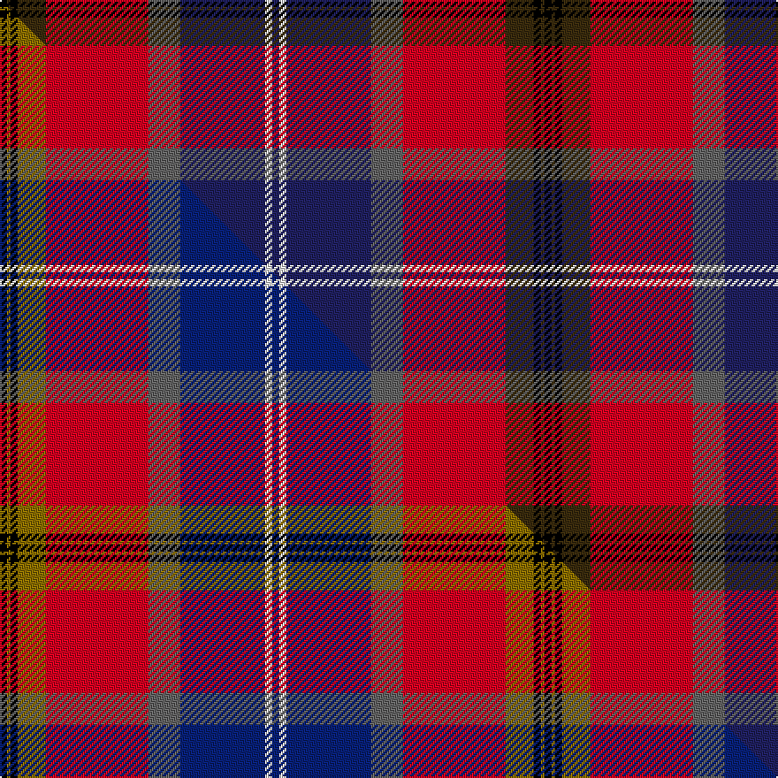

This page is one **sett** — a single exact thread-count. It belongs to the [tartan](/setts/k2dy1k2dy8r29n9db24w2db2/)
(the same proportion at any scale), whose colour order is pattern [BWBBRGKGK](/stripes/bwbbrgkgk/).

Part of the [Lermontov](/tartans/lermontov/) tartan — the named design grouping this sett with its other cloths.

Sourced from house-of-tartan.  It is a [9 stripe tartan](/stripes/stripes9/).

Original link http://www.house-of-tartan.scotland.net/house/TartanViewjs.asp?colr=Def&tnam=6493

## Provenance

Earliest known date: 2004 December For the Russian descendents of George Lermont (a Scotch Knight) of Fife who emigrated to Russia in 1613 to serve as a military instructor to Tsar Mikhail Romanov. The most famous Lermontov was Mikhail (b1814) - a much revered poet and dissident who was killed in a duel in 1841. His standing in Russia was almost akin to that of Robert Burns. This tartan is based upon the MacDuff, drawing upon George Lermont's home county of Fife. The white lines on blue symbolise St Andrew, patron saint of both Russia and Scotland and celebrate the Lermontovs Scottish ancestry. The remaining colours are from the Lermontov coat of arms registered in Russia in 1798. The three black lines represent the three lozenges in that device.

## Thread count
K/4 DY2 K4 DY16 R58 N18 DB48 W4 DB/4

One full sett is **308 threads**.

## Palette
<table><thead><tr><th>Colour</th><th>Shade</th><th>OKLCh</th></tr></thead><tbody><tr><td>T</td><td><code style="background-color:#00879F;">#00879F</code> <small style="color:#888">#00879F</small></td><td><small style="color:#888">oklch(57.4% 0.102 216.1)</small></td></tr><tr><td>DB</td><td><code style="background-color:#2C2C80;">#2C2C80</code> <small style="color:#888">#2C2C80</small></td><td><small style="color:#888">oklch(35.0% 0.138 276.6)</small></td></tr><tr><td>DB</td><td><code style="background-color:#202060;">#202060</code> <small style="color:#888">#202060</small></td><td><small style="color:#888">oklch(28.9% 0.111 276.9)</small></td></tr><tr><td>DG</td><td><code style="background-color:#053819;">#053819</code> <small style="color:#888">#053819</small></td><td><small style="color:#888">oklch(30.0% 0.075 151.3)</small></td></tr><tr><td>DR</td><td><code style="background-color:#55120C;">#55120C</code> <small style="color:#888">#55120C</small></td><td><small style="color:#888">oklch(30.0% 0.099 29.3)</small></td></tr><tr><td>G</td><td><code style="background-color:#008B2A;">#008B2A</code> <small style="color:#888">#008B2A</small></td><td><small style="color:#888">oklch(55.4% 0.170 145.9)</small></td></tr><tr><td>K</td><td><code style="background-color:#000000;">#000000</code> <small style="color:#888">#000000</small></td><td><small style="color:#888">oklch(0.0% 0.000 0.0)</small></td></tr><tr><td>W</td><td><code style="background-color:#F7F7F7;">#F7F7F7</code> <small style="color:#888">#F7F7F7</small></td><td><small style="color:#888">oklch(97.6% 0.000 89.9)</small></td></tr><tr><td>N</td><td><code style="background-color:#636363;">#636363</code> <small style="color:#888">#636363</small></td><td><small style="color:#888">oklch(50.0% 0.000 89.9)</small></td></tr><tr><td>R</td><td><code style="background-color:#D60020;">#D60020</code> <small style="color:#888">#D60020</small></td><td><small style="color:#888">oklch(55.2% 0.224 25.5)</small></td></tr><tr><td>DY</td><td><code style="background-color:#3A2B0D;">#3A2B0D</code> <small style="color:#888">#3A2B0D</small></td><td><small style="color:#888">oklch(30.0% 0.049 82.0)</small></td></tr></tbody></table>

# Sample pattern

## Compared to the master

This cloth is one sett of its design; the master sett (the exemplar the design is anchored on) is below for comparison.

Its **ΔTartan distance** from the master is **0.39** — the same measure the nearest-tartans table ranks by (0 is identical; a re-scale of the same cloth is near 0, a recolour or a different proportion further).

<figure class="master-compare" style="margin:0">

this sett
master sett ★

<figcaption style="color:#888;font-size:smaller">One weave of this sett against the <a href="/setts/k2y1k2y8r29n9db24w2db2/">master sett ★</a>, split on the diagonal: a shared proportion runs seamlessly across it with only the shades shifting; a different proportion breaks on it.</figcaption>
</figure>

## Nearest variants

The nearest existing variants by ΔTartan distance, with this cloth at the top so the swatches line up against it.

ΔTartan

Threads

Variant

Sett

—

308

<a href="/variants/s9/k2dy1k2dy8r29n9db24w2db2~x2~db1204274/">Lermontov Family Tartan</a>

<a href="/ttd/edit/#slug=k2y1k2y8r29n9db24w2db2~x2&amp;base=k2dy1k2dy8r29n9db24w2db2~x2~db1204274" title="compare in the TTD">0.00</a>

308

<a href="/variants/s9/k2y1k2y8r29n9db24w2db2~x2/">Lermontov</a>

<a href="/ttd/edit/#slug=db8k4db31lo5r26k5y10lo5k2&amp;base=k2dy1k2dy8r29n9db24w2db2~x2~db1204274" title="compare in the TTD">1.94</a>

182

<a href="/variants/s9/db8k4db31lo5r26k5y10lo5k2/">McGurk (Personal)</a>

2.10

—

<a href="/variants/s7/k2dbi2r16db2y1db13w2~x2~dbi1406275-db1204274/">Wishart Dress Family Tartan</a>

2.10

—

<a href="/variants/s7/k2dbi2r16db2y1db13w2~x2~dbi1604274-db0805267/">Wishart, dress</a>

2.13

—

<a href="/variants/s7/k7dbi4r31db3lo2db27lb4~x2~dbi1406275-db1204274/">Wishart Dress (Clan)</a>

<a href="/ttd/edit/#slug=w2db27k1g3k1n10k1r24w2~x2&amp;base=k2dy1k2dy8r29n9db24w2db2~x2~db1204274" title="compare in the TTD">2.67</a>

276

<a href="/variants/s9/w2db27k1g3k1n10k1r24w2~x2/">Scotland's Charity Air Ambulance</a>

<a href="/ttd/edit/#slug=dbi4y1r28db25k10dbi5k3~x2~dbi1605267-db1003265&amp;base=k2dy1k2dy8r29n9db24w2db2~x2~db1204274" title="compare in the TTD">2.68</a>

290

<a href="/variants/s7/dbi4y1r28db25k10dbi5k3~x2~dbi1605267-db1003265/">McKnight (Personal)</a>

<a href="/ttd/edit/#slug=lb4y1r28db24k5lb5k3~x4&amp;base=k2dy1k2dy8r29n9db24w2db2~x2~db1204274" title="compare in the TTD">2.68</a>

532

<a href="/variants/s7/lb4y1r28db24k5lb5k3~x4/">McKnight #2 (Personal)</a>

<a href="/ttd/edit/#slug=db4y1w10r28db25k10lb5k3~x4&amp;base=k2dy1k2dy8r29n9db24w2db2~x2~db1204274" title="compare in the TTD">2.88</a>

660

<a href="/variants/s8/db4y1w10r28db25k10lb5k3~x4/">McKnight Dress #2 (Personal)</a>

## Neighbour map

Every grey dot is one of 13620 variants placed by the first two principal components of the ΔTartan feature space (42% of its variance). Red is this tartan; blue dots are its nearest — click one to open its page.

<svg viewBox="0 0 640 380" role="img" style="max-width:100%;height:auto;border:1px solid #e0e0e0;border-radius:4px;display:block" xmlns="http://www.w3.org/2000/svg"><image href="/nn/cloud.v1.png" width="640" height="380"/><a href="/variants/s9/k2y1k2y8r29n9db24w2db2~x2/"><circle cx="187.6" cy="91.8" r="4" fill="#3465a4"><title>Lermontov</title></circle></a><a href="/variants/s9/db8k4db31lo5r26k5y10lo5k2/"><circle cx="164.2" cy="135.5" r="4" fill="#3465a4"><title>McGurk (Personal)</title></circle></a><a href="/variants/s7/k2dbi2r16db2y1db13w2~x2~dbi1406275-db1204274/"><circle cx="208.1" cy="123.0" r="4" fill="#3465a4"><title>Wishart Dress Family Tartan</title></circle></a><a href="/variants/s7/k2dbi2r16db2y1db13w2~x2~dbi1604274-db0805267/"><circle cx="193.4" cy="119.2" r="4" fill="#3465a4"><title>Wishart, dress</title></circle></a><a href="/variants/s7/k7dbi4r31db3lo2db27lb4~x2~dbi1406275-db1204274/"><circle cx="190.6" cy="128.0" r="4" fill="#3465a4"><title>Wishart Dress (Clan)</title></circle></a><a href="/variants/s9/w2db27k1g3k1n10k1r24w2~x2/"><circle cx="187.9" cy="84.9" r="4" fill="#3465a4"><title>Scotland's Charity Air Ambulance</title></circle></a><a href="/variants/s7/dbi4y1r28db25k10dbi5k3~x2~dbi1605267-db1003265/"><circle cx="202.1" cy="128.0" r="4" fill="#3465a4"><title>McKnight (Personal)</title></circle></a><a href="/variants/s7/lb4y1r28db24k5lb5k3~x4/"><circle cx="207.9" cy="116.8" r="4" fill="#3465a4"><title>McKnight #2 (Personal)</title></circle></a><a href="/variants/s8/db4y1w10r28db25k10lb5k3~x4/"><circle cx="130.7" cy="107.3" r="4" fill="#3465a4"><title>McKnight Dress #2 (Personal)</title></circle></a><circle cx="195.9" cy="93.2" r="5" fill="#c00000"/><text x="320" y="376" text-anchor="middle" font-size="11" fill="#999">ground</text><text x="11" y="190" text-anchor="middle" font-size="11" fill="#999" transform="rotate(-90 11 190)">complexity</text></svg>

ID: /variants/s9/k2dy1k2dy8r29n9db24w2db2~x2~db1204274/
