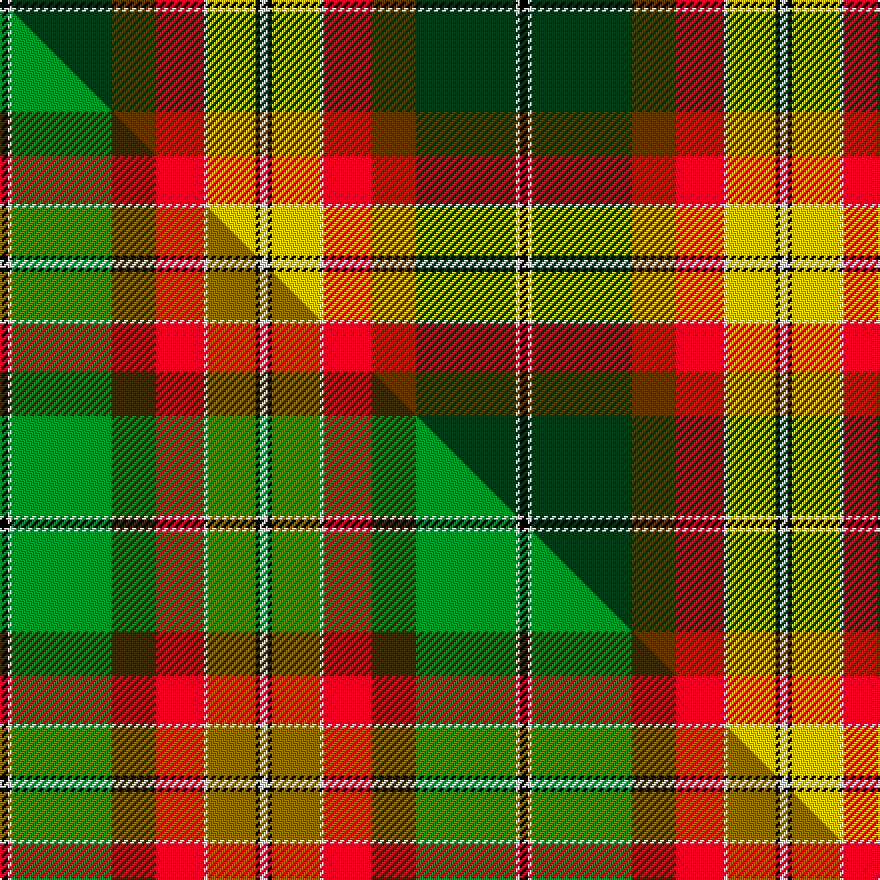

This is one **variant** — a specific cloth: this exact thread count and colourway, with its own
provenance below. It is one weaving of the [sett](/setts/k2w1dg25dy11r12w1ly12k1w2/) (the scale-free proportion — the
same cloth at any scale or shade), whose colour order is pattern [KWGGRWYKW](/stripes/kwggrwykw/).

Part of the [Leaf Peeper](/tartans/l/le/leaf-peeper/) tartan — the named design grouping this sett with its other cloths.

Sourced from tartans-authority.  It is a [9 stripe tartan](/stripes/stripes9/).

Original link [https://www.tartanregister.gov.uk/tartanDetails.aspx?ref=10915](https://www.tartanregister.gov.uk/tartanDetails.aspx?ref=10915)

Dataset <small>— provenance for this record, inherited from the source manifest</small>

<dl class="dataset-prov">
<dt>source</dt><dd><a href="/sources/tartans-authority/">Scottish Tartans Authority</a></dd>
<dt>data captured from</dt><dd><a href="https://github.com/thetartan/tartan-database/blob/master/data/tartans-authority/data.csv">https://github.com/thetartan/tartan-database/blob/master/data/tartans-authority/data.csv</a></dd>
<dt>data date</dt><dd>2013 <small>(this record)</small></dd>
<dt>licence</dt><dd><a href="https://creativecommons.org/licenses/by-nc-nd/4.0/">CC BY-NC-ND 4.0</a></dd>
</dl>

Capture chain <small>— the hands this data passed through, oldest first; each capture carries its own licence</small>

<ol class="capture-chain">
<li><a href="https://www.tartansauthority.com/">Scottish Tartans Authority</a> <small>the heritage body's archive — its tartan-ferret record browser is retired (links repaired to the SRT, above)</small></li>
<li><a href="https://github.com/thetartan/tartan-database">thetartan/tartan-database</a> <small>2016-2017</small> · <a href="https://creativecommons.org/licenses/by-nc-nd/4.0/">CC BY-NC-ND 4.0</a> <small>Levko Kravets's frozen compilation — the capture we vendored, and where its CC licence text came from</small></li>
<li>this dictionary <small>captured 2026-06-10 · commit 5bf86c7566</small> <small>each re-capture is a git commit to data/sources</small></li>
</ol>

## Register references

External register numbers recorded for this tartan.

- Scottish Register of Tartans: [10915](https://www.tartanregister.gov.uk/tartanDetails?ref=10915)
- Scottish Tartans Authority (ITI): 10915

## Thread count
K/4 W2 DG50 DY22 R24 W2 LY24 K2 W/4

One full sett is **260 threads**.

## Palette
<table><thead><tr><th>Colour</th><th>Shade</th><th>OKLCh</th></tr></thead><tbody><tr><td>DG</td><td><code style="background-color:#053819;">#053819</code> <small style="color:#888">#053819</small></td><td><small style="color:#888">oklch(30.0% 0.075 151.3)</small></td></tr><tr><td>K</td><td><code style="background-color:#000000;">#000000</code> <small style="color:#888">#000000</small></td><td><small style="color:#888">oklch(0.0% 0.000 0.0)</small></td></tr><tr><td>R</td><td><code style="background-color:#D60020;">#D60020</code> <small style="color:#888">#D60020</small></td><td><small style="color:#888">oklch(55.2% 0.224 25.5)</small></td></tr><tr><td>DY</td><td><code style="background-color:#603800;">#603800</code> <small style="color:#888">#603800</small></td><td><small style="color:#888">oklch(38.1% 0.084 66.7)</small></td></tr><tr><td>W</td><td><code style="background-color:#F7F7F7;">#F7F7F7</code> <small style="color:#888">#F7F7F7</small></td><td><small style="color:#888">oklch(97.6% 0.000 89.9)</small></td></tr><tr><td>LY</td><td><code style="background-color:#E8C000;">#E8C000</code> <small style="color:#888">#E8C000</small></td><td><small style="color:#888">oklch(81.9% 0.168 93.7)</small></td></tr></tbody></table>

# Sample pattern

## Compared to the master

This cloth is one sett of its design; the master sett (the exemplar the design is anchored on) is below for comparison.

Its **ΔTartan distance** from the master is **2.00** — the same measure the nearest-tartans table ranks by (0 is identical; a re-scale of the same cloth is near 0, a recolour or a different proportion further).

<figure class="master-compare" style="margin:0">

this sett
master sett ★

<figcaption style="color:#888;font-size:smaller">One weave of this sett against the <a href="/setts/k2w1g25dy11r12w1y12k1w2/">master sett ★</a>, split on the diagonal: a shared proportion runs seamlessly across it with only the shades shifting; a different proportion breaks on it.</figcaption>
</figure>

## Nearest tartan variants

The nearest existing variants by ΔTartan distance, with this cloth at the top so the swatches line up against it.

ΔTartan

Threads

Variant

Sett

—

260

<a href="/variants/s9/k2w1dg25dy11r12w1ly12k1w2~x2~dy1503076-ly3307090/">Leaf Peeper</a>

<a href="/ttd/edit/#slug=k2w1g25dy11r12w1y12k1w2~x2&amp;base=k2w1dg25dy11r12w1ly12k1w2~x2~dy1503076-ly3307090" title="compare in the TTD">2.00</a>

260

<a href="/variants/s9/k2w1g25dy11r12w1y12k1w2~x2/">Leaf Peeper</a>

<a href="/ttd/edit/#slug=w2dg27dy1ly7lb5dy5r17dy6lb1~x2&amp;base=k2w1dg25dy11r12w1ly12k1w2~x2~dy1503076-ly3307090" title="compare in the TTD">2.10</a>

278

<a href="/variants/s9/w2dg27dy1ly7lb5dy5r17dy6lb1~x2/">Elystan Glodrydd (Name)</a>

<a href="/ttd/edit/#slug=dy5k3w2r20db10g2w1dy1g20k4dy3~x2&amp;base=k2w1dg25dy11r12w1ly12k1w2~x2~dy1503076-ly3307090" title="compare in the TTD">2.43</a>

268

<a href="/variants/s11/dy5k3w2r20db10g2w1dy1g20k4dy3~x2/">MacCulloch</a>

<a href="/ttd/edit/#slug=o5k3w2r20db10g2w1r1g20k4o3~x2&amp;base=k2w1dg25dy11r12w1ly12k1w2~x2~dy1503076-ly3307090" title="compare in the TTD">2.45</a>

268

<a href="/variants/s11/o5k3w2r20db10g2w1r1g20k4o3~x2/">MacCullough Family Tartan</a>

<a href="/ttd/edit/#slug=g15r25g4k2y1db1y1k2g4db12w1~x2&amp;base=k2w1dg25dy11r12w1ly12k1w2~x2~dy1503076-ly3307090" title="compare in the TTD">2.51</a>

240

<a href="/variants/s11/g15r25g4k2y1db1y1k2g4db12w1~x2/">Livingstone (Australia) Dress</a>

<a href="/ttd/edit/#slug=r8lb7k8y2k1b1g19k1r8lb3r8~x2&amp;base=k2w1dg25dy11r12w1ly12k1w2~x2~dy1503076-ly3307090" title="compare in the TTD">2.55</a>

232

<a href="/variants/s11/r8lb7k8y2k1b1g19k1r8lb3r8~x2/">Unnamed No 1</a>

<a href="/ttd/edit/#slug=r8lb7k8y2k1w2k1g19k1r8lb3r8~x2&amp;base=k2w1dg25dy11r12w1ly12k1w2~x2~dy1503076-ly3307090" title="compare in the TTD">2.63</a>

240

<a href="/variants/s12/r8lb7k8y2k1w2k1g19k1r8lb3r8~x2/">Unnamed No 1 Tartan</a>

<a href="/ttd/edit/#slug=w3dy1r29dy16g23db3g3ly2~x2&amp;base=k2w1dg25dy11r12w1ly12k1w2~x2~dy1503076-ly3307090" title="compare in the TTD">2.64</a>

310

<a href="/variants/s8/w3dy1r29dy16g23db3g3ly2~x2/">Tache, Sir Etienne Paschal #2</a>

<a href="/ttd/edit/#slug=w3k1r25k2dy2g25dy2y2dy10k1r2~x2&amp;base=k2w1dg25dy11r12w1ly12k1w2~x2~dy1503076-ly3307090" title="compare in the TTD">2.68</a>

290

<a href="/variants/s11/w3k1r25k2dy2g25dy2y2dy10k1r2~x2/">Bicknell, The Hamish (Personal)</a>

<a href="/ttd/edit/#slug=w1lb3db2dr18r2g16r2dr2r2lb3w1~x2&amp;base=k2w1dg25dy11r12w1ly12k1w2~x2~dy1503076-ly3307090" title="compare in the TTD">2.73</a>

204

<a href="/variants/s11/w1lb3db2dr18r2g16r2dr2r2lb3w1~x2/">Moray of Abercairny</a>

## Neighbour map

Every grey dot is one of 13621 variants placed by the first two principal components of the ΔTartan feature space (42% of its variance). Red is this tartan; blue dots are its nearest — click one to open its page.

<svg viewBox="0 0 640 380" role="img" style="max-width:100%;height:auto;border:1px solid #e0e0e0;border-radius:4px;display:block" xmlns="http://www.w3.org/2000/svg"><image href="/nn/cloud.v1.png" width="640" height="380"/><a href="/variants/s9/k2w1g25dy11r12w1y12k1w2~x2/"><circle cx="169.7" cy="115.1" r="4" fill="#3465a4"><title>Leaf Peeper</title></circle></a><a href="/variants/s9/w2dg27dy1ly7lb5dy5r17dy6lb1~x2/"><circle cx="188.9" cy="118.3" r="4" fill="#3465a4"><title>Elystan Glodrydd (Name)</title></circle></a><a href="/variants/s11/dy5k3w2r20db10g2w1dy1g20k4dy3~x2/"><circle cx="111.4" cy="103.6" r="4" fill="#3465a4"><title>MacCulloch</title></circle></a><a href="/variants/s11/o5k3w2r20db10g2w1r1g20k4o3~x2/"><circle cx="111.6" cy="101.1" r="4" fill="#3465a4"><title>MacCullough Family Tartan</title></circle></a><a href="/variants/s11/g15r25g4k2y1db1y1k2g4db12w1~x2/"><circle cx="176.1" cy="85.8" r="4" fill="#3465a4"><title>Livingstone (Australia) Dress</title></circle></a><a href="/variants/s11/r8lb7k8y2k1b1g19k1r8lb3r8~x2/"><circle cx="120.8" cy="115.4" r="4" fill="#3465a4"><title>Unnamed No 1</title></circle></a><a href="/variants/s12/r8lb7k8y2k1w2k1g19k1r8lb3r8~x2/"><circle cx="110.0" cy="108.2" r="4" fill="#3465a4"><title>Unnamed No 1 Tartan</title></circle></a><a href="/variants/s8/w3dy1r29dy16g23db3g3ly2~x2/"><circle cx="213.2" cy="123.3" r="4" fill="#3465a4"><title>Tache, Sir Etienne Paschal #2</title></circle></a><a href="/variants/s11/w3k1r25k2dy2g25dy2y2dy10k1r2~x2/"><circle cx="176.6" cy="79.9" r="4" fill="#3465a4"><title>Bicknell, The Hamish (Personal)</title></circle></a><a href="/variants/s11/w1lb3db2dr18r2g16r2dr2r2lb3w1~x2/"><circle cx="189.5" cy="112.2" r="4" fill="#3465a4"><title>Moray of Abercairny</title></circle></a><circle cx="152.8" cy="107.4" r="5" fill="#c00000"/><text x="320" y="376" text-anchor="middle" font-size="11" fill="#999">ground</text><text x="11" y="190" text-anchor="middle" font-size="11" fill="#999" transform="rotate(-90 11 190)">complexity</text></svg>

ID: /variants/s9/k2w1dg25dy11r12w1ly12k1w2~x2~dy1503076-ly3307090/
