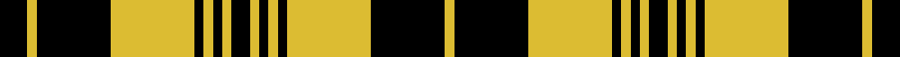

This page is one **sett** — a single exact thread-count. It belongs to the [tartan](/setts/k3ly1k8ly9k1ly1k1ly1k2/)
(the same proportion at any scale), whose colour order is pattern [KYKYKYKYKYKYKYKY](/stripes/kykykykykykykyky/).

Sourced from register-of-tartans.  It is a [16 stripe tartan](/stripes/stripes16/).

Original link https://www.tartanregister.gov.uk/tartanDetails.aspx?ref=1918

2 attestations — the source records this cloth was collapsed from (oldest owns this page)

<ul>
<li>01/01/1999 — Justus Black & Gold (Angus) (Personal) (register-of-tartans, <a href="https://www.tartanregister.gov.uk/tartanDetails.aspx?ref=1918">record</a>)  <em>One of 7 tartans created by Christopher Carlisle Justus in Hendersonville NC - 1986. Status not known and no evidence of actual commercial weaving although he appears to be a weaver (Sindex notes). Significance of (Angus) not known. This range of Justus 'tartans' are included for historical reasons only: were the Scottish Tartans Authority's asked to Register a range such as this, it would decline or at least limit the number to three and offer advice on tartan design.</em></li>
<li>Unknown — Justus Black & Gold (Angus) (Persona (tartans-authority, <a href="http://www.tartansauthority.com/tartan-ferret/display/2732/">record</a>)  <em>One of 7 tartans created by Christopher Carlisle Justus in Hendersonville NC - 1986. Status not known and no evidence of actual commercial weaving although he appears to be a weaver (Sindex notes).. Significance of (Angus) not known. This range of Justus 'tartans' are included for historical reasons only: were the Scottish Tartans Authority asked to Register a range such as this, it would decline or at least limit the number to three and offer advice on tartan design.</em></li>
</ul>

## Register references

External register numbers recorded for this tartan.

- Scottish Register of Tartans: [1918](https://www.tartanregister.gov.uk/tartanDetails.aspx?ref=1918)
- Scottish Tartans Authority (ITI): 2732
- Scottish Tartans World Register: 2732

## Thread count
K/12 LY4 K32 LY36 K4 LY4 K4 LY4 K8 LY4 K4 LY4 K4 LY36 K32 LY/4

One full sett is **376 threads**.

## Palette
<table><thead><tr><th>Colour</th><th>Shade</th><th>OKLCh</th></tr></thead><tbody><tr><td>DY</td><td><code style="background-color:#DCBC32;">#DCBC32</code> <small style="color:#888">#DCBC32</small></td><td><small style="color:#888">oklch(80.0% 0.150 95.2)</small></td></tr><tr><td>K</td><td><code style="background-color:#000000;">#000000</code> <small style="color:#888">#000000</small></td><td><small style="color:#888">oklch(0.0% 0.000 0.0)</small></td></tr><tr><td>Y</td><td><code style="background-color:#8B6E00;">#8B6E00</code> <small style="color:#888">#8B6E00</small></td><td><small style="color:#888">oklch(55.1% 0.113 90.4)</small></td></tr><tr><td>Ya</td><td><code style="background-color:#3A2B0D;">#3A2B0D</code> <small style="color:#888">#3A2B0D</small></td><td><small style="color:#888">oklch(30.0% 0.049 82.0)</small></td></tr></tbody></table>

# Sample pattern

## Nearest variants

The nearest existing variants by ΔTartan distance, with this cloth at the top so the swatches line up against it.

ΔTartan

Threads

Variant

Sett

—

376

<a href="/variants/s9/k3ly1k8ly9k1ly1k1ly1k2~x4/">Justus Black &amp; Gold (Angus) (Personal)</a>

<a href="/ttd/edit/#slug=k4y2k27y2k8y31k2y4~x2&amp;base=k3ly1k8ly9k1ly1k1ly1k2~x4" title="compare in the TTD">2.57</a>

304

<a href="/variants/s8/k4y2k27y2k8y31k2y4~x2/">Watertown Library Assoc.</a>

## Neighbour map

Every grey dot is one of 13620 variants placed by the first two principal components of the ΔTartan feature space (42% of its variance). Red is this tartan; blue dots are its nearest — click one to open its page.

<svg viewBox="0 0 640 380" role="img" style="max-width:100%;height:auto;border:1px solid #e0e0e0;border-radius:4px;display:block" xmlns="http://www.w3.org/2000/svg"><image href="/nn/cloud.v1.png" width="640" height="380"/><a href="/variants/s8/k4y2k27y2k8y31k2y4~x2/"><circle cx="308.8" cy="146.2" r="4" fill="#3465a4"><title>Watertown Library Assoc.</title></circle></a><circle cx="272.9" cy="163.9" r="5" fill="#c00000"/><text x="320" y="376" text-anchor="middle" font-size="11" fill="#999">ground</text><text x="11" y="190" text-anchor="middle" font-size="11" fill="#999" transform="rotate(-90 11 190)">complexity</text></svg>

ID: /variants/s9/k3ly1k8ly9k1ly1k1ly1k2~x4/
