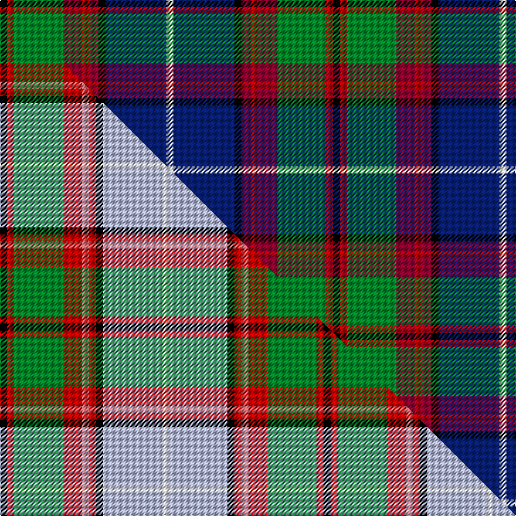

This is one **variant** — a specific cloth: this exact thread count and colourway, with its own
provenance below. It is one weaving of the [sett](/setts/k3ri3g21r8ri3r4k3db26w3/) (the scale-free proportion — the
same cloth at any scale or shade), whose colour order is pattern [KRGRRRKBW](/stripes/krgrrrkbw/).

Part of the [Dunedin](/tartans/dunedin/) tartan — the named design grouping this sett with its other cloths.

Sourced from weddslist.  It is a [9 stripe tartan](/stripes/stripes9/).

Original link [http://www.weddslist.com/cgi-bin/tartans/pg.pl?source=sts](http://www.weddslist.com/cgi-bin/tartans/pg.pl?source=sts)

Dataset <small>— provenance for this record, inherited from the source manifest</small>

<dl class="dataset-prov">
<dt>source</dt><dd><a href="/sources/weddslist/">Weddslist</a></dd>
<dt>data captured from</dt><dd><a href="https://github.com/thetartan/tartan-database/blob/master/data/weddslist/data.csv">https://github.com/thetartan/tartan-database/blob/master/data/weddslist/data.csv</a></dd>
<dt>data date</dt><dd>2016-11-17 <small>(dataset default)</small></dd>
<dt>licence</dt><dd><a href="https://creativecommons.org/licenses/by-nc-nd/4.0/">CC BY-NC-ND 4.0</a></dd>
</dl>

Capture chain <small>— the hands this data passed through, oldest first; each capture carries its own licence</small>

<ol class="capture-chain">
<li><a href="https://www.weddslist.com/tartans/">Weddslist</a> <small>the living privately compiled reference</small></li>
<li><a href="https://github.com/thetartan/tartan-database">thetartan/tartan-database</a> <small>2016-2017</small> · <a href="https://creativecommons.org/licenses/by-nc-nd/4.0/">CC BY-NC-ND 4.0</a> <small>Levko Kravets's frozen compilation — the capture we vendored, and where its CC licence text came from</small></li>
<li>this dictionary <small>captured 2026-06-10 · commit 5bf86c7566</small> <small>each re-capture is a git commit to data/sources</small></li>
</ol>

## Thread count
K/6 Ri6 G42 R16 Ri6 R8 K6 DB52 W/6

One full sett is **284 threads**.

## Palette
<table><thead><tr><th>Colour</th><th>Shade</th><th>OKLCh</th></tr></thead><tbody><tr><td>DB</td><td><code style="background-color:#082077;">#082077</code> <small style="color:#888">#082077</small></td><td><small style="color:#888">oklch(30.0% 0.149 265.1)</small></td></tr><tr><td>R</td><td><code style="background-color:#900030;">#900030</code> <small style="color:#888">#900030</small></td><td><small style="color:#888">oklch(41.6% 0.166 13.6)</small></td></tr><tr><td>G</td><td><code style="background-color:#008B2A;">#008B2A</code> <small style="color:#888">#008B2A</small></td><td><small style="color:#888">oklch(55.4% 0.170 145.9)</small></td></tr><tr><td>K</td><td><code style="background-color:#000000;">#000000</code> <small style="color:#888">#000000</small></td><td><small style="color:#888">oklch(0.0% 0.000 0.0)</small></td></tr><tr><td>W</td><td><code style="background-color:#F7F7F7;">#F7F7F7</code> <small style="color:#888">#F7F7F7</small></td><td><small style="color:#888">oklch(97.6% 0.000 89.9)</small></td></tr><tr><td>R</td><td><code style="background-color:#C00000;">#C00000</code> <small style="color:#888">#C00000</small></td><td><small style="color:#888">oklch(50.7% 0.208 29.2)</small></td></tr></tbody></table>

# Sample pattern

## Compared to the master

This cloth is one sett of its design; the master sett (the exemplar the design is anchored on) is below for comparison.

Its **ΔTartan distance** from the master is **1.06** — the same measure the nearest-tartans table ranks by (0 is identical; a re-scale of the same cloth is near 0, a recolour or a different proportion further).

<figure class="master-compare" style="margin:0">

this sett
master sett ★

<figcaption style="color:#888;font-size:smaller">One weave of this sett against the <a href="/setts/k3r3g21r8ri3r3k3lb25w3/">master sett ★</a>, split on the diagonal: a shared proportion runs seamlessly across it with only the shades shifting; a different proportion breaks on it.</figcaption>
</figure>

## Nearest tartan variants

The nearest existing variants by ΔTartan distance, with this cloth at the top so the swatches line up against it.

ΔTartan

Threads

Variant

Sett

—

284

<a href="/variants/s9/k3ri3g21r8ri3r4k3db26w3~x2~ri2008029-r1707016/">Dunedin</a>

<a href="/ttd/edit/#slug=w3db22k2r3k2r5g7b2k2~x2&amp;base=k3ri3g21r8ri3r4k3db26w3~x2~ri2008029-r1707016" title="compare in the TTD">1.18</a>

182

<a href="/variants/s9/w3db22k2r3k2r5g7b2k2~x2/">Edinburgh</a>

<a href="/ttd/edit/#slug=w8db50k4r8k6r12g17dp7k4&amp;base=k3ri3g21r8ri3r4k3db26w3~x2~ri2008029-r1707016" title="compare in the TTD">1.19</a>

220

<a href="/variants/s9/w8db50k4r8k6r12g17dp7k4/">Edinburgh</a>

<a href="/ttd/edit/#slug=w4db5r3db22dy4k3g17r7k2r7dy2~x2&amp;base=k3ri3g21r8ri3r4k3db26w3~x2~ri2008029-r1707016" title="compare in the TTD">1.57</a>

292

<a href="/variants/s11/w4db5r3db22dy4k3g17r7k2r7dy2~x2/">Crosser Crozier Family Tartan</a>

<a href="/ttd/edit/#slug=r2k1y2g3y4g3db12k1w2~x4&amp;base=k3ri3g21r8ri3r4k3db26w3~x2~ri2008029-r1707016" title="compare in the TTD">1.67</a>

224

<a href="/variants/s9/r2k1y2g3y4g3db12k1w2~x4/">Federated Women's Institutes of</a>

<a href="/ttd/edit/#slug=w4db5r3db22y4k3g17r7k2r7y2~x2&amp;base=k3ri3g21r8ri3r4k3db26w3~x2~ri2008029-r1707016" title="compare in the TTD">1.69</a>

292

<a href="/variants/s11/w4db5r3db22y4k3g17r7k2r7y2~x2/">Crosser, Crozier</a>

<a href="/ttd/edit/#slug=gi20r2g3db12k20r2lb3db4lb3~x2~gi2203152-g1903114&amp;base=k3ri3g21r8ri3r4k3db26w3~x2~ri2008029-r1707016" title="compare in the TTD">1.90</a>

230

<a href="/variants/s9/gi20r2g3db12k20r2lb3db4lb3~x2~gi2203152-g1903114/">Ithilien Heather (Personal)</a>

<a href="/ttd/edit/#slug=w2r2db16k14g15r2ly2~x2&amp;base=k3ri3g21r8ri3r4k3db26w3~x2~ri2008029-r1707016" title="compare in the TTD">1.97</a>

204

<a href="/variants/s7/w2r2db16k14g15r2ly2~x2/">Council of Scottish Clans &amp; Ass. (Co</a>

<a href="/ttd/edit/#slug=w4db5r3db22ly4k3g17r7k2r7ly2~x2&amp;base=k3ri3g21r8ri3r4k3db26w3~x2~ri2008029-r1707016" title="compare in the TTD">1.98</a>

292

<a href="/variants/s11/w4db5r3db22ly4k3g17r7k2r7ly2~x2/">Crozier/Crosser</a>

<a href="/ttd/edit/#slug=r3g18r4lb3r4k13r3db18g2y3~x2&amp;base=k3ri3g21r8ri3r4k3db26w3~x2~ri2008029-r1707016" title="compare in the TTD">2.02</a>

272

<a href="/variants/s10/r3g18r4lb3r4k13r3db18g2y3~x2/">Stirling and Bannockburn District Tartan</a>

<a href="/ttd/edit/#slug=r6g2r2g21k2w4k2db23y2db2y6~x2&amp;base=k3ri3g21r8ri3r4k3db26w3~x2~ri2008029-r1707016" title="compare in the TTD">2.09</a>

264

<a href="/variants/s11/r6g2r2g21k2w4k2db23y2db2y6~x2/">Glasgow, City of Culture</a>

## Neighbour map

Every grey dot is one of 13621 variants placed by the first two principal components of the ΔTartan feature space (42% of its variance). Red is this tartan; blue dots are its nearest — click one to open its page.

<svg viewBox="0 0 640 380" role="img" style="max-width:100%;height:auto;border:1px solid #e0e0e0;border-radius:4px;display:block" xmlns="http://www.w3.org/2000/svg"><image href="/nn/cloud.v1.png" width="640" height="380"/><a href="/variants/s9/w3db22k2r3k2r5g7b2k2~x2/"><circle cx="156.1" cy="119.4" r="4" fill="#3465a4"><title>Edinburgh</title></circle></a><a href="/variants/s9/w8db50k4r8k6r12g17dp7k4/"><circle cx="141.2" cy="120.1" r="4" fill="#3465a4"><title>Edinburgh</title></circle></a><a href="/variants/s11/w4db5r3db22dy4k3g17r7k2r7dy2~x2/"><circle cx="100.6" cy="134.0" r="4" fill="#3465a4"><title>Crosser Crozier Family Tartan</title></circle></a><a href="/variants/s9/r2k1y2g3y4g3db12k1w2~x4/"><circle cx="130.4" cy="137.9" r="4" fill="#3465a4"><title>Federated Women's Institutes of</title></circle></a><a href="/variants/s11/w4db5r3db22y4k3g17r7k2r7y2~x2/"><circle cx="100.2" cy="134.2" r="4" fill="#3465a4"><title>Crosser, Crozier</title></circle></a><a href="/variants/s9/gi20r2g3db12k20r2lb3db4lb3~x2~gi2203152-g1903114/"><circle cx="76.8" cy="144.9" r="4" fill="#3465a4"><title>Ithilien Heather (Personal)</title></circle></a><a href="/variants/s7/w2r2db16k14g15r2ly2~x2/"><circle cx="72.4" cy="169.3" r="4" fill="#3465a4"><title>Council of Scottish Clans &amp; Ass. (Co</title></circle></a><a href="/variants/s11/w4db5r3db22ly4k3g17r7k2r7ly2~x2/"><circle cx="92.9" cy="132.1" r="4" fill="#3465a4"><title>Crozier/Crosser</title></circle></a><a href="/variants/s10/r3g18r4lb3r4k13r3db18g2y3~x2/"><circle cx="60.4" cy="148.8" r="4" fill="#3465a4"><title>Stirling and Bannockburn District Tartan</title></circle></a><a href="/variants/s11/r6g2r2g21k2w4k2db23y2db2y6~x2/"><circle cx="121.2" cy="122.8" r="4" fill="#3465a4"><title>Glasgow, City of Culture</title></circle></a><circle cx="110.0" cy="144.5" r="5" fill="#c00000"/><text x="320" y="376" text-anchor="middle" font-size="11" fill="#999">ground</text><text x="11" y="190" text-anchor="middle" font-size="11" fill="#999" transform="rotate(-90 11 190)">complexity</text></svg>

ID: /variants/s9/k3ri3g21r8ri3r4k3db26w3~x2~ri2008029-r1707016/
