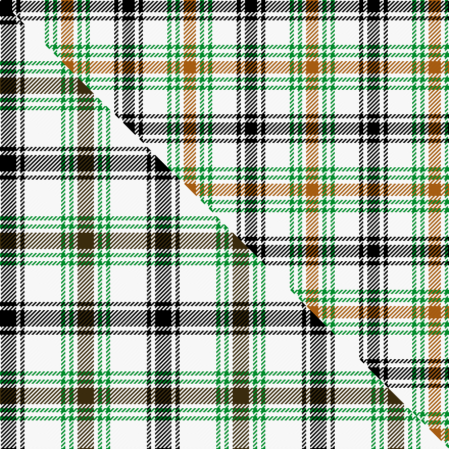

This is one **variant** — a specific cloth: this exact thread count and colourway, with its own
provenance below. It is one weaving of the [sett](/setts/k3w1k1w6g1w1g1w1o3/) (the scale-free proportion — the
same cloth at any scale or shade), whose colour order is pattern [KWKWGWGWR](/stripes/kwkwgwgwr/).

Part of the [Puffin](/tartans/p/pu/puffin/) tartan — the named design grouping this sett with its other cloths.

Sourced from weddslist.  It is a [9 stripe tartan](/stripes/stripes9/).

Original link [http://www.weddslist.com/cgi-bin/tartans/pg.pl?source=sts](http://www.weddslist.com/cgi-bin/tartans/pg.pl?source=sts)

Dataset <small>— provenance for this record, inherited from the source manifest</small>

<dl class="dataset-prov">
<dt>source</dt><dd><a href="/sources/weddslist/">Weddslist</a></dd>
<dt>data captured from</dt><dd><a href="https://github.com/thetartan/tartan-database/blob/master/data/weddslist/data.csv">https://github.com/thetartan/tartan-database/blob/master/data/weddslist/data.csv</a></dd>
<dt>data date</dt><dd>2016-11-17 <small>(dataset default)</small></dd>
<dt>licence</dt><dd><a href="https://creativecommons.org/licenses/by-nc-nd/4.0/">CC BY-NC-ND 4.0</a></dd>
</dl>

Capture chain <small>— the hands this data passed through, oldest first; each capture carries its own licence</small>

<ol class="capture-chain">
<li><a href="https://www.weddslist.com/tartans/">Weddslist</a> <small>the living privately compiled reference</small></li>
<li><a href="https://github.com/thetartan/tartan-database">thetartan/tartan-database</a> <small>2016-2017</small> · <a href="https://creativecommons.org/licenses/by-nc-nd/4.0/">CC BY-NC-ND 4.0</a> <small>Levko Kravets's frozen compilation — the capture we vendored, and where its CC licence text came from</small></li>
<li>this dictionary <small>captured 2026-06-10 · commit 5bf86c7566</small> <small>each re-capture is a git commit to data/sources</small></li>
</ol>

## Thread count
K/12 W4 K4 W24 G4 W4 G4 W4 O/12

One full sett is **120 threads**.

## Palette
<table><thead><tr><th>Colour</th><th>Shade</th><th>OKLCh</th></tr></thead><tbody><tr><td>G</td><td><code style="background-color:#008B2A;">#008B2A</code> <small style="color:#888">#008B2A</small></td><td><small style="color:#888">oklch(55.4% 0.170 145.9)</small></td></tr><tr><td>K</td><td><code style="background-color:#000000;">#000000</code> <small style="color:#888">#000000</small></td><td><small style="color:#888">oklch(0.0% 0.000 0.0)</small></td></tr><tr><td>W</td><td><code style="background-color:#F7F7F7;">#F7F7F7</code> <small style="color:#888">#F7F7F7</small></td><td><small style="color:#888">oklch(97.6% 0.000 89.9)</small></td></tr><tr><td>O</td><td><code style="background-color:#A65C11;">#A65C11</code> <small style="color:#888">#A65C11</small></td><td><small style="color:#888">oklch(55.0% 0.125 58.3)</small></td></tr></tbody></table>

# Sample pattern

## Compared to the master

This cloth is one sett of its design; the master sett (the exemplar the design is anchored on) is below for comparison.

Its **ΔTartan distance** from the master is **1.30** — the same measure the nearest-tartans table ranks by (0 is identical; a re-scale of the same cloth is near 0, a recolour or a different proportion further).

<figure class="master-compare" style="margin:0">

this sett
master sett ★

<figcaption style="color:#888;font-size:smaller">One weave of this sett against the <a href="/setts/k4w1k1w9g1w1g1w1dy4/">master sett ★</a>, split on the diagonal: a shared proportion runs seamlessly across it with only the shades shifting; a different proportion breaks on it.</figcaption>
</figure>

## Nearest tartan variants

The nearest existing variants by ΔTartan distance, with this cloth at the top so the swatches line up against it.

ΔTartan

Threads

Variant

Sett

—

120

<a href="/variants/s9/k3w1k1w6g1w1g1w1o3~x4/">Puffin</a>

<a href="/ttd/edit/#slug=k4w1k1w9g1w1g1w1dy4~x4&amp;base=k3w1k1w6g1w1g1w1o3~x4" title="compare in the TTD">1.30</a>

152

<a href="/variants/s9/k4w1k1w9g1w1g1w1dy4~x4/">Puffin (Personal)</a>

<a href="/ttd/edit/#slug=w2g4k7w2k1w11db2w2~x4&amp;base=k3w1k1w6g1w1g1w1o3~x4" title="compare in the TTD">2.12</a>

232

<a href="/variants/s8/w2g4k7w2k1w11db2w2~x4/">Forbes - 1880 (Clans Originaux)</a>

<a href="/ttd/edit/#slug=k3r3k3w16k3g3k3&amp;base=k3w1k1w6g1w1g1w1o3~x4" title="compare in the TTD">2.28</a>

62

<a href="/variants/s7/k3r3k3w16k3g3k3/">Eglinton</a>

<a href="/ttd/edit/#slug=w1b3w3b1w5k1w2k3lo1~x4&amp;base=k3w1k1w6g1w1g1w1o3~x4" title="compare in the TTD">2.63</a>

152

<a href="/variants/s9/w1b3w3b1w5k1w2k3lo1~x4/">Henderson Dress (Dance)</a>

<a href="/ttd/edit/#slug=dg14r5dg14w5k2r5k2w9~x4&amp;base=k3w1k1w6g1w1g1w1o3~x4" title="compare in the TTD">2.92</a>

356

<a href="/variants/s8/dg14r5dg14w5k2r5k2w9~x4/">Unnamed (Hip Flask)</a>

<a href="/ttd/edit/#slug=w23k4w4k4w4k22o23ly5~x2&amp;base=k3w1k1w6g1w1g1w1o3~x4" title="compare in the TTD">3.03</a>

300

<a href="/variants/s8/w23k4w4k4w4k22o23ly5~x2/">Aberlour (Corporate)</a>

<a href="/ttd/edit/#slug=w2r1w8n2k2w1n1w1n4w2k1w1r1~x4&amp;base=k3w1k1w6g1w1g1w1o3~x4" title="compare in the TTD">3.09</a>

204

<a href="/variants/s13/w2r1w8n2k2w1n1w1n4w2k1w1r1~x4/">Balmoral (Ghillies white variation)</a>

<a href="/ttd/edit/#slug=w23k4w4k4w4k22o23ly5~x2~o2005046&amp;base=k3w1k1w6g1w1g1w1o3~x4" title="compare in the TTD">3.10</a>

300

<a href="/variants/s8/w23k4w4k4w4k22o23ly5~x2~o2005046/">Aberlour</a>

<a href="/ttd/edit/#slug=w7k21w9k9w29lo4w29k10r3k3r3k3r19w6&amp;base=k3w1k1w6g1w1g1w1o3~x4" title="compare in the TTD">3.19</a>

297

<a href="/variants/s14/w7k21w9k9w29lo4w29k10r3k3r3k3r19w6/">Casey, Dress (Corporate)</a>

<a href="/ttd/edit/#slug=w26k8w3k5db3r5n3k4~x2&amp;base=k3w1k1w6g1w1g1w1o3~x4" title="compare in the TTD">3.22</a>

168

<a href="/variants/s8/w26k8w3k5db3r5n3k4~x2/">Lootens Jensen (Personal)</a>

## Neighbour map

Every grey dot is one of 13621 variants placed by the first two principal components of the ΔTartan feature space (42% of its variance). Red is this tartan; blue dots are its nearest — click one to open its page.

<svg viewBox="0 0 640 380" role="img" style="max-width:100%;height:auto;border:1px solid #e0e0e0;border-radius:4px;display:block" xmlns="http://www.w3.org/2000/svg"><image href="/nn/cloud.v1.png" width="640" height="380"/><a href="/variants/s9/k4w1k1w9g1w1g1w1dy4~x4/"><circle cx="199.6" cy="160.9" r="4" fill="#3465a4"><title>Puffin (Personal)</title></circle></a><a href="/variants/s8/w2g4k7w2k1w11db2w2~x4/"><circle cx="214.7" cy="172.8" r="4" fill="#3465a4"><title>Forbes - 1880 (Clans Originaux)</title></circle></a><a href="/variants/s7/k3r3k3w16k3g3k3/"><circle cx="162.0" cy="188.1" r="4" fill="#3465a4"><title>Eglinton</title></circle></a><a href="/variants/s9/w1b3w3b1w5k1w2k3lo1~x4/"><circle cx="179.9" cy="225.3" r="4" fill="#3465a4"><title>Henderson Dress (Dance)</title></circle></a><a href="/variants/s8/dg14r5dg14w5k2r5k2w9~x4/"><circle cx="166.8" cy="204.1" r="4" fill="#3465a4"><title>Unnamed (Hip Flask)</title></circle></a><a href="/variants/s8/w23k4w4k4w4k22o23ly5~x2/"><circle cx="105.1" cy="196.9" r="4" fill="#3465a4"><title>Aberlour (Corporate)</title></circle></a><a href="/variants/s13/w2r1w8n2k2w1n1w1n4w2k1w1r1~x4/"><circle cx="218.7" cy="161.3" r="4" fill="#3465a4"><title>Balmoral (Ghillies white variation)</title></circle></a><a href="/variants/s8/w23k4w4k4w4k22o23ly5~x2~o2005046/"><circle cx="105.6" cy="196.4" r="4" fill="#3465a4"><title>Aberlour</title></circle></a><a href="/variants/s14/w7k21w9k9w29lo4w29k10r3k3r3k3r19w6/"><circle cx="182.8" cy="147.5" r="4" fill="#3465a4"><title>Casey, Dress (Corporate)</title></circle></a><a href="/variants/s8/w26k8w3k5db3r5n3k4~x2/"><circle cx="185.5" cy="150.4" r="4" fill="#3465a4"><title>Lootens Jensen (Personal)</title></circle></a><circle cx="161.0" cy="189.8" r="5" fill="#c00000"/><text x="320" y="376" text-anchor="middle" font-size="11" fill="#999">ground</text><text x="11" y="190" text-anchor="middle" font-size="11" fill="#999" transform="rotate(-90 11 190)">complexity</text></svg>

ID: /variants/s9/k3w1k1w6g1w1g1w1o3~x4/
