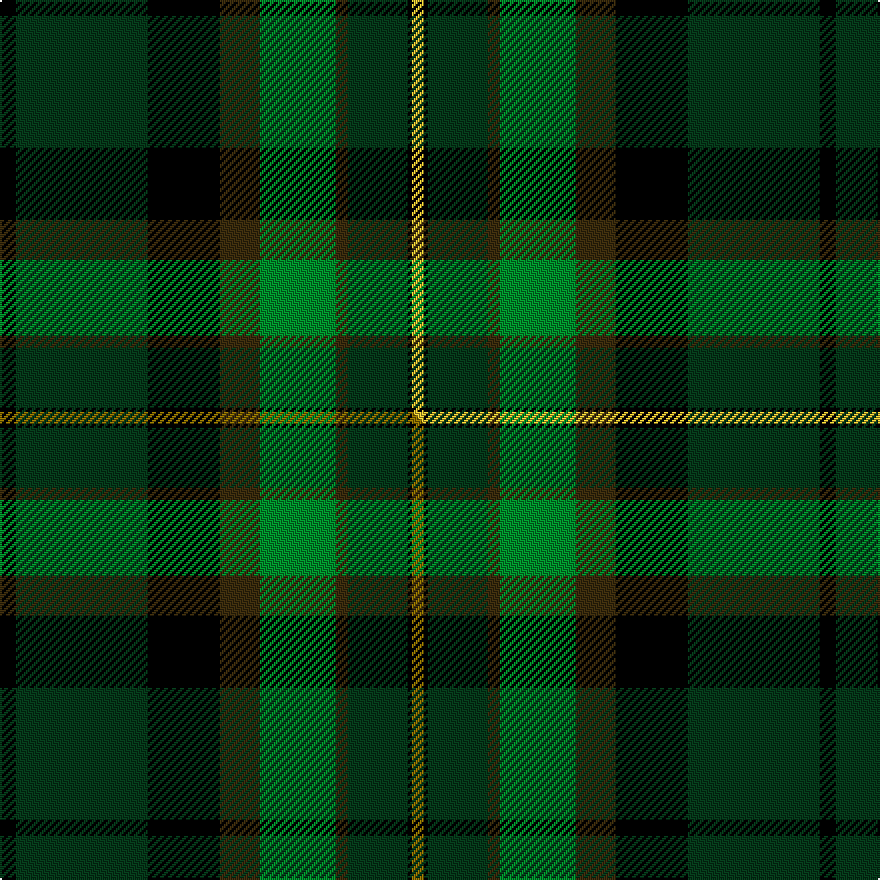

This page is one **sett** — a single exact thread-count. It belongs to the [tartan](/setts/k4dg33k18dy10g19dy3dg15k1ly3/)
(the same proportion at any scale), whose colour order is pattern [KGKGGGGKY](/stripes/kgkggggky/).

Part of the [Leinster Ancestry](/tartans/leinster-ancestry/) tartan — the named design grouping this sett with its other cloths.

Sourced from tartans-authority.  It is a [9 stripe tartan](/stripes/stripes9/).

Original link http://www.tartansauthority.com/tartan-ferret/display/10798/

## Register references

External register numbers recorded for this tartan.

- Scottish Register of Tartans: [10798](https://www.tartanregister.gov.uk/tartanDetails?ref=10798)
- Scottish Tartans Authority (ITI): 10798

## Thread count
K/8 DG66 K36 DY20 G38 DY6 DG30 K2 LY/6

One full sett is **410 threads**.

## Palette
<table><thead><tr><th>Colour</th><th>Shade</th><th>OKLCh</th></tr></thead><tbody><tr><td>DG</td><td><code style="background-color:#053819;">#053819</code> <small style="color:#888">#053819</small></td><td><small style="color:#888">oklch(30.0% 0.075 151.3)</small></td></tr><tr><td>LY</td><td><code style="background-color:#DCBC32;">#DCBC32</code> <small style="color:#888">#DCBC32</small></td><td><small style="color:#888">oklch(80.0% 0.150 95.2)</small></td></tr><tr><td>G</td><td><code style="background-color:#008B2A;">#008B2A</code> <small style="color:#888">#008B2A</small></td><td><small style="color:#888">oklch(55.4% 0.170 145.9)</small></td></tr><tr><td>K</td><td><code style="background-color:#000000;">#000000</code> <small style="color:#888">#000000</small></td><td><small style="color:#888">oklch(0.0% 0.000 0.0)</small></td></tr><tr><td>DY</td><td><code style="background-color:#3A2B0D;">#3A2B0D</code> <small style="color:#888">#3A2B0D</small></td><td><small style="color:#888">oklch(30.0% 0.049 82.0)</small></td></tr></tbody></table>

# Sample pattern

## Compared to the master

This cloth is one sett of its design; the master sett (the exemplar the design is anchored on) is below for comparison.

Its **ΔTartan distance** from the master is **0.02** — the same measure the nearest-tartans table ranks by (0 is identical; a re-scale of the same cloth is near 0, a recolour or a different proportion further).

<figure class="master-compare" style="margin:0">

this sett
master sett ★

<figcaption style="color:#888;font-size:smaller">One weave of this sett against the <a href="/setts/k4dg33k18dy10g19dy3dg15k1y3/">master sett ★</a>, split on the diagonal: a shared proportion runs seamlessly across it with only the shades shifting; a different proportion breaks on it.</figcaption>
</figure>

## Nearest tartan variants

The nearest existing variants by ΔTartan distance, with this cloth at the top so the swatches line up against it.

ΔTartan

Threads

Variant

Sett

—

410

<a href="/variants/s9/k4dg33k18dy10g19dy3dg15k1ly3~x2/">Leinster Ancestry (Fashion)</a>

<a href="/ttd/edit/#slug=k4dg33k18dy10g19dy3dg15k1y3~x2&amp;base=k4dg33k18dy10g19dy3dg15k1ly3~x2" title="compare in the TTD">0.02</a>

410

<a href="/variants/s9/k4dg33k18dy10g19dy3dg15k1y3~x2/">Leinster Ancestry</a>

<a href="/ttd/edit/#slug=dg14k1dg2k1dg2k10g14r2&amp;base=k4dg33k18dy10g19dy3dg15k1ly3~x2" title="compare in the TTD">2.45</a>

76

<a href="/variants/s8/dg14k1dg2k1dg2k10g14r2/">Manor (Corporate)</a>

<a href="/ttd/edit/#slug=dy83k35w3g35k3y10&amp;base=k4dg33k18dy10g19dy3dg15k1ly3~x2" title="compare in the TTD">2.95</a>

245

<a href="/variants/s6/dy83k35w3g35k3y10/">Brandon Manitoba Trade Tartan</a>

<a href="/ttd/edit/#slug=dg23r7g25y5dg17k5y1w1r1~x2&amp;base=k4dg33k18dy10g19dy3dg15k1ly3~x2" title="compare in the TTD">3.04</a>

292

<a href="/variants/s9/dg23r7g25y5dg17k5y1w1r1~x2/">Cates Hunting</a>

<a href="/ttd/edit/#slug=dg9k2dg2g13k2g2dy1dg13k26dy2~x2&amp;base=k4dg33k18dy10g19dy3dg15k1ly3~x2" title="compare in the TTD">3.17</a>

266

<a href="/variants/s10/dg9k2dg2g13k2g2dy1dg13k26dy2~x2/">Pride of Ireland Fashion Tartan</a>

<a href="/ttd/edit/#slug=dy12n2k2n42k13g25n6k2r4k10~x2&amp;base=k4dg33k18dy10g19dy3dg15k1ly3~x2" title="compare in the TTD">3.18</a>

428

<a href="/variants/s10/dy12n2k2n42k13g25n6k2r4k10~x2/">Dinwoodie (Name)</a>

<a href="/ttd/edit/#slug=k5dg25k10g15y1g5~x2&amp;base=k4dg33k18dy10g19dy3dg15k1ly3~x2" title="compare in the TTD">3.21</a>

224

<a href="/variants/s6/k5dg25k10g15y1g5~x2/">Delaware Fine Spirits Guild (Corp)</a>

<a href="/ttd/edit/#slug=g8dg60w1k33g9y4g4~x2&amp;base=k4dg33k18dy10g19dy3dg15k1ly3~x2" title="compare in the TTD">3.27</a>

452

<a href="/variants/s7/g8dg60w1k33g9y4g4~x2/">Duffy</a>

<a href="/ttd/edit/#slug=g22dy40n8k9o1~x2~n1900000-o2500000&amp;base=k4dg33k18dy10g19dy3dg15k1ly3~x2" title="compare in the TTD">3.31</a>

274

<a href="/variants/s5/g22dy40n8k9o1~x2~n1900000-o2500000/">Holehouse, Dag (Personal)</a>

<a href="/ttd/edit/#slug=dg28r3k28db8lb1dg8r2k3~x2&amp;base=k4dg33k18dy10g19dy3dg15k1ly3~x2" title="compare in the TTD">3.34</a>

262

<a href="/variants/s8/dg28r3k28db8lb1dg8r2k3~x2/">Stansbury</a>

## Neighbour map

Every grey dot is one of 13620 variants placed by the first two principal components of the ΔTartan feature space (42% of its variance). Red is this tartan; blue dots are its nearest — click one to open its page.

<svg viewBox="0 0 640 380" role="img" style="max-width:100%;height:auto;border:1px solid #e0e0e0;border-radius:4px;display:block" xmlns="http://www.w3.org/2000/svg"><image href="/nn/cloud.v1.png" width="640" height="380"/><a href="/variants/s9/k4dg33k18dy10g19dy3dg15k1y3~x2/"><circle cx="246.8" cy="140.4" r="4" fill="#3465a4"><title>Leinster Ancestry</title></circle></a><a href="/variants/s8/dg14k1dg2k1dg2k10g14r2/"><circle cx="198.8" cy="170.4" r="4" fill="#3465a4"><title>Manor (Corporate)</title></circle></a><a href="/variants/s6/dy83k35w3g35k3y10/"><circle cx="258.1" cy="136.9" r="4" fill="#3465a4"><title>Brandon Manitoba Trade Tartan</title></circle></a><a href="/variants/s9/dg23r7g25y5dg17k5y1w1r1~x2/"><circle cx="234.0" cy="124.8" r="4" fill="#3465a4"><title>Cates Hunting</title></circle></a><a href="/variants/s10/dg9k2dg2g13k2g2dy1dg13k26dy2~x2/"><circle cx="238.2" cy="130.8" r="4" fill="#3465a4"><title>Pride of Ireland Fashion Tartan</title></circle></a><a href="/variants/s10/dy12n2k2n42k13g25n6k2r4k10~x2/"><circle cx="195.1" cy="123.2" r="4" fill="#3465a4"><title>Dinwoodie (Name)</title></circle></a><a href="/variants/s6/k5dg25k10g15y1g5~x2/"><circle cx="229.9" cy="177.6" r="4" fill="#3465a4"><title>Delaware Fine Spirits Guild (Corp)</title></circle></a><a href="/variants/s7/g8dg60w1k33g9y4g4~x2/"><circle cx="299.2" cy="101.1" r="4" fill="#3465a4"><title>Duffy</title></circle></a><a href="/variants/s5/g22dy40n8k9o1~x2~n1900000-o2500000/"><circle cx="298.3" cy="150.3" r="4" fill="#3465a4"><title>Holehouse, Dag (Personal)</title></circle></a><a href="/variants/s8/dg28r3k28db8lb1dg8r2k3~x2/"><circle cx="261.0" cy="124.2" r="4" fill="#3465a4"><title>Stansbury</title></circle></a><circle cx="234.3" cy="136.2" r="5" fill="#c00000"/><text x="320" y="376" text-anchor="middle" font-size="11" fill="#999">ground</text><text x="11" y="190" text-anchor="middle" font-size="11" fill="#999" transform="rotate(-90 11 190)">complexity</text></svg>

ID: /variants/s9/k4dg33k18dy10g19dy3dg15k1ly3~x2/
